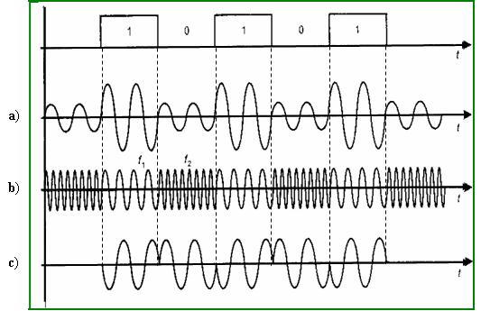
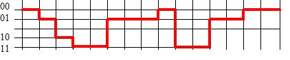
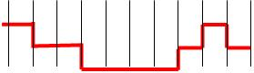
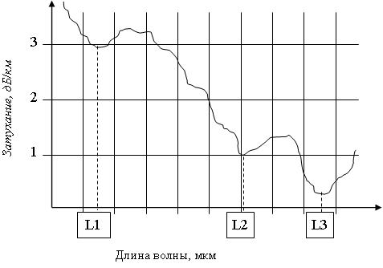

# Parsed Test

Total questions: 272

---

## Question 473 (2 points)

Как называется преобразование данных в вид, позволяющий передавать их по
выбранному каналу связи и  
обнаруживать ошибки, возникающие из-за помех при их передаче в этом канале
связи?

_Type: Text Input (4 correct answers)_

**✓ 1. кодирование**

**✓ 2. Кодирование**

**✓ 3. Кодированием**

**✓ 4. кодированием**

---

## Question 474 (2 points)

Какие типы сигналов используются в телекоммуникационных сетях для передачи
данных?

_Type: Multiple Choice (3 correct answers)_

**✓ 1. электрические**

**✓ 2. электромагнитные**

**✓ 3. оптические**

4.  акустические

5.  магнитные

6.  гравитационные

7.  инерционные

---

## Question 475 (2 points)

Какие типы сигналов для передачи данных не используются в телекоммуникационных
сетях ?

_Type: Multiple Choice (2 correct answers)_

**✓ 1. акустические**

**✓ 2. логические**

3.  электрические

4.  радиоволны

5.  оптические

---

## Question 476 (2 points)

Как называется способность системы противостоять воздействию помех?

_Type: Text Input (4 correct answers)_

**✓ 1. помехоустойчивость**

**✓ 2. Помехоустойчивость**

**✓ 3. помехозащищенность**

**✓ 4. Помехозащищенность**

---

## Question 477 (1 points)

Как называется количество данных, которое может быть передано по каналу связи за
единицу времени?

_Type: Single Choice (1 correct answer)_

**✓ 1. пропускная способность канала связи**

2.  полоса пропускания канала связи

3.  полоса пропускания сигнала

4.  скорость модуляции

5.  полоса частот

6.  скорость кодирования

---

## Question 478 (1 points)

В каких единицах принято измерять пропускную способность канала связи в
компьютерных сетях?

_Type: Single Choice (1 correct answer)_

**✓ 1. кбит/с**

2.  кбайт/с

3.  Гц

4.  дБ

5.  бод

6.  Кбит/с

7.  Гц/с

8.  гц/с

9.  бод/с

---

## Question 479 (1 points)

bps - это единица измерения ...

_Type: Single Choice (1 correct answer)_

**✓ 1. пропускной способности канала**

2.  полосы пропускания канала

3.  скорости модуляции

4.  времени передачи данных

5.  загрузки канала

6.  спектра сигнала

---

## Question 480 (1 points)

BER - это ...

_Type: Single Choice (1 correct answer)_

**✓ 1. интенсивность битовых ошибок**

2.  единица измерения скорости модуляции

3.  сетевой протокол

4.  показатель помехозащищенности

5.  единица измерения нагрузки в канале связи

6.  единица измерения пропускной способности канала связи

---

## Question 485 (1 points)

Канал связи, предоставляемый на определённое время, называется ...

_Type: Single Choice (1 correct answer)_

**✓ 1. Коммутируемым**

2.  Выделенным

3.  Общим

4.  Частным

5.  Постоянным

6.  Переменным

7.  Дискретным

---

## Question 486 (1 points)

Канал связи, существующий постоянно между двумя пользователями, называется ...

_Type: Single Choice (1 correct answer)_

**✓ 1. Выделенным**

2.  Коммутируемым

3.  Большим

4.  Двойным

5.  Локальным

6.  Групповым

---

## Question 487 (2 points)

Канал связи, по которому возможна передача только в одном направлении,
называется ...

_Type: Text Input (5 correct answers)_

**✓ 1. симплексным**

**✓ 2. симплексный**

**✓ 3. Симплексный**

**✓ 4. Симплексным**

**✓ 5. simplex**

---

## Question 488 (2 points)

Канал связи, по которому возможна одновременная передача в обоих направлениях,
называется ...

_Type: Text Input (5 correct answers)_

**✓ 1. дуплексный**

**✓ 2. дуплексным**

**✓ 3. Дуплексный**

**✓ 4. Дуплексным**

**✓ 5. duplex**

---

## Question 489 (2 points)

Канал связи, по которому возможна передача в обоих направлениях, но в разные
моменты времени, называется ...

_Type: Text Input (7 correct answers)_

**✓ 1. полудуплексным**

**✓ 2. полудуплексный**

**✓ 3. Полудуплексным**

**✓ 4. Полудуплексный**

**✓ 5. half-duplex**

**✓ 6. halfduplex**

**✓ 7. half duplex**

---

## Question 490 (2 points)

Раскрыть обозначения элементов на схеме аналогового канала связи,
предназначенного для передачи дискретных сообщений (на рисунке: ИС - источник
сообщений, ПС - приёмник сообщений).

_Type: Matching Values (6 correct answers)_

**✓ a. ::: дискретный (двоичный) сигнал**

**✓ b. ::: непрерывный сигнал**

**✓ c. ::: модулятор**

**✓ d. ::: демодулятор**

**✓ e. ::: фильтр**

**✓ f. ::: линия связи**

---

## Question 491 (2 points)

Раскрыть обозначения элементов на схеме дискретного (цифрового) канала связи (на
рисунке: ИДС - источник дискретных сообщений; ПДС - приёмник дискретных
сообщений).

_Type: Matching Values (4 correct answers)_

**✓ a. ::: устройство сопряжения с КС**

**✓ b. ::: устройство защиты от ошибок**

**✓ c. ::: устройство преобразования сигналов**

**✓ d. ::: линия связи**

---

## Question 492 (1 points)

Для обеспечения требуемых динамических и частотных свойств передаваемого сигнала
в непрерывном канале связи используются ...

_Type: Single Choice (1 correct answer)_

**✓ 1. фильтры**

2.  устройства защиты от ошибок

3.  модуляторы

4.  демодуляторы

5.  устройства сопряжения

6.  устройства преобразования сигналов

---

## Question 493 (1 points)

В каких единицах измеряется усиление и ослабление сигнала?

_Type: Single Choice (1 correct answer)_

**✓ 1. дБ**

2.  Дб

3.  кбит

4.  Кбит

5.  безразмерная

6.  бод

7.  бит/с

8.  дм

---

## Question 494 (1 points)

Мощность сигнала уменьшилась в 100 раз. Чему равно изменение сигнала?

_Type: Single Choice (1 correct answer)_

**✓ 1. - 20 дБ**

2.  - 20 дБ

3.  - 5 дБ

4.  - 5 дБ

5.  - 100 дБ

6.  - 100 дБ

7.  - 50 дБ

8.  - 50 дБ

---

## Question 495 (1 points)

Мощность сигнала уменьшилась в 10000 раз. Чему равно изменение сигнала?

_Type: Single Choice (1 correct answer)_

**✓ 1. - 40 дБ**

2.  - 40 дБ

3.  - 30Дб

4.  - 30 дБ

5.  - 10 Дб

6.  - 10 дБ

7.  - 100 дБ

8.  - 100 дБ

---

## Question 496 (1 points)

Мощность сигнала уменьшилась в 1000 раз. Чему равно изменение сигнала?

_Type: Single Choice (1 correct answer)_

**✓ 1. -30 дБ**

2.  +30 дБ

3.  -10 дБ

4.  +10 дБ

5.  -100 дБ

6.  +100 дБ

7.  -1000 дБ

8.  +1000 дБ

---

## Question 497 (2 points)

Как называется отношение выходной мощности сигнала ко входной?

_Type: Text Input (4 correct answers)_

**✓ 1. коэффициент передачи**

**✓ 2. коэффициентом передачи**

**✓ 3. Коэффициент передачи**

**✓ 4. Коэффициентом передачи**

---

## Question 498 (2 points)

Во сколько раз уменьшится мощность сигнала на расстоянии 100 м, если его
ослабление равно: d=100 дБ/км?

_Type: Text Input (1 correct answer)_

**✓ 1. 10**

---

## Question 499 (2 points)

Во сколько раз уменьшится мощность сигнала на расстоянии 50 м, если его
ослабление равно: d=20 дБ/100 м?

_Type: Text Input (1 correct answer)_

**✓ 1. 10**

---

## Question 500 (2 points)

Во сколько раз уменьшится мощность сигнала на расстоянии 2000 м, если его
ослабление равно: d=10 дБ/км?

_Type: Text Input (1 correct answer)_

**✓ 1. 100**

---

## Question 501 (2 points)

Во сколько раз уменьшится мощность сигнала на расстоянии 3 км, если его
ослабление равно: d=10 дБ/км?

_Type: Text Input (1 correct answer)_

**✓ 1. 1000**

---

## Question 502 (1 points)

В чем состоит удобство вычисления затухания в децибелах?

_Type: Single Choice (1 correct answer)_

**✓ 1. при каскадном включении нескольких устройств затухания в децибелах
складываются**

2.  при каскадном включении нескольких устройств затухания в децибелах
    умножаются

3.  при каскадном включении нескольких устройств затухания в децибелах не
    изменяются

4.  децибелы соответсвтуют международной системе единиц СИ

5.  для длинных линий связи затухание в децибелах не изменяется

6.  для коротких линий связи затухание в децибелах не изменяется

7.  для длинных линий связи усиление в децибелах не изменяется

---

## Question 503 (2 points)

Гармоническое колебание задано уравнением F(t) = X*sin(Y*t + Z). Что такое Z?

_Type: Text Input (1 correct answer)_

**✓ 1. фаза**

---

## Question 504 (2 points)

Гармоническое колебание задано уравнением F(t) = X*sin(Y*t + Z). Что такое X?

_Type: Text Input (1 correct answer)_

**✓ 1. амплитуда**

---

## Question 505 (1 points)

Какой спектр частот имеют дискретные сигналы?

_Type: Single Choice (1 correct answer)_

**✓ 1. Бесконечный**

2.  Ограниченный

3.  Низкий

4.  Отрицательный

5.  Маленький

6.  Большой

---

## Question 506 (1 points)

В каких единицах измеряется линейная частота?

_Type: Single Choice (1 correct answer)_

**✓ 1. Гц**

2.  безразмерная

3.  с

4.  дБ

5.  бод

6.  градусы

7.  бит/с

---

## Question 507 (2 points)

Единица измерения линейной частоты - это ...

_Type: Text Input (5 correct answers)_

**✓ 1. Гц**

**✓ 2. Герц**

**✓ 3. Hz**

**✓ 4. Herz**

**✓ 5. герц**

---

## Question 508 (2 points)

Как называется единица измерения линейной частоты?

_Type: Text Input (4 correct answers)_

**✓ 1. Герц**

**✓ 2. Гц**

**✓ 3. Herz**

**✓ 4. Hz**

---

## Question 509 (2 points)

Какие параметры гармонического сигнала могут нести информацию?

_Type: Multiple Choice (3 correct answers)_

**✓ 1. амплитуда**

**✓ 2. фаза**

**✓ 3. частота**

4.  затухание

5.  коэффициент передачи

6.  ослабление сигнала

---

## Question 510 (3 points)

Какие утверждения являются верными?

_Type: Multiple Choice (3 correct answers)_

**✓ 1. спектр - характеристика сигнала**

**✓ 2. полоса пропускания - характеристика среды передачи**

**✓ 3. для корректной передачи сигнала полоса пропускания должна быть шире
спектра**

4.  спектр - характеристика среды передачи

5.  полоса пропускания - характеристика сигнала

6.  спектр должен быть больше полосы пропускания

7.  спектр и полоса пропускания - понятия эквивалентные

8.  спектр может быть как больше, так и меньше полосы пропускания

---

## Question 511 (3 points)

Какие утверждения являются неверными?

_Type: Multiple Choice (4 correct answers)_

**✓ 1. спектр - характеристика среды передачи**

**✓ 2. полоса пропускания - характеристика сигнала**

**✓ 3. для корректной передачи сигнала спектр должен быть больше полосы
пропускания**

**✓ 4. для корректной передачи сигнала спектр может быть как больше, так и
меньше полосы пропускания**

5.  спектр - характеристика сигнала

6.  полоса пропускания - характеристика среды передачи

7.  полоса пропускания должна быть больше спектра сигнала

---

## Question 512 (2 points)

Выберите правильные утверждения

_Type: Multiple Choice (2 correct answers)_

**✓ 1. Спектр - это характеристика сигнала.**

**✓ 2. Полоса пропускания - это характеристика канала связи.**

3.  Спектр - это характеристика канала связи

4.  Полоса пропускания - это характеристика сигнала.

5.  Спектр - это характеристика затухания сигнала.

6.  Полоса пропускания - это характеристика дальности передачи сигнала.

7.  Спектр - это характеристика пропускной способности канала связи.

8.  Полоса пропускания - это характеристика затухания сигнала

---

## Question 513 (1 points)

Полоса пропускания - это характеристика ...

_Type: Single Choice (1 correct answer)_

**✓ 1. среды передачи**

2.  сигнала

3.  передаваемых данных

4.  узла связи

5.  сети передачи данных

6.  телекоммуникационной сети

---

## Question 514 (2 points)

В каких единицах измеряется спектр?

_Type: Text Input (4 correct answers)_

**✓ 1. Гц**

**✓ 2. Герц**

**✓ 3. Hz**

**✓ 4. Herz**

---

## Question 515 (2 points)

В каких единицах измеряется полоса пропускания?

_Type: Text Input (4 correct answers)_

**✓ 1. Гц**

**✓ 2. Герц**

**✓ 3. Hz**

**✓ 4. Herz**

---

## Question 516 (1 points)

При каком условии обеспечивается качественная передача сигнала?

_Type: Single Choice (1 correct answer)_

**✓ 1. Спектр сигнала меньше полосы пропускания**

2.  Спектр сигнала больше полосы пропускания

3.  Спектр сигнала равен бесконечности

4.  Спектр сигнала положительный

5.  Спектр сигнала не ограничен

6.  Спектр сигнала не зависит от полосы пропускания

7.  Среди приведенных нет правильных ответов

---

## Question 517 (2 points)

Какую ширину полосы пропускания (в Гц) имеет телефонный канал? Ответ округлите
до целых.

_Type: Text Input (1 correct answer)_

**✓ 1. 3100**

---

## Question 518 (1 points)

В каком интервале находится полоса пропускания телефонного канала?

_Type: Single Choice (1 correct answer)_

**✓ 1. От 300 до 3400 Гц**

2.  От 0 до 4000 Гц

3.  От 100 до 3000 Гц

4.  От 100 до 10000 Гц

5.  От 0 до бесконечности

6.  От 300 до 10000 Гц

---

## Question 519 (2 points)

Рассчитать максимально возможную пропускную способность (кбит/с) канала связи
при условии, что полоса пропускания равна 100 МГц, а мощность сигнала равна
мощности шума.

_Type: Text Input (3 correct answers)_

**✓ 1. 100000**

---

## Question 520 (2 points)

Рассчитать максимально возможную пропускную способность (кбит/с) канала связи
при условии, что полоса пропускания равна 100 МГц, а отношение мощности сигнала
к мощности шума равно 3.

_Type: Text Input (2 correct answers)_

**✓ 1. 200000**

---

## Question 521 (2 points)

Рассчитать максимально возможную пропускную способность (Мбит/с) канала связи
при условии, что полоса пропускания равна 100 МГц, а отношение мощности сигнала
к мощности шума равно 3.

_Type: Text Input (1 correct answer)_

**✓ 1. 200**

---

## Question 522 (2 points)

Рассчитать максимально возможную пропускную способность (бит/с) канала связи при
условии, что полоса пропускания равна 100 МГц, а отношение мощности сигнала к
мощности шума равно 3.

_Type: Text Input (1 correct answer)_

**✓ 1. 200000000**

---

## Question 523 (2 points)

Рассчитать максимально возможную пропускную способность (бит/с) канала связи при
условии, что полоса пропускания равна 20 МГц, а отношение мощности сигнала к
мощности шума равно 3.

_Type: Text Input (1 correct answer)_

**✓ 1. 40000000**

---

## Question 524 (2 points)

Рассчитать максимально возможную пропускную способность (кбит/с) канала связи
при условии, что полоса пропускания равна 20 МГц, а отношение мощности сигнала к
мощности шума равно 3.

_Type: Text Input (1 correct answer)_

**✓ 1. 40000**

---

## Question 525 (2 points)

Рассчитать максимально возможную пропускную способность (Мбит/с) канала связи
при условии, что полоса пропускания равна 20 МГц, а отношение мощности сигнала к
мощности шума равно 3.

_Type: Text Input (1 correct answer)_

**✓ 1. 40**

---

## Question 526 (2 points)

Рассчитать максимально возможную пропускную способность (Мбит/с) канала связи
при условии, что полоса пропускания равна 100 МГц, а отношение мощности сигнала
к мощности шума равно 7.

_Type: Text Input (1 correct answer)_

**✓ 1. 300**

---

## Question 527 (2 points)

Рассчитать максимально возможную пропускную способность (кбит/с) канала связи
при условии, что полоса пропускания равна 100 МГц, а отношение мощности сигнала
к мощности шума равно 7.

_Type: Text Input (1 correct answer)_

**✓ 1. 300000**

---

## Question 528 (2 points)

Рассчитать максимально возможную пропускную способность (бит/с) канала связи при
условии, что полоса пропускания равна 100 МГц, а отношение мощности сигнала к
мощности шума равно 7.

_Type: Text Input (1 correct answer)_

**✓ 1. 300000000**

---

## Question 529 (2 points)

Рассчитать максимально возможную пропускную способность (бит/с) канала связи при
условии, что полоса пропускания равна 10 МГц, а отношение мощности сигнала к
мощности шума равно 15.

_Type: Text Input (1 correct answer)_

**✓ 1. 40000000**

---

## Question 530 (2 points)

Рассчитать максимально возможную пропускную способность (кбит/с) канала связи
при условии, что полоса пропускания равна 100 кГц, а отношение мощности сигнала
к мощности шума равно 127.

_Type: Text Input (1 correct answer)_

**✓ 1. 700**

---

## Question 531 (2 points)

Рассчитать максимально возможную пропускную способность (бит/с) канала связи при
условии, что полоса пропускания равна 100 кГц, а отношение мощности сигнала к
мощности шума равно 1023.

_Type: Text Input (1 correct answer)_

**✓ 1. 1000000**

---

## Question 532 (2 points)

Изменение характеристик несущей в соответствии с информативным сигналом - это…

_Type: Text Input (2 correct answers)_

**✓ 1. модуляция**

**✓ 2. Модуляция**

---

## Question 533 (2 points)

Какие бывают методы модуляции?

_Type: Multiple Choice (2 correct answers)_

**✓ 1. Амплитудная**

**✓ 2. Фазовая**

3.  Частичная

4.  Случайная

5.  Сложная

6.  Общая

---

## Question 534 (1 points)

Какие бывают методы модуляции?

_Type: Multiple Choice (2 correct answers)_

**✓ 1. Частотная**

**✓ 2. Амплитудная**

3.  Общая

4.  Произвольная

5.  Полная

6.  Случайная

7.  Частичная

---

## Question 535 (2 points)

Какие из перечисленных методов модуляции используются для представления
непрерывных данных в виде непрерывных сигналов?

_Type: Multiple Choice (2 correct answers)_

**✓ 1. амплитудная**

**✓ 2. частотная**

3.  волновая

4.  фазовая

5.  импульсно-кодовая

6.  амплитудно-импульсная

7.  временная

---

## Question 536 (2 points)

Какие из перечисленных методов модуляции используются для представления
непрерывных данных в виде дискретных сигналов?

_Type: Multiple Choice (2 correct answers)_

**✓ 1. импульсно-кодовая**

**✓ 2. амплитудно-импульсная**

3.  амплитудная

4.  фазовая

5.  частотная

6.  волновая

7.  временная

---

## Question 537 (2 points)

Какие из перечисленных методов модуляции используются для представления
дискретных данных в виде непрерывных сигналов?

_Type: Multiple Choice (3 correct answers)_

**✓ 1. амплитудная**

**✓ 2. фазовая**

**✓ 3. частотная**

4.  импульсно-кодовая

5.  амплитудно-импульсная

6.  волновая

---

## Question 538 (2 points)

Какие методы модуляции представлены на рисунке?

_Type: Matching Values (3 correct answers)_

**✓ a. :: амплитудная**

**✓ b. :: частотная**

**✓ c. :: фазовая**

---

## Question 539 (2 points)

От чего зависит спектр результирующего модулированного сигнала?

_Type: Multiple Choice (2 correct answers)_

**✓ 1. от метода модуляции**

**✓ 2. от скорости модуляции**

3.  от полосы пропускания

4.  от пропускной способности

5.  от коэффициента затухания

6.  от типа канала связи

---

## Question 540 (2 points)

Как называется аналоговый высокочастотный сигнал, подвергаемый модуляции в
соответствии с некоторым информативным сигналом?

_Type: Text Input (4 correct answers)_

**✓ 1. несущая**

**✓ 2. несущей**

**✓ 3. Несущая**

**✓ 4. Несущей**

---

## Question 541 (2 points)

Чему равна скорость передачи речевых данных при использовании адаптивной
дифференциальной импульсно-кодовой модуляции? Ответ укажите в кбит/с.

_Type: Text Input (1 correct answer)_

**✓ 1. 32**

---

## Question 542 (2 points)

Чему равна скорость передачи речевых данных (бит/с) при использовании адаптивной
дифференциальной импульсно-кодовой модуляции?

_Type: Text Input (1 correct answer)_

**✓ 1. 32000**

---

## Question 543 (2 points)

Чему равна скорость передачи речевых данных (кбит/с) при использовании
импульсно-кодовой модуляции?

_Type: Text Input (1 correct answer)_

**✓ 1. 64**

---

## Question 544 (2 points)

Чему равна скорость передачи речевых данных (бит/с) при использовании
импульсно-кодовой модуляции?

_Type: Text Input (1 correct answer)_

**✓ 1. 64000**

---

## Question 545 (1 points)

При каком способе модуляции по каналу связи передается разность между текущим
значением сигнала и предыдущим?

_Type: Single Choice (1 correct answer)_

**✓ 1. адаптивная дифференциальная импульсно-кодовая модуляция**

2.  импульсно-кодовая модуляция

3.  амплитудно-импульсная модуляция

4.  амплитудная модуляция

5.  фазовая модуляция

6.  частотная модуляция

---

## Question 546 (1 points)

Модуляция, при которой непрерывный сигнал представляется совокупностью
дискретных сигналов с определенной амплитудой, называется ...

_Type: Single Choice (1 correct answer)_

**✓ 1. Амплитудно-импульсной модуляцией**

2.  Аналогово-импульсной модуляцией

3.  Аналогово-информационной модуляцией

4.  Амплитудно-информационной модуляцией

5.  Импульсно-кодовой модуляцией

6.  Амплитудно-кодовой модуляцией

7.  Амплитудно-дискретной модуляцией

---

## Question 547 (1 points)

Что такое АИМ?

_Type: Single Choice (1 correct answer)_

**✓ 1. Амплитудно-импульсная модуляция**

2.  Биполярное кодирование с альтернативной инверсией

3.  Амплитудная модуляция с инверсией

4.  Аналоговый информационный модулятор

5.  Аналогово-импульсный модулятор

6.  Аналогово-индуктируемый мезонин

7.  Амплитудно-импульсовая модальность

---

## Question 548 (2 points)

Как называется метод модуляции, показанный на рисунке?

_Type: Text Input (4 correct answers)_

**✓ 1. амплитудно-импульсная модуляция**

**✓ 2. амплитудно-импульсной модуляцией**

**✓ 3. амплитудно-импульсная**

**✓ 4. амплитудно-импульсной**

---

## Question 549 (2 points)

Чему равна частота квантования речевого сигнала в методе модуляции, показанном
на рисунке? Ответ указать в Герцах.

_Type: Text Input (3 correct answers)_

**✓ 1. 8000**

**✓ 2. восемь тысяч**

**✓ 3. 8 000**

---

## Question 550 (1 points)

Что такое ИКМ?

_Type: Single Choice (1 correct answer)_

**✓ 1. Импульсно-кодовая модуляция**

2.  Информационно-кодовая модуляция

3.  Импульсно-кодовый мультиплексор

4.  Идентификационный корневой мультиплексор

5.  Индивидуальный коммутатор-маршрутизатор

6.  Информационно-коммутируемый модулятор

---

## Question 551 (1 points)

Модуляция, при которой аналоговый сигнал кодируется сериями импульсов,
представляющими собой цифровые коды амплитуд в точках отсчета аналогового
сигнала, называется ...

_Type: Single Choice (1 correct answer)_

**✓ 1. Импульсно-кодовой модуляцией**

2.  Амплитудно-импульсной модуляцией

3.  Амплитудно-кодовой модуляцией

4.  Дифференциальной кодовой модуляцией

5.  Амплитудно-частотной модуляцией

6.  Амплитудно-фазовой модуляцией

7.  Цифро-аналоговой модуляцией

---

## Question 552 (2 points)

Как называется метод модуляции, показанный на рисунке?

_Type: Text Input (6 correct answers)_

**✓ 1. импульсно-кодовая модуляция**

**✓ 2. импульсно-кодовой модуляцией**

**✓ 3. импульсно-кодовая**

**✓ 4. импульсно-кодовой**

**✓ 5. ИКМ**

**✓ 6. PCM**

---

## Question 553 (2 points)

Чему равен интервал &#916;t квантования по времени в методе модуляции,
показанном на рисунке, при использовании этого метода в телефонии? Ответ укажите
в микросекундах.

_Type: Text Input (1 correct answer)_

**✓ 1. 125**

---

## Question 554 (2 points)

Чему равен интервал квантования по времени &#916;t в методе модуляции,
показанном на рисунке, при использовании этого метода в телефонии? Ответ укажите
в миллисекундах.

_Type: Text Input (3 correct answers)_

**✓ 1. 0,125**

**✓ 2. 0.125**

**✓ 3. 1/8**

---

## Question 555 (2 points)

Чему равно количество N уровней квантования по значению сигнала в методе
модуляции, показанном на рисунке, при использовании этого метода в телефонии?

_Type: Text Input (1 correct answer)_

**✓ 1. 256**

---

## Question 556 (1 points)

Какая минимальная пропускная способность необходима для передачи речевого
сигнала с использованием метода модуляции, показанного на рисунке, при условии,
что количество уровней квантования по значению сигнала равно 256, а интервал
квантования по времени равен 125 мкс? Ответ укажите в кбит/с

_Type: Text Input (1 correct answer)_

**✓ 1. 64**

---

## Question 557 (2 points)

Чему равна частота квантования речевого сигнала в методе модуляции, показанном
на рисунке, при использовании этого метода в телефонии? Ответ указать в кГц

_Type: Text Input (2 correct answers)_

**✓ 1. 8**

**✓ 2. восемь**

---

## Question 566 (2 points)

Какие коды применяют при цифровом кодировании дискретных данных?

_Type: Multiple Choice (2 correct answers)_

**✓ 1. потенциальные**

**✓ 2. импульсные**

3.  аналоговые

4.  непрерывные

5.  симметричные

6.  асиметричные

---

## Question 567 (1 points)

Какой метод кодирования изображен на рисунке?

_Type: Single Choice (1 correct answer)_

**✓ 1. RZ**

2.  Манчестерский

3.  NRZ

4.  AMI

5.  NRZI

6.  MLT-3

7.  PAM-5

---

## Question 568 (2 points)

Какие коды не применяют при цифровом кодировании дискретных данных?

_Type: Multiple Choice (4 correct answers)_

**✓ 1. асиметричные**

**✓ 2. симметричные**

**✓ 3. аналоговые**

**✓ 4. непрерывные**

5.  импульсные

6.  потенциальные

---

## Question 569 (1 points)

Какой метод кодирования изображен на рисунке?

_Type: Single Choice (1 correct answer)_

**✓ 1. NRZ**

2.  RZ

3.  АМI

4.  Манчестерский

5.  MLT-3

6.  PAM-5

7.  NRZI

---

## Question 570 (2 points)

Какой метод кодирования изображен на рисунке (англоязычная аббревиатура)?

_Type: Text Input (2 correct answers)_

**✓ 1. NRZ**

**✓ 2. nrz**

---

## Question 571 (2 points)

Какой метод кодирования изображен на рисунке (англоязычная аббревиатура)?

_Type: Text Input (1 correct answer)_

**✓ 1. AMI**

---

## Question 572 (1 points)

Какой метод кодирования изображен на рисунке?

_Type: Single Choice (1 correct answer)_

**✓ 1. AMI**

2.  RZ

3.  NRZ

4.  NRZI

5.  MLT-3

6.  PAM-5

7.  Манчестер 2

---

## Question 573 (1 points)

Какой метод кодирования изображен на рисунке?

_Type: Single Choice (1 correct answer)_

**✓ 1. Манчестерский**

2.  RZ

3.  NRZ

4.  AMI

5.  PAM-5

6.  MLT-3

---

## Question 574 (1 points)

Какой метод кодирования изображен на рисунке?

_Type: Single Choice (1 correct answer)_

**✓ 1. MLT-3**

2.  AMI

3.  RZ

4.  NRZ

5.  NRZI

6.  Манчестер 2

7.  PAM-5

---

## Question 575 (2 points)

Какой метод кодирования изображен на рисунке (англоязычная аббревиатура)?

_Type: Text Input (2 correct answers)_

**✓ 1. MLT-3**

**✓ 2. MLT3**

---

## Question 576 (1 points)

Какой метод кодирования изображен на рисунке (англоязычная аббревиатура)?

_Type: Text Input (4 correct answers)_

**✓ 1. PAM-5**

**✓ 2. PAM5**

**✓ 3. PAM 5**

---

## Question 578 (1 points)

Что не является методом физического кодирования?

_Type: Single Choice (1 correct answer)_

**✓ 1. ISDN**

2.  RZ

3.  NRZ

4.  NRZI

5.  MLT-3

6.  PAM-5

---

## Question 579 (2 points)

Что является методом физического кодирования?

_Type: Multiple Choice (2 correct answers)_

**✓ 1. MLT-3**

**✓ 2. NRZ**

3.  PDH

4.  SDH

5.  SONET

6.  ATM

7.  ISDN

---

## Question 580 (1 points)

Какой метод является методом логического кодирования?

_Type: Single Choice (1 correct answer)_

**✓ 1. 4B/5B**

2.  MLT-3

3.  PAM-5

4.  RZ

5.  NRZ

6.  AMI

---

## Question 581 (2 points)

Какие методы не относятся к методам логического кодирования?

_Type: Multiple Choice (3 correct answers)_

**✓ 1. MLT-3**

**✓ 2. РАМ-5**

**✓ 3. NRZI**

4.  8B/10B

5.  8B/6T

6.  5B/6B

---

## Question 582 (2 points)

Какими достоинствами обладает метод кодирования NRZ?

_Type: Multiple Choice (3 correct answers)_

**✓ 1. наличие только двух уровней потенциала**

**✓ 2. низкая частота основной гармоники**

**✓ 3. простота реализации**

4.  обладает свойством самосинхронизации

5.  наличие низкочастотной составляющей

6.  нет постоянной составляющей

---

## Question 583 (2 points)

Какими недостатками обладает метод кодирования NRZ?

_Type: Multiple Choice (2 correct answers)_

**✓ 1. не обладает свойством самосинхронизации**

**✓ 2. наличие низкочастотной составляющей**

3.  отсутствие постоянной низкочастотной составляющей

4.  низкая частота основной гармоники

5.  наличие только двух уровней потенциала

6.  сложность реализации

---

## Question 584 (2 points)

Какими достоинствами обладает метод кодирования RZ?

_Type: Multiple Choice (2 correct answers)_

**✓ 1. обладает свойством самосинхронизации**

**✓ 2. отсутствие постоянной низкочастотной составляющей**

3.  наличие только двух уровней потенциала

4.  низкая частота основной гармоники

5.  простота реализации

6.  наличие постоянной низкочастотной составляющей

---

## Question 585 (2 points)

Какими недостатками обладает метод кодирования RZ?

_Type: Multiple Choice (2 correct answers)_

**✓ 1. наличие трех уровней сигнала**

**✓ 2. спектр сигнала шире, чем у потенциальных кодов NRZ**

3.  не обладает свойством самосинхронизации

4.  наличие постоянной низкочастотной составляющей

5.  отсутствие постоянной низкочастотной составляющей

6.  наличие двух уровней сигнала

---

## Question 586 (2 points)

В каких методах кодирования используются только два уровня сигнала?

_Type: Multiple Choice (3 correct answers)_

**✓ 1. NRZ**

**✓ 2. NRZI**

**✓ 3. Манчестерское кодирование**

4.  RZ

5.  AMI

6.  MLT-3

7.  PAM-5

---

## Question 587 (2 points)

В каких методах кодирования используются три уровня сигнала?

_Type: Multiple Choice (3 correct answers)_

**✓ 1. RZ**

**✓ 2. AMI**

**✓ 3. MLT-3**

4.  Манчестерское кодирование

5.  PAM-5

6.  NRZ

7.  NRZI

---

## Question 588 (2 points)

В каких методах кодирования используется более двух уровней сигнала?

_Type: Multiple Choice (4 correct answers)_

**✓ 1. AMI**

**✓ 2. PAM-5**

**✓ 3. MLT-3**

**✓ 4. RZ**

5.  NRZ

6.  NRZI

7.  Манчестерское кодирование

---

## Question 589 (2 points)

Какими достоинствами обладает манчестерское кодирование?

_Type: Multiple Choice (3 correct answers)_

**✓ 1. обладает свойством самосинхронизации**

**✓ 2. наличие только двух уровней сигнала**

**✓ 3. нет постоянной составляющей**

4.  простота реализации

5.  наличие трех уровней сигнала

---

## Question 590 (1 points)

Основной недостаток манчестерского кодирования?

_Type: Single Choice (1 correct answer)_

**✓ 1. спектр сигнала шире, чем у кода NRZ и кода AMI**

2.  наличие трех уровней сигнала

3.  наличие постоянной низкочастотной составляющей

4.  отсутствие постоянной низкочастотной составляющей

5.  не обладает свойством самосинхронизации

6.  наличие двух уровней сигнала

---

## Question 591 (2 points)

Какими недостатками обладает метод кодирования MLT-3?

_Type: Multiple Choice (2 correct answers)_

**✓ 1. наличие трех уровней сигнала**

**✓ 2. отсутствие самосинхронизации**

3.  отсутствие постоянной низкочастотной составляющей

4.  низкая частота основной гармоники

5.  высокая частота основной гармоники

---

## Question 592 (1 points)

Сколько уровней сигнала используется для передачи данных в методе кодирования
PAM-5?

_Type: Text Input (1 correct answer)_

**✓ 1. 4**

---

## Question 593 (1 points)

В каком методе используется двухбитовое кодирование?

_Type: Single Choice (1 correct answer)_

**✓ 1. PAM-5**

2.  RZ

3.  NRZ

4.  NRZI

5.  AMI

6.  MLT-3

7.  Манчестерское кодирование

---

## Question 594 (2 points)

Какая битовая последовательность закодирована методом "Манчестер 2"?

_Type: Text Input (2 correct answers)_

**✓ 1. 0101010000**

**✓ 2. 1010101111**

---

## Question 595 (2 points)

Какая битовая последовательность закодирована методом "Манчестер 2"?

_Type: Text Input (2 correct answers)_

**✓ 1. 0111101100**

**✓ 2. 1000010011**

---

## Question 596 (2 points)

Какая битовая последовательность закодирована методом "Манчестер 2"?

_Type: Text Input (2 correct answers)_

**✓ 1. 0100001111**

**✓ 2. 1011110000**

---

## Question 597 (2 points)

Какая битовая последовательность закодирована методом "Манчестер 2"?

_Type: Text Input (2 correct answers)_

**✓ 1. 0001111011**

**✓ 2. 1110000100**

---

## Question 598 (2 points)

Какая битовая последовательность закодирована методом "MLT-3"?

_Type: Text Input (1 correct answer)_

**✓ 1. 0101010001**

---

## Question 599 (2 points)

Какая битовая последовательность закодирована методом "MLT-3"?

_Type: Text Input (1 correct answer)_

**✓ 1. 0011110110**

---

## Question 600 (2 points)

Какая битовая последовательность закодирована методом "MLT-3"?

_Type: Text Input (1 correct answer)_

**✓ 1. 1010001111**

---

## Question 601 (2 points)

Какая битовая последовательность закодирована методом "MLT-3"?

_Type: Text Input (1 correct answer)_

**✓ 1. 0101000111**

---

## Question 602 (2 points)

Какая битовая последовательность закодирована методом "РАМ-5"?

_Type: Text Input (1 correct answer)_

**✓ 1. 00011011110101**

---

## Question 603 (2 points)

Какая битовая последовательность закодирована методом "РАМ-5"?

_Type: Text Input (1 correct answer)_

**✓ 1. 10001001011111**

---

## Question 604 (2 points)

Какая битовая последовательность закодирована методом "РАМ-5"?

_Type: Text Input (1 correct answer)_

**✓ 1. 11000110100101**

---

## Question 605 (2 points)

Выполнить скремблирование последовательности 10000001

с использованием сотношения:

.

_Type: Text Input (1 correct answer)_

**✓ 1. 10111000**

---

## Question 606 (2 points)

Выполнить скремблирование последовательности 11000001

с использованием сотношения:

.

_Type: Text Input (1 correct answer)_

**✓ 1. 11100100**

---

## Question 607 (2 points)

Выполнить скремблирование последовательности 10010001

с использованием сотношения:

.

_Type: Text Input (1 correct answer)_

**✓ 1. 10101111**

---

## Question 608 (2 points)

Выполнить скремблирование последовательности 11111001

с использованием сотношения:

.

_Type: Text Input (1 correct answer)_

**✓ 1. 11010110**

---

## Question 609 (2 points)

Выполнить скремблирование последовательности 10011111

с использованием сотношения:

.

_Type: Text Input (1 correct answer)_

**✓ 1. 10100011**

---

## Question 610 (2 points)

Выполнить скремблирование последовательности 01000010

с использованием сотношения:

.

_Type: Text Input (1 correct answer)_

**✓ 1. 01011110**

---

## Question 611 (2 points)

Выполнить скремблирование последовательности 11111001

с использованием сотношения:

.

_Type: Text Input (1 correct answer)_

**✓ 1. 11010110**

---

## Question 612 (2 points)

Выполнить скремблирование последовательности 01111110

с использованием сотношения:

_Type: Text Input (1 correct answer)_

**✓ 1. 01101001**

---

## Question 613 (2 points)

Какими достоинствами обладает избыточное кодирование?

_Type: Multiple Choice (2 correct answers)_

**✓ 1. код становится самосинхронизирующимся**

**✓ 2. исчезает постоянная составляющая**

3.  увеличивается полезная пропускная способность канала связи

4.  увеличивается скорость передачи данных

5.  уменьшается пропускная способность канала связи

6.  уменьшается спектр сигнала

---

## Question 614 (2 points)

Какими недостатками обладает избыточное кодирование?

_Type: Multiple Choice (2 correct answers)_

**✓ 1. уменьшается полезная пропускная способность канала связи**

**✓ 2. дополнительные затраты времени на реализацию кодирования**

3.  теряется самосинхронизация

4.  исчезает постоянная составляющая

5.  появляется постоянная составляющая

6.  код становится самосинхронизирующимся

---

## Question 615 (2 points)

Как называется способ улучшения потенциальных кодов, основанный на
предварительном "перемешивании" исходной информации по определенному алгоритму с
целью исключения длинных последовательностей нулей или единиц?

_Type: Text Input (6 correct answers)_

**✓ 1. скремблирование**

**✓ 2. скрэмблирование**

**✓ 3. scrambling**

**✓ 4. Скремблирование**

**✓ 5. Скрэмблирование**

**✓ 6. Scrambling**

---

## Question 616 (1 points)

Каким преимуществом обладает скремблирование по сравнению с избыточным
кодированием?

_Type: Single Choice (1 correct answer)_

**✓ 1. выше полезная пропускная способность канала связи**

2.  проще реализация

3.  меньше временные затраты на реализацию

4.  увеличивается недежность передачи данных

5.  присутствует самосинхронизация

6.  отсутствует самосинхронизация

7.  увеличивается помехозащищенность

---

## Question 617 (1 points)

Каким недостатком обладает скремблирование по сравнению с избыточным
кодированием?

_Type: Single Choice (1 correct answer)_

**✓ 1. нет гарантии исключения длинных последовательностей нулей или единиц**

2.  уменьшается полезная пропускная способность канала связи

3.  уменьшается полоса пропускания канала связи

4.  уменьшается скорость передачи данных

5.  увеличивается число уровней сигнала

6.  увеличивается полезная пропускная способность канала связи

---

## Question 618 (2 points)

Сколько избыточных (запрещённых) кодов содержится в методе логического
кодирования 4В/5В?

_Type: Text Input (1 correct answer)_

**✓ 1. 16**

---

## Question 619 (2 points)

Сколько избыточных (запрещённых) кодов содержится в методе логического
кодирования 5В/6В?

_Type: Text Input (1 correct answer)_

**✓ 1. 32**

---

## Question 620 (2 points)

Сколько избыточных (запрещённых) кодов содержится в методе логического
кодирования 8В/10В?

_Type: Text Input (2 correct answers)_

**✓ 1. 768**

---

## Question 621 (2 points)

Сколько избыточных (запрещённых) кодов содержится в методе логического
кодирования 8В/6Т?

_Type: Text Input (2 correct answers)_

**✓ 1. 473**

---

## Question 622 (2 points)

Чему равна избыточность (в процентах) логического кодирования 4В/5В?

_Type: Text Input (1 correct answer)_

**✓ 1. 25**

---

## Question 623 (2 points)

Чему равна избыточность (в процентах) логического кодирования 5В/6В?

_Type: Text Input (1 correct answer)_

**✓ 1. 20**

---

## Question 624 (2 points)

Чему равна избыточность (в процентах) логического кодирования 8В/10В?

_Type: Text Input (1 correct answer)_

**✓ 1. 25**

---

## Question 625 (1 points)

Что такое FDM?

_Type: Single Choice (1 correct answer)_

**✓ 1. Частотное мультиплексирование**

2.  Временное мультиплексирование

3.  Фазовое мультиплексирование

4.  Волновое мультиплексирование

5.  Дискретное мультиплексирование

6.  Оптический цифровой модулятор

7.  Фазовое дискретное мультиплексирование

---

## Question 626 (1 points)

Что такое TDM?

_Type: Single Choice (1 correct answer)_

**✓ 1. Временное мультиплексирование**

2.  Частотное мультиплексирование

3.  Тройное мультиплексирование

4.  Волновое мультиплексирование

5.  Терминальное дискретное мультиплексирование

6.  Троичная цифровая модуляция

7.  Временная дискретная модуляция

---

## Question 627 (1 points)

Что такое WDM?

_Type: Single Choice (1 correct answer)_

**✓ 1. Волновое мультиплексирование**

2.  Частотное мультиплексирование

3.  Временное мультиплексирование

4.  Сложное мультиплексирование

5.  Беспроводное мультиплексирование

6.  Беспроводной цифровой мультиплексор

7.  Удаленный цифровой мультиплексор

---

## Question 628 (2 points)

Какие методы мультиплексирования используются в современных вычислительных
сетях?

_Type: Multiple Choice (3 correct answers)_

**✓ 1. частотное мультиплексирование**

**✓ 2. временное мультиплексирование**

**✓ 3. волновое мультиплексирование**

4.  амплитудное мультиплексирование

5.  фазовое мультиплексирование

6.  смешанное мультиплексирование

---

## Question 629 (1 points)

Какая англоязычная аббревиатура означает частотное мультиплексирование?

_Type: Text Input (1 correct answer)_

**✓ 1. FDM**

---

## Question 630 (2 points)

Какая англоязычная аббревиатура означает временно'е мультиплексирование?

_Type: Text Input (1 correct answer)_

**✓ 1. TDM**

---

## Question 631 (2 points)

Какая англоязычная аббревиатура означает волновое мультиплексирование?

_Type: Text Input (1 correct answer)_

**✓ 1. WDM**

---

## Question 632 (1 points)

Какие электрические кабели связи применяются в сетях передачи данных?

_Type: Multiple Choice (2 correct answers)_

**✓ 1. витая пара**

**✓ 2. коаксиальный кабель**

3.  многомодовый кабель

4.  одномодовый кабель

5.  информационный кабель

---

## Question 633 (2 points)

Что относится к характеристикам линии связи?

_Type: Multiple Choice (3 correct answers)_

**✓ 1. полоса пропускания**

**✓ 2. помехоустойчивость**

**✓ 3. удельная стоимость**

4.  пропускная способность

5.  достоверность передачи данных

6.  скорость модуляции

7.  скорость передачи данных

8.  спектр

---

## Question 634 (2 points)

В каких единицах измеряется затухание сигнала?

_Type: Text Input (3 correct answers)_

**✓ 1. дБ**

**✓ 2. децибел**

**✓ 3. децибелы**

---

## Question 635 (2 points)

В каких единицах измеряется импеданс?

_Type: Text Input (2 correct answers)_

**✓ 1. Ом**

**✓ 2. ом**

---

## Question 636 (1 points)

С какой целью применяется скручивание электрических проводников?

_Type: Single Choice (1 correct answer)_

**✓ 1. с целью уменьшения излучения и повышения помехозащищенности кабеля**

2.  с целью уменьшения импеданса и ёмкости

3.  с целью увеличения долговечности кабеля

4.  для удобства монтажа

5.  для уменьшения диаметра кабеля

6.  для увеличения плотности прокладки кабеля

---

## Question 637 (1 points)

Иерархическая кабельная система здания или группы зданий, разделенная на
структурные подсистемы, называется ...

_Type: Single Choice (1 correct answer)_

**✓ 1. структурированной кабельной системой**

2.  иерархической кабельной системой

3.  кабельной системой

4.  структурной кабельной системой

5.  локальной кабельной системой

6.  линейной кабельной системой

7.  структурно-иерархической кабельной системой

---

## Question 638 (1 points)

СКС - это ...

_Type: Single Choice (1 correct answer)_

**✓ 1. структурированная кабельная система**

2.  протокол Интернета

3.  сетевая технология

4.  скоростной канал связи

5.  симметричный канал связи

6.  контрольная сумма пакета

---

## Question 639 (2 points)

Какие недостатки присущи кабельным линиям связи (включая оптоволоконные)?

_Type: Multiple Choice (3 correct answers)_

**✓ 1. высокая стоимость арендуемых выделенных каналов**

**✓ 2. подверженность механическим воздействиям**

**✓ 3. невозможность организации мобильной связи**

4.  плохая помехозащищенность

5.  большая вероятность перехвата передаваемых данных

6.  низкая пропускная способность

---

## Question 640 (2 points)

Кабель витой пары какой категории (номер) применяется в настоящее время наиболее
широко?

_Type: Text Input (1 correct answer)_

**✓ 1. 5**

---

## Question 641 (1 points)

Какую полосу пропускания (в МГц) имеют электрические кабели 3-й категории?

_Type: Text Input (1 correct answer)_

**✓ 1. 16**

---

## Question 642 (1 points)

Какую полосу пропускания (в МГц) имеют электрические кабели 5-й категории?

_Type: Text Input (1 correct answer)_

**✓ 1. 100**

---

## Question 643 (2 points)

Расположите (пронумеруйте) кабели в порядке возрастания их качества для передачи
данных.

_Type: Ranking (6 correct answers)_

**✓ 1. неэкранированная витая пара**

**✓ 2. экранированная витая пара**

**✓ 3. тонкий коаксиальный кабель**

**✓ 4. толстый коаксиальный кабель**

**✓ 5. многомодовый кабель**

**✓ 6. одномодовый кабель**

---

## Question 644 (2 points)

Расположите (пронумеруйте) кабели в порядке убывания их качества для передачи
данных.

_Type: Ranking (6 correct answers)_

**✓ 1. одномодовый**

**✓ 2. многомодовый**

**✓ 3. толстый коаксиальный**

**✓ 4. тонкий коаксиальный**

**✓ 5. экранированная витая пара**

**✓ 6. неэкранированная витая пара**

---

## Question 645 (2 points)

Какая англоязычная аббревиатура используется для неэкранированной витой пары?

_Type: Text Input (1 correct answer)_

**✓ 1. UTP**

---

## Question 646 (2 points)

Какая англоязычная аббревиатура используется для электрического кабеля с одним
общим экраном для всех витых пар?

_Type: Text Input (1 correct answer)_

**✓ 1. FTP**

---

## Question 647 (1 points)

Какая англоязычная аббревиатура используется для электрического кабеля с
экранированием каждой витой пары и с общим экраном для всех пар?

_Type: Text Input (1 correct answer)_

**✓ 1. STP**

---

## Question 648 (1 points)

Какие кабели на основе витой пары относятся к экранированным?

_Type: Multiple Choice (2 correct answers)_

**✓ 1. FTP**

**✓ 2. STP**

3.  UTP

4.  тонкий коаксиальный

5.  толстый коаксиальный

6.  одномодовый

7.  многомодовый

---

## Question 649 (2 points)

Какие бывают типы коаксиального кабеля?

_Type: Multiple Choice (2 correct answers)_

**✓ 1. толстый**

**✓ 2. тонкий**

3.  UTP

4.  STP

5.  FTP

6.  одномодовый

7.  многомодовый

---

## Question 650 (1 points)

Что представляет собой кабель UTP?

_Type: Single Choice (1 correct answer)_

**✓ 1. Неэкранированная витая пара**

2.  Экранированная витая пара

3.  Тонкий коаксиальный кабель

4.  Толстый коаксиальный кабель

5.  Волоконно-оптический кабель

6.  Одномодовый кабель

7.  Многомодовый кабель

---

## Question 651 (1 points)

Что представляет собой кабель STP?

_Type: Single Choice (1 correct answer)_

**✓ 1. Экранированная витая пара**

2.  Неэкранированная витая пара

3.  Толстый коаксиальный кабель

4.  Тонкий коаксиальный кабель

5.  Волоконно-оптический кабель

6.  Многомодовый кабель

7.  Одномодовый кабель

---

## Question 652 (1 points)

Неэкранированная витая пара - это ...

_Type: Single Choice (1 correct answer)_

**✓ 1. UTP**

2.  FTP

3.  STP

4.  SDH

5.  PDH

6.  WAN

7.  LAN

---

## Question 653 (1 points)

Экранированная витая пара - это ...

_Type: Multiple Choice (2 correct answers)_

**✓ 1. STP**

**✓ 2. FTP**

3.  SDH

4.  PDH

5.  ISO

6.  OSI

7.  STS

8.  UTP

---

## Question 654 (1 points)

Оптическое волокно, в котором передается только один луч, называется ...

_Type: Text Input (2 correct answers)_

**✓ 1. одномодовым**

**✓ 2. одномодовый**

---

## Question 655 (1 points)

Оптическое волокно, в котором передается несколько лучей, называется ...

_Type: Text Input (2 correct answers)_

**✓ 1. многомодовым**

**✓ 2. многомодовый**

---

## Question 656 (1 points)

Рассеяние во времени спектральных и модовых составляющих оптического сигнала
называется ...

_Type: Text Input (2 correct answers)_

**✓ 1. дисперсия**

**✓ 2. дисперсией**

---

## Question 657 (2 points)

Как называется величина, обратная величине уширения импульса при прохождении им
по оптическому волокну расстояния в 1 км?

\*В качестве ответа введите два слова.

_Type: Text Input (2 correct answers)_

**✓ 1. полоса пропускания**

**✓ 2. полосой пропускания**

3.  Полоса пропускания

4.  Полосой пропускания

---

## Question 658 (1 points)

В каких единицах измеряется полоса пропускания оптического волокна?

_Type: Single Choice (1 correct answer)_

**✓ 1. МГц\*км**

2.  МГц/км

3.  МГц

4.  Дб

5.  Мбит/с

6.  Мбайт/с

7.  1/с

---

## Question 659 (3 points)

Какие достоинства присущи волоконно-оптическим кабелям?

_Type: Multiple Choice (5 correct answers)_

**✓ 1. высокая пропускная способность**

**✓ 2. отсутствие электромагнитного излучения**

**✓ 3. высокая помехоустойчивость**

**✓ 4. малый вес**

**✓ 5. высокое электрическое сопротивление, обеспечивающее гальваническую
развязку**

6.  низкая стоимость сетевых устройств

7.  простота монтажа

---

## Question 660 (1 points)

Какие недостатки присущи волоконно-оптическим кабелям?

_Type: Multiple Choice (2 correct answers)_

**✓ 1. трудоемкость монтажа, требующая специального оборудования**

**✓ 2. высокая стоимость сетевых устройств**

3.  низкая пропускная способность

4.  наличие электромагнитного излучения

5.  небольшое расстояние передачи

---

## Question 661 (1 points)

Какими достоинствами обладают одномодовые оптические волокна по сравнению с
многомодовыми?

_Type: Multiple Choice (2 correct answers)_

**✓ 1. меньше затухание**

**✓ 2. больше полоса пропускания**

3.  меньше стоимость

4.  проще ввести световой луч

5.  более удобны при монтаже

---

## Question 662 (1 points)

Какими недостатками обладают одномодовые оптические волокна по сравнению с
многомодовыми?

_Type: Multiple Choice (2 correct answers)_

**✓ 1. дороже многомодовых**

**✓ 2. труднее ввести световой луч**

3.  большое затухание

4.  больший вес

5.  меньше полоса попускания

---

## Question 663 (1 points)

Какими достоинствами обладают многомодовые оптические волокна по сравнению с
одномодовыми?

_Type: Multiple Choice (2 correct answers)_

**✓ 1. более удобны при монтаже**

**✓ 2. дешевле**

3.  меньше затухание

4.  больше полоса пропускания

5.  меньше вес

---

## Question 664 (2 points)

Какими недостатками обладают многомодовые оптические волокна по сравнению с
одномодовыми?

_Type: Multiple Choice (2 correct answers)_

**✓ 1. большое затухание**

**✓ 2. меньше полоса пропускания**

3.  дороже

4.  труднее ввести световой луч

5.  сложный монтаж

---

## Question 665 (2 points)

На каких длинах волн осуществляется передача сигналов по оптическому волокну?

_Type: Multiple Choice (3 correct answers)_

**✓ 1. 0,85 мкм**

**✓ 2. 1,31 мкм**

**✓ 3. 1,55 мкм**

4.  0,55 мкм

5.  2,40 мкм

6.  5 мкм

---

## Question 666 (2 points)

На каких длинах волн не осуществляется передача сигналов по оптическому волокну?

_Type: Multiple Choice (3 correct answers)_

**✓ 1. 2,95 мкм**

**✓ 2. 1,85 мкм**

**✓ 3. 0,55 мкм**

4.  0,85 мкм

5.  1,31 мкм

6.  1,55 мкм

---

## Question 667 (1 points)

Чему равен диаметр световодной жилы одномодового оптического волокна?

_Type: Single Choice (1 correct answer)_

**✓ 1. 8-10 мкм**

2.  8-10 мм

3.  8-10 нм

4.  50-60 мкм

5.  50-60 нм

6.  125 мкм

7.  125 нм

---

## Question 668 (1 points)

Чему равен диаметр световодной жилы многомодового оптического волокна?

_Type: Single Choice (1 correct answer)_

**✓ 1. 50-60 мкм**

2.  50-60 нм

3.  8-10 мкм

4.  8-10 мм

5.  8-10 нм

6.  125 мкм

7.  125 нм

---

## Question 669 (1 points)

В каких пределах находится затухание в оптических волокнах?

_Type: Single Choice (1 correct answer)_

**✓ 1. от 0,2 до 3 дБ/км**

2.  от 0,2 до 3 дБ/100 м

3.  от 0,2 до 3 дБ/м

4.  от 5 до 10 дБ/км

5.  от 10 до 20 дБ/км

6.  от 5 до 10 дБ/100 м

7.  от 10 до 20 дБ/100 м

---

## Question 670 (2 points)

Чему равно значение длины волны L1 на графике, иллюстрирующем зависимость
затухания от длины волны в оптическом волокне? Ответ укажите в микрометрах с
точностью до второго знака после запятой.

_Type: Text Input (2 correct answers)_

**✓ 1. 0,85**

**✓ 2. 0.85**

---

## Question 671 (2 points)

Чему равно значение длины волны L2 на графике, иллюстрирующем зависимость
затухания от длины волны в оптическом волокне? Ответ укажите в микрометрах с
точностью до первого знака после запятой.

_Type: Text Input (6 correct answers)_

**✓ 1. 1,31**

**✓ 2. 1,3**

**✓ 3. 1.3**

**✓ 4. 1.31**

**✓ 5. 1,30**

**✓ 6. 1.30**

---

## Question 672 (2 points)

Чему равно значение длины волны L3 на графике, иллюстрирующем зависимость
затухания от длины волны в оптическом волокне? Ответ укажите в микрометрах с
точностью до второго знака после запятой.

_Type: Text Input (2 correct answers)_

**✓ 1. 1.55**

**✓ 2. 1,55**

---

## Question 673 (2 points)

Чему равно значение длины волны L1 на графике, иллюстрирующем зависимость
затухания от длины волны в оптическом волокне? Ответ укажите в нанометрах,
округлив до целых

_Type: Text Input (1 correct answer)_

**✓ 1. 850**

---

## Question 674 (2 points)

Чему равно значение длины волны L3 на графике, иллюстрирующем зависимость
затухания от длины волны в оптическом волокне? Ответ укажите в нанометрах,
округлив до целых.

_Type: Text Input (1 correct answer)_

**✓ 1. 1550**

---

## Question 675 (2 points)

Чему равно значение длины волны L2 на графике, иллюстрирующем зависимость
затухания от длины волны в оптическом волокне? Ответ укажите в нанометрах,
округлив до целых.

_Type: Text Input (2 correct answers)_

**✓ 1. 1300**

**✓ 2. 1310**

---

## Question 676 (1 points)

ЭПИ в беспроводной системе связи - это ...

_Type: Single Choice (1 correct answer)_

**✓ 1. электромагнитное поле излучения**

2.  электрическая передача информации

3.  электрическое поле индукции

4.  электронный передатчик информации

5.  эквивалентное преобразование информации

6.  электрический первичный импульс

---

## Question 677 (2 points)

Какие фундаментальные физические процессы оказывают влияние на передачу ЭПИ?

_Type: Multiple Choice (3 correct answers)_

**✓ 1. отражение электромагнитного поля от Земли, зданий и т.п.**

**✓ 2. преломление его лучей в ионизированных слоях атмосферы**

**✓ 3. явление дифракции**

4.  явление дисперсии

5.  изменение магнитного поля Земли

6.  явление интерференции

7.  апертура

---

## Question 678 (1 points)

Какое из утверждений является верным (f1, f2 - частота ЭПИ)?

_Type: Single Choice (1 correct answer)_

**✓ 1. f1 < f2**

2.  f1 <= f2

3.  f1 >= f2

4.  f1 > f2

5.  f1 = f2

6.  f1 и f2 могут быть любыми

---

## Question 679 (1 points)

Как называется явление, показанное на рисунке?

_Type: Text Input (2 correct answers)_

**✓ 1. дифракция**

**✓ 2. дифракцией**

---

## Question 680 (1 points)

Как называется луч, показанный на рисунке?

_Type: Text Input (2 correct answers)_

**✓ 1. дифрагирующий**

**✓ 2. дифрагирующим**

---

## Question 681 (1 points)

Как называется явление огибания препятствий ЭПИ?

_Type: Text Input (2 correct answers)_

**✓ 1. дифракция**

**✓ 2. дифракцией**

---

## Question 682 (1 points)

В каких случаях явление дифракции слабее (больше ослабление поля в точке
приема)?

_Type: Single Choice (1 correct answer)_

**✓ 1. чем больше расстояние и чем больше частота**

2.  чем больше расстояние и чем меньше частота

3.  чем меньше расстояние и чем больше частота

4.  чем меньше расстояние и чем меньше частота

5.  расстояние не влияет на дифракцию

6.  частота не влияет на дифракцию

---

## Question 683 (2 points)

Как называется эффект замирания электромагнитного поля излучения?

_Type: Text Input (6 correct answers)_

**✓ 1. фединг**

**✓ 2. федингом**

**✓ 3. fading**

**✓ 4. Fading**

**✓ 5. Фединг**

**✓ 6. Фейдинг**

---

## Question 684 (1 points)

Что такое фединг (fading)?

_Type: Single Choice (1 correct answer)_

**✓ 1. эффект замирания электромагнитного поля излучения**

2.  эффект огибания препятствий электромагнитным полем излучения

3.  эффект отражения электромагнитного поля излучения от Земли

4.  эффект преломления электромагнитного поля излучения в ионизированных слоях
    атмосферы

5.  эффект распространения электромагнитного поля излучения по дугам

6.  эффект рассеяния электромагнитного поля излучения на малых неоднородностях
    атмосферы и ионосферы

7.  эффект молекулярного поглощения электромагнитного поля излучения

---

## Question 685 (1 points)

Как называется явление распространения радиоволн не по прямым линиям, а по
дугам?

_Type: Text Input (3 correct answers)_

**✓ 1. рефракция**

**✓ 2. рефракцией**

**✓ 3. рефракции**

---

## Question 686 (1 points)

Что такое рефракция?

_Type: Single Choice (1 correct answer)_

**✓ 1. эффект распространения электромагнитного поля излучения по дугам**

2.  эффект замирания электромагнитного поля излучения

3.  эффект рассеяния электромагнитного поля излучения на малых неоднородностях
    атмосферы и ионосферы

4.  эффект молекулярного поглощения электромагнитного поля излучения

5.  эффект огибания препятствий электромагнитным полем излучения

6.  эффект преломления электромагнитного поля излучения в ионизированных слоях
    атмосферы

7.  эффект отражения электромагнитного поля излучения от Земли

---

## Question 687 (1 points)

Для каких радиоволн ионизированный слой атмосферы является практически
"прозрачным"?

_Type: Single Choice (1 correct answer)_

**✓ 1. Для высокочастотных**

2.  Для среднечастотных

3.  Для низкочастотных

4.  Для длинных

5.  Для любых

---

## Question 688 (1 points)

Какие радиоволны распространяются практически только в пределах прямой
видимости?

_Type: Single Choice (1 correct answer)_

**✓ 1. Высокочастотные**

2.  Низкочастотные

3.  Любые

4.  Никакие

5.  Среднечастотные

---

## Question 689 (1 points)

Какие достоинства присущи наземной радиосвязи?

_Type: Multiple Choice (2 correct answers)_

**✓ 1. невысокая стоимость передачи данных**

**✓ 2. возможность организации мобильной связи**

3.  возможность передачи данных на большие расстояния

4.  хорошая защита передаваемых данных

5.  высокая помехозащищённость

---

## Question 690 (1 points)

РРЛС - это ...

_Type: Single Choice (1 correct answer)_

**✓ 1. Радиорелейные линии связи**

2.  Разнораспределенные локальные сети

3.  Радиораспостраненные локальныен сети

4.  Районные радиальные линии связи

5.  Радиально распределённые линии связи

---

## Question 691 (1 points)

На каких частотах работают цифровые радиорелейные линии связи?

_Type: Single Choice (1 correct answer)_

**✓ 1. От 30 ГГц до 300 ГГц**

2.  От 30 Гц до 300 Гц

3.  От 30 кГц до 300 кГц

4.  От 30 МГц до 300 МГц

5.  От 30 Гц до 300 МГц

6.  От 30 МГц до 300 ТГц

---

## Question 692 (1 points)

Какой принцип используют радиорелейные линии связи для передачи данных ?

_Type: Single Choice (1 correct answer)_

**✓ 1. ретрансляция**

2.  реляция

3.  транслирование

4.  дифракция

5.  релейность

6.  рефракция

---

## Question 693 (1 points)

На каком максимальном расстоянии (км) друг от друга могут быть расположены
антенны РРЛС, высоты которых равны 100 м?

_Type: Text Input (1 correct answer)_

**✓ 1. 72**

---

## Question 694 (1 points)

На каком максимальном расстоянии (км) друг от друга могут быть расположены
антенны РРЛС, высоты которых равны 25 м?

_Type: Text Input (1 correct answer)_

**✓ 1. 36**

---

## Question 695 (1 points)

На каком максимальном расстоянии (км) друг от друга могут быть расположены
антенны РРЛС, высоты которых соответственно равны 100 м и 25 м?

_Type: Text Input (1 correct answer)_

**✓ 1. 54**

---

## Question 696 (1 points)

На каком максимальном расстоянии (в метрах) друг от друга могут быть расположены
антенны РРЛС, высоты которых соответственно равны 25 м и 100 м?

_Type: Text Input (1 correct answer)_

**✓ 1. 54000**

---

## Question 697 (1 points)

На каком максимальном расстоянии (в метрах) друг от друга могут быть расположены
антенны РРЛС, высоты которых соответственно равны 36 м и 16 м?

_Type: Text Input (1 correct answer)_

**✓ 1. 36000**

---

## Question 698 (1 points)

На каком максимальном расстоянии (км) друг от друга могут быть расположены
антенны РРЛС, высоты которых соответственно равны 9 м и 49 м?

_Type: Text Input (1 correct answer)_

**✓ 1. 36**

---

## Question 699 (1 points)

На каком максимальном расстоянии (в метрах) друг от друга могут быть расположены
антенны РРЛС, высоты которых соответственно равны 36 м и 25 м?

_Type: Text Input (1 correct answer)_

**✓ 1. 39600**

---

## Question 700 (1 points)

Что означает аббревиатура VSAT в спутниковых системах связи?

_Type: Single Choice (1 correct answer)_

**✓ 1. Технология малоапертурных спутниковых терминалов**

2.  Системы с очень маленькими антеннами

3.  Терминальное оборудование спутниковой связи

4.  Виртуальные спутниковые сети

5.  Высокоорбитальные космические станции

---

## Question 701 (1 points)

Чему равен радиус действия сетей на ИК-лучах?

_Type: Single Choice (1 correct answer)_

**✓ 1. Десятки метров**

2.  Несколько километров

3.  Десятки километров

4.  Не более одного метра

5.  Сотни километров

6.  Может быть любым

---

## Question 702 (1 points)

В каком диапазоне частот организована связь на ИК-лучах?

_Type: Single Choice (1 correct answer)_

**✓ 1. 300-400 ТГц**

2.  300-400 МГц

3.  300-400 кГц

4.  30-40 кГц

5.  30-40 МГц

6.  1-10 ТГц

7.  10-100 МГц

---

## Question 703 (1 points)

Как называется круговая экваториальная синхронная орбита с периодом обращения 24
ч?

_Type: Text Input (2 correct answers)_

**✓ 1. геостационарная**

**✓ 2. геостационарной**

---

## Question 704 (2 points)

Чему равен угол наклона плоскости геостационарной орбиты по отношению к
плоскости экватора?

- Ответ укажите в градусах.

_Type: Text Input (4 correct answers)_

**✓ 1. 0**

**✓ 2. нулю**

**✓ 3. ноль**

**✓ 4. нуль**

---

## Question 705 (1 points)

На какой высоте расположен геостационарный спутник?

_Type: Single Choice (1 correct answer)_

**✓ 1. 36 000 км**

2.  36 км

3.  300 км

4.  3 600 км

5.  1200 км

6.  600 км

7.  200 км

8.  10 000 км

---

## Question 706 (1 points)

Чему равен период обращения геостационарного спутника?

_Type: Single Choice (1 correct answer)_

**✓ 1. 24 часа**

2.  12 часов

3.  1 час

4.  6 часов

5.  48 часов

6.  36 часов

---

## Question 707 (1 points)

Связь с геостационарным спутником может осуществляться ...

_Type: Single Choice (1 correct answer)_

**✓ 1. Круглосуточно**

2.  12 часов в сутки

3.  Только днём

4.  Только ночью

5.  В период его движения по видимой части орбиты

6.  В период его движения по невидимой части орбиты

---

## Question 708 (1 points)

Основное достоинство высокоэллиптической орбиты.

_Type: Single Choice (1 correct answer)_

**✓ 1. Возможность организации радиосвязи в высоких широтах**

2.  Возможность организации радиосвязи на экваторе

3.  Возможность организации круглосуточной радиосвязи

4.  Возможность организации устойчивой радиосвязи

5.  Не требуется отслеживать местонахождение спутника

6.  Использование маломощного приёмопередающего оборудования

---

## Question 709 (2 points)

Как в спутниковых системах связи называется наиболее удаленная точка орбиты?

_Type: Text Input (4 correct answers)_

**✓ 1. апогей**

**✓ 2. апогеем**

**✓ 3. Апогей**

**✓ 4. Апогеем**

---

## Question 710 (1 points)

Как в спутниковых системах связи называется наименее удаленная точка орбиты?

_Type: Text Input (4 correct answers)_

**✓ 1. перигей**

**✓ 2. перигеем**

**✓ 3. Перигей**

**✓ 4. Перигеем**

---

## Question 711 (1 points)

На основе каких технологий могут быть реализованы цифровые транспортные системы?

_Type: Multiple Choice (3 correct answers)_

**✓ 1. PDH**

**✓ 2. SDH**

**✓ 3. АТМ**

4.  Ethernet

5.  Token Ring

6.  FDDI

7.  X.25

8.  MPLS

---

## Question 712 (1 points)

Какая англоязычная аббревиатура соответствует плезиохронной цифровой иерархии?
(Английская раскладка клавиатуры)

_Type: Text Input (2 correct answers)_

**✓ 1. PDH**

**✓ 2. pdh**

---

## Question 713 (1 points)

Какая англоязычная аббревиатура соответствует синхронной цифровой иерархии?
(Английская раскладка клавиатуры)

_Type: Text Input (2 correct answers)_

**✓ 1. SDH**

**✓ 2. sdh**

---

## Question 714 (1 points)

Что в PDH означает термин "плезиохронная"?

_Type: Single Choice (1 correct answer)_

**✓ 1. почти синхронная**

2.  асинхронная

3.  многосинхронная

4.  сохраняемая

5.  изменяемая

6.  несохраняемая

7.  синхронизированная

---

## Question 715 (1 points)

Каково назначение аппаратуры Т1 в технологии PDH?

_Type: Single Choice (1 correct answer)_

**✓ 1. мультиплексирование, коммутирование и передача данных 24-х абонентов в
цифровом виде**

2.  мультиплексирование, коммутирование и передача данных 24-х абонентов в
    аналоговом виде

3.  мультиплексирование, коммутирование и передача данных 30-и абонентов в
    цифровом виде

4.  мультиплексирование, коммутирование и передача данных 30-и абонентов в
    аналоговом виде

5.  маршрутизация, кодирование и передача данных 24-х абонентов в цифровом виде

6.  маршрутизация, кодирование и передача данных 30-и абонентов в цифровом виде

7.  маршрутизация, кодирование и передача данных 24-х абонентов в аналоговом
    виде

8.  маршрутизация, кодирование и передача данных 30-и абонентов в аналоговом
    виде

---

## Question 716 (1 points)

Сколько уровней мультиплексирования потоков реализовано в технологии PDH?

_Type: Text Input (1 correct answer)_

**✓ 1. 4**

---

## Question 717 (1 points)

Какие каналы технологии PDH используются обычно на практике?

_Type: Multiple Choice (2 correct answers)_

**✓ 1. Т1/Е1**

**✓ 2. Т3/Е3**

3.  Т2/Е2

4.  Т4/Е4

5.  Т5/Е5

6.  Т3/Е4

7.  Т1/Е2

---

## Question 718 (2 points)

Какие функции реализуются аппаратурой Т1?

_Type: Multiple Choice (3 correct answers)_

**✓ 1. мультиплексирование цифровых данных**

**✓ 2. коммутация цифровых данных**

**✓ 3. передача цифровых данных**

4.  мультиплексирование аналоговых данных

5.  коммутация аналоговых данных

6.  дешифрация цифровых данных

7.  кодирование цифровых данных

---

## Question 719 (2 points)

Какие недостатки присущи PDH?

_Type: Multiple Choice (3 correct answers)_

**✓ 1. сложность операций мультиплексирования и демультиплексирования**

**✓ 2. отсутствие встроенных процедур контроля и управления сетью, а также
процедур поддержки отказоустойчивости**

**✓ 3. низкие по современным понятиям скорости передачи данных**

4.  большие задержки в каналах связи

5.  низкая достоверность передачи

6.  большая загрузка каналов

7.  маленькая загрузка каналов

---

## Question 720 (1 points)

Что такое АТС?

_Type: Single Choice (1 correct answer)_

**✓ 1. Автоматическая телефонная станция**

2.  Асинхронные территориальные сети

3.  Автоматические территориальные сети

4.  Асинхронные телефонные сети

5.  Асинхронные телефонные станции

6.  Автоматизированные транспортные сети

7.  Автоматические транспортные сети

---

## Question 721 (1 points)

Какие АТС относятся к электромеханическим?

_Type: Multiple Choice (2 correct answers)_

**✓ 1. декадно-шаговые**

**✓ 2. координатные**

3.  с программным управлением

4.  квазиэлектронные

5.  цифровые

6.  импульсные

---

## Question 722 (1 points)

Что относится к АТС с программным управлением?

_Type: Multiple Choice (2 correct answers)_

**✓ 1. цифровые**

**✓ 2. квазиэлектронные**

3.  электромеханические

4.  декадно-шаговые

5.  координатные

6.  частотные

---

## Question 723 (1 points)

Назначение модемов.

_Type: Single Choice (1 correct answer)_

**✓ 1. Модуляция и демодуляция сигналов**

2.  Мультиплексирование и демультиплексирование данных

3.  Модуляция и кодирование данных

4.  Преобразование последовательности байт в последовательность битов

5.  Моделирование сигналов

---

## Question 724 (2 points)

Что из перечисленного не относится к модемам?

_Type: Multiple Choice (2 correct answers)_

**✓ 1. транспортные**

**✓ 2. магистральные**

3.  телеграфные

4.  сотовые

5.  кабельные

6.  факс-модемы

7.  телефонные

---

## Question 725 (1 points)

Какая максимальная скорость передачи обеспечивается при модемной связи?

_Type: Single Choice (1 correct answer)_

**✓ 1. 56 кбит/с**

2.  12 кбит/с

3.  24 кбит/с

4.  48 кбит/с

5.  560 кбит/с

6.  512 кбит/с

7.  1 Мбит/с

---

## Question 726 (1 points)

Что такое ISDN?

_Type: Single Choice (1 correct answer)_

**✓ 1. Цифровая сеть с интегральным обслуживанием**

2.  Цифровая сеть с интенсивным потоком данных

3.  Интегративная сеть с цифровыми данными

4.  Международная система цифровых сетей

5.  Международная серверная сеть данных

6.  Международная система доменных имён

---

## Question 727 (1 points)

Какая скорость обеспечивается в одном канале В в ISDN-сетях?

_Type: Single Choice (1 correct answer)_

**✓ 1. 64 кбит/с**

2.  56 кбит/с

3.  128 кбит/с

4.  144 кбит/с

5.  2048 кбит/с

6.  1024 кбит/с

---

## Question 728 (2 points)

ISDN по сравнению с обычной модемной связью обеспечивает:

_Type: Multiple Choice (2 correct answers)_

**✓ 1. более высокую скорость передачи данных**

**✓ 2. более высокую надежность**

3.  более низкую стоимость

4.  более высокую загрузку оборудования

5.  меньшую загрузку оборудования

---

## Question 729 (1 points)

ISDN целесообразно применять в тех случаях, когда необходимо ...

_Type: Single Choice (1 correct answer)_

**✓ 1. периодически передавать средние и большие объемы данных на любые
расстояния с высокой скоростью и надежностью**

2.  постоянно передавать средние и большие объемы данных на любые расстояния с
    высокой скоростью и надежностью

3.  периодически передавать небольшие объемы данных на большие расстояния

4.  периодически передавать большие объемы данных на маленькие расстояния

5.  постоянно передавать небольшие объемы данных на любые расстояния

6.  постоянно передавать небольшие объемы данных на большие расстояния с
    невысокой скоростью

---

## Question 730 (2 points)

Какие интерфейсы доступа к ISDN определяют стандарты?

_Type: Multiple Choice (3 correct answers)_

**✓ 1. BRI**

**✓ 2. PRI**

**✓ 3. B-ISDN**

4.  PDH

5.  SDH

6.  ATM

---

## Question 731 (2 points)

Какие интерфейсы доступа к ISDN определяют стандарты?

_Type: Multiple Choice (3 correct answers)_

**✓ 1. базовый**

**✓ 2. первичный**

**✓ 3. широкополосный**

4.  синхронный

5.  асинхронный

6.  цифровой

7.  аналоговый

---

## Question 732 (1 points)

Какую пропускную способность (кбит/с) обеспечивает в ISDN интерфейс BRI?

_Type: Text Input (1 correct answer)_

**✓ 1. 144**

---

## Question 733 (1 points)

Какую пропускную способность обеспечивает в ISDN интерфейс BRI?

_Type: Single Choice (1 correct answer)_

**✓ 1. 144 кбит/с**

2.  144 Кбит/с

3.  2048 Кбит/с

4.  2048 кбит/с

5.  64 кбит/с

6.  64 Кбит/с

---

## Question 734 (1 points)

Какую пропускную способность обеспечивает в ISDN интерфейс РRI?

_Type: Single Choice (1 correct answer)_

**✓ 1. 2048 кбит/с**

2.  2048 Кбит/с

3.  144 кбит/с

4.  64 кбит/с

5.  144 Кбит/с

6.  64 Мбит/с

---

## Question 735 (1 points)

Какие скорости передачи данных обеспечивает B-ISDN?

_Type: Multiple Choice (2 correct answers)_

**✓ 1. 155 Мбит/с**

**✓ 2. 622 Мбит/с**

3.  2,048 Мбит/с

4.  2048 Мбит/с

5.  2048 Кбит/с

6.  144 Кбит/с

---

## Question 736 (1 points)

Что такое ADSL?

_Type: Single Choice (1 correct answer)_

**✓ 1. Асимметричная цифровая абонентская линия**

2.  Асинхронная цифровая абонентская линия

3.  Асимметричная цифровая станция

4.  Асимметричный поток данных

5.  Асинхронная цифровая системная линия

6.  Асимметричная двойная синхронная линия

---

## Question 737 (1 points)

Что такое xDSL?

_Type: Single Choice (1 correct answer)_

**✓ 1. цифровая абонентская линия**

2.  цифровая синхронная линия

3.  цифровая асинхронная линия

4.  цифровая симметричная линия

5.  дуплексная симметричная линия

6.  дуплексная синхронная линия

7.  удалённый мультиплексор

---

## Question 738 (2 points)

Какая англоязычная аббревиатура означает асимметричную цифровую абонентскую
линию, позволяющую передавать данные по телефонным каналам? (Переключить
клавиатуру на английскую раскладку!)

_Type: Text Input (2 correct answers)_

**✓ 1. ADSL**

**✓ 2. adsl**

---

## Question 739 (1 points)

Какая технология обеспечивает по одной телефонной линии связи передачу цифровых
данных со скоростями до нескольких десятков Мбит/с?

_Type: Single Choice (1 correct answer)_

**✓ 1. xDSL**

2.  обычная модемная

3.  ISDN

4.  Ethernet

5.  Token Ring

6.  TCP/IP

---

## Question 740 (2 points)

Какие протоколы канального уровня разработаны для выделенных линий связи?

_Type: Multiple Choice (3 correct answers)_

**✓ 1. SLIP**

**✓ 2. протоколы семейства HDLC**

**✓ 3. РРР**

4.  TCP

5.  IP

6.  UDP

7.  CSMA/CD

8.  CSMA/CA

---

## Question 741 (1 points)

Реализация какого протокола канального уровня показана на рисунке? (Англоязычная
аббревиатура)

_Type: Text Input (2 correct answers)_

**✓ 1. SLIP**

**✓ 2. slip**

---

## Question 742 (1 points)

Какой протокол канального уровня для выделенных линий наиболее широко
используется в современных сетях? (Англоязычная аббревиатура)

_Type: Text Input (2 correct answers)_

**✓ 1. PPP**

**✓ 2. ppp**

---

## Question 743 (1 points)

Какая англоязычная аббревиатура соответствует протоколу "точка-точка" канального
уровня для выделенных линий?

_Type: Text Input (3 correct answers)_

**✓ 1. PPP**

**✓ 2. ppp**

**✓ 3. РРР**

---

## Question 746 (2 points)

Какой английской аббревиатурой обозначается отношение мощности передаваемого
сигнала к мощности шума на линии связи?

_Type: Text Input (2 correct answers)_

**✓ 1. SNR**

**✓ 2. snr**

---

## Question 747 (1 points)

Какая формула позволяет рассчитать максимально возможную пропускную способность
канала связи, зная его полосу пропускания и SNR?

_Type: Single Choice (1 correct answer)_

**✓ 1. Формула Шеннона**

2.  Формула Найквиста

3.  Формула Котельникова

4.  Формула Ньютона

5.  Формула Коши

6.  Формула Чебышева

---

## Question 769 (1 points)

Какую ширину полосы пропускания (в кГц) имеет телефонный канал? Ответ округлить
до 1-го знака после запятой.

_Type: Text Input (2 correct answers)_

**✓ 1. 3,1**

**✓ 2. 3.1**

---

## Question 770 (1 points)

Чему равна частота квантования речевого сигнала в методе модуляции, показанном
на рисунке, при использовании этого метода в телефонии? Ответ указать в Гц

_Type: Text Input (1 correct answer)_

**✓ 1. 8000**

---

## Question 843 (2 points)

Какая англоязычная аббревиатура соответствует мобильному коммутационному центру?
(Английская раскладка клавиатуры)

_Type: Text Input (2 correct answers)_

**✓ 1. MSC**

**✓ 2. msc**

---

## Question 844 (1 points)

Какое поколение мобильной сотовой связи относится к аналоговой связи?

_Type: Text Input (5 correct answers)_

**✓ 1. 1G**

**✓ 2. 1g**

**✓ 3. 1 G**

**✓ 4. 1 g**

**✓ 5. 1**

---

## Question 845 (1 points)

Укажите поколения мобильной сотовой связи. относящиеся к цифровой связи

_Type: Multiple Choice (3 correct answers)_

**✓ 1. 2G**

**✓ 2. 3G**

**✓ 3. 4G**

4.  1G

---

## Question 846 (1 points)

Укажите стандарты мобильной сотовой связи первого поколения

_Type: Multiple Choice (2 correct answers)_

**✓ 1. AMPS**

**✓ 2. NMT**

3.  D-AMPS

4.  GSM

5.  CDMA

6.  GPRS

7.  EDGE

---

## Question 847 (1 points)

Укажите стандарты мобильной сотовой связи второго поколения

_Type: Multiple Choice (3 correct answers)_

**✓ 1. D-AMPS**

**✓ 2. GSM**

**✓ 3. CDMA**

4.  AMPS

5.  NMT

6.  GPRS

7.  EDGE

---

## Question 848 (1 points)

Укажите стандарты мобильной сотовой связи 2.5G поколения

_Type: Multiple Choice (3 correct answers)_

**✓ 1. GPRS**

**✓ 2. EDGE**

**✓ 3. 1xRTT**

4.  AMPS

5.  NMT

6.  D-AMPS

7.  GSM

---

## Question 849 (1 points)

Укажите стандарты мобильной сотовой связи третьего поколения

_Type: Multiple Choice (3 correct answers)_

**✓ 1. UMTS**

**✓ 2. CDMA2000**

**✓ 3. WCDMA**

4.  AMPS

5.  NMT

6.  GSM

7.  HSDPA

---

## Question 850 (1 points)

Укажите стандарт мобильной сотовой связи 3.5G поколения

_Type: Single Choice (1 correct answer)_

**✓ 1. HSDPA**

2.  WCDMA

3.  CDMA

4.  GPS

5.  GPRS

6.  UMTS

7.  AMPS

---

## Question 851 (1 points)

Укажите стандарты мобильной сотовой связи четвертого поколения

_Type: Multiple Choice (2 correct answers)_

**✓ 1. WiMAX**

**✓ 2. LTE**

3.  GSM

4.  GPRS

5.  NMT

6.  AMPS

7.  EDGE

---

## Question 852 (1 points)

Какие компоненты содержит подсистема сетевой коммутации?

_Type: Multiple Choice (5 correct answers)_

**✓ 1. центр коммутации**

**✓ 2. домашний реестр местоположения**

**✓ 3. гостевой реестр местоположения**

**✓ 4. реестр идентификации оборудования**

**✓ 5. центр аутентификации**

6.  контроллер базовых станций

7.  центр маршрутизации

---
