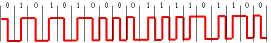
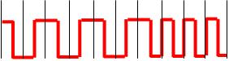
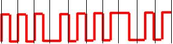

# Parsed Test

Total questions: 1040

---

## Question 2 (2 points)

Что по определению может включать в себя вычислительный комплекс?

*Type: Multiple Choice (4 correct answers)*

**✓ 1. два и более центральных процессоров**

**✓ 2. устройства ввода/вывода**

**✓ 3. оперативная память**

**✓ 4. процессоры ввода/вывода**

   5. ровно один центральный процессор

   6. операционная система

   7. прикладные программы

   8. базы данных

   9. канал связи

   10. узел/узлы связи

---

## Question 3 (2 points)

Что по определению может включать в себя вычислительная система?

*Type: Multiple Choice (8 correct answers)*

**✓ 1. ровно один центральный процессор**

**✓ 2. устройства ввода/вывода**

**✓ 3. оперативная память**

**✓ 4. процессоры ввода/вывода**

**✓ 5. базы данных**

**✓ 6. операционная система**

**✓ 7. прикладные программы**

**✓ 8. два и более центральных процессоров**

   9. канал связи

   10. узел/узлы связи

---

## Question 4 (2 points)

Что по определению могут включать в себя средства телекоммуникаций?

*Type: Multiple Choice (2 correct answers)*

**✓ 1. узлы связи**

**✓ 2. каналы связи**

   3. оперативная память

   4. процессоры ввода/вывода

   5. базы данных

   6. операционная система

   7. прикладные программы

   8. два и более центральных процессоров

   9. ровно один центральный процессор

   10. устройства ввода/вывода

---

## Question 6 (2 points)

Что по определению включает в себя вычислительная система ?

*Type: Multiple Choice (3 correct answers)*

**✓ 1. технические средства**

**✓ 2. программные средства**

**✓ 3. информационное обеспечение**

   4. все приведенные варианты ответов правильные

   5. только один из прочих вариантов ответа правильный

   6. обслуживающий персонал

---

## Question 7 (2 points)

В чем отличие информации от данных? Выберите верные утверждения.

*Type: Multiple Choice (3 correct answers)*

**✓ 1. Данные могут не содержать информацию**

**✓ 2. Мерой данных является объем**

**✓ 3. Мерой информации является энтропия**

   4. Объем информации измеряется в байтах

   5. Данные всегда содержат информацию

   6. Количественной мерой данных является энтропия

   7. Данные и информация - это одно и то же.

   8. Мерой данных является емкость

---

## Question 9 (1 points)

Основной целью построения вычислительного комплекса является обеспечение ... (закончите фразу)

*Type: Single Choice (1 correct answer)*

**✓ 1. высокой надежности и/или производительности**

   2. высокой надежности при невысокой производительности

   3. высокой  производительности при невысокой стоимости

   4. высокой скорости передачи данных

   5. низкой стоимости

   6. управления внешним объектом

---

## Question 10 (1 points)

В чём принято измерять системную производительность вычислительной системы?

*Type: Single Choice (1 correct answer)*

**✓ 1. задач в секунду**

   2. бод

   3. MFLOPS

   4. MIPS

   5. такты в секунду

   6. мегагерцы

   7. FPS

   8. команд/секунду

---

## Question 11 (1 points)

В чём принято измерять производительность компьютера (ЭВМ)?

*Type: Multiple Choice (2 correct answers)*

**✓ 1. MFLOPS**

**✓ 2. MIPS**

   3. LAPS

   4. децибел/c

   5. тактов в секунду

   6. мегагерц

   7. FPS

   8. задач в секунду

---

## Question 12 (2 points)

Что по определению включает в себя канал связи?

*Type: Multiple Choice (3 correct answers)*

**✓ 1. линия связи**

**✓ 2. каналообразующее оборудование**

**✓ 3. аппаратура передачи данных**

   4. маршрутизатор

   5. мост

   6. оперативная память

   7. шлюз

   8. центр обработки данных

---

## Question 13 (2 points)

Укажите, что из перечисленного называется узлом связи компьютерной сети.

*Type: Multiple Choice (3 correct answers)*

**✓ 1. мост**

**✓ 2. шлюз**

**✓ 3. маршрутизатор**

   4. сервер

   5. прокси-сервер

   6. оперативная память

   7. файловый сервер

   8. центр обработки данных

---

## Question 15 (2 points)

Что принято относить к информационному обеспечению (dataware) вычислительной системы?

*Type: Multiple Choice (2 correct answers)*

**✓ 1. база данных**

**✓ 2. система управления базой данных**

   3. системное программное обеспечение

   4. прикладное программное обеспечение

   5. обслуживающий персонал

   6. каналообразующее оборудование

---

## Question 16 (2 points)

Укажите основные функции узла связи в компьютерной сети?

*Type: Multiple Choice (4 correct answers)*

**✓ 1. маршрутизация**

**✓ 2. коммутация**

**✓ 3. мультиплексирование**

**✓ 4. демультиплексирование**

   5. декоммутация

   6. демаршрутизация

   7. обработка запросов к базе данных

   8. перколяция

---

## Question 17 (2 points)

Как называется процесс установления физического или логического соединения между входным и выходным 
портами узла связи? 

 * В качестве ответа введите одно слово  в именительном падеже единственного 
числа.

*Type: Text Input (3 correct answers)*

**✓ 1. коммутация**

**✓ 2. Коммутация**

**✓ 3. КОММУТАЦИЯ**

---

## Question 18 (2 points)

Как называется процесс выбора выходного порта в узле компьютерной сети при определении направления 
передачи данных? 

 * В качестве ответа введите одно слово в именительном падеже единственного числа.

*Type: Text Input (3 correct answers)*

**✓ 1. маршрутизация**

**✓ 2. Маршрутизация**

**✓ 3. МАРШРУТИЗАЦИЯ**

---

## Question 19 (2 points)

Как называется процесс объединения нескольких входящих в узел потоков данных в один выходящий из узла 
поток? 

 * В качестве ответа введите одно слово в именительном падеже единственного 
числа.

*Type: Text Input (5 correct answers)*

**✓ 1. мультиплексирование**

**✓ 2. Мультиплексирование**

**✓ 3. МУЛЬТИПЛЕКСИРОВАНИЕ**

**✓ 4. multiplexing**

**✓ 5. Multiplexing**

---

## Question 20 (2 points)

Как называется процесс разделения одного входящего в узел потока данных на несколько выходящих из узла 
потоков? 

 * В качестве ответа введите одно слово в именительном падеже единственного 
числа.

*Type: Text Input (5 correct answers)*

**✓ 1. демультиплексирование**

**✓ 2. Демультиплексирование**

**✓ 3. ДЕМУЛЬТИПЛЕКСИРОВАНИЕ**

**✓ 4. demultiplexing**

**✓ 5. Demultiplexing**

---

## Question 21 (2 points)

Какие поля в общем случае содержатся в сообщении, передаваемом по компьютерной сети?

*Type: Multiple Choice (3 correct answers)*

**✓ 1. данные**

**✓ 2. заголовок**

**✓ 3. концевик**

   4. шифр

   5. управление

   6. бит-стаффинг

   7. ключ защиты

---

## Question 22 (2 points)

Укажите, что является узлом компьютерной сети.

*Type: Multiple Choice (3 correct answers)*

**✓ 1. маршрутизатор**

**✓ 2. центр обработки данных**

**✓ 3. коммутатор**

   4. среда передачи

   5. канал связи

   6. линия связи

   7. коадъютор

---

## Question 23 (1 points)

Что обозначает аббревиатура PAN?

*Type: Single Choice (1 correct answer)*

**✓ 1. Персональная сеть**

   2. Локальная вычислительная сеть

   3. Глобальная вычислительная сеть

   4. Виртуальная вычислительная сеть

   5. Домашняя вычислительная сеть

   6. Офисная вычислительная сеть

   7. Муниципальная вычислительная

---

## Question 24 (1 points)

Установите соответствие русских терминов англоязычным аббревиатурам.

*Type: Matching Values (4 correct answers)*

**✓ 1. LAN ::: локальная сеть**

**✓ 2. MAN ::: городская сеть**

**✓ 3. PAN ::: персональная сеть**

**✓ 4. WAN ::: глобальная сеть**

---

## Question 25 (2 points)

Укажите, каких типов бывают компьютерные сети в зависимости от их назначения.

*Type: Multiple Choice (4 correct answers)*

**✓ 1. вычислительные**

**✓ 2. информационные**

**✓ 3. информационно-вычислительные**

**✓ 4. информационно-управляющие**

   5. городские

   6. оптоволоконные

   7. беспроводные

   8. коммутируемые

   9. маршрутизируемые

---

## Question 26 (1 points)

Как называется компьютерная сеть, которая используется для объединения  телефонов, карманных ПК, 
смартфонов?

*Type: Single Choice (1 correct answer)*

**✓ 1. PAN**

   2. LAN

   3. MAN

   4. WAN

   5. Серверная ферма

   6. Корпоративная сеть

   7. Виртуальная частная сеть

---

## Question 27 (2 points)

Какие технологии используются для построения PAN?

*Type: Multiple Choice (2 correct answers)*

**✓ 1. Bluetooth**

**✓ 2. Zigbee**

   3. Ethernet

   4. Token Ring

   5. IEEE 802.16 (WiMAX)

   6. ATM

   7. MPLS

---

## Question 28 (1 points)

Что обозначает аббревиатура MAN?

*Type: Single Choice (1 correct answer)*

**✓ 1. Городская вычислительная сеть**

   2. Локальная вычислительная сеть

   3. Глобальная вычислительная сеть

   4. Виртуальная вычислительная сеть

   5. Домашняя вычислительная сеть

   6. Офисная вычислительная сеть

   7. Персональная сеть

---

## Question 29 (1 points)

Что обозначает аббревиатура LAN?

*Type: Single Choice (1 correct answer)*

**✓ 1. Локальная вычислительная сеть**

   2. Персональная сеть

   3. Глобальная вычислительная сеть

   4. Виртуальная вычислительная сеть

   5. Домашняя вычислительная сеть

   6. Офисная вычислительная сеть

   7. Муниципальная вычислительная

---

## Question 30 (1 points)

Что обозначает аббревиатура WAN?

*Type: Single Choice (1 correct answer)*

**✓ 1. Глобальная вычислительная сеть**

   2. Локальная вычислительная сеть

   3. Персональная сеть

   4. Виртуальная вычислительная сеть

   5. Домашняя вычислительная сеть

   6. Офисная вычислительная сеть

   7. Муниципальная вычислительная

---

## Question 31 (2 points)

Как называется компьютерная  сеть, представляющая собой логичесое объединение узлов, которые физически 
могут находиться в разных локальных сетях?

*Type: Multiple Choice (2 correct answers)*

**✓ 1. Виртуальная частная сеть**

**✓ 2. VPN**

   3. MAN

   4. WAN

   5. Серверная ферма

   6. Корпоративная сеть

   7. PAN

   8. LAN

---

## Question 32 (2 points)

Какие технологии используются для построения LAN?

*Type: Multiple Choice (2 correct answers)*

**✓ 1. Ethernet**

**✓ 2. Token Ring**

   3. Bluetooth

   4. Zigbee

   5. IEEE 802.16 (WiMAX)

   6. ATM

   7. MPLS

---

## Question 35 (2 points)

Какие данные являются  в исходном виде дискретными?

*Type: Multiple Choice (2 correct answers)*

**✓ 1. телеграфные**

**✓ 2. компьютерные**

   3. телефонные

   4. аудио

   5. видео

   6. факсимильные

---

## Question 36 (2 points)

Какие данные являются в исходном виде непрерывными?

*Type: Multiple Choice (4 correct answers)*

**✓ 1. разговорная речь**

**✓ 2. видео**

**✓ 3. температура воздуха в помещении**

**✓ 4. уровень воды в Неве**

   5. компьютерные данные

   6. цифровые данные

---

## Question 37 (1 points)

Какой спектр частот имеют аудиоданные (с музыкой)?

*Type: Single Choice (1 correct answer)*

**✓ 1. от 20 Гц до 20 кГц**

   2. от 10 кГц до 20 кГц

   3. от 0 Гц до 100 кГц

   4. от 100 Гц до 3400 Гц

   5. от 0 Гц до 20000 Гц

   6. от 300 Гц до 20000 кГц

   7. от 300 Гц до 3400 Гц

   8. от 80 Гц до 12000 Гц

   9. от 40 Гц до 6000 кГц

---

## Question 38 (1 points)

В чём отличие аудиоданных от телефонных?

*Type: Single Choice (1 correct answer)*

**✓ 1. у аудиоданных более широкий спектр**

   2. у аудиоданных более узкий спектр

   3. отличия нет

   4. у аудиоданных большая скорость передачи

   5. у аудиоданных меньшая скорость передачи

   6. у аудиоданных большая полоса пропускания

   7. у аудиоданных меньшая полоса пропускания

---

## Question 39 (1 points)

Какой спектр частот имеют голосовые данные?

*Type: Single Choice (1 correct answer)*

**✓ 1. от 80 Гц до 12 кГц**

   2. от 10 кГц до 20 кГц

   3. от 0 Гц до 100 кГц

   4. от 100 Гц до 3400 Гц

   5. от 0 Гц до 20000 Гц

   6. от 300 Гц до 20000 кГц

   7. от 300 Гц до 3400 Гц

   8. от 20 Гц до 20 кГц

   9. от 40 Гц до 6000 кГц

---

## Question 40 (1 points)

Какой спектр частот имеют видеоданные?

*Type: Single Choice (1 correct answer)*

**✓ 1. от 40 Гц до 6000 кГц**

   2. от 10 кГц до 20 кГц

   3. от 0 Гц до 100 кГц

   4. от 100 Гц до 3400 Гц

   5. от 0 Гц до 20000 Гц

   6. от 300 Гц до 20000 кГц

   7. от 300 Гц до 3400 Гц

   8. от 80 Гц до 12000 Гц

   9. от 20 Гц до 20 кГц

---

## Question 41 (1 points)

В какой полосе частот передаются данные в каналах тональной частоты?

*Type: Single Choice (1 correct answer)*

**✓ 1. от 300 Гц до 3400 Гц**

   2. от 10 кГц до 20 кГц

   3. от 0 Гц до 100 кГц

   4. от 100 Гц до 3400 Гц

   5. от 0 Гц до 20000 Гц

   6. от 300 Гц до 20000 кГц

   7. от 20 Гц до 20 кГц

   8. от 80 Гц до 12000 Гц

   9. от 40 Гц до 6000 кГц

---

## Question 42 (2 points)

Какие требования предъявляются к организации компьютерных сетей?

*Type: Multiple Choice (5 correct answers)*

**✓ 1. Открытость**

**✓ 2. Гибкость**

**✓ 3. Совместимость**

**✓ 4. Масштабируемость**

**✓ 5. Эффективность**

   6. Размерность

   7. Системность

   8. Протяжённость

   9. Адекватность

   10. Простота

---

## Question 43 (1 points)

Возможность включения дополнительных компонентов в компьютерную сеть без изменения существующих 
технических и программных средств называется ...

*Type: Single Choice (1 correct answer)*

**✓ 1. открытостью**

   2. масштабируемостью

   3. прозрачностью

   4. эффективностью

   5. надёжностью

   6. системностью

   7. верифицируемостью

---

## Question 44 (1 points)

Сохранение работоспособности при изменении структуры вычислительной сети в результате выхода из строя 
отдельных компонентов или при замене оборудования называется ...

*Type: Single Choice (1 correct answer)*

**✓ 1. гибкостью**

   2. открытостью

   3. эффективностью

   4. адекватностью

   5. прозрачностью

   6. масштабируемостью

---

## Question 45 (1 points)

Возможность работы в сети оборудования разного типа и разных производителей называется ...

*Type: Single Choice (1 correct answer)*

**✓ 1. совместимостью**

   2. эффективностью

   3. масштабируемостью

   4. прозрачностью

   5. системностью

   6. оскуляцией

---

## Question 46 (1 points)

Способность компьютерной сети увеличивать свою производительность при добавлении узлов и каналов связи 
называется...

*Type: Single Choice (1 correct answer)*

**✓ 1. масштабируемостью**

   2. открытостью

   3. эффективностью

   4. гибкостью

   5. надёжностью

   6. адекватностью

   7. экскалацией

---

## Question 47 (1 points)

Обеспечение требуемого качества обслуживания пользователей компьютерной сети при минимальных 
затратах называется ...

*Type: Single Choice (1 correct answer)*

**✓ 1. эффективностью**

   2. открытостью

   3. закрытостью

   4. надёжностью

   5. гибкостью

   6. масштабируемостью

---

## Question 48 (2 points)

Укажите номера уровней OSI-модели.

*Type: Matching Values (7 correct answers)*

**✓ 1. Сетевой уровень ::: 3**

**✓ 2. Уровень представления ::: 6**

**✓ 3. Физический уровень ::: 1**

**✓ 4. Транспортный уровень ::: 4**

**✓ 5. Прикладной уровень ::: 7**

**✓ 6. Сеансовый уровень ::: 5**

**✓ 7. Канальный уровень ::: 2**

---

## Question 49 (2 points)

Как называются уровни OSI-модели?

*Type: Matching Values (7 correct answers)*

**✓ 1. 5 ::: сеансовый**

**✓ 2. 7 ::: прикладной**

**✓ 3. 1 ::: физический**

**✓ 4. 4 ::: транспортный**

**✓ 5. 2 ::: канальный**

**✓ 6. 6 ::: представления**

**✓ 7. 3 ::: сетевой**

---

## Question 50 (1 points)

Установите соответствие между русскоязычными и англоязычными названиями уровней OSI-модели

*Type: Matching Values (7 correct answers)*

**✓ 1. физический уровень ::: physical layer (PHY)**

**✓ 2. канальный уровень ::: data link layer**

**✓ 3. сетевой уровень ::: network layer**

**✓ 4. транспортный уровень ::: transport layer**

**✓ 5. сеансовый уровень ::: session layer**

**✓ 6. уровень представления ::: presentation layer**

**✓ 7. прикладной уровень ::: application layer**

---

## Question 51 (2 points)

Как называется первый уровень OSI-модели?  

* В качестве ответа  введите одно слово (прилагательное в именительном падеже)

*Type: Text Input (4 correct answers)*

**✓ 1. физический**

**✓ 2. Физический**

**✓ 3. physical**

**✓ 4. PHY**

---

## Question 52 (2 points)

Как называется второй уровень OSI-модели?

* В качестве ответа  введите одно слово (прилагательное в именительном падеже)

*Type: Text Input (4 correct answers)*

**✓ 1. канальный**

**✓ 2. Канальный**

**✓ 3. data link**

---

## Question 53 (2 points)

Как называется третий уровень OSI-модели?

* В качестве ответа  введите одно слово (прилагательное в именительном падеже)

*Type: Text Input (4 correct answers)*

**✓ 1. сетевой**

**✓ 2. Сетевой**

**✓ 3. network**

**✓ 4. Network**

---

## Question 54 (2 points)

Как называется четвёртый уровень OSI-модели?

* В качестве ответа  введите одно слово (прилагательное в именительном падеже)

*Type: Text Input (4 correct answers)*

**✓ 1. транспортный**

**✓ 2. Транспортный**

**✓ 3. transport**

**✓ 4. Transport**

---

## Question 55 (2 points)

Как называется пятый уровень OSI-модели?

* В качестве ответа  введите одно слово (прилагательное в именительном падеже)

*Type: Text Input (6 correct answers)*

**✓ 1. сеансовый**

**✓ 2. Сеансовый**

**✓ 3. сессионный**

**✓ 4. Сессионный**

**✓ 5. session**

**✓ 6. Session**

---

## Question 56 (2 points)

Как называется шестой уровень OSI-модели?

*Type: Text Input (6 correct answers)*

**✓ 1. представления**

**✓ 2. Представления**

**✓ 3. представительский**

**✓ 4. Представительский**

**✓ 5. Presentation**

**✓ 6. presentation**

---

## Question 57 (2 points)

Как называется седьмой уровень OSI-модели?

* В качестве ответа  введите одно слово (прилагательное в именительном падеже)

*Type: Text Input (4 correct answers)*

**✓ 1. прикладной**

**✓ 2. Прикладной**

**✓ 3. Application**

**✓ 4. application**

---

## Question 58 (1 points)

Какая основная задача решается на 3-м уровне OSI-модели?

*Type: Single Choice (1 correct answer)*

**✓ 1. Маршрутизация**

   2. Шифрование данных

   3. Кодирование данных

   4. Модуляция

   5. Управление каналом

   6. Сжатие данных

---

## Question 59 (1 points)

Какая основная задача решается на 2-м уровне OSI-модели?

*Type: Single Choice (1 correct answer)*

**✓ 1. управление доступом к среде передачи данных**

   2. маршрутизация

   3. конвергенция

   4. мультиплексирование

   5. кодирование

   6. передача сигналов

   7. управление сетью

---

## Question 60 (1 points)

На каком уровне OSI-модели решается задача управления доступом к среде передачи данных?

*Type: Single Choice (1 correct answer)*

**✓ 1. канальном**

   2. физическом

   3. сетевом

   4. транспортном

   5. сеансовом

   6. прикладном

   7. представления

---

## Question 61 (1 points)

Сколько уровней содержит OSI-модель?

*Type: Text Input (3 correct answers)*

**✓ 1. 7**

**✓ 2. семь**

**✓ 3. Семь**

---

## Question 62 (1 points)

На каком уровне OSI-модели реализуются методы доступа к среде передачи?

*Type: Text Input (5 correct answers)*

**✓ 1. 2**

**✓ 2. канальный**

**✓ 3. канальном**

**✓ 4. Канальный**

**✓ 5. на канальном**

---

## Question 63 (1 points)

На каком уровне OSI-модели реализуются методы маршрутизации?

*Type: Text Input (5 correct answers)*

**✓ 1. 3**

**✓ 2. сетевой**

**✓ 3. Сетевой**

**✓ 4. сетевом**

**✓ 5. на сетевом**

---

## Question 64 (2 points)

На каком уровне OSI-модели реализуется ...?

*Type: Matching Values (7 correct answers)*

**✓ 1. контроль последовательности прохождения пакетов ::: транспортный**

**✓ 2. управление маршрутизацией ::: сетевой**

**✓ 3. управление доступом сетевых устройств к среде передачи ::: канальный**

**✓ 4. модуляция сигнала, передаваемого по среде ::: физический**

**✓ 5. интерфейс между программой пользователя и системой связи ::: прикладной**

**✓ 6. кодирование передаваемых сигналов ::: физический**

**✓ 7. шифрование и дешифрование данных ::: представления**

---

## Question 65 (2 points)

На какие подуровни разбивается в IEEE-модели канальный уровень?

*Type: Multiple Choice (2 correct answers)*

**✓ 1. MAC**

**✓ 2. LLC**

   3. TCP

   4. UDP

   5. UTP

   6. STP

   7. LSR

---

## Question 66 (1 points)

Подуровень управления доступом к среде передачи - это ...

*Type: Single Choice (1 correct answer)*

**✓ 1. MAC**

   2. LLC

   3. UTP

   4. FTP

   5. STP

   6. ATM

   7. DSL

---

## Question 67 (1 points)

Подуровень управления логическим соединением - это ...

*Type: Single Choice (1 correct answer)*

**✓ 1. LLC**

   2. MAC

   3. DSL

   4. LSR

   5. LER

   6. SDH

   7. PDH

---

## Question 68 (2 points)

Какие типы сервисов обеспечивает LLC-подуровень канального уровня?

*Type: Multiple Choice (3 correct answers)*

**✓ 1. сервис без установления соединения и без подтверждения доставки**

**✓ 2. сервис без установления соединения с подтверждением доставки**

**✓ 3. сервис с установлением соединения**

   4. сервис с коммутацией

   5. сервис без установления соединения и с частичным подтверждением доставки

   6. сервис с маршрутизацией

   7. сервис с установлением соединения и с подтверждением доставки

   8. сервис с установлением соединения и с подтверждением по запросу

---

## Question 69 (2 points)

Как называется соглашение о взаимодействии между уровнями одной системы, определяющее структуру 
данных и способ обмена данными между соседними уровнями?

 * В качестве ответа введите одно слово в именительном падеже единственного числа.

*Type: Text Input (4 correct answers)*

**✓ 1. интерфейс**

**✓ 2. Интерфейс**

**✓ 3. интерфейсом**

**✓ 4. Интерфейсом**

---

## Question 70 (2 points)

Как называется совокупность правил, регламентирующих формат и процедуры взаимодействия процессов 
одноимённых уровней на основе обмена сообщениями?

 * В качестве ответа введите одно слово в именительном падеже единственного 
числа.

*Type: Text Input (4 correct answers)*

**✓ 1. протокол**

**✓ 2. Протокол**

**✓ 3. протоколом**

**✓ 4. Протоколом**

---

## Question 71 (1 points)

На каком уровне (название) OSI-модели реализуются методы маршрутизации?

*Type: Text Input (6 correct answers)*

**✓ 1. Сетевой**

**✓ 2. сетевой**

**✓ 3. сетевом**

**✓ 4. на сетевом**

**✓ 5. Сетевом**

**✓ 6. На сетевом**

---

## Question 72 (1 points)

На каком уровне (название) OSI-модели используются MAC-адреса?

*Type: Text Input (6 correct answers)*

**✓ 1. Канальном**

**✓ 2. канальном**

**✓ 3. канальный**

**✓ 4. Канальный**

**✓ 5. на канальном**

**✓ 6. На канальном**

---

## Question 74 (1 points)

Что такое МАС-адрес?

*Type: Single Choice (1 correct answer)*

**✓ 1. Физический адрес**

   2. Сетевой адрес

   3. Адрес маршрута

   4. Транспортный адрес

   5. Адрес приложения

   6. Адрес порта

---

## Question 75 (1 points)

Сколько устройств в Интернете может иметь одинаковый универсальный MAC-адрес?

*Type: Single Choice (1 correct answer)*

**✓ 1. 1**

   2. 0

   3. 255

   4. 256

   5. Нет правильного ответа

   6. 65535

   7. 65536

   8. 127

   9. Любое количество

---

## Question 76 (1 points)

Что такое ISO?

*Type: Single Choice (1 correct answer)*

**✓ 1. Международная организация по стандартизации**

   2. Модель взаимодействия открытых систем

   3. Семиуровневая модель вычислительных сетей

   4. Протокол передачи данных

   5. Открытая вычислительная система

   6. Тип сетевого оборудования

---

## Question 77 (1 points)

Что такое OSI?

*Type: Single Choice (1 correct answer)*

**✓ 1. Модель взаимодействия открытых систем**

   2. Международная организация по стандартизации

   3. Межсетевой протокол

   4. Открытая иерархическая система

   5. Открытый сетевой интерфейс

   6. Операционная система

---

## Question 78 (2 points)

Какие уровни OSI-модели относятся к высшим уровням?

*Type: Multiple Choice (4 correct answers)*

**✓ 1. транспортный**

**✓ 2. сеансовый**

**✓ 3. представления**

**✓ 4. прикладной**

   5. физический

   6. канальный

   7. сетевой

---

## Question 79 (2 points)

Какие уровни OSI-модели относятся к низшим уровням?

*Type: Multiple Choice (3 correct answers)*

**✓ 1. физический**

**✓ 2. канальный**

**✓ 3. сетевой**

   4. прикладной

   5. транспортный

   6. сеансовый

   7. представления

---

## Question 80 (2 points)

Интерфейсы подразделяются на:

*Type: Multiple Choice (2 correct answers)*

**✓ 1. схемные**

**✓ 2. программные**

   3. логические

   4. процедурные

   5. инвариантные

   6. инвертированные

---

## Question 81 (2 points)

Какие из перечисленных характеристик используются для описания сетевых протоколов?

*Type: Multiple Choice (2 correct answers)*

**✓ 1. логическая**

**✓ 2. процедурная**

   3. схемная

   4. программная

   5. эффективности

   6. производительности

---

## Question 82 (1 points)

На каком уровне OSI-модели используются IP-адреса?

* В качестве ответа введите целое число

*Type: Text Input (1 correct answer)*

**✓ 1. 3**

---

## Question 83 (1 points)

PDU - это ...

*Type: Single Choice (1 correct answer)*

**✓ 1. Протокольный блок данных**

   2. Время двойного оборота

   3. Путь передачи данных

   4. Протокол прикладного уровня

   5. Метод внутренней маршрутизации

   6. Технология коммутации

   7. Дейтаграммный протокол устройства

   8. Протокол дейтаграммных пользователей

   9. Уникальный путь передачи данных

---

## Question 84 (2 points)

Пусть некоторое приложение собирается передать сообщение в компьютерную сеть.
Что будет происходить с PDU, содержащим это сообщение?

*Type: Multiple Choice (2 correct answers)*

**✓ 1. Размер PDU будет увеличиваться**

**✓ 2. PDU будет продвигаться от 7-го уровня к 1-му**

   3. Размер PDU будет уменьшаться

   4. PDU будет продвигаться от 1-го уровня к 7-му

   5. Размер PDU будет оставаться неизменным

   6. PDU будет отправлен с 7-го уровня, минуя 1-й

   7. PDU будет отправлен с 1-го уровня, минуя 7-й

---

## Question 85 (2 points)

Какая англоязычная аббревиатура соответствует термину "протокольный блок данных"?

*Type: Text Input (3 correct answers)*

**✓ 1. PDU**

**✓ 2. pdu**

**✓ 3. ЗВГ**

---

## Question 87 (2 points)

Как называется блок данных, передаваемый на канальном уровне?

*Type: Text Input (6 correct answers)*

**✓ 1. кадр**

**✓ 2. кадром**

**✓ 3. Кадр**

**✓ 4. Кадром**

**✓ 5. frame**

**✓ 6. Frame**

---

## Question 88 (2 points)

Как называется блок данных, передаваемый на сетевом уровне?

*Type: Text Input (4 correct answers)*

**✓ 1. пакет**

**✓ 2. Пакет**

**✓ 3. packet**

**✓ 4. Packet**

---

## Question 89 (1 points)

Установите соответствие между русскими и английскими терминами.

*Type: Matching Values (5 correct answers)*

**✓ 1. кадр ::: frame**

**✓ 2. пакет ::: packet**

**✓ 3. дейтаграмма ::: datagram**

**✓ 4. сообщение ::: message**

---

## Question 90 (2 points)

Что является корректным МАС-адресом?

*Type: Single Choice (1 correct answer)*

**✓ 1. 00-1А-F4-05-56-67**

   2. 192.65.132.1

   3. mac.adres.ch

   4. 01:12::D3:FF

   5. 01-34-Z4-X8-99-GG

   6. 901:42::E3:BA

   7. 20-A1-00-45-23

   8. FF-00-05-DE-11-00-11

---

## Question 91 (3 points)

Что является корректным МАС-адресом?

*Type: Multiple Choice (3 correct answers)*

**✓ 1. 00-01-05-99-95-00**

**✓ 2. 01-AA-BB-CC-DD-EF**

**✓ 3. 2F-01-05-95-91-90**

   4. F3-0A-B2-CC-D1-24

   5. 01-AB-CD-EF-GH-10

   6. 00.01.64.91.FF.00

   7. 01-AA-BB-CC-DD

   8. AB.01.64.91:FF.BC

---

## Question 92 (3 points)

Что не может являться МАС-адресом?

*Type: Multiple Choice (4 correct answers)*

**✓ 1. 00-12-AA-CD-RH-34**

**✓ 2. AA-BB-CC-DD-EE-FF**

**✓ 3. 00-00-00-3A-D4-F5**

**✓ 4. 5F-11-22-33-44-55**

   5. 00-00-02-0A-1B-0C

   6. АF-90-02-0A-9B-9C

   7. 00-11-22-33-44-55

   8. 1C-05-31-E2-99-01

---

## Question 93 (3 points)

Что не может являться МАС-адресом?

*Type: Multiple Choice (4 correct answers)*

**✓ 1. 12-24-99-0Х-FA-08**

**✓ 2. 45-16-A1-B2-C3-00**

**✓ 3. 02-00-16-71-11-17-11**

**✓ 4. 42-16-A1-B2-C3-D4**

   5. 22-36-A1-B2-C3-DD

   6. 01-00-05-00-1F-5C

   7. 02-10-05-50-1F-F1

   8. 3F-21-04-F2-00-03

---

## Question 94 (1 points)

Как называется представленная на рисунке топология?

*Type: Single Choice (1 correct answer)*

**✓ 1. Полносвязная**

   2. Общая шина

   3. Дерево

   4. Звезда

   5. Кольцо

   6. Многосвязная

   7. Смешанная

   8. Амбивалентная

   9. Робастная

   10. Канальная

   11. Стробоскопическая

---

## Question 95 (1 points)

Как называется представленная на рисунке топология?

*Type: Single Choice (1 correct answer)*

**✓ 1. Многосвязная**

   2. Общая шина

   3. Дерево

   4. Звезда

   5. Кольцо

   6. Полносвязная

   7. Смешанная

   8. Амбивалентная

   9. Робастная

   10. Канальная

   11. Стробоскопическая

---

## Question 96 (1 points)

Как называется представленная на рисунке топология?

*Type: Single Choice (1 correct answer)*

**✓ 1. Многосвязная**

   2. Общая шина

   3. Дерево

   4. Звезда

   5. Кольцо

   6. Полносвязная

   7. Смешанная

   8. Амбивалентная

   9. Робастная

   10. Канальная

   11. Стробоскопическая

---

## Question 97 (1 points)

Как называется представленная на рисунке топология?

*Type: Single Choice (1 correct answer)*

**✓ 1. Звезда**

   2. Общая шина

   3. Дерево

   4. Полносвязная

   5. Кольцо

   6. Многосвязная

   7. Смешанная

   8. Амбивалентная

   9. Робастная

   10. Канальная

   11. Стробоскопическая

---

## Question 98 (1 points)

Как называется представленная на рисунке топология?

*Type: Single Choice (1 correct answer)*

**✓ 1. Кольцо**

   2. Общая шина

   3. Дерево

   4. Звезда

   5. Полносвязная

   6. Многосвязная

   7. Смешанная

   8. Амбивалентная

   9. Робастная

   10. Канальная

   11. Стробоскопическая

---

## Question 99 (1 points)

Как называется представленная на рисунке топология?

*Type: Single Choice (1 correct answer)*

**✓ 1. Общая шина**

   2. Полносвязная

   3. Дерево

   4. Звезда

   5. Кольцо

   6. Многосвязная

   7. Смешанная

   8. Амбивалентная

   9. Робастная

   10. Канальная

   11. Стробоскопическая

---

## Question 100 (2 points)

В каких единицах обычно измеряется длина маршрута доставки сообщений при сравнении разных 
топологий?

 * В качестве ответа введите одно слово с маленькой буквы в именительном падеже единственного 
числа.

*Type: Text Input (4 correct answers)*

**✓ 1. хоп**

**✓ 2. хопы**

**✓ 3. в хопах**

**✓ 4. hop**

---

## Question 101 (2 points)

Какие характеристики используются при сравнении разных топологий сети передачи данных?

*Type: Multiple Choice (5 correct answers)*

**✓ 1. производительность сети (возможное снижение эффективной скорости передачи данных из-за конфликтов)**

**✓ 2. время доставки сообщений (или длина маршрута)**

**✓ 3. стоимость, зависящая как от состава оборудования, так и от сложности реализации**

**✓ 4. надежность, определяемая наличием альтернативных путей**

**✓ 5. сложность (простота) структурной и функциональной организации**

   6. количество узлов связи

   7. количество каналов связи

---

## Question 102 (1 points)

Какая топология обеспечивает минимальное время доставки сообщений?

*Type: Single Choice (1 correct answer)*

**✓ 1. Полносвязная**

   2. Общая шина

   3. Дерево

   4. Звезда

   5. Кольцо

   6. Многосвязная

   7. Смешанная

   8. Амбивалентная

   9. Робастная

   10. Канальная

   11. Стробоскопическая

---

## Question 103 (1 points)

Какая топология СПД обладает максимальной надежностью?

*Type: Single Choice (1 correct answer)*

**✓ 1. Полносвязная**

   2. Общая шина

   3. Дерево

   4. Звезда

   5. Кольцо

   6. Многосвязная

   7. Смешанная

   8. Амбивалентная

   9. Робастная

   10. Канальная

   11. Стробоскопическая

---

## Question 104 (1 points)

Какая топология является самой простой и дешевой?

*Type: Single Choice (1 correct answer)*

**✓ 1. Общая шина**

   2. Полносвязная

   3. Дерево

   4. Звезда

   5. Кольцо

   6. Многосвязная

   7. Смешанная

   8. Амбивалентная

   9. Робастная

   10. Канальная

   11. Стробоскопическая

---

## Question 105 (2 points)

Выберите верные утверждения.

*Type: Multiple Choice (3 correct answers)*

**✓ 1. Физическая топология полностью определяется структурой связи узлов**

**✓ 2. Логическая топология зависит от последовательности передачи данных между узлами**

**✓ 3. Физическая топология сети "Кольцо" может совпадать с "Полносвязной" при некотором количестве узлов в сети**

   4. Физическая топология зависит от последовательности передачи данных между узлами

   5. Физическая и логическая топологии всегда идентичны

   6. Физическая и логическая топологии всегда отличаются

   7. Логическая топология полностью определяется структурой связи узлов.

---

## Question 106 (1 points)

Чему равно количество каналов связи в сети с топологией "Дерево", состоящей из 10 узлов?

 * В качестве ответа введите целое число

*Type: Text Input (1 correct answer)*

**✓ 1. 9**

---

## Question 107 (1 points)

Чему равно количество каналов связи в сети с топологией "Дерево", состоящей из 15 узлов?

 * В качестве ответа введите целое число

*Type: Text Input (1 correct answer)*

**✓ 1. 14**

---

## Question 108 (1 points)

Чему равно количество каналов связи в сети с топологией "Звезда", состоящей из 10 узлов?

 * В качестве ответа введите целое число

*Type: Text Input (1 correct answer)*

**✓ 1. 9**

---

## Question 109 (1 points)

Чему равно количество каналов связи в сети с топологией "Звезда", состоящей из 15 узлов?

 * В качестве ответа введите целое число

*Type: Text Input (1 correct answer)*

**✓ 1. 14**

---

## Question 110 (1 points)

Чему равно количество каналов связи в сети с топологией "Кольцо", состоящей из 10 узлов?

 * В качестве ответа введите целое число

*Type: Text Input (1 correct answer)*

**✓ 1. 10**

---

## Question 111 (1 points)

Чему равно количество каналов связи в сети с топологией "Кольцо", состоящей из 15 узлов?

 * В качестве ответа введите целое число

*Type: Text Input (1 correct answer)*

**✓ 1. 15**

---

## Question 112 (1 points)

Чему равно количество каналов связи в сети с топологией "Полносвязная", состоящей из 10 узлов?

 * В качестве ответа введите целое число

*Type: Text Input (1 correct answer)*

**✓ 1. 45**

---

## Question 113 (1 points)

Чему равно количество каналов связи в сети с топологией "Полносвязная", состоящей из 15 узлов?

 * В качестве ответа введите целое число

*Type: Text Input (1 correct answer)*

**✓ 1. 105**

---

## Question 114 (1 points)

Чему равно количество каналов связи в сети с топологией "Полносвязная", состоящей из 20 узлов?

 * В качестве ответа введите целое число

*Type: Text Input (1 correct answer)*

**✓ 1. 190**

---

## Question 115 (1 points)

В сети с топологией "Кольцо" 24 компьютера. Чему равна средняя длина маршрута доставки сообщений в 
такой 
сети, если пакеты могут двигаться только в одном направлении? 

 * В качестве ответа укажите целое число хопов.

*Type: Text Input (1 correct answer)*

**✓ 1. 12**

---

## Question 116 (1 points)

В сети с топологией "Кольцо" 12 компьютеров. Чему равна средняя длина маршрута доставки сообщений в 
такой сети, если пакеты могут двигаться только в одном направлении? 

 * В качестве ответа укажите целое число хопов.

*Type: Text Input (1 correct answer)*

**✓ 1. 6**

---

## Question 117 (2 points)

В сети с топологией "Кольцо" 7 компьютеров. Чему равна средняя длина маршрута доставки сообщений в 
такой 
сети, если пакеты могут двигаться в обоих направлениях и всегда двигаются по кратчайшему маршруту? 

 * В качестве ответа укажите целое число хопов.

*Type: Text Input (1 correct answer)*

**✓ 1. 2**

---

## Question 118 (2 points)

В сети с топологией "Кольцо" 23 компьютера. Чему равна средняя длина маршрута доставки сообщений в такой 
сети, если пакеты могут двигаться обоих направлениях и всегда двигаются по кратчайшему маршруту? 

 * В качестве ответа укажите целое число хопов.

*Type: Text Input (1 correct answer)*

**✓ 1. 6**

---

## Question 119 (2 points)

Какие способы коммутации используются в компьютерных сетях?

*Type: Multiple Choice (4 correct answers)*

**✓ 1. коммутация пакетов**

**✓ 2. коммутация ячеек**

**✓ 3. коммутация каналов**

**✓ 4. коммутация сообщений**

   5. коммутация маршрутов

   6. коммутация IP

   7. коммутация фреймов

---

## Question 120 (1 points)

Какой способ коммутации используется в традиционных (аналоговых) телефонных сетях?

*Type: Single Choice (1 correct answer)*

**✓ 1. коммутация каналов**

   2. коммутация пакетов

   3. коммутация сообщений

   4. коммутация ячеек

   5. коммутация маршрутов

   6. коммутация линий

   7. коммутация маршрутов

   8. коммутация IP

---

## Question 121 (2 points)

Какие способы коммутации используют промежуточное хранение передаваемых данных?

*Type: Multiple Choice (3 correct answers)*

**✓ 1. коммутация сообщений**

**✓ 2. коммутация пакетов**

**✓ 3. коммутация ячеек**

   4. коммутация каналов

   5. коммутация данных

   6. коммутация маршрутов

   7. коммутация линий

---

## Question 122 (1 points)

При каком способе коммутации каналы связи должны иметь одинаковые пропускные способности на всем 
пути передачи?

*Type: Single Choice (1 correct answer)*

**✓ 1. Коммутация каналов**

   2. Коммутация пакетов

   3. Коммутация сообщений

   4. Коммутация ячеек

   5. Коммутация маршрутов

   6. Коммутация кадров

   7. Коммутация IP

   8. Коммутация фреймов

---

## Question 123 (1 points)

Какой способ коммутации эффективен при передаче больших объемов данных?

*Type: Single Choice (1 correct answer)*

**✓ 1. коммутация каналов**

   2. коммутация сообщений

   3. коммутация пакетов

   4. коммутация ячеек

   5. коммутация маршрутов

   6. коммутация кадров

   7. коммутация IP

---

## Question 124 (1 points)

Какой способ коммутации непременно требует установления соединения?

*Type: Single Choice (1 correct answer)*

**✓ 1. коммутация каналов**

   2. коммутация сообщений

   3. коммутация пакетов

   4. коммутация ячеек

   5. коммутация маршрутов

   6. коммутация кадров

   7. коммутация IP

---

## Question 125 (2 points)

Что относится к достоинствам коммутации каналов?

*Type: Multiple Choice (3 correct answers)*

**✓ 1. возможность использования существующих телефонных каналов**

**✓ 2. не требуется память в транзитных узлах для хранения сообщений**

**✓ 3. высокая эффективность при передаче больших объемов данных**

   4. каналы связи должны иметь одинаковые пропускные способности на всем пути передачи

   5. не требуется предварительное установление соединения

   6. задержка в промежуточных узлах может оказаться значительной

   7. высокая загрузка каналов связи

   8. низкая загрузка каналов связи

---

## Question 126 (2 points)

Что относится к недостаткам коммутации каналов?

*Type: Multiple Choice (2 correct answers)*

**✓ 1. каналы связи должны иметь одинаковые пропускные способности на всем пути передачи**

**✓ 2. большие накладные расходы на установление соединения**

   3. необходимость хранения передаваемых сообщений в промежуточных узлах

   4. задержка в промежуточных узлах может оказаться значительной

   5. высокие накладные расходы на анализ заголовков

   6. низкая загрузка каналов связи

   7. высокая загрузка каналов связи

---

## Question 127 (2 points)

Какими преимуществами обладает коммутация сообщений по сравнению с коммутацией каналов?

*Type: Multiple Choice (2 correct answers)*

**✓ 1. не требуется предварительное установление соединения**

**✓ 2. каналы связи на всем пути передачи могут иметь разные пропускные способности**

   3. каналы связи на всем пути передачи должны иметь одинаковые пропускные способности

   4. незначительные задержки в промежуточных узлах

   5. не требует большой ёмкости памяти в промежуточных узлах

   6. требуется предварительное установление соединения, что повышает надёжность передачи

---

## Question 128 (2 points)

Какими недостатками обладает коммутация сообщений по сравнению с коммутацией каналов?

*Type: Multiple Choice (2 correct answers)*

**✓ 1. необходимость хранения передаваемых сообщений в промежуточных узлах, что требует значительной ёмкости 
памяти при разных длинах передаваемых сообщений
.**

**✓ 2. задержка в промежуточных узлах может оказаться значительной**

   3. значительные накладные расходы на установление соединения

   4. требуется предварительное установление соединения

   5. одинаковые пропускные способности на всем пути

   6. низкая надёжность передачи данных

---

## Question 129 (2 points)

Какими недостатками обладает коммутация сообщений по сравнению с коммутацией пакетов?

*Type: Multiple Choice (3 correct answers)*

**✓ 1. большее время доставки сообщений**

**✓ 2. большие затраты буферной памяти в промежуточных узлах**

**✓ 3. менее эффективная организация надежной передачи данных**

   4. необходимость хранения передаваемых сообщений в промежуточных узлах

   5. требуется предварительное установление соединения

   6. необходимость сборки сообщения в конечном узле

   7. высокая загрузка каналов связи

---

## Question 130 (2 points)

Какими преимуществами обладает коммутация сообщений по сравнению с коммутацией пакетов?

*Type: Multiple Choice (2 correct answers)*

**✓ 1. меньшие накладные расходы на анализ заголовков**

**✓ 2. не требуется сборка сообщения в узле назначения**

   3. меньше время доставки сообщений

   4. более эффективное использование буферной памяти

   5. более эффективная организация надежной передачи данных

   6. не требуется предварительное установление соединения

---

## Question 131 (2 points)

Какими преимуществами обладает коммутация пакетов по сравнению с коммутацией сообщений?

*Type: Multiple Choice (3 correct answers)*

**✓ 1. меньше время доставки сообщений**

**✓ 2. более эффективное использование буферной памяти**

**✓ 3. более эффективная организация надежной передачи данных**

   4. меньше накладные расходы на анализ заголовков всех пакетов сообщения

   5. не требуется сборка сообщения в узле назначения

   6. не требуется предварительное установление соединения

---

## Question 132 (2 points)

Какими недостатками обладает коммутация пакетов по сравнению с коммутацией сообщений?

*Type: Multiple Choice (2 correct answers)*

**✓ 1. более высокие накладные расходы на анализ заголовков**

**✓ 2. необходимость сборки из пакетов в узле назначения**

   3. большее время доставки сообщений

   4. менее эффективное использование буферной памяти

   5. менее эффективная организация надежной передачи данных

   6. требуется предварительное установление соединения

---

## Question 133 (1 points)

Чем обусловлен тот факт, что при коммутации пакетов буферная память используется более эффективно, чем 
при коммутации сообщений?

*Type: Single Choice (1 correct answer)*

**✓ 1. ограниченным размером пакетов**

   2. большим числом пакетов

   3. разными маршрутами пакетов

   4. небольшим числом пакетов

   5. неограниченным размером пакетов

   6. одинаковыми маршрутами пакетов

---

## Question 134 (2 points)

За счёт чего время доставки сообщений при коммутации пакетов меньше, чем при коммутации сообщений?

*Type: Single Choice (1 correct answer)*

**✓ 1. разные пакеты одного и того же собщения передаются параллельно по разным каналам**

   2. разные пакеты одного и разных собщений передаются быстрее по разным каналам

   3. разные собщения передаются параллельно по разным каналам

   4. разные пакеты одного и того же собщения передаются одновременно по одному и тому же каналу

   5. скорость передачи пакетов выше, чем сообщений

   6. меньше задержки в узлах связи

---

## Question 135 (1 points)

При каком способе коммутации затраты на буферную память в узлах оказываются наибольшими?

*Type: Single Choice (1 correct answer)*

**✓ 1. коммутация сообщений**

   2. коммутация каналов

   3. коммутация пакетов

   4. коммутация ячеек

   5. коммутация маршрутов

   6. коммутация кадров

   7. коммутация IP

---

## Question 136 (2 points)

Почему коммутация пакетов обеспечивает более эффективную организацию надежной передачи данных, чем 
коммутация сообщений?

*Type: Multiple Choice (2 correct answers)*

**✓ 1. контроль передаваемых данных осуществляется для каждого пакета**

**✓ 2. в случае обнаружения ошибки переприему подлежит только один пакет**

   3. не осуществляется контроль передаваемых данных

   4. пакеты не теряются в сети

   5. используются более надёжные каналы связи

   6. не требуется большая буферная память

   7. пакеты передаются разными маршрутами

   8. контроль передаваемых данных осуществляется для всего сообщения

---

## Question 137 (2 points)

Основные достоинства коммутации ячеек?

*Type: Multiple Choice (4 correct answers)*

**✓ 1. маленькие задержки ячеек в узлах**

**✓ 2. не монополизируется канал связи**

**✓ 3. быстрая обработка заголовка ячейки в узлах, поскольку местоположение заголовка строго фиксировано**

**✓ 4. более эффективная, по сравнению с коммутацией пакетов, организация буферной памяти и надежной передачи 
данных**

   5. задержка ячеек в узлах - величина постоянная

   6. монополизируется канал связи

   7. не требуется обработка заголовка ячейки в узлах

---

## Question 139 (1 points)

Какой способ коммутации является основным в современных компьютерных сетях?

*Type: Single Choice (1 correct answer)*

**✓ 1. коммутация пакетов**

   2. коммутация сообщений

   3. коммутация каналов

   4. коммутация ячеек

   5. коммутация маршрутов

   6. коммутация кадров

   7. коммутация IP

---

## Question 140 (1 points)

Какие способы коммутации являются основными и наиболее широко используемыми в 
компьютерных сетях?

*Type: Multiple Choice (2 correct answers)*

**✓ 1. каналов**

**✓ 2. пакетов**

   3. сообщений

   4. маршрутов

   5. линий

   6. передач

   7. фреймов

---

## Question 141 (1 points)

Какими способами в компьютерной сети может быть реализована  коммутация пакетов?

*Type: Multiple Choice (2 correct answers)*

**✓ 1. дейтаграммный**

**✓ 2. виртуальный канал**

   3. программный

   4. реальный канал

   5. полносвязный

   6. маршрутизация

---

## Question 142 (2 points)

Как называется способ передачи данных, при котором пакеты одного и того же сообщения могут передаваться 
между двумя взаимодействующими абонентами по разным маршрутам? 

* В качестве ответа введите прилагательное в именительном падеже единственного числа с маленькой 
буквы

*Type: Text Input (12 correct answers)*

**✓ 1. дейтаграммном**

**✓ 2. дейтаграммный**

**✓ 3. при дейтаграммном**

**✓ 4. Дейтаграммном**

**✓ 5. Дейтаграммный**

**✓ 6. При дейтаграммном**

**✓ 7. датаграммный**

**✓ 8. датаграммного**

**✓ 9. датаграмный**

**✓ 10. дейтаграмный**

**✓ 11. datagram**

**✓ 12. Дейтаграммный**

---

## Question 143 (2 points)

Как называется способ передачи данных, при котором пакеты одного и того же сообщения приходят в 
конечный узел в 
произвольной последовательности? 

* В качестве ответа введите прилагательное в именительном падеже единственного числа с маленькой 
буквы

*Type: Text Input (12 correct answers)*

**✓ 1. дейтаграммном**

**✓ 2. дейтаграммный**

**✓ 3. при дейтаграммном**

**✓ 4. Дейтаграммном**

**✓ 5. Дейтаграммный**

**✓ 6. При дейтаграммном**

**✓ 7. датаграммный**

**✓ 8. датаграммного**

**✓ 9. датаграмный**

**✓ 10. дейтаграмный**

**✓ 11. datagram**

**✓ 12. Дейтаграммный**

---

## Question 144 (2 points)

Какими достоинствами обладает дейтаграммный способ передачи пакетов?

*Type: Multiple Choice (2 correct answers)*

**✓ 1. простота организации и реализации передачи данных - каждый пакет сообщения передается независимо от других 
пакетов**

**✓ 2. каждый пакет выбирает наилучший путь**

   3. все пакеты передаются по одному и тому же пути

   4. пакеты не теряются в процессе передачи

   5. сообщение не может быть передано получателю, пока в конечном узле не соберутся все пакеты данного сообщения

   6. в конечном узле не требуется собирать все пакеты сообщения

---

## Question 145 (2 points)

Какими недостатками обладает способ передачи пакетов "виртуальный канал"?

*Type: Multiple Choice (2 correct answers)*

**✓ 1. наличие накладных расходов на установление соединения**

**✓ 2. неэффективное использование ресурсов сети**

   3. требуется установление физического соединения между абонентами

   4. пакеты передаются без промежуточного хранения в узлах сети

   5. пакет двигаются разными маршрутами

---

## Question 146 (1 points)

Основной недостаток дейтаграммного способа передачи данных?

*Type: Single Choice (1 correct answer)*

**✓ 1. усложняется процесс сборки сообщения из пакетов, т.к. они могут приходить в конечный узел в произвольном порядке**

   2. каждый пакет сообщения передается независимо от других пакетов

   3. пакет двигаются разными маршрутами

   4. не требуется предварительно устанавливать соединение между абонентами

   5. требуется предварительно устанавливать соединение между абонентами

   6. пакеты могут иметь слишком большую длину

---

## Question 147 (1 points)

При каком способе передачи пакеты передаются в сети по одному и тому же маршруту?

*Type: Single Choice (1 correct answer)*

**✓ 1. Виртуальный канал**

   2. Дейтаграммный

   3. Программный

   4. Случайный

   5. Лавинообразный

   6. Однопутевой

   7. Многопутевой

   8. Статический

---

## Question 148 (1 points)

При каком способе передачи пакеты одного и того же сообщения передаются в сети по разным маршрутам?

*Type: Single Choice (1 correct answer)*

**✓ 1. Дейтаграммный**

   2. Виртуальный канал

   3. Программный

   4. Случайный

   5. Системный

   6. Многопутевой

   7. Адаптивный

   8. Динамический

---

## Question 149 (2 points)

Какие методы маршрутизации относятся к простым?

*Type: Multiple Choice (3 correct answers)*

**✓ 1. лавинообразные**

**✓ 2. по предыдущему опыту**

**✓ 3. случайные**

   4. однопутевые

   5. многопутевые

   6. локальные

   7. распределённые

   8. централизованные

---

## Question 150 (2 points)

Какие методы маршрутизации относятся к фиксированным?

*Type: Multiple Choice (2 correct answers)*

**✓ 1. однопутевые**

**✓ 2. многопутевые**

   3. по предыдущему опыту

   4. локальные

   5. распределённые

   6. централизованные

   7. случайные

   8. лавинообразные

---

## Question 151 (2 points)

Какие методы маршрутизации относятся к адаптивным?

*Type: Multiple Choice (3 correct answers)*

**✓ 1. локальные**

**✓ 2. централизованные**

**✓ 3. распределённые**

   4. случайные

   5. лавинообразные

   6. однопутевые

   7. многопутевые

   8. по предыдущему опыту

---

## Question 152 (1 points)

В каком методе маршрутизации изменение маршрутной таблицы зависит от состояний выходных буферов 
данного узла (маршрутизатора) и не зависит от состояния соседних узлов?

*Type: Single Choice (1 correct answer)*

**✓ 1. локальный**

   2. по предыдущему опыту

   3. распределённый

   4. централизованный

   5. случайный

   6. фиксированный

   7. лавинообразный

---

## Question 153 (1 points)

В каком методе маршрутизации изменение маршрутной таблицы зависит от состояний соседних узлов 
(маршрутизаторов)?

*Type: Single Choice (1 correct answer)*

**✓ 1. распределённый**

   2. локальный

   3. по предыдущему опыту

   4. централизованный

   5. случайный

   6. фиксированный

   7. лавинообразный

---

## Question 154 (1 points)

В каком методе маршрутизации изменение маршрутной таблицы осуществляется на основе анализа 
адресов отправителей пакетов?

*Type: Single Choice (1 correct answer)*

**✓ 1. по предыдущему опыту**

   2. локальный

   3. распределённый

   4. централизованный

   5. случайный

   6. фиксированный

   7. лавинообразный

---

## Question 155 (2 points)

Что изображено на рисунке? 

 *В качестве ответа введите два слова 

 

*Type: Text Input (4 correct answers)*

**✓ 1. маршрутная таблица**

**✓ 2. таблица маршрутизации**

**✓ 3. Маршрутная таблица**

**✓ 4. Таблица маршрутизации**

---

## Question 156 (1 points)

Интервал времени, в течение которого узел сети, передавший пакет, ожидает подтверждения - это…

*Type: Single Choice (1 correct answer)*

**✓ 1. Таймаут**

   2. Период

   3. Время передачи

   4. Задержка

   5. Флуктуация

   6. Дельта-тайм

   7. Время ожидания

   8. Время подтверждения

   9. Время отсечки

   10. Время окна

   11. Ширина окна

---

## Question 157 (1 points)

Из какого условия обычно определяется величина тайм-аута при единичной ширине окна?

*Type: Single Choice (1 correct answer)*

**✓ 1. минимум вдвое больше, чем время передачи кадра**

   2. больше, чем время передачи кадра в прямом направлении

   3. больше, чем время передачи кадра в обратном направлении

   4. больше, чем время передачи квитанции

   5. больше, чем время формирования квитанции

   6. вдвое больше, чем время передачи квитанции

   7. максимум вдвое больше, чем время передачи кадра

---

## Question 158 (2 points)

Какие особенности присущи сетевому компьютерному трафику?

*Type: Multiple Choice (4 correct answers)*

**✓ 1. неоднородность потока данных**

**✓ 2. разные требования к качеству передачи данных разных типов**

**✓ 3. возникновение периодов перегрузок**

**✓ 4. нестационарность трафика**

   5. стационарность трафика

   6. одинаковые требования к качеству передачи данных разных типов

   7. однородность потока данных

   8. отсутствие перегрузок

---

## Question 159 (2 points)

Какие цели преследует управление трафиком?

*Type: Multiple Choice (4 correct answers)*

**✓ 1. обеспечение надежной передачи данных**

**✓ 2. повышение эффективости загрузки оборудования сети**

**✓ 3. обеспечение требуемого уровня задержек при передаче по сети**

**✓ 4. предотвращение перегрузок и блокировок**

   5. повышение помехоустойчивости

   6. шифрование трафика

   7. антивирусная защита

   8. синхронизация передаваемых данных

---

## Question 160 (1 points)

Какая задача реализуется за счет механизмов квитирования и тайм-аута?

*Type: Single Choice (1 correct answer)*

**✓ 1. надежная передача данных**

   2. эффективная загрузка оборудования (каналов и узлов) сети

   3. малые задержки при передаче по сети

   4. предотвращение перегрузок и блокировок

   5. выбор наилучшего маршрута

   6. шифрация трафика на основе заданного алгоритма

   7. безопасная передача данных

---

## Question 161 (1 points)

Какая из представленных на графике зависимостей отражает влияние числа пакетов на производительность 
сети?

*Type: Single Choice (1 correct answer)*

**✓ 1. 5**

   2. 1

   3. 2

   4. 3

   5. 4

   6. 7

   7. 6

---

## Question 162 (1 points)

За счёт чего в телекоммуникационной сети обеспечивается надежная передача данных?

*Type: Single Choice (1 correct answer)*

**✓ 1. за счет механизма квитирования**

   2. за счет использования бит-стаффинга

   3. за счёт введения приоритетов

   4. за счёт маршрутизации

   5. за счёт коммутации

   6. за счёт применения виртуальных каналов

---

## Question 163 (1 points)

Как называется служебный кадр, подтверждающий, что данные переданы без ошибок?

*Type: Single Choice (1 correct answer)*

**✓ 1. положительная квитанция**

   2. пакет соглашения

   3. отрицательная квитанция

   4. безошибочная квитанция

   5. кадр доставки

   6. квитированный прием

   7. положительный кадр

   8. отрицательный кадр

---

## Question 164 (1 points)

Как называется служебный кадр, свидетельствующий, что переданные данные содержат ошибку?

*Type: Single Choice (1 correct answer)*

**✓ 1. отрицательная квитанция**

   2. положительная квитанция

   3. ошибочная квитанция

   4. контрольная квитанция

   5. ошибочные данные

   6. отрицательный кадр

   7. ошибочный кадр

---

## Question 165 (2 points)

Какой вид после реализации процедуры бит-стаффинг примет кадр:
10111110111111011111110
?

*Type: Text Input (1 correct answer)*

**✓ 1. 10111110011111010111110110**

---

## Question 166 (2 points)

Какой вид после реализации процедуры бит-стаффинга примет кадр:
11111011110111111111111
?

*Type: Text Input (1 correct answer)*

**✓ 1. 11111001111011111011111011**

---

## Question 167 (2 points)

Восстановите кадр, переданный в соответствии с процедурой бит-стаффинга и имеющий вид
11111001111011111011111011  ?

*Type: Text Input (1 correct answer)*

**✓ 1. 11111011110111111111111**

---

## Question 168 (2 points)

Восстановите кадр, переданный в соответствии с процедурой бит-стаффинга и имеющий вид
100110111110001111101  ?

*Type: Text Input (1 correct answer)*

**✓ 1. 1001101111100111111**

---

## Question 169 (1 points)

Основное назначение "механизма скользящего окна"?

*Type: Single Choice (1 correct answer)*

**✓ 1. увеличить загрузку канала связи**

   2. увеличить загрузку узла связи

   3. уменьшить загрузку канала связи

   4. уменьшить загрузку узла связи

   5. увеличить надёжность доставки кадров

   6. уменьшить время доставки кадров

---

## Question 170 (1 points)

Что такое "ширина окна"?

*Type: Single Choice (1 correct answer)*

**✓ 1. максимальное число кадров, которые могут быть переданы без подтверждения**

   2. минимальное число кадров, которые могут быть переданы без подтверждения

   3. минимальное время, в течение которого могут быть переданы кадры без подтверждения

   4. минимальное время, в течение которого передающий узел ожидает подтверждения

   5. максимальное время, в течение которого могут быть переданы кадры без подтверждения

   6. максимальное время, в течение которого передающий узел ожидает подтверждения

   7. максимальное число квитанций, которые должны быть переданы

   8. минимальное число квитанций, которые должны быть переданы

---

## Question 171 (2 points)

Ширина окна равна 128. Передающий узел, передавший 36-й кадр, получил подтверждение о приёме 28-го 
кадра. 
Какое максимальное число кадров может ещё передать узел без подтверждения?

*Type: Text Input (1 correct answer)*

**✓ 1. 120**

---

## Question 172 (2 points)

Ширина окна равна 128. Передающий узел, передавший 39-й кадр, получил подтверждение о приёме 38-го кадра. 
Какое максимальное число кадров может ещё передать узел без подтверждения?

*Type: Text Input (1 correct answer)*

**✓ 1. 127**

---

## Question 173 (2 points)

Ширина окна равна 8. Передающий узел, передавший 5-й кадр, получил подтверждение о приёме 3-го кадра. 
Какое максимальное число кадров может ещё передать узел без подтверждения?

*Type: Text Input (1 correct answer)*

**✓ 1. 6**

---

## Question 174 (2 points)

Ширина окна равна 16. Передающий узел, передавший 6-й кадр, получил подтверждение о приёме 5-го кадра. 
Какое максимальное число кадров может ещё передать узел без подтверждения?

*Type: Text Input (1 correct answer)*

**✓ 1. 15**

---

## Question 175 (1 points)

Какая из перечисленных задач реализуется за счет применения механизма окна?

*Type: Single Choice (1 correct answer)*

**✓ 1. увеличение загрузки канала связи**

   2. надежная передача данных

   3. малые задержки при передаче по сети

   4. предотвращение перегрузок и блокировок при передаче данных

   5. выбор наилучшего маршрута

   6. шифрация трафика на основе заданного алгоритма

---

## Question 176 (2 points)

В каких единицах принято измерять пропускную способность каналов связи в сетях ЭВМ?

*Type: Multiple Choice (2 correct answers)*

**✓ 1. [bps]**

**✓ 2. [килобит*секунд]**

   3. [секунд/килобайт]

   4. гигабайт в минуту

   5. байт в секунду в квадрате

   6. мегагерц в секунду

   7. бод в секунду

---

## Question 177 (1 points)

Чему соответствует пропускная способность канала связи в 100 кбит/с?

*Type: Single Choice (1 correct answer)*

**✓ 1. 100 000 бит/с**

   2. 102 400 бит/с

   3. 800 000 бит/с

   4. 819 200 бит/с

   5. 12 800 байт/с

   6. 0.01 Мбит/с

   7. правильный вариант отсутствует

---

## Question 178 (1 points)

Установите соответствие между значениями.

*Type: Matching Values (5 correct answers)*

**✓ 1. 1 кбит/с ::: 1 000 бит/с**

**✓ 2. 1 Мбит/с ::: 1 000 000 бит/с**

**✓ 3. 1 Тбит/с ::: 1 000 000 000 000 бит/с**

**✓ 4. 1 Гбит/с ::: 1 000 000 000 бит/с**

**✓ 5. 1 Пбит/с ::: 1 000 000 000 000 000 бит/с**

---

## Question 179 (2 points)

Выберите корректно заданные значения пропускных способностей канала связи в компьютерной сети?

*Type: Multiple Choice (3 correct answers)*

**✓ 1. 128 кбит/с**

**✓ 2. 10 Мбит/с**

**✓ 3. 1 Гбит/с**

   4. 64 Кбит/с

   5. 128 кбайт/с

   6. 200 Кбайт/с

   7. 256 гбит/с

   8. 512 мбит/с

---

## Question 180 (2 points)

Укажите некорректно заданные значения пропускных способностей канала связи в компьютерной сети?

*Type: Multiple Choice (4 correct answers)*

**✓ 1. 100 Кбит/с**

**✓ 2. 256 кбайт/с**

**✓ 3. 512 Кбайт/с**

**✓ 4. 10 мбит/с**

   5. 100 Мбит/с

   6. 64 кбит/с

   7. 10 Гбит/с

---

## Question 181 (1 points)

Какой стек протоколов разработан компанией IBM и предназначен для удаленной связи с большими 
компьютерами?

*Type: Single Choice (1 correct answer)*

**✓ 1. SNA**

   2. TCP/IP

   3. XNS

   4. IPX

   5. AppleTalk

   6. DECnet

   7. TCP

   8. IP

---

## Question 182 (2 points)

Как называется множество протоколов разных уровней одной сетевой технологии?

*Type: Text Input (4 correct answers)*

**✓ 1. стек**

**✓ 2. стек протоколов**

**✓ 3. Стек**

**✓ 4. Стек протоколов**

---

## Question 183 (2 points)

Что являеся сетевыми стеками протоколов?

*Type: Multiple Choice (6 correct answers)*

**✓ 1. TCP/IP**

**✓ 2. XNS**

**✓ 3. IPX**

**✓ 4. AppleTalk**

**✓ 5. DECnet**

**✓ 6. SNA**

   7. LAN

   8. WAN

   9. ISO

---

## Question 184 (1 points)

Сколько уровней содержит стек протоколов TCP/IP?

*Type: Text Input (1 correct answer)*

**✓ 1. 4**

---

## Question 185 (2 points)

Пусть некоторое 
приложение вот-вот получит сообщение из компьютерной сети.
Что будет происходить с PDU, содержащим это сообщение, при продвижении PDU по интерфейсам между 
уровнями OSI-модели?

*Type: Multiple Choice (2 correct answers)*

**✓ 1. Размер PDU будет уменьшаться**

**✓ 2. PDU будет продвигаться от 1-го уровня к 7-му**

   3. Размер PDU будет увеличиваться

   4. PDU будет продвигаться от 7-го уровня к 1-му

   5. Размер PDU будет оставаться неизменным

   6. PDU будет отправлен с 7-го уровня, минуя 1-й

   7. PDU будет отправлен с 1-го уровня, минуя 7-й

---

## Question 186 (2 points)

Как называется преобразование данных в вид, позволяющий передавать их по выбранному каналу связи и  
обнаруживать ошибки, возникающие из-за помех при их передаче в этом канале связи?

*Type: Text Input (4 correct answers)*

**✓ 1. кодирование**

**✓ 2. Кодирование**

**✓ 3. Кодированием**

**✓ 4. кодированием**

---

## Question 187 (2 points)

Какие типы сигналов используются в компьютерных сетях для передачи данных?

*Type: Multiple Choice (3 correct answers)*

**✓ 1. электрические**

**✓ 2. электромагнитные**

**✓ 3. оптические**

   4. акустические

   5. магнитные

   6. гравитационные

   7. инерционные

---

## Question 188 (2 points)

Какие типы сигналов для передачи данных не используются в компьютерных сетях ?

*Type: Multiple Choice (2 correct answers)*

**✓ 1. акустические**

**✓ 2. логические**

   3. электрические

   4. радиоволны

   5. оптические

---

## Question 189 (2 points)

Как называется способность системы противостоять воздействию помех?

*Type: Text Input (4 correct answers)*

**✓ 1. помехоустойчивость**

**✓ 2. Помехоустойчивость**

**✓ 3. помехозащищенность**

**✓ 4. Помехозащищенность**

---

## Question 190 (1 points)

Как называется количество данных, которое может быть передано по каналу связи за единицу времени?

*Type: Single Choice (1 correct answer)*

**✓ 1. пропускная способность канала связи**

   2. полоса пропускания канала связи

   3. полоса пропускания сигнала

   4. скорость модуляции

   5. полоса частот

   6. скорость кодирования

---

## Question 191 (1 points)

В каких единицах принято измерять пропускную способность канала связи в компьютерных сетях?

*Type: Single Choice (1 correct answer)*

**✓ 1. кбит/с**

   2. кбайт/с

   3. Гц

   4. дБ

   5. бод

   6. Кбит/с

   7. Гц/с

   8. гц/с

   9. бод/с

---

## Question 192 (1 points)

bps - это единица измерения ...

*Type: Single Choice (1 correct answer)*

**✓ 1. пропускной способности канала**

   2. полосы пропускания канала

   3. скорости модуляции

   4. времени передачи данных

   5. загрузки канала

   6. спектра сигнала

---

## Question 193 (1 points)

BER - это ...

*Type: Single Choice (1 correct answer)*

**✓ 1. интенсивность битовых ошибок**

   2. единица измерения скорости модуляции

   3. сетевой протокол

   4. показатель помехозащищенности

   5. единица измерения нагрузки в канале связи

   6. единица измерения пропускной способности канала связи

---

## Question 194 (1 points)

Канал связи, предоставляемый на определённое время, называется ...

*Type: Single Choice (1 correct answer)*

**✓ 1. Коммутируемым**

   2. Выделенным

   3. Общим

   4. Частным

   5. Постоянным

   6. Переменным

   7. Дискретным

---

## Question 195 (1 points)

Канал связи, существующий постоянно между двумя пользователями, называется ...

*Type: Single Choice (1 correct answer)*

**✓ 1. Выделенным**

   2. Коммутируемым

   3. Большим

   4. Двойным

   5. Локальным

   6. Групповым

---

## Question 196 (2 points)

Канал связи, по которому возможна передача только в одном направлении, называется ...

*Type: Text Input (5 correct answers)*

**✓ 1. симплексным**

**✓ 2. симплексный**

**✓ 3. Симплексный**

**✓ 4. Симплексным**

**✓ 5. simplex**

---

## Question 197 (2 points)

Канал связи, по которому возможна одновременная передача в обоих направлениях, называется ...

*Type: Text Input (5 correct answers)*

**✓ 1. дуплексный**

**✓ 2. дуплексным**

**✓ 3. Дуплексный**

**✓ 4. Дуплексным**

**✓ 5. duplex**

---

## Question 198 (2 points)

Канал связи, по которому возможна передача в обоих направлениях, но в разные моменты времени, 
называется 
...

*Type: Text Input (7 correct answers)*

**✓ 1. полудуплексным**

**✓ 2. полудуплексный**

**✓ 3. Полудуплексным**

**✓ 4. Полудуплексный**

**✓ 5. half-duplex**

**✓ 6. halfduplex**

**✓ 7. half duplex**

---

## Question 199 (2 points)

Раскрыть обозначения элементов на схеме аналогового канала связи, предназначенного для передачи 
дискретных сообщений (на рисунке: ИС - источник сообщений, ПС - приёмник сообщений). 

*Type: Matching Values (6 correct answers)*

**✓ a. ::: дискретный (двоичный) сигнал**

**✓ b. ::: непрерывный сигнал**

**✓ c. ::: модулятор**

**✓ d. ::: демодулятор**

**✓ e. ::: фильтр**

**✓ f. ::: линия связи**

---

## Question 200 (2 points)

Раскрыть обозначения элементов на схеме дискретного (цифрового) канала связи (на рисунке: ИДС - 
источник дискретных сообщений; ПДС - приёмник дискретных сообщений). 

*Type: Matching Values (4 correct answers)*

**✓ a. ::: устройство сопряжения с КС**

**✓ b. ::: устройство защиты от ошибок**

**✓ c. ::: устройство преобразования сигналов**

**✓ d. ::: линия связи**

---

## Question 201 (1 points)

Для обеспечения требуемых динамических и частотных свойств передаваемого сигнала в непрерывном канале 
связи используются ...

*Type: Single Choice (1 correct answer)*

**✓ 1. фильтры**

   2. устройства защиты от ошибок

   3. модуляторы

   4. демодуляторы

   5. устройства сопряжения

   6. устройства преобразования сигналов

---

## Question 202 (1 points)

В каких единицах измеряется усиление и ослабление сигнала?

*Type: Single Choice (1 correct answer)*

**✓ 1. дБ**

   2. Дб

   3. кбит

   4. Кбит

   5. безразмерная

   6. бод

   7. бит/с

   8. дм

---

## Question 203 (1 points)

Мощность сигнала уменьшилась в 100 раз. Чему равно изменение сигнала?

*Type: Single Choice (1 correct answer)*

**✓ 1. - 20 дБ**

   2. + 20 дБ

   3. - 5 дБ

   4. + 5 дБ

   5. - 100 дБ

   6. + 100 дБ

   7. - 50 дБ

   8. + 50 дБ

---

## Question 204 (1 points)

Мощность сигнала уменьшилась в 10000 раз. Чему равно изменение сигнала?

*Type: Single Choice (1 correct answer)*

**✓ 1. - 40 дБ**

   2. + 40 дБ

   3. - 30Дб

   4. + 30 дБ

   5. - 10 Дб

   6. + 10 дБ

   7. - 100 дБ

   8. + 100 дБ

---

## Question 205 (1 points)

Мощность сигнала уменьшилась в 1000 раз. Чему равно изменение сигнала?

*Type: Single Choice (1 correct answer)*

**✓ 1. -30 дБ**

   2. +30 дБ

   3. -10 дБ

   4. +10 дБ

   5. -100 дБ

   6. +100 дБ

   7. -1000 дБ

   8. +1000 дБ

---

## Question 206 (2 points)

Как называется отношение выходной мощности сигнала ко входной?

*Type: Text Input (4 correct answers)*

**✓ 1. коэффициент передачи**

**✓ 2. коэффициентом передачи**

**✓ 3. Коэффициент передачи**

**✓ 4. Коэффициентом передачи**

---

## Question 207 (2 points)

Во сколько раз уменьшится мощность сигнала на расстоянии 100 м, если его ослабление равно:  d=100 дБ/км?

*Type: Text Input (1 correct answer)*

**✓ 1. 10**

---

## Question 208 (2 points)

Во сколько раз уменьшится мощность сигнала на расстоянии 50 м, если его ослабление равно:  d=20 дБ/100 
м?

*Type: Text Input (1 correct answer)*

**✓ 1. 10**

---

## Question 209 (2 points)

Во сколько раз уменьшится мощность сигнала на расстоянии 2000 м, если его ослабление равно:  d=10 дБ/км?

*Type: Text Input (1 correct answer)*

**✓ 1. 100**

---

## Question 210 (2 points)

Во сколько раз уменьшится мощность сигнала на расстоянии 3 км, если его ослабление равно:  d=10 дБ/км?

*Type: Text Input (1 correct answer)*

**✓ 1. 1000**

---

## Question 211 (1 points)

В чем состоит удобство вычисления затухания в децибелах?

*Type: Single Choice (1 correct answer)*

**✓ 1. при каскадном включении нескольких устройств затухания в децибелах складываются**

   2. при каскадном включении нескольких устройств затухания в децибелах умножаются

   3. при каскадном включении нескольких устройств затухания в децибелах не изменяются

   4. децибелы соответсвтуют международной системе единиц СИ

   5. для длинных линий связи затухание в децибелах не изменяется

   6. для коротких линий связи затухание в децибелах не изменяется

   7. для длинных линий связи усиление в децибелах не изменяется

---

## Question 212 (2 points)

Гармоническое колебание задано уравнением F(t) = X*sin(Y*t + Z). Что такое Z?

*Type: Text Input (1 correct answer)*

**✓ 1. фаза**

---

## Question 213 (1 points)

Гармоническое колебание задано уравнением F(t) = X*sin(Y*t + Z). Что такое X?

*Type: Text Input (1 correct answer)*

**✓ 1. амплитуда**

---

## Question 214 (1 points)

Какой спектр частот имеют дискретные сигналы?

*Type: Single Choice (1 correct answer)*

**✓ 1. Бесконечный**

   2. Ограниченный

   3. Низкий

   4. Отрицательный

   5. Маленький

   6. Большой

---

## Question 215 (1 points)

В каких единицах измеряется линейная частота?

*Type: Single Choice (1 correct answer)*

**✓ 1. Гц**

   2. безразмерная

   3. с

   4. дБ

   5. бод

   6. градусы

   7. бит/с

---

## Question 217 (2 points)

Как называется единица измерения линейной частоты?

*Type: Text Input (4 correct answers)*

**✓ 1. Герц**

**✓ 2. Гц**

**✓ 3. Herz**

**✓ 4. Hz**

---

## Question 218 (2 points)

Какие параметры гармонического сигнала могут нести информацию?

*Type: Multiple Choice (3 correct answers)*

**✓ 1. амплитуда**

**✓ 2. фаза**

**✓ 3. частота**

   4. затухание

   5. коэффициент передачи

   6. ослабление сигнала

---

## Question 219 (3 points)

Какие утверждения являются верными?

*Type: Multiple Choice (3 correct answers)*

**✓ 1. спектр - характеристика сигнала**

**✓ 2. полоса пропускания - характеристика среды передачи**

**✓ 3. для корректной передачи сигнала полоса пропускания должна быть шире спектра**

   4. спектр - характеристика среды передачи

   5. полоса пропускания - характеристика сигнала

   6. спектр должен быть больше полосы пропускания

   7. спектр и полоса пропускания - понятия эквивалентные

   8. спектр может быть как больше, так и меньше полосы пропускания

---

## Question 220 (3 points)

Какие утверждения являются неверными?

*Type: Multiple Choice (4 correct answers)*

**✓ 1. спектр - характеристика среды передачи**

**✓ 2. полоса пропускания - характеристика сигнала**

**✓ 3. для корректной передачи сигнала спектр должен быть больше полосы пропускания**

**✓ 4. для корректной передачи сигнала спектр может быть как больше, так и меньше полосы пропускания**

   5. спектр - характеристика сигнала

   6. полоса пропускания - характеристика среды передачи

   7. полоса пропускания должна быть больше спектра сигнала

---

## Question 221 (2 points)

Выберите правильные утверждения

*Type: Multiple Choice (2 correct answers)*

**✓ 1. Спектр - это характеристика сигнала.**

**✓ 2. Полоса пропускания - это характеристика канала связи.**

   3. Спектр - это характеристика канала связи

   4. Полоса пропускания - это характеристика сигнала.

   5. Спектр - это характеристика затухания сигнала.

   6. Полоса пропускания - это характеристика дальности передачи сигнала.

   7. Спектр - это характеристика пропускной способности канала связи.

   8. Полоса пропускания - это характеристика затухания сигнала

---

## Question 222 (1 points)

Полоса пропускания - это характеристика ...

*Type: Single Choice (1 correct answer)*

**✓ 1. среды передачи**

   2. сигнала

   3. передаваемых данных

   4. узла связи

   5. сети передачи данных

   6. телекоммуникационной сети

---

## Question 223 (2 points)

В каких единицах измеряется спектр?

*Type: Text Input (4 correct answers)*

**✓ 1. Гц**

**✓ 2. Герц**

**✓ 3. Hz**

**✓ 4. Herz**

---

## Question 224 (2 points)

В каких единицах измеряется полоса пропускания?

*Type: Text Input (4 correct answers)*

**✓ 1. Гц**

**✓ 2. Герц**

**✓ 3. Hz**

**✓ 4. Herz**

---

## Question 225 (1 points)

При каком условии обеспечивается качественная передача сигнала?

*Type: Single Choice (1 correct answer)*

**✓ 1. Спектр сигнала меньше полосы пропускания**

   2. Спектр сигнала больше полосы пропускания

   3. Спектр сигнала равен бесконечности

   4. Спектр сигнала положительный

   5. Спектр сигнала не ограничен

   6. Спектр сигнала не зависит от полосы пропускания

   7. Среди приведенных нет правильных ответов

---

## Question 226 (2 points)

Какую ширину полосы пропускания (в Гц) имеет телефонный канал? Ответ округлите до целых.

*Type: Text Input (1 correct answer)*

**✓ 1. 3100**

---

## Question 227 (1 points)

Какую ширину полосы пропускания (в кГц) имеет телефонный канал? Ответ округлить до 1-го знака после 
запятой.

*Type: Text Input (2 correct answers)*

**✓ 1. 3,1**

**✓ 2. 3.1**

---

## Question 228 (1 points)

В каком интервале находится полоса пропускания телефонного канала?

*Type: Single Choice (1 correct answer)*

**✓ 1. От 300 до 3400 Гц**

   2. От 0 до 4000 Гц

   3. От 100 до 3000 Гц

   4. От 100 до 10000 Гц

   5. От 0 до бесконечности

   6. От 300 до 10000 Гц

---

## Question 229 (2 points)

Какие данные являются  в исходном виде дискретными?

*Type: Multiple Choice (2 correct answers)*

**✓ 1. телеграфные**

**✓ 2. компьютерные**

   3. телефонные

   4. аудио

   5. видео

   6. факсимильные

---

## Question 230 (2 points)

Какие данные являются в исходном виде непрерывными?

*Type: Multiple Choice (4 correct answers)*

**✓ 1. разговорная речь**

**✓ 2. видео**

**✓ 3. температура воздуха в помещении**

**✓ 4. уровень воды в Неве**

   5. компьютерные данные

   6. цифровые данные

---

## Question 231 (1 points)

Какой спектр частот имеют аудиоданные / голосовые данные  / видеоданные? В какой полосе частот 
передаются данные в 
каналах тональной частоты?

*Type: Single Choice (1 correct answer)*

**✓ 1. от 20 Гц до 20 кГц**

   2. от 10 кГц до 20 кГц

   3. от 0 Гц до 100 кГц

   4. от 100 Гц до 3400 Гц

   5. от 0 Гц до 20000 Гц

   6. от 300 Гц до 20000 кГц

   7. от 300 Гц до 3400 Гц

   8. от 80 Гц до 12000 Гц

   9. от 40 Гц до 6000 кГц

---

## Question 232 (1 points)

В чём отличие аудиоданных от телефонных?

*Type: Single Choice (1 correct answer)*

**✓ 1. более широкий спектр**

   2. более узкий спектр

   3. отличия нет

   4. большая скорость передачи

   5. меньшая скорость передачи

   6. большая полоса пропускания

   7. меньшая полоса пропускания

---

## Question 233 (2 points)

Рассчитать максимально возможную пропускную способность  (кбит/с) канала связи при 
условии, что полоса пропускания равна 100 МГц, а мощность сигнала равна мощности шума.

*Type: Text Input (3 correct answers)*

**✓ 1. 100000**

---

## Question 234 (2 points)

Какой английской аббревиатурой обозначается отношение мощности передаваемого сигнала к мощности шума 
на линии связи?

*Type: Text Input (2 correct answers)*

**✓ 1. SNR**

**✓ 2. snr**

---

## Question 235 (1 points)

Какая формула позволяет рассчитать максимально возможную пропускную способность канала связи, зная его 
полосу пропускания и SNR?

*Type: Single Choice (1 correct answer)*

**✓ 1. Формула Шеннона**

   2. Формула Найквиста

   3. Формула Котельникова

   4. Формула Ньютона

   5. Формула Коши

   6. Формула Чебышева

---

## Question 236 (2 points)

Рассчитать максимально возможную пропускную способность (кбит/с) канала связи при условии, что полоса 
пропускания равна 100 МГц, а отношение мощности сигнала к мощности шума равно 3.

*Type: Text Input (2 correct answers)*

**✓ 1. 200000**

---

## Question 237 (2 points)

Рассчитать максимально возможную пропускную способность (Мбит/с) канала связи при условии, что полоса 
пропускания равна 100 
МГц, а отношение мощности сигнала к мощности шума равно 3.

*Type: Text Input (1 correct answer)*

**✓ 1. 200**

---

## Question 238 (2 points)

Рассчитать максимально возможную пропускную способность (бит/с) канала связи при условии, что полоса 
пропускания равна 100 МГц, а 
отношение мощности сигнала к мощности шума равно 3.

*Type: Text Input (1 correct answer)*

**✓ 1. 200000000**

---

## Question 239 (2 points)

Рассчитать максимально возможную пропускную способность (бит/с) канала связи при условии, что полоса 
пропускания равна 20 МГц, а 
отношение мощности сигнала к мощности шума равно 3.

*Type: Text Input (1 correct answer)*

**✓ 1. 40000000**

---

## Question 240 (2 points)

Рассчитать максимально возможную пропускную способность (кбит/с) канала связи при условии, что полоса 
пропускания равна 20 МГц, 
а 
отношение мощности сигнала к мощности шума равно 3.

*Type: Text Input (1 correct answer)*

**✓ 1. 40000**

---

## Question 241 (2 points)

Рассчитать максимально возможную пропускную способность (Мбит/с) канала связи при условии, что полоса 
пропускания равна 20 МГц, 
а 
отношение мощности сигнала к мощности шума равно 3.

*Type: Text Input (1 correct answer)*

**✓ 1. 40**

---

## Question 242 (2 points)

Рассчитать максимально возможную пропускную способность (Мбит/с) канала связи при условии, что полоса 
пропускания равна 100 МГц, 
а отношение мощности сигнала к мощности шума равно 7.

*Type: Text Input (1 correct answer)*

**✓ 1. 300**

---

## Question 243 (2 points)

Рассчитать максимально возможную пропускную способность (кбит/с) канала связи при условии, что полоса 
пропускания равна 100 МГц, 
а отношение мощности сигнала к мощности шума равно 7.

*Type: Text Input (1 correct answer)*

**✓ 1. 300000**

---

## Question 244 (2 points)

Рассчитать максимально возможную пропускную способность (бит/с) канала связи при условии, что полоса 
пропускания равна 100 МГц, 
а отношение мощности сигнала к мощности шума равно 7.

*Type: Text Input (1 correct answer)*

**✓ 1. 300000000**

---

## Question 245 (2 points)

Рассчитать максимально возможную пропускную способность (бит/с) канала связи при условии, что полоса 
пропускания равна 10 МГц, 
а отношение мощности сигнала к мощности шума равно 15.

*Type: Text Input (1 correct answer)*

**✓ 1. 40000000**

---

## Question 246 (2 points)

Рассчитать максимально возможную пропускную способность (кбит/с) канала связи при условии, что полоса 
пропускания равна 100 кГц, 
а отношение мощности сигнала к мощности шума равно 127.

*Type: Text Input (1 correct answer)*

**✓ 1. 700**

---

## Question 247 (2 points)

Рассчитать максимально возможную пропускную способность (бит/с) канала связи при условии, что полоса 
пропускания равна 100 кГц, 
а отношение мощности сигнала к мощности шума равно 1023.

*Type: Text Input (1 correct answer)*

**✓ 1. 1000000**

---

## Question 248 (2 points)

Изменение характеристик несущей в соответствии с информативным сигналом - это…

*Type: Text Input (2 correct answers)*

**✓ 1. модуляция**

**✓ 2. Модуляция**

---

## Question 250 (1 points)

Какие бывают методы модуляции?

*Type: Multiple Choice (2 correct answers)*

**✓ 1. Частотная**

**✓ 2. Амплитудная**

   3. Общая

   4. Произвольная

   5. Полная

   6. Случайная

   7. Частичная

---

## Question 251 (2 points)

Какие из перечисленных методов модуляции используются для представления непрерывных данных в виде 
непрерывных сигналов?

*Type: Multiple Choice (2 correct answers)*

**✓ 1. амплитудная**

**✓ 2. частотная**

   3. волновая

   4. фазовая

   5. импульсно-кодовая

   6. амплитудно-импульсная

   7. временная

---

## Question 252 (2 points)

Какие из перечисленных методов модуляции используются для представления непрерывных данных в виде 
дискретных сигналов?

*Type: Multiple Choice (2 correct answers)*

**✓ 1. импульсно-кодовая**

**✓ 2. амплитудно-импульсная**

   3. амплитудная

   4. фазовая

   5. частотная

   6. волновая

   7. временная

---

## Question 253 (2 points)

Какие из перечисленных методов модуляции используются для представления дискретных данных в виде 
непрерывных сигналов?

*Type: Multiple Choice (3 correct answers)*

**✓ 1. амплитудная**

**✓ 2. фазовая**

**✓ 3. частотная**

   4. импульсно-кодовая

   5. амплитудно-импульсная

   6. волновая

---

## Question 254 (2 points)

Какие методы модуляции представлены на рисунке? 

*Type: Matching Values (3 correct answers)*

**✓ a. :: амплитудная**

**✓ b. :: частотная**

**✓ c. :: фазовая**

---

## Question 255 (2 points)

От чего зависит спектр результирующего модулированного сигнала?

*Type: Multiple Choice (2 correct answers)*

**✓ 1. от метода модуляции**

**✓ 2. от скорости модуляции**

   3. от полосы пропускания

   4. от пропускной способности

   5. от коэффициента затухания

   6. от типа канала связи

---

## Question 256 (2 points)

Как называется аналоговый высокочастотный сигнал, подвергаемый модуляции в соответствии с некоторым 
информативным сигналом?

*Type: Text Input (4 correct answers)*

**✓ 1. несущая**

**✓ 2. несущей**

**✓ 3. Несущая**

**✓ 4. Несущей**

---

## Question 257 (1 points)

Чему равна скорость передачи речевых данных при использовании адаптивной дифференциальной 
импульсно-кодовой модуляции?

*Type: Single Choice (1 correct answer)*

**✓ 1. 32 кбит/с**

   2. 32 Кбит/с

   3. 64 кбит/с

   4. 128 кбит/с

   5. 64 Кбит/с

   6. 128 Кбит/с

   7. 1,544 Мбит/с

   8. 2,048 Мбит/с

---

## Question 259 (2 points)

Чему равна скорость передачи речевых данных (кбит/с) при использовании импульсно-кодовой модуляции?

*Type: Text Input (1 correct answer)*

**✓ 1. 64**

---

## Question 260 (2 points)

Чему равна скорость передачи речевых данных (бит/с) при использовании импульсно-кодовой модуляции?

*Type: Text Input (1 correct answer)*

**✓ 1. 64000**

---

## Question 261 (1 points)

При каком способе модуляции по каналу связи передается разность между текущим значением сигнала и 
предыдущим?

*Type: Single Choice (1 correct answer)*

**✓ 1. адаптивная дифференциальная импульсно-кодовая модуляция**

   2. импульсно-кодовая модуляция

   3. амплитудно-импульсная модуляция

   4. амплитудная модуляция

   5. фазовая модуляция

   6. частотная модуляция

---

## Question 262 (1 points)

Модуляция, при которой непрерывный сигнал представляется совокупностью дискретных сигналов с 
определенной амплитудой, называется ...

*Type: Single Choice (1 correct answer)*

**✓ 1. Амплитудно-импульсной модуляцией**

   2. Аналогово-импульсной модуляцией

   3. Аналогово-информационной модуляцией

   4. Амплитудно-информационной модуляцией

   5. Импульсно-кодовой модуляцией

   6. Амплитудно-кодовой модуляцией

   7. Амплитудно-дискретной модуляцией

---

## Question 263 (1 points)

Что такое АИМ?

*Type: Single Choice (1 correct answer)*

**✓ 1. Амплитудно-импульсная модуляция**

   2. Биполярное кодирование с альтернативной инверсией

   3. Амплитудная модуляция с инверсией

   4. Аналоговый информационный модулятор

   5. Аналогово-импульсный модулятор

   6. Аналогово-индуктируемый мезонин

   7. Амплитудно-импульсовая модальность

---

## Question 264 (2 points)

Как называется метод модуляции, показанный на рисунке? 

*Type: Text Input (5 correct answers)*

**✓ 1. амплитудно-импульсная модуляция**

**✓ 2. амплитудно-импульсной модуляцией**

**✓ 3. амплитудно-импульсная**

**✓ 4. амплитудно-импульсной**

**✓ 5. АИМ**

---

## Question 265 (1 points)

Чему равна частота квантования речевого сигнала в методе модуляции, показанном на рисунке? Ответ указать 
в Герцах.

*Type: Text Input (3 correct answers)*

**✓ 1. 8000**

**✓ 2. восемь тысяч**

**✓ 3. 8 000**

---

## Question 266 (1 points)

Что такое ИКМ?

*Type: Single Choice (1 correct answer)*

**✓ 1. Импульсно-кодовая модуляция**

   2. Информационно-кодовая модуляция

   3. Импульсно-кодовый мультиплексор

   4. Идентификационный корневой мультиплексор

   5. Индивидуальный коммутатор-маршрутизатор

   6. Информационно-коммутируемый модулятор

---

## Question 267 (1 points)

Модуляция, при которой аналоговый сигнал кодируется сериями импульсов, представляющими собой 
цифровые коды амплитуд в точках отсчета аналогового сигнала, называется ...

*Type: Single Choice (1 correct answer)*

**✓ 1. Импульсно-кодовой модуляцией**

   2. Амплитудно-импульсной модуляцией

   3. Амплитудно-кодовой модуляцией

   4. Дифференциальной кодовой модуляцией

   5. Амплитудно-частотной модуляцией

   6. Амплитудно-фазовой модуляцией

   7. Цифро-аналоговой модуляцией

---

## Question 268 (2 points)

Как называется метод модуляции, показанный на рисунке? 

*Type: Text Input (6 correct answers)*

**✓ 1. импульсно-кодовая модуляция**

**✓ 2. импульсно-кодовой модуляцией**

**✓ 3. импульсно-кодовая**

**✓ 4. импульсно-кодовой**

**✓ 5. ИКМ**

**✓ 6. PCM**

---

## Question 269 (2 points)

Чему равен интервал &#916;t квантования по времени в методе модуляции, 
показанном на 
рисунке, при использовании  этого метода в телефонии?  Ответ укажите в микросекундах. 

*Type: Text Input (1 correct answer)*

**✓ 1. 125**

---

## Question 270 (2 points)

Чему равен интервал квантования по времени &#916;t в методе модуляции, 
показанном на рисунке, при использовании этого метода в телефонии?  Ответ укажите в миллисекундах. 

*Type: Text Input (3 correct answers)*

**✓ 1. 0,125**

**✓ 2. 0.125**

**✓ 3. 1/8**

---

## Question 271 (2 points)

Чему равно количество N уровней квантования по значению сигнала в методе модуляции, 
показанном на рисунке, при использовании этого метода в телефонии? 

*Type: Text Input (1 correct answer)*

**✓ 1. 256**

---

## Question 272 (1 points)

Какая минимальная пропускная способность необходима для передачи речевого сигнала с использованием 
метода модуляции, показанного на рисунке, при условии, что количество уровней квантования по 
значению сигнала равно 256, а интервал квантования по времени равен 125 мкс? Ответ укажите в кбит/с 

*Type: Text Input (1 correct answer)*

**✓ 1. 64**

---

## Question 273 (2 points)

Чему равна частота квантования речевого сигнала в методе модуляции, показанном на рисунке, при 
использовании этого метода в телефонии? Ответ указать в кГц

*Type: Text Input (2 correct answers)*

**✓ 1. 8**

**✓ 2. восемь**

---

## Question 274 (1 points)

Чему равна частота квантования речевого сигнала в методе модуляции, показанном на рисунке, при 
использовании этого метода в телефонии? Ответ указать в Гц

*Type: Text Input (1 correct answer)*

**✓ 1. 8000**

---

## Question 275 (2 points)

Какие коды применяют при цифровом кодировании дискретных данных?

*Type: Multiple Choice (2 correct answers)*

**✓ 1. потенциальные**

**✓ 2. импульсные**

   3. аналоговые

   4. непрерывные

   5. симметричные

   6. асиметричные

---

## Question 276 (1 points)

Какой метод кодирования изображен на рисунке? 

*Type: Single Choice (1 correct answer)*

**✓ 1. RZ**

   2. Манчестерский

   3. NRZ

   4. AMI

   5. NRZI

   6. MLT-3

   7. PAM-5

---

## Question 278 (1 points)

Какой метод кодирования изображен на рисунке? 

*Type: Single Choice (1 correct answer)*

**✓ 1. NRZ**

   2. RZ

   3. АМI

   4. Манчестерский

   5. MLT-3

   6. PAM-5

   7. NRZI

---

## Question 279 (2 points)

Какой метод кодирования изображен на рисунке (англоязычная аббревиатура)? 

*Type: Text Input (2 correct answers)*

**✓ 1. NRZ**

**✓ 2. nrz**

---

## Question 280 (2 points)

Какой метод кодирования изображен на рисунке (англоязычная аббревиатура)? 

*Type: Text Input (1 correct answer)*

**✓ 1. AMI**

---

## Question 281 (1 points)

Какой метод кодирования изображен на рисунке? 

*Type: Single Choice (1 correct answer)*

**✓ 1. AMI**

   2. RZ

   3. NRZ

   4. NRZI

   5. MLT-3

   6. PAM-5

   7. Манчестер 2

---

## Question 282 (1 points)

Какой метод кодирования изображен на рисунке? 

*Type: Single Choice (1 correct answer)*

**✓ 1. Манчестерский**

   2. RZ

   3. NRZ

   4. AMI

   5. PAM-5

   6. MLT-3

---

## Question 283 (1 points)

Какой метод кодирования изображен на рисунке? 

*Type: Single Choice (1 correct answer)*

**✓ 1. MLT-3**

   2. AMI

   3. RZ

   4. NRZ

   5. NRZI

   6. Манчестер 2

   7. PAM-5

---

## Question 284 (2 points)

Какой метод кодирования изображен на рисунке (англоязычная аббревиатура)? 

*Type: Text Input (4 correct answers)*

**✓ 1. MLT-3**

**✓ 2. MLT3**

**✓ 3. ЬДЕ-3**

**✓ 4. ЬДЕ3**

---

## Question 285 (1 points)

Какой метод кодирования изображен на рисунке (англоязычная аббревиатура)? 

*Type: Text Input (4 correct answers)*

**✓ 1. PAM-5**

**✓ 2. PAM5**

**✓ 3. PAM 5**

---

## Question 286 (1 points)

Что не является методом физического кодирования?

*Type: Single Choice (1 correct answer)*

**✓ 1. ISDN**

   2. RZ

   3. NRZ

   4. NRZI

   5. MLT-3

   6. PAM-5

---

## Question 287 (2 points)

Что является методом физического кодирования?

*Type: Multiple Choice (2 correct answers)*

**✓ 1. MLT-3**

**✓ 2. NRZ**

   3. PDH

   4. SDH

   5. SONET

   6. ATM

   7. ISDN

---

## Question 288 (1 points)

Какой метод является методом логического кодирования?

*Type: Single Choice (1 correct answer)*

**✓ 1. 4B/5B**

   2. MLT-3

   3. PAM-5

   4. RZ

   5. NRZ

   6. AMI

---

## Question 289 (2 points)

Какие методы не относятся к методам логического кодирования?

*Type: Multiple Choice (3 correct answers)*

**✓ 1. MLT-3**

**✓ 2. РАМ-5**

**✓ 3. NRZI**

   4. 8B/10B

   5. 8B/6T

   6. 5B/6B

---

## Question 290 (2 points)

Какими достоинствами обладает метод кодирования NRZ?

*Type: Multiple Choice (3 correct answers)*

**✓ 1. наличие только двух уровней потенциала**

**✓ 2. низкая частота основной гармоники**

**✓ 3. простота реализации**

   4. обладает свойством самосинхронизации

   5. наличие низкочастотной составляющей

   6. нет постоянной составляющей

---

## Question 291 (2 points)

Какими недостатками обладает метод кодирования NRZ?

*Type: Multiple Choice (2 correct answers)*

**✓ 1. не обладает свойством самосинхронизации**

**✓ 2. наличие низкочастотной составляющей**

   3. отсутствие постоянной низкочастотной составляющей

   4. низкая частота основной гармоники

   5. наличие только двух уровней потенциала

   6. сложность реализации

---

## Question 292 (2 points)

Какими достоинствами обладает метод кодирования RZ?

*Type: Multiple Choice (2 correct answers)*

**✓ 1. обладает свойством самосинхронизации**

**✓ 2. отсутствие постоянной низкочастотной составляющей**

   3. наличие только двух уровней потенциала

   4. низкая частота основной гармоники

   5. простота реализации

   6. наличие постоянной низкочастотной составляющей

---

## Question 293 (2 points)

Какими недостатками обладает метод кодирования RZ?

*Type: Multiple Choice (2 correct answers)*

**✓ 1. наличие трех уровней сигнала**

**✓ 2. спектр сигнала шире, чем у потенциальных кодов NRZ**

   3. не обладает свойством самосинхронизации

   4. наличие постоянной низкочастотной составляющей

   5. отсутствие постоянной низкочастотной составляющей

   6. наличие двух уровней сигнала

---

## Question 294 (2 points)

В каких методах кодирования используются только два уровня сигнала?

*Type: Multiple Choice (3 correct answers)*

**✓ 1. NRZ**

**✓ 2. NRZI**

**✓ 3. Манчестерское кодирование**

   4. RZ

   5. AMI

   6. MLT-3

   7. PAM-5

---

## Question 295 (2 points)

В каких методах кодирования используются три уровня сигнала?

*Type: Multiple Choice (3 correct answers)*

**✓ 1. RZ**

**✓ 2. AMI**

**✓ 3. MLT-3**

   4. Манчестерское кодирование

   5. PAM-5

   6. NRZ

   7. NRZI

---

## Question 296 (2 points)

В каких методах кодирования используется более двух уровней сигнала?

*Type: Multiple Choice (4 correct answers)*

**✓ 1. AMI**

**✓ 2. PAM-5**

**✓ 3. MLT-3**

**✓ 4. RZ**

   5. NRZ

   6. NRZI

   7. Манчестерское кодирование

---

## Question 297 (2 points)

Какими достоинствами обладает манчестерское кодирование?

*Type: Multiple Choice (3 correct answers)*

**✓ 1. обладает свойством самосинхронизации**

**✓ 2. наличие только двух уровней сигнала**

**✓ 3. нет постоянной составляющей**

   4. простота реализации

   5. наличие трех уровней сигнала

---

## Question 298 (1 points)

Основной недостаток манчестерского кодирования?

*Type: Single Choice (1 correct answer)*

**✓ 1. спектр сигнала шире, чем у кода NRZ и кода AMI**

   2. наличие трех уровней сигнала

   3. наличие постоянной низкочастотной составляющей

   4. отсутствие постоянной низкочастотной составляющей

   5. не обладает свойством самосинхронизации

   6. наличие двух уровней сигнала

---

## Question 299 (2 points)

Какими недостатками обладает метод кодирования MLT-3?

*Type: Multiple Choice (2 correct answers)*

**✓ 1. наличие трех уровней сигнала**

**✓ 2. отсутствие самосинхронизации**

   3. отсутствие постоянной низкочастотной составляющей

   4. низкая частота основной гармоники

   5. высокая частота основной гармоники

---

## Question 300 (1 points)

Сколько уровней сигнала используется для передачи данных в методе кодирования PAM-5?

*Type: Text Input (1 correct answer)*

**✓ 1. 4**

---

## Question 301 (1 points)

В каком методе используется двухбитовое кодирование?

*Type: Single Choice (1 correct answer)*

**✓ 1. PAM-5**

   2. RZ

   3. NRZ

   4. NRZI

   5. AMI

   6. MLT-3

   7. Манчестерское кодирование

---

## Question 302 (2 points)

Какая битовая последовательность закодирована методом "Манчестер 2"? 

*Type: Text Input (2 correct answers)*

**✓ 1. 0101010000**

**✓ 2. 1010101111**

---

## Question 303 (2 points)

Какая битовая последовательность закодирована методом "Манчестер 2"? 

*Type: Text Input (2 correct answers)*

**✓ 1. 0111101100**

**✓ 2. 1000010011**

---

## Question 304 (2 points)

Какая битовая последовательность закодирована методом "Манчестер 2"? 

*Type: Text Input (2 correct answers)*

**✓ 1. 0100001111**

**✓ 2. 1011110000**

---

## Question 305 (2 points)

Какая битовая последовательность закодирована методом "Манчестер 2"? 

*Type: Text Input (2 correct answers)*

**✓ 1. 0001111011**

**✓ 2. 1110000100**

---

## Question 306 (2 points)

Какая битовая последовательность закодирована методом "MLT-3"? 

*Type: Text Input (1 correct answer)*

**✓ 1. 0101010001**

---

## Question 307 (2 points)

Какая битовая последовательность закодирована методом "MLT-3"? 

*Type: Text Input (1 correct answer)*

**✓ 1. 0011110110**

---

## Question 308 (2 points)

Какая битовая последовательность закодирована методом "MLT-3"? 

*Type: Text Input (1 correct answer)*

**✓ 1. 1010001111**

---

## Question 309 (2 points)

Какая битовая последовательность закодирована методом "MLT-3"? 

*Type: Text Input (1 correct answer)*

**✓ 1. 0101000111**

---

## Question 310 (2 points)

Какая битовая последовательность закодирована методом "РАМ-5"? 

*Type: Text Input (1 correct answer)*

**✓ 1. 00011011110101**

---

## Question 311 (2 points)

Какая битовая последовательность закодирована методом "РАМ-5"? 

*Type: Text Input (1 correct answer)*

**✓ 1. 10001001011111**

---

## Question 312 (2 points)

Какая битовая последовательность закодирована методом "РАМ-5"? 

*Type: Text Input (1 correct answer)*

**✓ 1. 11000110100101**

---

## Question 313 (2 points)

Выполнить скремблирование последовательности 10000001 

с использованием сотношения: 

 

*Type: Text Input (1 correct answer)*

**✓ 1. 10111000**

---

## Question 314 (2 points)

Выполнить скремблирование последовательности 11000001 

с использованием сотношения: 

 

*Type: Text Input (1 correct answer)*

**✓ 1. 11100100**

---

## Question 315 (2 points)

Выполнить скремблирование последовательности 10010001 

с использованием сотношения: 

 

*Type: Text Input (1 correct answer)*

**✓ 1. 10101111**

---

## Question 316 (2 points)

Выполнить скремблирование последовательности 11111001 

с использованием сотношения: 

 

*Type: Text Input (1 correct answer)*

**✓ 1. 11010110**

---

## Question 317 (2 points)

Выполнить скремблирование последовательности 10011111 

с использованием сотношения: 

 

*Type: Text Input (1 correct answer)*

**✓ 1. 10100011**

---

## Question 318 (2 points)

Выполнить скремблирование последовательности 01000010 

с использованием сотношения: 

 

*Type: Text Input (1 correct answer)*

**✓ 1. 01011110**

---

## Question 319 (2 points)

Выполнить скремблирование последовательности 11111001 

с использованием сотношения: 

 

*Type: Text Input (1 correct answer)*

**✓ 1. 11010110**

---

## Question 320 (2 points)

Выполнить скремблирование последовательности 01111110 

с использованием сотношения: 

 

*Type: Text Input (1 correct answer)*

**✓ 1. 01101001**

---

## Question 321 (2 points)

Какими достоинствами обладает избыточное кодирование?

*Type: Multiple Choice (2 correct answers)*

**✓ 1. код становится самосинхронизирующимся**

**✓ 2. исчезает постоянная составляющая**

   3. увеличивается полезная пропускная способность канала связи

   4. увеличивается скорость передачи данных

   5. уменьшается пропускная способность канала связи

   6. уменьшается спектр сигнала

---

## Question 322 (2 points)

Какими недостатками обладает избыточное кодирование?

*Type: Multiple Choice (2 correct answers)*

**✓ 1. уменьшается полезная пропускная способность канала связи**

**✓ 2. дополнительные затраты времени на реализацию кодирования**

   3. теряется самосинхронизация

   4. исчезает постоянная составляющая

   5. появляется постоянная составляющая

   6. код становится самосинхронизирующимся

---

## Question 323 (2 points)

Как называется способ улучшения потенциальных кодов, основанный на предварительном "перемешивании" 
исходной информации по определенному алгоритму с целью исключения длинных последовательностей нулей 
или единиц?

*Type: Text Input (6 correct answers)*

**✓ 1. скремблирование**

**✓ 2. скрэмблирование**

**✓ 3. scrambling**

**✓ 4. Скремблирование**

**✓ 5. Скрэмблирование**

**✓ 6. Scrambling**

---

## Question 324 (1 points)

Каким преимуществом обладает скремблирование по сравнению с избыточным кодированием?

*Type: Single Choice (1 correct answer)*

**✓ 1. выше полезная пропускная способность канала связи**

   2. проще реализация

   3. меньше временные затраты на реализацию

   4. увеличивается недежность передачи данных

   5. присутствует самосинхронизация

   6. отсутствует самосинхронизация

   7. увеличивается помехозащищенность

---

## Question 325 (1 points)

Каким недостатком обладает скремблирование по сравнению с избыточным кодированием?

*Type: Single Choice (1 correct answer)*

**✓ 1. нет гарантии исключения длинных последовательностей нулей или единиц**

   2. уменьшается полезная пропускная способность канала связи

   3. уменьшается полоса пропускания канала связи

   4. уменьшается скорость передачи данных

   5. увеличивается число уровней сигнала

   6. увеличивается полезная пропускная способность канала связи

---

## Question 326 (2 points)

Сколько избыточных (запрещённых) кодов содержится в методе логического кодирования 4В/5В?

*Type: Text Input (1 correct answer)*

**✓ 1. 16**

---

## Question 327 (2 points)

Сколько избыточных (запрещённых) кодов содержится в методе логического кодирования 5В/6В?

*Type: Text Input (1 correct answer)*

**✓ 1. 32**

---

## Question 328 (2 points)

Сколько избыточных (запрещённых) кодов содержится в методе логического кодирования 8В/10В?

*Type: Text Input (2 correct answers)*

**✓ 1. 768**

---

## Question 329 (2 points)

Сколько избыточных (запрещённых) кодов содержится в методе логического кодирования 8В/6Т?

*Type: Text Input (2 correct answers)*

**✓ 1. 473**

---

## Question 330 (2 points)

Чему равна избыточность (в процентах) логического кодирования 4В/5В?

*Type: Text Input (1 correct answer)*

**✓ 1. 25**

---

## Question 331 (2 points)

Чему равна избыточность (в процентах) логического кодирования 5В/6В?

*Type: Text Input (1 correct answer)*

**✓ 1. 20**

---

## Question 332 (2 points)

Чему равна избыточность (в процентах) логического кодирования 8В/10В?

*Type: Text Input (1 correct answer)*

**✓ 1. 25**

---

## Question 333 (1 points)

Что такое FDM?

*Type: Single Choice (1 correct answer)*

**✓ 1. Частотное мультиплексирование**

   2. Временное мультиплексирование

   3. Фазовое мультиплексирование

   4. Волновое мультиплексирование

   5. Дискретное мультиплексирование

   6. Оптический цифровой модулятор

   7. Фазовое дискретное мультиплексирование

---

## Question 334 (1 points)

Что такое TDM?

*Type: Single Choice (1 correct answer)*

**✓ 1. Временное мультиплексирование**

   2. Частотное мультиплексирование

   3. Тройное мультиплексирование

   4. Волновое мультиплексирование

   5. Терминальное дискретное мультиплексирование

   6. Троичная цифровая модуляция

   7. Временная дискретная модуляция

---

## Question 335 (1 points)

Что такое WDM?

*Type: Single Choice (1 correct answer)*

**✓ 1. Волновое мультиплексирование**

   2. Частотное мультиплексирование

   3. Временное мультиплексирование

   4. Сложное мультиплексирование

   5. Беспроводное мультиплексирование

   6. Беспроводной цифровой мультиплексор

   7. Удаленный цифровой мультиплексор

---

## Question 336 (2 points)

Какие методы мультиплексирования используются в современных вычислительных сетях?

*Type: Multiple Choice (3 correct answers)*

**✓ 1. частотное мультиплексирование**

**✓ 2. временное мультиплексирование**

**✓ 3. волновое мультиплексирование**

   4. амплитудное мультиплексирование

   5. фазовое мультиплексирование

   6. смешанное мультиплексирование

---

## Question 337 (1 points)

Какая англоязычная аббревиатура означает частотное мультиплексирование?

*Type: Text Input (2 correct answers)*

**✓ 1. FDM**

**✓ 2. АВЬ**

---

## Question 338 (1 points)

Какая англоязычная аббревиатура означает временно'е мультиплексирование?

*Type: Text Input (2 correct answers)*

**✓ 1. TDM**

**✓ 2. ЕВЬ**

---

## Question 339 (1 points)

Какая англоязычная аббревиатура означает волновое мультиплексирование?

*Type: Text Input (2 correct answers)*

**✓ 1. WDM**

**✓ 2. ЦВЬ**

---

## Question 340 (1 points)

Какие электрические кабели связи применяются в сетях передачи данных?

*Type: Multiple Choice (2 correct answers)*

**✓ 1. витая пара**

**✓ 2. коаксиальный кабель**

   3. многомодовый кабель

   4. одномодовый кабель

   5. информационный кабель

---

## Question 342 (2 points)

В каких единицах измеряется затухание сигнала?

*Type: Text Input (3 correct answers)*

**✓ 1. дБ**

**✓ 2. децибел**

**✓ 3. децибелы**

---

## Question 344 (1 points)

С какой целью применяется скручивание электрических проводников?

*Type: Single Choice (1 correct answer)*

**✓ 1. с целью уменьшения излучения и повышения помехозащищенности кабеля**

   2. с целью уменьшения импеданса и ёмкости

   3. с целью увеличения долговечности кабеля

   4. для удобства монтажа

   5. для уменьшения диаметра кабеля

   6. для увеличения плотности прокладки кабеля

---

## Question 347 (2 points)

Какие недостатки присущи кабельным линиям связи (включая оптоволоконные)?

*Type: Multiple Choice (3 correct answers)*

**✓ 1. высокая стоимость арендуемых выделенных каналов**

**✓ 2. подверженность механическим воздействиям**

**✓ 3. невозможность организации мобильной связи**

   4. плохая помехозащищенность

   5. большая вероятность перехвата передаваемых данных

   6. низкая пропускная способность

---

## Question 348 (2 points)

Кабель витой пары какой категории (номер) применяется в настоящее время наиболее широко?

*Type: Text Input (1 correct answer)*

**✓ 1. 5**

---

## Question 350 (1 points)

Какую полосу пропускания (в МГц) имеют электрические кабели 5-й категории?

*Type: Text Input (1 correct answer)*

**✓ 1. 100**

---

## Question 351 (2 points)

Расположите  (пронумеруйте) кабели в порядке возрастания их качества для передачи данных.

*Type: Ranking (6 correct answers)*

**✓ 1. неэкранированная витая пара**

**✓ 2. экранированная витая пара**

**✓ 3. тонкий коаксиальный кабель**

**✓ 4. толстый коаксиальный кабель**

**✓ 5. многомодовый кабель**

**✓ 6. одномодовый кабель**

---

## Question 352 (2 points)

Расположите  (пронумеруйте) кабели в порядке убывания их качества для передачи данных.

*Type: Ranking (6 correct answers)*

**✓ 1. одномодовый**

**✓ 2. многомодовый**

**✓ 3. толстый коаксиальный**

**✓ 4. тонкий коаксиальный**

**✓ 5. экранированная витая пара**

**✓ 6. неэкранированная витая пара**

---

## Question 353 (2 points)

Какая англоязычная аббревиатура используется для неэкранированной витой пары?

*Type: Text Input (2 correct answers)*

**✓ 1. UTP**

**✓ 2. ГЕЗ**

---

## Question 354 (2 points)

Какая англоязычная аббревиатура используется для электрического кабеля с одним общим экраном для всех 
витых пар?

*Type: Text Input (1 correct answer)*

**✓ 1. FTP**

---

## Question 355 (1 points)

Какая англоязычная аббревиатура используется для электрического кабеля с экранированием каждой витой 
пары и с общим экраном для всех пар?

*Type: Text Input (1 correct answer)*

**✓ 1. STP**

---

## Question 356 (1 points)

Какие кабели на основе витой пары относятся к экранированным?

*Type: Multiple Choice (2 correct answers)*

**✓ 1. FTP**

**✓ 2. STP**

   3. UTP

   4. тонкий коаксиальный

   5. толстый коаксиальный

   6. одномодовый

   7. многомодовый

---

## Question 357 (2 points)

Какие бывают типы коаксиального кабеля?

*Type: Multiple Choice (2 correct answers)*

**✓ 1. толстый**

**✓ 2. тонкий**

   3. UTP

   4. STP

   5. FTP

   6. одномодовый

   7. многомодовый

---

## Question 358 (1 points)

Что представляет собой кабель UTP?

*Type: Single Choice (1 correct answer)*

**✓ 1. Неэкранированная витая пара**

   2. Экранированная витая пара

   3. Тонкий коаксиальный кабель

   4. Толстый коаксиальный кабель

   5. Волоконно-оптический кабель

   6. Одномодовый кабель

   7. Многомодовый кабель

---

## Question 359 (1 points)

Что представляет собой кабель STP?

*Type: Single Choice (1 correct answer)*

**✓ 1. Экранированная витая пара**

   2. Неэкранированная витая пара

   3. Толстый коаксиальный кабель

   4. Тонкий коаксиальный кабель

   5. Волоконно-оптический кабель

   6. Многомодовый кабель

   7. Одномодовый кабель

---

## Question 360 (1 points)

Неэкранированная витая пара - это ...

*Type: Single Choice (1 correct answer)*

**✓ 1. UTP**

   2. FTP

   3. STP

   4. SDH

   5. PDH

   6. WAN

   7. LAN

---

## Question 361 (1 points)

Экранированная витая пара - это ...

*Type: Multiple Choice (2 correct answers)*

**✓ 1. STP**

**✓ 2. FTP**

   3. SDH

   4. PDH

   5. ISO

   6. OSI

   7. STS

   8. UTP

---

## Question 362 (1 points)

Оптическое волокно, в котором передается только один луч, называется ...

*Type: Text Input (3 correct answers)*

**✓ 1. одномодовым**

**✓ 2. одномодовое**

**✓ 3. одномодовое волокно**

---

## Question 363 (1 points)

Оптическое волокно, в котором передается несколько лучей, называется ...

*Type: Text Input (2 correct answers)*

**✓ 1. многомодовым**

**✓ 2. многомодовое**

---

## Question 367 (3 points)

Какие достоинства присущи волоконно-оптическим кабелям?

*Type: Multiple Choice (5 correct answers)*

**✓ 1. высокая пропускная способность**

**✓ 2. отсутствие электромагнитного излучения**

**✓ 3. высокая помехоустойчивость**

**✓ 4. малый вес**

**✓ 5. высокое электрическое сопротивление, обеспечивающее гальваническую развязку**

   6. низкая стоимость сетевых устройств

   7. простота монтажа

---

## Question 368 (1 points)

Какие недостатки присущи волоконно-оптическим кабелям?

*Type: Multiple Choice (2 correct answers)*

**✓ 1. трудоемкость монтажа, требующая специального оборудования**

**✓ 2. высокая стоимость сетевых устройств**

   3. низкая пропускная способность

   4. наличие электромагнитного излучения

   5. небольшое расстояние передачи

---

## Question 369 (1 points)

Какими достоинствами обладают одномодовые оптические волокна по сравнению с многомодовыми?

*Type: Multiple Choice (2 correct answers)*

**✓ 1. меньше затухание**

**✓ 2. больше полоса пропускания**

   3. меньше стоимость

   4. проще ввести световой луч

   5. более удобны при монтаже

---

## Question 370 (1 points)

Какими недостатками обладают одномодовые оптические волокна по сравнению с многомодовыми?

*Type: Multiple Choice (2 correct answers)*

**✓ 1. дороже многомодовых**

**✓ 2. труднее ввести световой луч**

   3. большое затухание

   4. больший вес

   5. меньше полоса попускания

---

## Question 371 (1 points)

Какими достоинствами обладают многомодовые оптические волокна по сравнению с одномодовыми?

*Type: Multiple Choice (2 correct answers)*

**✓ 1. более удобны при монтаже**

**✓ 2. дешевле**

   3. меньше затухание

   4. больше полоса пропускания

   5. меньше вес

---

## Question 372 (2 points)

Какими недостатками обладают многомодовые оптические волокна по сравнению с одномодовыми?

*Type: Multiple Choice (2 correct answers)*

**✓ 1. большое затухание**

**✓ 2. меньше полоса пропускания**

   3. дороже

   4. труднее ввести световой луч

   5. сложный монтаж

---

## Question 373 (2 points)

На каких длинах волн осуществляется передача сигналов по оптическому волокну?

*Type: Multiple Choice (3 correct answers)*

**✓ 1. 0,85 мкм**

**✓ 2. 1,31 мкм**

**✓ 3. 1,55 мкм**

   4. 0,55 мкм

   5. 2,40 мкм

   6. 5 мкм

---

## Question 374 (2 points)

На каких длинах волн не осуществляется передача сигналов по оптическому волокну?

*Type: Multiple Choice (3 correct answers)*

**✓ 1. 2,95 мкм**

**✓ 2. 1,85 мкм**

**✓ 3. 0,55 мкм**

   4. 0,85 мкм

   5. 1,31 мкм

   6. 1,55 мкм

---

## Question 375 (1 points)

Чему равен диаметр световодной жилы одномодового оптического волокна?

*Type: Single Choice (1 correct answer)*

**✓ 1. 8-10 мкм**

   2. 8-10 мм

   3. 8-10 нм

   4. 50-60 мкм

   5. 50-60 нм

   6. 125 мкм

   7. 125 нм

---

## Question 376 (1 points)

Чему равен диаметр световодной жилы многомодового оптического волокна?

*Type: Single Choice (1 correct answer)*

**✓ 1. 50-60 мкм**

   2. 50-60 нм

   3. 8-10 мкм

   4. 8-10 мм

   5. 8-10 нм

   6. 125 мкм

   7. 125 нм

---

## Question 377 (1 points)

В каких пределах находится затухание в оптических волокнах?

*Type: Single Choice (1 correct answer)*

**✓ 1. от 0,2 до 3 дБ/км**

   2. от 0,2 до 3 дБ/100 м

   3. от 0,2 до 3 дБ/м

   4. от 5 до 10 дБ/км

   5. от 10 до 20 дБ/км

   6. от 5 до 10 дБ/100 м

   7. от 10 до 20 дБ/100 м

---

## Question 378 (2 points)

Чему равно значение длины волны L1 на графике, иллюстрирующем зависимость затухания от длины волны в 
оптическом волокне? Ответ укажите в микрометрах с точностью до второго знака после запятой.

*Type: Text Input (2 correct answers)*

**✓ 1. 0,85**

**✓ 2. 0.85**

---

## Question 379 (2 points)

Чему равно значение длины волны L2 на графике, иллюстрирующем зависимость затухания от длины волны в 
оптическом волокне? Ответ укажите в микрометрах с точностью до первого знака после запятой.

*Type: Text Input (6 correct answers)*

**✓ 1. 1,31**

**✓ 2. 1,3**

**✓ 3. 1.3**

**✓ 4. 1.31**

**✓ 5. 1,30**

**✓ 6. 1.30**

---

## Question 380 (2 points)

Чему равно значение длины волны L3 на графике, иллюстрирующем зависимость затухания от длины волны в 
оптическом волокне? Ответ укажите в микрометрах с точностью до второго знака после запятой.

*Type: Text Input (2 correct answers)*

**✓ 1. 1.55**

**✓ 2. 1,55**

---

## Question 381 (2 points)

Чему равно значение длины волны L1 на графике, иллюстрирующем зависимость затухания от длины волны в 
оптическом волокне? Ответ укажите в нанометрах, округлив до целых

*Type: Text Input (1 correct answer)*

**✓ 1. 850**

---

## Question 382 (2 points)

Чему равно значение длины волны L3 на графике, иллюстрирующем зависимость затухания от длины волны в 
оптическом волокне? Ответ укажите в нанометрах, округлив до целых.

*Type: Text Input (1 correct answer)*

**✓ 1. 1550**

---

## Question 383 (2 points)

Чему равно значение длины волны L2 на графике, иллюстрирующем зависимость затухания от длины волны в 
оптическом волокне? Ответ укажите в нанометрах, округлив до целых.

*Type: Text Input (2 correct answers)*

**✓ 1. 1300**

**✓ 2. 1310**

---

## Question 384 (1 points)

ЭПИ в беспроводной системе связи - это ...

*Type: Single Choice (1 correct answer)*

**✓ 1. электромагнитное поле излучения**

   2. электрическая передача информации

   3. электрическое поле индукции

   4. электронный передатчик информации

   5. эквивалентное преобразование информации

   6. электрический первичный импульс

---

## Question 385 (2 points)

Какие фундаментальные физические процессы оказывают влияние на передачу ЭПИ?

*Type: Multiple Choice (3 correct answers)*

**✓ 1. отражение электромагнитного поля от Земли, зданий и т.п.**

**✓ 2. преломление его лучей в ионизированных слоях атмосферы**

**✓ 3. явление дифракции**

   4. явление дисперсии

   5. изменение магнитного поля Земли

   6. явление интерференции

   7. апертура

---

## Question 386 (1 points)

Какое из утверждений является верным (f1, f2 - частота ЭПИ)? 

*Type: Single Choice (1 correct answer)*

**✓ 1. f1 < f2**

   2. f1 <= f2

   3. f1 >= f2

   4. f1 > f2

   5. f1 = f2

   6. f1 и f2 могут быть любыми

---

## Question 387 (1 points)

Как называется явление, показанное на рисунке? 

*Type: Text Input (2 correct answers)*

**✓ 1. дифракция**

**✓ 2. дифракцией**

---

## Question 388 (1 points)

Как называется луч, показанный на рисунке? 

*Type: Text Input (2 correct answers)*

**✓ 1. дифрагирующий**

**✓ 2. дифрагирующим**

---

## Question 389 (1 points)

Как называется явление огибания препятствий ЭПИ? 

*Type: Text Input (2 correct answers)*

**✓ 1. дифракция**

**✓ 2. дифракцией**

---

## Question 390 (1 points)

В каких случаях явление дифракции слабее (больше ослабление поля в точке приема)?

*Type: Single Choice (1 correct answer)*

**✓ 1. чем больше расстояние и чем больше частота**

   2. чем больше расстояние и чем меньше частота

   3. чем меньше расстояние и чем больше частота

   4. чем меньше расстояние и чем меньше частота

   5. расстояние не влияет на дифракцию

   6. частота не влияет на дифракцию

---

## Question 391 (2 points)

Как называется эффект замирания электромагнитного поля излучения?

*Type: Text Input (6 correct answers)*

**✓ 1. фединг**

**✓ 2. федингом**

**✓ 3. fading**

**✓ 4. Fading**

**✓ 5. Фединг**

**✓ 6. Фейдинг**

---

## Question 392 (1 points)

Что такое фединг (fading)?

*Type: Single Choice (1 correct answer)*

**✓ 1. эффект замирания электромагнитного поля излучения**

   2. эффект огибания препятствий электромагнитным полем излучения

   3. эффект отражения электромагнитного поля излучения от Земли

   4. эффект преломления электромагнитного поля излучения в ионизированных слоях атмосферы

   5. эффект распространения электромагнитного поля излучения по дугам

   6. эффект рассеяния электромагнитного поля излучения на малых неоднородностях атмосферы и ионосферы

   7. эффект молекулярного поглощения электромагнитного поля излучения

---

## Question 393 (1 points)

Как называется явление распространения радиоволн не по прямым линиям, а по дугам?

*Type: Text Input (3 correct answers)*

**✓ 1. рефракция**

**✓ 2. рефракцией**

**✓ 3. рефракции**

---

## Question 394 (1 points)

Что такое рефракция?

*Type: Single Choice (1 correct answer)*

**✓ 1. эффект распространения электромагнитного поля излучения по дугам**

   2. эффект замирания электромагнитного поля излучения

   3. эффект рассеяния электромагнитного поля излучения на малых неоднородностях атмосферы и ионосферы

   4. эффект молекулярного поглощения электромагнитного поля излучения

   5. эффект огибания препятствий электромагнитным полем излучения

   6. эффект преломления электромагнитного поля излучения в ионизированных слоях атмосферы

   7. эффект отражения электромагнитного поля излучения от Земли

---

## Question 395 (1 points)

Для каких радиоволн ионизированный слой атмосферы является практически "прозрачным"?

*Type: Single Choice (1 correct answer)*

**✓ 1. Для высокочастотных**

   2. Для среднечастотных

   3. Для низкочастотных

   4. Для длинных

   5. Для любых

---

## Question 396 (1 points)

Какие радиоволны распространяются практически только в пределах прямой видимости?

*Type: Single Choice (1 correct answer)*

**✓ 1. Высокочастотные**

   2. Низкочастотные

   3. Любые

   4. Никакие

   5. Среднечастотные

---

## Question 397 (1 points)

Какие достоинства присущи наземной радиосвязи?

*Type: Multiple Choice (2 correct answers)*

**✓ 1. невысокая стоимость передачи данных**

**✓ 2. возможность организации мобильной связи**

   3. возможность передачи данных на большие расстояния

   4. хорошая защита передаваемых данных

   5. высокая помехозащищённость

---

## Question 411 (1 points)

Как называется круговая  экваториальная  синхронная орбита с периодом обращения 24 ч?

*Type: Text Input (2 correct answers)*

**✓ 1. геостационарная**

**✓ 2. геостационарной**

---

## Question 412 (2 points)

Чему равен угол наклона плоскости геостационарной орбиты по отношению к плоскости экватора? 

 * 
Ответ укажите в градусах.

*Type: Text Input (4 correct answers)*

**✓ 1. 0**

**✓ 2. нулю**

**✓ 3. ноль**

**✓ 4. нуль**

---

## Question 413 (1 points)

На какой высоте расположен геостационарный спутник?

*Type: Single Choice (1 correct answer)*

**✓ 1. 36 000 км**

   2. 36 км

   3. 300 км

   4. 3 600 км

   5. 1200  км

   6. 600 км

   7. 200 км

   8. 10 000 км

---

## Question 414 (1 points)

Чему равен период обращения геостационарного спутника?

*Type: Single Choice (1 correct answer)*

**✓ 1. 24 часа**

   2. 12 часов

   3. 1 час

   4. 6 часов

   5. 48 часов

   6. 36 часов

---

## Question 415 (1 points)

Связь с геостационарным спутником может осуществляться  ...

*Type: Single Choice (1 correct answer)*

**✓ 1. Круглосуточно**

   2. 12 часов в сутки

   3. Только днём

   4. Только ночью

   5. В период его движения по видимой части орбиты

   6. В период его движения по невидимой части орбиты

---

## Question 416 (1 points)

Основное достоинство высокоэллиптической орбиты.

*Type: Single Choice (1 correct answer)*

**✓ 1. Возможность организации радиосвязи в высоких широтах**

   2. Возможность организации радиосвязи на экваторе

   3. Возможность организации круглосуточной радиосвязи

   4. Возможность организации устойчивой радиосвязи

   5. Не требуется отслеживать местонахождение спутника

   6. Использование маломощного приёмопередающего оборудования

---

## Question 417 (2 points)

Как в спутниковых системах связи называется наиболее удаленная точка орбиты?

*Type: Text Input (4 correct answers)*

**✓ 1. апогей**

**✓ 2. апогеем**

**✓ 3. Апогей**

**✓ 4. Апогеем**

---

## Question 418 (1 points)

Как в спутниковых системах связи называется наименее удаленная точка орбиты?

*Type: Text Input (4 correct answers)*

**✓ 1. перигей**

**✓ 2. перигеем**

**✓ 3. Перигей**

**✓ 4. Перигеем**

---

## Question 419 (1 points)

На основе каких технологий могут быть реализованы цифровые транспортные системы?

*Type: Multiple Choice (3 correct answers)*

**✓ 1. PDH**

**✓ 2. SDH**

**✓ 3. АТМ**

   4. Ethernet

   5. Token Ring

   6. FDDI

   7. X.25

   8. MPLS

---

## Question 420 (1 points)

Какая англоязычная аббревиатура соответствует плезиохронной цифровой иерархии? (Английская раскладка 
клавиатуры)

*Type: Text Input (2 correct answers)*

**✓ 1. PDH**

**✓ 2. pdh**

---

## Question 421 (1 points)

Какая англоязычная аббревиатура соответствует синхронной цифровой иерархии? (Английская раскладка 
клавиатуры)

*Type: Text Input (2 correct answers)*

**✓ 1. SDH**

**✓ 2. sdh**

---

## Question 422 (1 points)

Что в PDH означает термин "плезиохронная"?

*Type: Single Choice (1 correct answer)*

**✓ 1. почти синхронная**

   2. асинхронная

   3. многосинхронная

   4. сохраняемая

   5. изменяемая

   6. несохраняемая

   7. синхронизированная

---

## Question 423 (1 points)

Каково назначение аппаратуры Т1 в технологии PDH?

*Type: Single Choice (1 correct answer)*

**✓ 1. мультиплексирование, коммутирование и передача данных 24-х абонентов в цифровом виде**

   2. мультиплексирование, коммутирование и передача данных 24-х абонентов в аналоговом виде

   3. мультиплексирование, коммутирование и передача данных 30-и абонентов в цифровом виде

   4. мультиплексирование, коммутирование и передача данных 30-и абонентов в аналоговом виде

   5. маршрутизация, кодирование и передача данных 24-х абонентов в цифровом виде

   6. маршрутизация, кодирование и передача данных 30-и абонентов в цифровом виде

   7. маршрутизация, кодирование и передача данных 24-х абонентов в аналоговом виде

   8. маршрутизация, кодирование и передача данных 30-и абонентов в аналоговом виде

---

## Question 424 (1 points)

Сколько уровней мультиплексирования потоков реализовано в технологии PDH?

*Type: Text Input (1 correct answer)*

**✓ 1. 4**

---

## Question 425 (1 points)

Какие каналы технологии PDH используются обычно на практике?

*Type: Multiple Choice (2 correct answers)*

**✓ 1. Т1/Е1**

**✓ 2. Т3/Е3**

   3. Т2/Е2

   4. Т4/Е4

   5. Т5/Е5

   6. Т3/Е4

   7. Т1/Е2

---

## Question 426 (2 points)

Какие функции реализуются аппаратурой Т1?

*Type: Multiple Choice (3 correct answers)*

**✓ 1. мультиплексирование цифровых данных**

**✓ 2. коммутация цифровых данных**

**✓ 3. передача цифровых данных**

   4. мультиплексирование аналоговых данных

   5. коммутация аналоговых данных

   6. дешифрация цифровых данных

   7. кодирование цифровых данных

---

## Question 427 (2 points)

Какие недостатки присущи PDH?

*Type: Multiple Choice (3 correct answers)*

**✓ 1. сложность операций мультиплексирования и демультиплексирования**

**✓ 2. отсутствие встроенных процедур контроля и управления сетью, а также процедур поддержки отказоустойчивости**

**✓ 3. низкие по современным понятиям скорости передачи данных**

   4. большие задержки в каналах связи

   5. низкая достоверность передачи

   6. большая загрузка каналов

   7. маленькая загрузка каналов

---

## Question 444 (1 points)

Что такое ADSL?

*Type: Single Choice (1 correct answer)*

**✓ 1. Асимметричная цифровая абонентская линия**

   2. Асинхронная цифровая абонентская линия

   3. Асимметричная цифровая станция

   4. Асимметричный поток данных

   5. Асинхронная цифровая системная линия

   6. Асимметричная двойная синхронная линия

---

## Question 445 (1 points)

Что такое xDSL?

*Type: Single Choice (1 correct answer)*

**✓ 1. цифровая абонентская линия**

   2. цифровая синхронная линия

   3. цифровая асинхронная линия

   4. цифровая симметричная линия

   5. дуплексная симметричная линия

   6. дуплексная синхронная линия

   7. удалённый мультиплексор

---

## Question 446 (2 points)

Какая англоязычная аббревиатура означает асимметричную цифровую абонентскую линию, позволяющую 
передавать данные по телефонным каналам? (Переключить клавиатуру на английскую раскладку!)

*Type: Text Input (2 correct answers)*

**✓ 1. ADSL**

**✓ 2. adsl**

---

## Question 448 (2 points)

Какие протоколы канального уровня разработаны для выделенных линий связи?

*Type: Multiple Choice (3 correct answers)*

**✓ 1. SLIP**

**✓ 2. протоколы семейства HDLC**

**✓ 3. РРР**

   4. TCP

   5. IP

   6. UDP

   7. CSMA/CD

   8. CSMA/CA

---

## Question 449 (1 points)

Реализация какого протокола канального уровня показана на рисунке? (Англоязычная аббревиатура)

*Type: Text Input (2 correct answers)*

**✓ 1. SLIP**

**✓ 2. slip**

---

## Question 450 (1 points)

Какой протокол канального уровня для выделенных линий наиболее широко используется в современных сетях? 
(Англоязычная аббревиатура)

*Type: Text Input (2 correct answers)*

**✓ 1. PPP**

**✓ 2. ppp**

---

## Question 451 (1 points)

Какая англоязычная аббревиатура соответствует протоколу "точка-точка" канального уровня для выделенных 
линий?

*Type: Text Input (3 correct answers)*

**✓ 1. PPP**

**✓ 2. ppp**

**✓ 3. РРР**

---

## Question 452 (2 points)

Какая англоязычная аббревиатура соответствует мобильному коммутационному центру? (Английская раскладка 
клавиатуры)

*Type: Text Input (2 correct answers)*

**✓ 1. MSC**

**✓ 2. msc**

---

## Question 453 (1 points)

Какое поколение мобильной сотовой связи относится к аналоговой связи?

*Type: Text Input (4 correct answers)*

**✓ 1. 1G**

**✓ 2. 1g**

**✓ 3. 1 G**

**✓ 4. 1 g**

---

## Question 454 (1 points)

Укажите поколения мобильной сотовой связи. относящиеся к цифровой связи

*Type: Multiple Choice (3 correct answers)*

**✓ 1. 2G**

**✓ 2. 3G**

**✓ 3. 4G**

   4. 1G

---

## Question 455 (1 points)

Укажите стандарты мобильной сотовой связи первого поколения

*Type: Multiple Choice (2 correct answers)*

**✓ 1. AMPS**

**✓ 2. NMT**

   3. D-AMPS

   4. GSM

   5. CDMA

   6. GPRS

   7. EDGE

---

## Question 456 (1 points)

Укажите стандарты мобильной сотовой связи второго поколения

*Type: Multiple Choice (3 correct answers)*

**✓ 1. D-AMPS**

**✓ 2. GSM**

**✓ 3. CDMA**

   4. AMPS

   5. NMT

   6. GPRS

   7. EDGE

---

## Question 457 (1 points)

Укажите стандарты мобильной сотовой связи 2.5G поколения

*Type: Multiple Choice (3 correct answers)*

**✓ 1. GPRS**

**✓ 2. EDGE**

**✓ 3. 1xRTT**

   4. AMPS

   5. NMT

   6. D-AMPS

   7. GSM

---

## Question 458 (1 points)

Укажите стандарты мобильной сотовой связи третьего поколения

*Type: Multiple Choice (3 correct answers)*

**✓ 1. UMTS**

**✓ 2. CDMA2000**

**✓ 3. WCDMA**

   4. AMPS

   5. NMT

   6. GSM

   7. HSDPA

---

## Question 459 (1 points)

Укажите стандарт мобильной сотовой связи 3.5G поколения

*Type: Single Choice (1 correct answer)*

**✓ 1. HSDPA**

   2. WCDMA

   3. CDMA

   4. GPS

   5. GPRS

   6. UMTS

   7. AMPS

---

## Question 460 (1 points)

Укажите стандарты мобильной сотовой связи четвертого поколения

*Type: Multiple Choice (2 correct answers)*

**✓ 1. WiMAX**

**✓ 2. LTE**

   3. GSM

   4. GPRS

   5. NMT

   6. AMPS

   7. EDGE

---

## Question 461 (1 points)

Какие компоненты содержит подсистема сетевой коммутации?

*Type: Multiple Choice (5 correct answers)*

**✓ 1. центр коммутации**

**✓ 2. домашний реестр местоположения**

**✓ 3. гостевой реестр местоположения**

**✓ 4. реестр идентификации оборудования**

**✓ 5. центр аутентификации**

   6. контроллер базовых станций

   7. центр маршрутизации

---

## Question 462 (2 points)

Какие из перечисленных особенностей присущи ЛВС?

*Type: Multiple Choice (4 correct answers)*

**✓ 1. высокая пропускная способность**

**✓ 2. немодулированная передача данных**

**✓ 3. отсутствует маршрутизация**

**✓ 4. простые типовые топологии**

   5. низкая пропускная способность

   6. используются статические алгоритмы маршрутизации

   7. полносвязная или распределенные топологии

   8. используются динамические алгоритмы маршрутизации

   9. используется частотное мультиплексирование

---

## Question 463 (2 points)

Какие из перечисленных особенностей присущи ЛВС?

*Type: Multiple Choice (3 correct answers)*

**✓ 1. высокая пропускная способность**

**✓ 2. используется основополосная передача данных (baseband)**

**✓ 3. отсутствует маршрутизация**

   4. используется широкополосная передача данных (broadband)

   5. низкая пропускная способность

   6. используются распределенные алгоритмы маршрутизации

   7. используетя распределенная топология с обязательным наличием альтернативных путей

   8. используется модулированная передача данных

   9. используются методы мультиплексирования

---

## Question 464 (2 points)

Какие из перечисленных особенностей не присущи ЛВС?

*Type: Multiple Choice (4 correct answers)*

**✓ 1. полносвязная или распределенная топологии**

**✓ 2. наличие разных видов маршрутизации**

**✓ 3. наличие аппаратуры передачи данных для модуляции сигнала**

**✓ 4. используется широкополосная передача**

   5. отсутствует маршрутизация

   6. высокая пропускная способность

   7. используется основополосная передача

   8. не используется аппаратура передачи данных для модуляции сигнала

---

## Question 465 (2 points)

Какие функциии не относятся к магистральным функциям сетевого адаптера?

*Type: Multiple Choice (3 correct answers)*

**✓ 1. подсчет контрольной суммы кадра**

**✓ 2. кодирование и декодирование сигналов**

**✓ 3. преобразование кода из параллельного в последовательный и наоборот**

   4. обработка стробов обмена на магистрали (выработка внутренних управляющих сигналов)

   5. электрическое буферирование сигналов магистрали

   6. селекция (дешифрация) адреса

---

## Question 466 (2 points)

Какие функциии не относятся к сетевым функциям сетевого адаптера?

*Type: Multiple Choice (2 correct answers)*

**✓ 1. электрическое буферирование сигналов магистрали**

**✓ 2. обработка стробов обмена на магистрали (выработка внутренних управляющих сигналов)**

   3. кодирование сигналов

   4. распознавание своего кадра при приеме

   5. подсчет контрольной суммы кадра

---

## Question 467 (2 points)

Какие функциии относятся к сетевым функциям сетевого адаптера?

*Type: Multiple Choice (4 correct answers)*

**✓ 1. кодирование и декодирование сигналов**

**✓ 2. распознавание своего кадра при приеме**

**✓ 3. подсчет контрольной суммы кадра**

**✓ 4. преобразование кода из параллельного в последовательный и наоборот**

   5. обработка стробов обмена на магистрали (выработка внутренних управляющих сигналов)

   6. электрическое буферирование сигналов магистрали

   7. селекция или дешифрация адреса

---

## Question 468 (2 points)

В какой последовательности реализуются сетевым адаптером перечисленные функции при передаче кадра?

*Type: Ranking (7 correct answers)*

**✓ 1. передача данных из ОЗУ ПК в буфер сетевого адаптера**

**✓ 2. разделение сообщения на кадры и добавление заголовка и концевика**

**✓ 3. доступ к среде передачи**

**✓ 4. преобразование данных из параллельной формы в последовательную**

**✓ 5. кодирование данных**

**✓ 6. передача импульсов**

---

## Question 469 (2 points)

В какой последовательности реализуются сетевым адаптером перечисленные функции при приёме кадра?

*Type: Ranking (5 correct answers)*

**✓ 1. прием импульсов**

**✓ 2. декодирование данных**

**✓ 3. преобразование данных из последовательной формы в параллельную**

**✓ 4. объединение кадров и формирование сообщения**

**✓ 5. передача данных из адаптера в память ПК**

---

## Question 470 (1 points)

Как называется электрическое устройство, осуществляющее физическую передачу и прием сигналов в 
телекоммуникационной среде?

*Type: Single Choice (1 correct answer)*

**✓ 1. трансивер**

   2. ресивер

   3. мультиплексор

   4. терминатор

   5. транслятор

   6. синтезатор

   7. концентратор

   8. модулятор

   9. кодек

---

## Question 471 (2 points)

Какие названия соответствуют методу передачи данных, при котором вся полоса пропускания используется 
для передачи только одного цифрового сигнала?

*Type: Multiple Choice (3 correct answers)*

**✓ 1. Основополосная передача**

**✓ 2. Немодулированная передача**

**✓ 3. Baseband networking**

   4. Широкополосная передача

   5. Broadband networking

   6. Модулированная передача

   7. Передача несущей

   8. Косвенная передача

   9. Импульсная передача

---

## Question 472 (2 points)

Какие названия соответствуют методу передачи данных, основанному на частотном, временном или волновом 
уплотнении?

*Type: Multiple Choice (2 correct answers)*

**✓ 1. Broadband networking**

**✓ 2. Широкополосная передача данных**

   3. Baseband networking

   4. Основополосная передача данных

   5. Монополосная передача данных

   6. Многопотоковая передача данных

   7. Мультиполосная передача данных

   8. Многопутевая передача данных

---

## Question 473 (1 points)

Какой метод физического кодирования используется в ЛВС Ethernet 10 Мбит/с?

*Type: Single Choice (1 correct answer)*

**✓ 1. Манчестерский**

   2. NRZ

   3. RZ

   4. MLT-3

   5. PAM-5

   6. AMI

   7. NRZI

---

## Question 474 (2 points)

Какие методы физического кодирования используются в ЛВС Fast Ethernet?

*Type: Multiple Choice (2 correct answers)*

**✓ 1. NRZI**

**✓ 2. MLT-3**

   3. 4B/5B

   4. NRZ

   5. Манчестерский

   6. РАМ-5

   7. RZ

---

## Question 475 (2 points)

Какие методы логического кодирования используются в ЛВС Fast Ethernet?

*Type: Multiple Choice (2 correct answers)*

**✓ 1. 4В/5В**

**✓ 2. 8В/6Т**

   3. 8В/10В

   4. Скремблирование

   5. 64В/65В

   6. 5В/6В

---

## Question 476 (1 points)

Какой метод физического кодирования используется в ЛВС Gigabit Ethernet?

*Type: Single Choice (1 correct answer)*

**✓ 1. PAM-5**

   2. AMI

   3. Манчестерский

   4. RZ

   5. MLT-3

   6. NRZ

---

## Question 477 (2 points)

Какие методы логического кодирования используются в ЛВС 10Gigabit Ethernet?

*Type: Multiple Choice (2 correct answers)*

**✓ 1. 8B/10B**

**✓ 2. 64B/66B**

   3. 4B/5B

   4. Скремблирование

   5. 5B/6T

   6. 8B/6T

---

## Question 478 (2 points)

Укажите методы кодирования, используемые в каждой из приведенных технологий ЛВС:

*Type: Matching Values (4 correct answers)*

**✓ 1. Ethernet:::Манчестерский**

**✓ 2. Fast Ethernet:::NRZI**

**✓ 3. Gigabit Ethernet:::PAM-5**

**✓ 4. 10Gigabit Ethernet:::64B/66B**

---

## Question 479 (2 points)

Укажите методы кодирования, используемые в каждой из приведенных технологий ЛВС:

*Type: Matching Values (4 correct answers)*

**✓ 1. Ethernet:::Манчестерское**

**✓ 2. Fast Ethernet:::8B/6T**

**✓ 3. Gigabit Ethernet:::PAM-5**

**✓ 4. 10Gigabit Ethernet:::8B/10B**

---

## Question 481 (2 points)

Какие топологии ЛВС получили наибольшее распространение?

*Type: Multiple Choice (3 correct answers)*

**✓ 1. Общая шина**

**✓ 2. Звезда**

**✓ 3. Кольцо**

   4. Полносвязная

   5. Точка-точка

   6. Распределённая

---

## Question 482 (1 points)

Какую топологию имеет сеть Ethernet в соответствии со спецификацией 10Base2?

*Type: Single Choice (1 correct answer)*

**✓ 1. Общая шина**

   2. Кольцо

   3. Звезда

   4. Дерево

   5. Полносвязная

   6. Распределная

---

## Question 483 (1 points)

Какую топологию имеет сеть Ethernet в соответствии со спецификацией 10Base5?

*Type: Text Input (2 correct answers)*

**✓ 1. Общая шина**

**✓ 2. общая шина**

---

## Question 484 (1 points)

Какую логическую топологию имеет сеть Token Ring?

*Type: Text Input (3 correct answers)*

**✓ 1. Кольцо**

**✓ 2. кольцо**

**✓ 3. кольцевую**

---

## Question 485 (1 points)

Какую физическую топологию имеет сеть FDDI?

*Type: Single Choice (1 correct answer)*

**✓ 1. Кольцо**

   2. Распределенную

   3. Полносвязную

   4. Звезда

   5. Дерево

   6. Произвольную

---

## Question 486 (1 points)

Для какого кабеля обеспечивается наименьшая  длина сегмента ЛВС?

*Type: Single Choice (1 correct answer)*

**✓ 1. Неэкранированная витая пара**

   2. Экранированная витая пара

   3. Тонкий коаксиальный кабель

   4. Толстый коаксиальный кабель

   5. Волоконно-оптический кабель

---

## Question 487 (1 points)

Для какого кабеля обеспечивается наибольшая длина сегмента ЛВС?

*Type: Single Choice (1 correct answer)*

**✓ 1. Волоконно-оптический кабель**

   2. Толстый коаксиальный кабель

   3. Тонкий коаксиальный кабель

   4. Экранированная пара

   5. Неэкранированная витая пара

---

## Question 488 (1 points)

Для какого кабеля обеспечивается наибольшая длина сегмента ЛВС?

*Type: Single Choice (1 correct answer)*

**✓ 1. Толстый коаксиальный кабель**

   2. Тонкий коаксиальный кабель

   3. UTP

   4. STP

   5. FTP

---

## Question 489 (1 points)

Для какого кабеля обеспечивается наименьшая длина сегмента ЛВС?

*Type: Single Choice (1 correct answer)*

**✓ 1. UTP**

   2. STP

   3. FTP

   4. Тонкий коаксиальный кабель

   5. Толстый коаксиальный кабель

---

## Question 490 (1 points)

Для предотвращения отражения электрических сигналов в общей шине на каждом конце коаксиального 
кабеля устанавливают ...

*Type: Single Choice (1 correct answer)*

**✓ 1. Терминаторы**

   2. Концентраторы

   3. Коммутаторы

   4. Повторители

   5. Разъёмы

   6. Заглушки

---

## Question 491 (1 points)

Какое сетевое устройство используется в ЛВС типа 10Base-T и 100Base-TХ?

*Type: Single Choice (1 correct answer)*

**✓ 1. концентратор**

   2. терминатор

   3. маршрутизатор

   4. AUI

   5. шлюз

   6. активный монитор кольца

---

## Question 492 (1 points)

Какая сетевая технология может передавать кадры Ethernet и кадры Token Ring?

*Type: Single Choice (1 correct answer)*

**✓ 1. 100VG-AnyLAN**

   2. Fast Ethernet

   3. FDDI

   4. Token Ring

   5. Gigabit Ethernet

   6. Frame Relay

   7. X.25

---

## Question 493 (1 points)

Что означает слово "Base" в обозначении ЛВС 100Base-TX?

*Type: Single Choice (1 correct answer)*

**✓ 1. Данные при передаче не модулируются**

   2. В качестве базовой технологии испльзуется Ethernet

   3. Используется широкополосная передача

   4. Полоса пропускания используется для передачи нескольких сигналов с помощью одного из видов 
мультиплексирования

   5. Несущая частота для сигнала выбирается так, чтобы обеспечить базовую скорость передачи 100 Мбит/с

   6. В качестве базовой кабельной системы используется витая пара

---

## Question 494 (1 points)

Что означает слово "Base" в обозначении ЛВС 10Base-5?

*Type: Single Choice (1 correct answer)*

**✓ 1. Используется основополосная (монополосная) передача данных**

   2. Применяется принцип широкополосной передачи

   3. По каналу связи передаются 5 сигналов, уплотненных с помощью TDM

   4. Модулированный сигнал получен после выполнения частотного мультиплексирования

   5. По каналу связи передаются 10 сигналов, уплотненных с помощью TDM

   6. Несущая частота имеет значение 5МГц

---

## Question 495 (2 points)

Какую ЛВС описывает обозначение "10Base-2"?

*Type: Multiple Choice (2 correct answers)*

**✓ 1. Пропускная способность 10 Мбит/с**

**✓ 2. Используется тонкий коаксиальный кабель**

   3. Используется толстый коаксиальный кабель

   4. Используется неэкранированная витая пара

   5. Используется толстый оптоволоконный кабель

   6. Пропускная способность 10 Гбит/с

   7. Используется витая пара

   8. Используется экранированная витая пара

---

## Question 496 (2 points)

Какую ЛВС описывает обозначение "10Base-5"?

*Type: Multiple Choice (3 correct answers)*

**✓ 1. Пропускная способность 10 Мбит/с**

**✓ 2. Используется толстый коаксиальный кабель**

**✓ 3. Используется трансиверный кабель**

   4. Используется неэкранированная витая пара

   5. Используется толстый оптоволоконный кабель

   6. Пропускная способность 10 Гбит/с

   7. Используется витая пара

   8. Используется экранированная витая пара

   9. Используется тонкий коаксиальный кабель

---

## Question 497 (2 points)

Какую ЛВС описывает обозначение "10Base-T"?

*Type: Multiple Choice (2 correct answers)*

**✓ 1. Пропускная способность 10 Мбит/с**

**✓ 2. Используется витая пара**

   3. Используется тонкий коаксиальный кабель

   4. Применяются Т-образные терминаторы

   5. Используется оптоволоконный кабель

   6. Пропускная способность 10 Гбит/с

   7. Используется толстый коаксиальный кабель

---

## Question 498 (2 points)

Какую ЛВС описывает обозначение "100Base-FX"?

*Type: Multiple Choice (2 correct answers)*

**✓ 1. Пропускная способность 100 Мбит/с**

**✓ 2. Передача данных ведется по двум волокнам многомодового ВОК.**

   3. Используется тонкий коаксиальный кабель

   4. Применяются Т-образные терминаторы

   5. Используется витая пара

   6. Пропускная способность 100 кбит/с

   7. Используется толстый коаксиальный кабель

   8. Пропускная способность 100 Гбит/с

---

## Question 499 (2 points)

Какую ЛВС описывает обозначение "100Base-ТX"?

*Type: Multiple Choice (2 correct answers)*

**✓ 1. Пропускная способность 100 Мбит/с**

**✓ 2. Используется витая пара**

   3. Используется тонкий коаксиальный кабель

   4. Передача данных ведется по двум волокнам многомодового ВОК.

   5. Используется оптоволоконный кабель

   6. Пропускная способность 100 Гбит/с

   7. Используется толстый коаксиальный кабель

   8. Пропускная способность 100 кбит/с

---

## Question 500 (2 points)

Какую ЛВС описывает обозначение "100Base-Т4"?

*Type: Multiple Choice (2 correct answers)*

**✓ 1. Пропускная способность 100 Мбит/с**

**✓ 2. Используется витая пара**

   3. Используется тонкий коаксиальный кабель

   4. Передача данных ведется по двум волокнам многомодового ВОК.

   5. Используется оптоволоконный кабель

   6. Пропускная способность 100 Гбит/с

   7. Используется толстый коаксиальный кабель

---

## Question 501 (2 points)

Какую ЛВС описывает обозначение "1000Base-SX"?

*Type: Multiple Choice (2 correct answers)*

**✓ 1. Пропускная способность 1 Гбит/с**

**✓ 2. Используется оптоволоконный кабель**

   3. Используется тонкий коаксиальный кабель

   4. Применена SX-развязка оптоволоконного кабеля

   5. Используется толстый коаксиальный кабель

   6. Пропускная способность 1000 кбит/с

   7. Пропускная способность 1024 Мбит/с

   8. Пропускная способность 1024 кбит/с

---

## Question 502 (2 points)

Какие технологии физического уровня обозначаются "Fast Ethernet"

*Type: Multiple Choice (3 correct answers)*

**✓ 1. 100Base-ТX**

**✓ 2. 100Base-Т4**

**✓ 3. 100Base-FX**

   4. 100VG-AnyLAN

   5. 10Base-FOIRL

   6. 10Base-Т

   7. 100Base-5

   8. 100Base-2

   9. 1000Base-SX

   10. 1000Base-LX

   11. 10Base-FX

---

## Question 503 (1 points)

Чему равно максимальное расстояние (в метрах) от рабочей станции до концентратора в стандартах 10Base-T и 
100Base-TX?

*Type: Text Input (1 correct answer)*

**✓ 1. 100**

---

## Question 504 (1 points)

Чему равно максимальное число рабочих станций в одном сегменте кабеля в соответствии со стандартом 
10Base2?

*Type: Single Choice (1 correct answer)*

**✓ 1. 30**

   2. 10

   3. 20

   4. 50

   5. 100

   6. 1024

---

## Question 505 (1 points)

Чему равно максимальное число рабочих станций в одном сегменте кабеля в соответствии со стандартом 
10Base5?

*Type: Single Choice (1 correct answer)*

**✓ 1. 100**

   2. 10

   3. 20

   4. 30

   5. 50

   6. 500

   7. 1024

---

## Question 506 (1 points)

Чему равна максимальная длина одного сегмента кабеля ЛВС в соответствии со стандартом 10Base2?

*Type: Single Choice (1 correct answer)*

**✓ 1. 185 м**

   2. 100 м

   3. 500 м

   4. 1000 м

   5. 2000 м

   6. Не ограничена

   7. 200 м

---

## Question 507 (1 points)

Чему равна максимальная длина кабеля (в метрах) одного сегмента ЛВС в соответствии со стандартом 
10Base5?

*Type: Text Input (1 correct answer)*

**✓ 1. 500**

---

## Question 508 (1 points)

Чему равно максимальное число рабочих станций в одном домене коллизий ЛВС (Fast) Ethernet?

*Type: Single Choice (1 correct answer)*

**✓ 1. 1024**

   2. 10

   3. 100

   4. 185

   5. 500

   6. 1000

   7. 2048

---

## Question 509 (1 points)

За счет чего в ЛВС Gigabit Ethernet удалось обеспечить максимальный диаметр сети 200 м (при использовании 
одного повторителя)?

*Type: Single Choice (1 correct answer)*

**✓ 1. Минимальная длина кадра увеличена до 512 байт**

   2. Изменился метод доступа к среде передачи

   3. Используются более мощные повторители

   4. Используются более мощные коммутаторы

   5. Используются новые методы кодирования

   6. Реализуется поддержка только полнодуплексных каналов связи

   7. Максимальная длина кадра увеличена до 8192 байт

---

## Question 510 (1 points)

Расстояние между двумя наиболее удаленными (крайними) станциями ЛВС называется ...

*Type: Text Input (6 correct answers)*

**✓ 1. диаметр сети**

**✓ 2. диаметр**

**✓ 3. диаметром**

**✓ 4. диаметром сети**

**✓ 5. диаметром ЛВС**

**✓ 6. диаметр ЛВС**

---

## Question 511 (2 points)

Какие называния используются для ЛВС с равноправными компьютерами, которые могут использовать общие 
ресурсы?

*Type: Multiple Choice (4 correct answers)*

**✓ 1. одноранговые**

**✓ 2. peer-to-peer**

**✓ 3. P2P**

**✓ 4. пиринговые**

   5. ранжированные

   6. клиент-ориентированные

   7. point-to-point

   8. клиент-серверные

   9. сервер-ориентированные

---

## Question 512 (2 points)

Какими достоинствами обладают одноранговые ЛВС?

*Type: Multiple Choice (3 correct answers)*

**✓ 1. умеренная стоимость**

**✓ 2. простота построения**

**✓ 3. нет необходимости в сетевом администрировании**

   4. удобство поддержки большого размера сети

   5. нет необходимости обеспечиватьзащиту информации

   6. хорошие возможности для расширения

---

## Question 513 (1 points)

Какие недостатки присущи одноранговым ЛВС?

*Type: Multiple Choice (2 correct answers)*

**✓ 1. небольшой размер сети**

**✓ 2. трудно обеспечить должную защиту информации**

   3. большая стоимость сети

   4. сложность администрирования

   5. сложность построения и эксплуатации

   6. невозможность использования общих ресурсов

---

## Question 514 (3 points)

Какими достоинствами обладают ЛВС типа "клиент-сервер"?

*Type: Multiple Choice (5 correct answers)*

**✓ 1. высокая производительность за счет разделения ресурсов сети**

**✓ 2. эффективная организация резервного копирования данных**

**✓ 3. способность поддерживать работу в сети сотен и тысяч пользователей**

**✓ 4. хорошие возможности для расширения**

**✓ 5. возможность организации эффективной защиты данных**

   6. низкая стоимость

   7. не требуется администрирование

   8. простота построения

---

## Question 515 (2 points)

Какими недостатками обладают ЛВС типа "клиент-сервер"?

*Type: Multiple Choice (2 correct answers)*

**✓ 1. требуются постоянное квалифицированное обслуживание (администрирование)**

**✓ 2. высокая стоимость по сравнению с одноранговыми ЛВС**

   3. низкая производительность

   4. невозможность организации эффективной защиты данных

   5. небольшой размер сети

   6. невозможность расширения сети

---

## Question 516 (1 points)

Какой метод доступа используется в сетях Ethernet 802.3?

*Type: Single Choice (1 correct answer)*

**✓ 1. CSMA/CD**

   2. CSMA/CА

   3. CDMA

   4. Маркерный

   5. ETR

   6. Тактированный

---

## Question 517 (1 points)

Сколько пакетов может передаваться в сегменте ЛВС с методом доступа CSMA/CD в один момент времени?

*Type: Single Choice (1 correct answer)*

**✓ 1. 1**

   2. 2

   3. Равное количеству станций

   4. Много

   5. Не более 10

   6. 1024

---

## Question 518 (1 points)

CSMA/CD - это метод ...

*Type: Single Choice (1 correct answer)*

**✓ 1. множественного доступа с контролем несущей и обнаружением конфликтов**

   2. множественного случайного доступа

   3. множественного доступа с контролем несущей и предотвращением конфликтов

   4. множественного доступа тактированный

   5. маркерного (управляемого) доступа

   6. статической маршрутизации

   7. динамической маршрутизации

---

## Question 519 (1 points)

CSMA/CА - это метод ...

*Type: Single Choice (1 correct answer)*

**✓ 1. множественного доступа с контролем несущей и предотвращением конфликтов**

   2. множественного доступа с контролем несущей и обнаружением конфликтов

   3. множественного случайного доступа

   4. множественного доступа тактированный

   5. маркерного (управляемого) доступа

   6. статической маршрутизации

   7. динамической маршрутизации

---

## Question 520 (1 points)

Какой метод доступа используется в ЛВС Token Ring?

*Type: Single Choice (1 correct answer)*

**✓ 1. Маркерный**

   2. Случайный

   3. CSMA/CD

   4. CSMA/CA

   5. FIFO

   6. LIFO

---

## Question 521 (1 points)

Какой метод доступа используется в ЛВС FDDI?

*Type: Single Choice (1 correct answer)*

**✓ 1. Маркерный**

   2. CSMA/CD

   3. CSMA/CA

   4. CDMA

   5. Случайный

   6. FIFO

---

## Question 522 (1 points)

Что такое маркер в сетях Token Ring?

*Type: Single Choice (1 correct answer)*

**✓ 1. Кадр специального типа.**

   2. Повторитель.

   3. Высокоскоростная технология Ethernet.

   4. Быстродействующий компьютер.

   5. Топология локальных вычислительных сетей.

   6. Активный монитор кольца.

---

## Question 523 (1 points)

Какие пропускные способности обеспечиваются в ЛВС Token Ring?

*Type: Multiple Choice (2 correct answers)*

**✓ 1. 4 Мбит/с**

**✓ 2. 16 Мбит/с**

   3. 25 Мбит/с

   4. 10 Мбит/с

   5. 100 Мбит/с

   6. 40 Мбит/с

   7. 4 Гбит/с

   8. 16 Гбит/с

---

## Question 524 (1 points)

Что представляет собой устройство множественного доступа MSAU?

*Type: Single Choice (1 correct answer)*

**✓ 1. Концентратор**

   2. Коммутатор

   3. Маршрутизатор

   4. Повторитель

   5. Сетевой адаптер

   6. Маркер

---

## Question 525 (1 points)

В каких сетях используются MSAU?

*Type: Single Choice (1 correct answer)*

**✓ 1. Token Ring**

   2. Ethernet

   3. FDDI

   4. X.25

   5. Frame Relay

   6. ATM

   7. MPLS

---

## Question 526 (1 points)

Что используется в качестве среды передачи в сетях FDDI?

*Type: Single Choice (1 correct answer)*

**✓ 1. Волоконно-оптический кабель**

   2. Неэкранированная витая пара

   3. Экранированная витая пара

   4. Тонкий коаксиальный кабель

   5. Толстый коаксиальный кабель

   6. Любой кабель

---

## Question 527 (1 points)

Какая пропускная способность обеспечивается в ЛВС FDDI?

*Type: Single Choice (1 correct answer)*

**✓ 1. 100 Мбит/с**

   2. 10 Мбит/с

   3. 1 Мбит/с

   4. 16 Мбит/с

   5. 4 Мбит/с

   6. 1000 Мбит/с

   7. 1 Гбит/с

---

## Question 528 (1 points)

Чему равен межкадровый интервал в ЛВС Ethernet (в битовых интервалах)?

*Type: Text Input (1 correct answer)*

**✓ 1. 96**

---

## Question 529 (1 points)

Чему равен межкадровый интервал (в микросекундах) в ЛВС Ethernet с пропускной способностью 10 Мбит/с?

*Type: Text Input (2 correct answers)*

**✓ 1. 9,6**

**✓ 2. 9.6**

---

## Question 530 (1 points)

Чему равен межкадровый интервал (в наносекундах) в ЛВС Ethernet с пропускной способностью 10 Мбит/с?

*Type: Text Input (1 correct answer)*

**✓ 1. 9600**

---

## Question 531 (1 points)

Чему равен межкадровый интервал (в микросекундах) в ЛВС Ethernet с пропускной способностью 100 Мбит/с?

*Type: Text Input (2 correct answers)*

**✓ 1. 0,96**

**✓ 2. 0.96**

---

## Question 533 (2 points)

Зачем нужен межкадровый интервал в семействе технологий Ethernet?

*Type: Multiple Choice (2 correct answers)*

**✓ 1. Для приведения сетевых адаптеров в исходное состояние**

**✓ 2. Для предотвращения монопольного захвата среды одной станцией**

   3. Для синхронизации кадров

   4. Для отделения кадров друг от друга

   5. Для подсчета контрольной суммы

   6. Для предотвращения коллизий

   7. Для синхронизации сетевых адаптеров

---

## Question 534 (1 points)

Кадр ЛВС (Fast) Ethernet остается не переданным рабочей станцией после ...

*Type: Single Choice (1 correct answer)*

**✓ 1. 16 коллизий**

   2. 2-й коллизии

   3. 10 коллизий

   4. 32 коллизий

   5. Всегда будет передан

   6. Не известно

---

## Question 535 (1 points)

Часть сети Ethernet, все узлы которой распознают коллизию, независимо от того, в какой части 
этой сети коллизия возникла, называется ... коллизий.

*Type: Text Input (2 correct answers)*

**✓ 1. домен**

**✓ 2. доменом**

---

## Question 536 (1 points)

Как называется кадр ЛВС Ethernet, вовлеченный в коллизию?

*Type: Single Choice (1 correct answer)*

**✓ 1. фрагмент кадра**

   2. испорченный кадр

   3. коллизионный кадр

   4. backoff-кадр

   5. error-кадр

   6. csma-кадр

   7. MAC-кадр

   8. неотправленный кадр

---

## Question 537 (1 points)

Станция ЛВС Ethernet считает, что она управляет сегментом кабеля, если ею уже передано более ... байт. 

*В ответе укажите число

*Type: Text Input (1 correct answer)*

**✓ 1. 64**

---

## Question 538 (2 points)

На какое максимальное время (мкс) может быть отложена передача кадра в ЛВС Fast Ethernet после 
второй коллизии?

*Type: Text Input (2 correct answers)*

**✓ 1. 20,48**

**✓ 2. 20.48**

---

## Question 539 (2 points)

На какое максимальное время (нс) может быть отложена передача кадра в ЛВС Fast Ethernet после 
второй коллизии?

*Type: Text Input (1 correct answer)*

**✓ 1. 20480**

---

## Question 540 (2 points)

На какое максимальное время (мкс) может быть отложена передача кадра в ЛВС Fast Ethernet после 
третьей коллизии?

*Type: Text Input (2 correct answers)*

**✓ 1. 40,96**

**✓ 2. 40.96**

---

## Question 541 (2 points)

На какое максимальное время (нс) может быть отложена передача кадра в ЛВС Fast Ethernet после 
третьей коллизии?

*Type: Text Input (1 correct answer)*

**✓ 1. 40960**

---

## Question 542 (1 points)

На какое максимальное время (мкс) может быть отложена передача кадра в ЛВС Fast Ethernet после 
четвертой коллизии?

*Type: Text Input (2 correct answers)*

**✓ 1. 81,92**

**✓ 2. 81.92**

---

## Question 543 (2 points)

На какое максимальное время (нс) может быть отложена передача кадра в ЛВС Fast Ethernet после 
четвертой коллизии?

*Type: Text Input (1 correct answer)*

**✓ 1. 81920**

---

## Question 544 (2 points)

На какое максимальное время (мкс) может быть отложена передача кадра в ЛВС Ethernet (10 Мбит/с) после 
четвертой коллизии?

*Type: Text Input (2 correct answers)*

**✓ 1. 819,2**

**✓ 2. 819.2**

---

## Question 545 (2 points)

На какое максимальное время (нс) может быть отложена передача кадра в ЛВС Ethernet (10 Мбит/с) после 
четвертой коллизии?

*Type: Text Input (1 correct answer)*

**✓ 1. 819200**

---

## Question 546 (2 points)

На какое максимальное время (мкс) может быть отложена передача кадра в ЛВС Ethernet (10 Мбит/с) после 
третьей коллизии?

*Type: Text Input (2 correct answers)*

**✓ 1. 409,6**

**✓ 2. 409.6**

---

## Question 547 (2 points)

На какое максимальное время (нс) может быть отложена передача кадра в ЛВС Ethernet (10 Мбит/с) после 
третьей коллизии?

*Type: Text Input (1 correct answer)*

**✓ 1. 409600**

---

## Question 548 (2 points)

На какое максимальное время (мкс) может быть отложена передача кадра в ЛВС Ethernet (10 Мбит/с) после 
второй коллизии?

*Type: Text Input (2 correct answers)*

**✓ 1. 204,8**

**✓ 2. 204.8**

---

## Question 549 (2 points)

На какое максимальное время (нс) может быть отложена передача кадра в ЛВС Ethernet (10 Мбит/с) после 
второй коллизии?

*Type: Text Input (1 correct answer)*

**✓ 1. 204800**

---

## Question 550 (1 points)

Чему равна длина поля адреса источника в кадре Ethernet 802.3? Ответ укажите в битах

*Type: Text Input (1 correct answer)*

**✓ 1. 48**

---

## Question 551 (1 points)

Чему равна длина поля адреса назначения в кадре Ethernet 802.3? Ответ укажите в байтах

*Type: Text Input (1 correct answer)*

**✓ 1. 6**

---

## Question 552 (1 points)

Чему равна длина поля адреса источника в кадре Gigabit Ethernet? Ответ укажите в байтах

*Type: Text Input (1 correct answer)*

**✓ 1. 6**

---

## Question 553 (1 points)

Чему равна длина поля адреса источника в кадре Fast Ethernet? Ответ укажите в байтах

*Type: Text Input (1 correct answer)*

**✓ 1. 6**

---

## Question 554 (1 points)

Чему равна длина поля адреса назначения в кадре Fast Ethernet? Ответ укажите в битах

*Type: Text Input (1 correct answer)*

**✓ 1. 48**

---

## Question 555 (3 points)

Адрес назначения в кадре Ethernet имеет вид:  0C-21-00-04-B2-30. 
Этот адрес ...

*Type: Multiple Choice (4 correct answers)*

**✓ 1. уникальный**

**✓ 2. глобальный**

**✓ 3. может быть адресом отправителя**

**✓ 4. индивидуальный**

   5. локальный

   6. групповой

   7. не может быть адресом отправителя

   8. ошибочный

   9. широковещательный

---

## Question 556 (3 points)

Какие адреса являются групповыми глобальными?

*Type: Multiple Choice (3 correct answers)*

**✓ 1. 21-A3-01-00-2B-CD**

**✓ 2. A9-D0-31-11-FF-00**

**✓ 3. FD-00-01-16-2C-57**

   4. 12-A3-01-00-2B-CD

   5. 0A-03-21-00-5C-11

   6. 2E-F0-00-00-FF-D3

   7. 3F-00-02-00-77-12

   8. 07-BC-B1-05-99-16

---

## Question 557 (3 points)

Какие адреса являются групповыми локальными?

*Type: Multiple Choice (4 correct answers)*

**✓ 1. А3-00-12-48-С0-22**

**✓ 2. С7-01-00-53-00-02**

**✓ 3. АB-01-10-98-65-02**

**✓ 4. EF-BA-C0-55-00-14**

   5. А5-01-C2-D8-00-05

   6. АA-BB-CC-DD-EE-FF

   7. 01-0D-00-58-00-14

   8. 0D-00-00-11-25-00

   9. C9-44-88-D1-1A-20

---

## Question 558 (1 points)

Какие адреса являются уникальными глобальными?

*Type: Single Choice (4 correct answers)*

**✓ 1. 20-00-02-17-С1-FE**

**✓ 2. C4-12-77-4D-00-09**

**✓ 3. A8-11-00-41-B0-00**

**✓ 4. CC-22-00-0D-00-50**

   5. 02-52-71-4A-0B-0C

   6. 15-00-70-0D-01-33

   7. 77-00-77-01-00-77

   8. 0D-12-27-4B-04-04

   9. 0E-01-59-44-05-5A

---

## Question 559 (1 points)

Признаком чего является первый бит поля "адрес назначения" кадра Ethernet?

*Type: Single Choice (1 correct answer)*

**✓ 1. Адрес индивидуальный или групповой**

   2. Адрес универсвльный или локальный

   3. Адрес физический или сетевой

   4. IP-адрес или МАС-адрес

   5. Адрес двоичный или восьмеричный

   6. Контрольная сумма CRC-8 или CRC-32

---

## Question 560 (1 points)

Что указывается во втором бите поля "адрес назначения" кадра Ethernet?

*Type: Single Choice (1 correct answer)*

**✓ 1. Адрес универсальный или локальный**

   2. Адрес индивидуальный или групповой

   3. Адрес локальный или сетевой

   4. Адрес сетевой или транспортный

   5. IP или МАС адрес

   6. Реальный адрес или loopback

---

## Question 561 (1 points)

Адрес назначения в кадре 802.3 в шестнадцатеричном выражении равен FF-FF-FF-FF-FF-FF. Что это означает?

*Type: Single Choice (1 correct answer)*

**✓ 1. Кадр адресован всем компьютерам данной ЛВС**

   2. Адрес отправителя неизвестен

   3. Адрес назначения неизвестен

   4. Кадр адресован компьютеру, который его отправил

   5. Кадр является локальным

   6. Адрес назначения является универсальным

   7. Не может быть адресом назначения

---

## Question 562 (2 points)

Какие поля содержит кадр ЛВС Ethernet II?

*Type: Multiple Choice (4 correct answers)*

**✓ 1. тип протокола**

**✓ 2. адрес назначения**

**✓ 3. адрес источника**

**✓ 4. контрольная сумма кадра**

   5. контрольная сумма заголовка

   6. время жизни

   7. приоритет

   8. длина заголовка

   9. преамбула

---

## Question 563 (1 points)

Чему равна максимальная длина поля данных кадра Ethernet (байт)?

*Type: Text Input (1 correct answer)*

**✓ 1. 1500**

---

## Question 564 (1 points)

Каково назначение преамбулы кадра Ethernet?

*Type: Single Choice (1 correct answer)*

**✓ 1. Синхронизация рабочих станций ЛВС перед началом передачи**

   2. Начальная настройка ЛВС

   3. Указание типа передаваемых кадров

   4. Указание завершения передачи кадра

   5. Разделение передаваемых кадров

   6. Проверка кадра на наличие ошибок

   7. Настройка сетевого адаптера

   8. Заполнение интервала между передаваемыми кадрами

---

## Question 565 (1 points)

В каком диапазоне находится длина кадра Ethernet 802.3?

*Type: Single Choice (1 correct answer)*

**✓ 1. 64 - 1518 байт**

   2. 46 -1500 байт

   3. 46 -1518 байт

   4. 64 - 1500 байт

   5. 0 - 1500 байт

   6. 0 - 1518 байт

   7. 18 - 1518 байт

---

## Question 566 (3 points)

Для каких полей кадра Ethernet вычисляется значение CRC?

*Type: Multiple Choice (4 correct answers)*

**✓ 1. Адрес назначения**

**✓ 2. Адрес источника**

**✓ 3. Тип / Длина**

**✓ 4. Данные**

   5. Концевик

   6. Преамбула

   7. Межкадровый интервал

   8. Контрольная сумма

   9. Поле расширения

---

## Question 567 (1 points)

Чему равна длина контрольной суммы в кадре Ethernet 802.3? Ответ укажите в байтах.

*Type: Text Input (1 correct answer)*

**✓ 1. 4**

---

## Question 568 (1 points)

На каком уровне (название) OSI-модели работают повторители?

*Type: Text Input (4 correct answers)*

**✓ 1. физическом**

**✓ 2. на физическом**

**✓ 3. физический**

**✓ 4. Физический**

---

## Question 569 (1 points)

На каком уровне (номер) OSI-модели работают повторители?

*Type: Text Input (1 correct answer)*

**✓ 1. 1**

---

## Question 570 (1 points)

На каком уровне OSI-модели работают концентраторы?

*Type: Single Choice (1 correct answer)*

**✓ 1. Физическом**

   2. Канальном

   3. Сетевом

   4. Сеансовом

   5. Прикладном

   6. Представления

   7. Транспортном

---

## Question 571 (1 points)

На каком уровне OSI-модели работают концентраторы?

*Type: Single Choice (1 correct answer)*

**✓ 1. 1**

   2. 2

   3. 3

   4. 4

   5. 5

   6. 6

   7. 7

---

## Question 572 (1 points)

На каком уровне OSI-модели реализуются методы управления доступом в ЛВС?

*Type: Single Choice (1 correct answer)*

**✓ 1. 2**

   2. 1

   3. 3

   4. 4

   5. 5

   6. 6

   7. 7

---

## Question 573 (1 points)

На каком уровне OSI-модели реализуются методы управления доступом в ЛВС?

*Type: Single Choice (1 correct answer)*

**✓ 1. Канальном**

   2. Физическом

   3. Прикладном

   4. Сетевом

   5. Представления

   6. Транспортном

   7. Сеансовом

---

## Question 574 (2 points)

На каких уровнях OSI-модели работают коммутаторы ЛВС?

*Type: Multiple Choice (2 correct answers)*

**✓ 1. Физический**

**✓ 2. Канальный**

   3. Сетевой

   4. Сеансовый

   5. Прикладной

   6. Представления

   7. Транспортный

---

## Question 575 (2 points)

На каких уровнях OSI-модели работают мосты?

*Type: Multiple Choice (2 correct answers)*

**✓ 1. Физический**

**✓ 2. Канальный**

   3. Сетевой

   4. Сеансовый

   5. Прикладной

   6. Представления

   7. Транспортный

---

## Question 576 (2 points)

На каких уровнях OSI-модели работают маршрутизаторы?

*Type: Multiple Choice (3 correct answers)*

**✓ 1. Физический**

**✓ 2. Канальный**

**✓ 3. Сетевой**

   4. Сеансовый

   5. Прикладной

   6. Представления

---

## Question 577 (1 points)

Repeater - это ...

*Type: Text Input (2 correct answers)*

**✓ 1. повторитель**

**✓ 2. Повторитель**

---

## Question 578 (1 points)

Router - это ...

*Type: Text Input (2 correct answers)*

**✓ 1. маршрутизатор**

**✓ 2. Маршрутизатор**

---

## Question 579 (1 points)

Hub - это ...

*Type: Text Input (2 correct answers)*

**✓ 1. концентратор**

**✓ 2. Концентратор**

---

## Question 580 (1 points)

Switch - это...

*Type: Text Input (2 correct answers)*

**✓ 1. коммутатор**

**✓ 2. Коммутатор**

---

## Question 581 (1 points)

Nibble - это

*Type: Single Choice (1 correct answer)*

**✓ 1. полубайт (4 бит)**

   2. адрес скрытой сети

   3. полубит

   4. усеченный кадр

   5. фрагмент кадра

   6. служебный пакет

   7. слово длиной 32 бита

   8. часть пакета

   9. часть кадра

---

## Question 582 (1 points)

Token в сетях Token Ring - это ...

*Type: Text Input (2 correct answers)*

**✓ 1. маркер**

**✓ 2. Маркер**

---

## Question 583 (2 points)

Назовите преимущества беспроводных ЛВС по сравнению с проводными

*Type: Multiple Choice (2 correct answers)*

**✓ 1. проще и дешевле разворачивать и модифицировать**

**✓ 2. обеспечивается мобильность пользователей**

   3. высокая помехоустойчивость

   4. четко определенная зона покрытия

   5. отсутствует проблема "скрытого терминала"

---

## Question 584 (1 points)

Зачем в беспроводных ЛВС используется технологии расширения спектра?

*Type: Single Choice (1 correct answer)*

**✓ 1. Для повышения помехоустойчивости сигналов**

   2. Для предотвращения фединга

   3. Для повышения уровня защищености передаваемой информации

   4. Для обеспечения возможности передавать данные на любые расстояния

   5. Для снижения негативных эффектов интерференции

   6. Для снижения негативных эффектов дифракции

---

## Question 585 (2 points)

Укажите методы расширения спектра, применяемые в беспроводных ЛВС

*Type: Multiple Choice (2 correct answers)*

**✓ 1. FHSS**

**✓ 2. DSSS**

   3. CSMA/CD

   4. CSMA/CA

   5. OFDN

   6. OFOM

---

## Question 586 (1 points)

В чем суть технологии OFDM?

*Type: Single Choice (1 correct answer)*

**✓ 1. Битовый поток разделяется на подпотоки, каждый из которых модулируется своей несущей частотой**

   2. Несколько битовых потоков объединяются в один поток, который передается на заданной частоте

   3. Частота несущей меняется случайным образом на основе псевдослучайной последовательности

   4. Каждый "единичный" бит заменяется двоичной последовательностью из N бит, а каждый "нулевой" бит кодируется инверсным значением расширяющей последовательности.

   5. Несколько потоков объединяются на основе одной несущей

   6. Каждый узел использует некоторую расширяющую последовательность, которая позволяет выделить данные из суммарного сигнала.

---

## Question 587 (1 points)

При передаче данных через один канал связи каждый узел сети использует собственную расширяющую 
последовательность, которая выбирается так, чтобы принимающий узел мог выделить данные из суммарного 
сигнала. В какой 
технологии используется этот принцип?

*Type: Single Choice (1 correct answer)*

**✓ 1. CDMA**

   2. OFDM

   3. FHSS

   4. DSSS

   5. CSMA

   6. UGRS

---

## Question 588 (1 points)

При передаче данных частота несущей меняется случайным образом на основе псевдослучайной последовательности. В какой технологии используется этот принцип?

*Type: Single Choice (1 correct answer)*

**✓ 1. FHSS**

   2. DSSS

   3. CDMA

   4. CSMA

   5. TDM

   6. OFDM

---

## Question 589 (1 points)

Каждый "единичный" бит заменяется двоичной последовательностью из N бит, а каждый "нулевой" бит кодируется инверсным значением расширяющей последовательности. В какой технологии используется этот принцип?

*Type: Single Choice (1 correct answer)*

**✓ 1. DSSS**

   2. OFDM

   3. CDMA

   4. CSMA

   5. TDM

   6. FHSS

---

## Question 590 (2 points)

Какую технологию иллюстрирует рисунок?

*В качестве ответа введите англоязычную аббревиатуру.

*Type: Text Input (4 correct answers)*

**✓ 1. OFDM**

**✓ 2. ofdm**

**✓ 3. Ofdm**

**✓ 4. ЩАВЬ**

---

## Question 591 (2 points)

Какую технологию иллюстрирует рисунок? 

*В качестве ответа введите англоязычную аббревиатуру.

*Type: Text Input (4 correct answers)*

**✓ 1. FHSS**

**✓ 2. fhss**

**✓ 3. Fhss**

**✓ 4. АРЫЫ**

---

## Question 592 (2 points)

Какую технологию иллюстрирует рисунок?

*В качестве ответа введите англоязычную аббревиатуру.

*Type: Text Input (4 correct answers)*

**✓ 1. FHSS**

**✓ 2. fhss**

**✓ 3. Fhss**

**✓ 4. АРЫЫ**

---

## Question 593 (2 points)

Какую технологию иллюстрирует рисунок?

*В качестве ответа введите англоязычную аббревиатуру.

*Type: Text Input (4 correct answers)*

**✓ 1. DSSS**

**✓ 2. dsss**

**✓ 3. Dsss**

**✓ 4. ВЫЫЫ**

---

## Question 594 (2 points)

Перечислите особенности технологии Bluetooth (IEEE 802.15.1)

*Type: Multiple Choice (3 correct answers)*

**✓ 1. кадры имеют длину до 343 байт;**

**✓ 2. одновременно взаимодействовать могут не более 8 устройств**

**✓ 3. диапазон частот в районе 2.4 МГц**

   4. скорость передачи -  723 Мбит/с

   5. область покрытия от 100 м до 1000 м

   6. количество устройств в сети не ограничено

   7. количество активных устройств - до 255

---

## Question 595 (1 points)

Как назвается семейство стандартов IEEE 802.11?

*Type: Single Choice (1 correct answer)*

**✓ 1. WiFi**

   2. WiMAX

   3. Token Ring

   4. Bluetooth

   5. PAN

   6. Ethernet

   7. FHSS

   8. DSSS

   9. OFDM

   10. CDMA

   11. ZigBee

---

## Question 596 (1 points)

Как назвается семейство стандартов IEEE 802.15.1?

*Type: Single Choice (1 correct answer)*

**✓ 1. Bluetooth**

   2. WiMAX

   3. Token Ring

   4. WiFi

   5. PAN

   6. Ethernet

   7. FHSS

   8. DSSS

   9. OFDM

   10. CDMA

   11. ZigBee

---

## Question 597 (1 points)

Как назвается семейство стандартов IEEE 802.15.4?

*Type: Single Choice (1 correct answer)*

**✓ 1. ZigBee**

   2. WiMAX

   3. Token Ring

   4. Bluetooth

   5. PAN

   6. Ethernet

   7. FHSS

   8. DSSS

   9. OFDM

   10. CDMA

   11. WiFi

---

## Question 598 (1 points)

Как назвается семейство стандартов IEEE 802.16?

*Type: Single Choice (1 correct answer)*

**✓ 1. WiMAX**

   2. ZigBee

   3. Token Ring

   4. Bluetooth

   5. PAN

   6. Ethernet

   7. FHSS

   8. DSSS

   9. OFDM

   10. CDMA

   11. WiFi

---

## Question 599 (1 points)

Основное преимущество коммутатора по сравнению с маршрутизатором.

*Type: Single Choice (1 correct answer)*

**✓ 1. Меньшая задержка блоков данных**

   2. Большой буфер

   3. Большая скорость записи в буфер

   4. Большая надёжность

   5. Маленький буфер

   6. Высокая эффективность маршрутизации

---

## Question 600 (2 points)

В чем состоят недостатки сетевых мостов по сравнению с маршрутизаторами?

*Type: Multiple Choice (2 correct answers)*

**✓ 1. мосты не могут использовать несколько маршрутов для доставки кадров**

**✓ 2. мосты не могут предотвращать "широковещательные штормы"**

   3. мосты не могут работать на канальном уровне OSI-модели

   4. мосты существенно дороже маршрутизаторов

   5. мосты не могут объединять сети, работающие с разными протоколами сетевого уровня

---

## Question 601 (2 points)

Какие типы сетевых мостов существуют?

*Type: Multiple Choice (3 correct answers)*

**✓ 1. прозрачные**

**✓ 2. транслирующие**

**✓ 3. инкапсулирующие**

   4. транспонирующие

   5. призрачные

   6. с маршрутизацией без источника

   7. ингибирующие

   8. инспирирующие

---

## Question 602 (1 points)

Какие мосты предназначены для непосредственного объединения сетей с идентичными протоколами на 
канальном и 
физическом уровнях?

*Type: Single Choice (1 correct answer)*

**✓ 1. Прозрачные.**

   2. Инкапсулирующие.

   3. С маршрутизацией вне источника.

   4. Транслирующие.

   5. Транспонирующие.

   6. С маршрутизацией по TCP.

   7. Инспирирующие.

   8. Призрачные.

---

## Question 603 (1 points)

Какие мосты предназначены для объединения сетей с разными протоколами на канальном и физическом 
уровнях.

*Type: Single Choice (1 correct answer)*

**✓ 1. Транслирующие.**

   2. Призрачные.

   3. С маршрутизацией к источнику.

   4. Прозрачные.

   5. Транспонирующие.

   6. С маршрутизацией по TCP.

   7. Инспирирующие.

---

## Question 604 (1 points)

Какие мосты  предназначены для объединения сетей с одинаковыми протоколами канального и физического 
уровня 
через высокоскоростную магистральную сеть с другими протоколами.

*Type: Single Choice (1 correct answer)*

**✓ 1. Инкапсулирующие.**

   2. Транслирующие.

   3. С маршрутизацией через источник.

   4. Прозрачные.

   5. Транспонирующие.

   6. С маршрутизацией по TCP.

   7. Инспирирующие.

   8. Призрачные.

---

## Question 605 (2 points)

Для чего используется алгоритм покрывающего дерева (Spanning Tree Algorithm - STA) в ЛВС на основе мостов 
или коммутаторов?

*Type: Multiple Choice (2 correct answers)*

**✓ 1. Для исключения зацикливания кадров в сети при наличии в ней нескольких марштутов.**

**✓ 2. Для построения покрывающего дерева, исключающего петли в топологии сети**

   3. Для предотвращения зацикливания кадров в сети при отсутствии в ней нескольких марштутов.

   4. Для построения покрывающего дерева, использующего петли в топологии сети для передачи данных

   5. Для обеспечения зацикливания кадров в сети при наличии в ней нескольких марштутов.

   6. Для построения циклической топологии из покрывающего дерева исходной топологии.

---

## Question 606 (2 points)

Отметьте присущие маршрутизатору свойства.

*Type: Multiple Choice (3 correct answers)*

**✓ 1. Маршрутизатор работает на сетевом уровне OSI-модели**

**✓ 2. У каждого интерфейса маршрутизатора есть IP-адрес**

**✓ 3. У каждого интерфейса маршрутизатора есть МАС-адрес**

   4. Маршрутизатор имеет один МАС-адрес вне зависимости от количества интерфейсов

   5. Маршрутизатор имеет один IP-адрес вне зависимости от количества интерфейсов

   6. Марштутизатор не имеет MAC-адреса

   7. Марштутизатор не имеет IP-адреса

---

## Question 607 (2 points)

Укажите отличительные особенности магистральных марштутизаторов с распределенной архитектурой (по 
сравнению с другими видами маршрутизаторов)

*Type: Multiple Choice (3 correct answers)*

**✓ 1. имеют модульную конструкцию, и каждый модуль маршрутизатора снабжен собственным процессором**

**✓ 2. возможна  замена модулей марштутизатора в "горячем" режиме (без выключения питания)**

**✓ 3. используются избыточные источники питания**

   4. используются для объединения удаленных локальной сети офиса некоторой компании с центральной сетью этой компании

   5. имеют один резервный порт для коммутируемого соединения

---

## Question 609 (1 points)

Как называется вид маршрутизации, при котором устройство-источник инициализирует обнаружение маршрута, 
посылая специальный исследовательский кадр, который по достижении станции назначения содержит в 
специальном конверте все промежуточные точки маршрута.

*Type: Single Choice (1 correct answer)*

**✓ 1. Марштутизация от источника**

   2. Статическая маршрутизация

   3. Динамическая маршрутизация

   4. Внутренняя маршрутизация

   5. Внешняя маршрутизация

   6. Маршрутизация типа "вектор-длина" (DVA)

   7. Маршрутизация с информацией о состоянии каналов (LSA)

---

## Question 610 (1 points)

Как называется вид маршрутизации, при котором пакеты передаются по определенному пути, установленному 
администратором и не изменяемому в течение длительного времени

*Type: Single Choice (1 correct answer)*

**✓ 1. Статическая маршрутизация**

   2. Марштутизация от источника

   3. Динамическая маршрутизация

   4. Внутренняя маршрутизация

   5. Внешняя маршрутизация

   6. Маршрутизация типа "вектор-длина" (DVA)

   7. Маршрутизация с информацией о состоянии каналов (LSA)

---

## Question 611 (1 points)

Как называется вид маршрутизации, при котором маршрутные таблицы строятся в пределах так называемой 
автономной системы (autonomous system).

*Type: Single Choice (1 correct answer)*

**✓ 1. Внутренняя маршрутизация**

   2. Марштутизация от источника

   3. Динамическая маршрутизация

   4. Статическая маршрутизация

   5. Внешняя маршрутизация

   6. Маршрутизация типа "вектор-длина" (DVA)

   7. Маршрутизация с информацией о состоянии каналов (LSA)

---

## Question 612 (1 points)

Как называется вид маршрутизации, который используется для обмена маршрутной информацией между 
различными автономными системами  (autonomous system).

*Type: Single Choice (1 correct answer)*

**✓ 1. Внешняя маршрутизация**

   2. Марштутизация от источника

   3. Динамическая маршрутизация

   4. Статическая маршрутизация

   5. Внутренняя маршрутизация

   6. Маршрутизация типа "вектор-длина" (DVA)

   7. Маршрутизация с информацией о состоянии каналов (LSA)

---

## Question 613 (1 points)

Как называется вид маршрутизации, при котором маршрутизаторы периодически (даже если в сети не 
происходит 
изменений) посылают широковещательные пакеты с таблицами маршрутизации, содержащими иноформацию об 
адресах подключенных сетей и расстояниях до них.

*Type: Single Choice (1 correct answer)*

**✓ 1. Маршрутизация по алгоритму DVA**

   2. Марштутизация от источника

   3. Марштутизация к источнику

   4. Статстическая маршрутизация

   5. Марштутизация по протоколоу OSPF

   6. Марштутизация по протоколоу IS-IS

   7. Маршрутизация с информацией о состоянии каналов (LSA)

---

## Question 614 (1 points)

Как называется вид маршрутизации, при котором при изменении состояния своих каналов маршрутизатор 
немедленно распространяет соответствующую информацию по сети всем остальным маршрутизаторам, 
которые, 
получив сообщения, обновляют свои карты сети и заново вычисляют кратчайшие пути во все точки назначения.

*Type: Single Choice (1 correct answer)*

**✓ 1. Маршрутизация по алгоритму LSA**

   2. Марштутизация от источника

   3. Вероятностная маршрутизация

   4. Статистическая маршрутизация

   5. Маршрутизация по протоколу RIP

   6. Маршрутизация типа "вектор-длина" (DVA)

   7. Марштутизация к источнику

---

## Question 615 (1 points)

Как называется совокупность сетей и/или маршрутизаторов с единым административным подчинением, 
которые используют для  марштутизации один протокол IGP?

*Type: Single Choice (1 correct answer)*

**✓ 1. Автономная система (аutonomous system)**

   2. Административная система (administrative system)

   3. Независимая система (independent system)

   4. Независимая сеть (Autonomous network)

   5. Подчиненная сеть (dependent network)

   6. Административная сеть (administrative network)

   7. Корпоративная сеть (corporate network)

---

## Question 619 (2 points)

Какую длину в байтах имеет адрес IPv4?

*Type: Text Input (1 correct answer)*

**✓ 1. 4**

---

## Question 620 (2 points)

Какую длину в битах имеет адрес IPv4?

*Type: Text Input (1 correct answer)*

**✓ 1. 32**

---

## Question 622 (2 points)

Чему равен минимальный размер заголовка IPv4-пакета? Ответ укажите в битах.

*Type: Text Input (1 correct answer)*

**✓ 1. 160**

---

## Question 624 (2 points)

Чему равен максимальный размер заголовка IPv4-пакета? Ответ укажите в битах.

*Type: Text Input (1 correct answer)*

**✓ 1. 480**

---

## Question 625 (1 points)

Чему равен максимальный размер IPv4-пакета?

*Type: Single Choice (1 correct answer)*

**✓ 1. 65535 байт**

   2. 32768 байт

   3. 64 кбайт

   4. 32 кбайт

   5. 16 кбайт

   6. 8 кбайт

   7. Не ограничен

   8. 16383

---

## Question 627 (1 points)

Чему равна минимальная длина заголовка пакета  IPv4 (в байтах)?

*Type: Text Input (1 correct answer)*

**✓ 1. 20**

---

## Question 628 (1 points)

Чему равна минимальная длина заголовка пакета  IPv4 (в 32-битовых словах)?

*Type: Text Input (1 correct answer)*

**✓ 1. 5**

---

## Question 629 (1 points)

Чему равна максимальная длина заголовка пакета  IPv4 (в байтах)?

*Type: Text Input (1 correct answer)*

**✓ 1. 60**

---

## Question 630 (1 points)

Чему равна максимальная длина заголовка пакета  IPv4 (в 32-битовых словах)?

*Type: Text Input (1 correct answer)*

**✓ 1. 15**

---

## Question 631 (2 points)

Сколько уровней приоритета может иметь пакет IPv4?

*Type: Text Input (1 correct answer)*

**✓ 1. 8**

---

## Question 632 (2 points)

Чему равна максимальная длина пакета  IPv4 (в байтах)?

*Type: Text Input (1 correct answer)*

**✓ 1. 65535**

---

## Question 633 (1 points)

Чему равно максимальное время жизни пакета  IPv4 (выраженное в единицах, задаваемых полем TTL)?

*Type: Text Input (1 correct answer)*

**✓ 1. 255**

---

## Question 634 (1 points)

Чему равно максимальное количество маршрутизаторов на пути пакета  IPv4?

*Type: Text Input (1 correct answer)*

**✓ 1. 255**

---

## Question 635 (1 points)

Сколько бит отведено в заголовке пакета  IPv4 под поле "Время жизни (TTL)"?

*Type: Text Input (1 correct answer)*

**✓ 1. 8**

---

## Question 636 (1 points)

Сколько байт отведено в заголовке пакета  IPv4 под поле "Время жизни (TTL)"?

*Type: Text Input (1 correct answer)*

**✓ 1. 1**

---

## Question 637 (1 points)

Сколько бит отведено в заголовке пакета  IPv4 под поле "Адрес источника"?

*Type: Text Input (1 correct answer)*

**✓ 1. 32**

---

## Question 638 (1 points)

Сколько байт отведено в заголовке пакета  IPv4 под поле "Адрес источника"?

*Type: Text Input (1 correct answer)*

**✓ 1. 4**

---

## Question 639 (1 points)

Сколько бит отведено в заголовке пакета  IPv4 под поле "Адрес назначения"?

*Type: Text Input (1 correct answer)*

---

## Question 640 (1 points)

Сколько байт отведено в заголовке пакета  IPv4 под поле "Адрес назначения"?

*Type: Text Input (1 correct answer)*

**✓ 1. 4**

---

## Question 641 (2 points)

Какое утверждение по отношению к пакету IPv4 является правильным?

*Type: Single Choice (1 correct answer)*

**✓ 1. Контрольная сумма рассчитывается только для заголовка пакета**

   2. Контрольная сумма рассчитывается  для всего пакета

   3. Контрольная сумма рассчитывается только для поля данных пакета

   4. Контрольная сумма не рассчитывается

   5. Контрольная сумма рассчитывается для первых 20 байтов заголовка пакета, за исклюением поля TTL

   6. Контрольная сумма рассчитывается только для заголовка пакета, за исключением адресов источника и назначения

---

## Question 642 (1 points)

Какое утверждение по отношению к пакету IPv4 является правильным?

*Type: Single Choice (1 correct answer)*

**✓ 1. Контрольная сумма заголовка пересчитывается в каждом маршрутизаторе**

   2. Контрольная сумма заголовка пересчитывается только в начальном и конечном  маршрутизаторах

   3. Контрольная сумма заголовка не рассчитывается

   4. Контрольная сумма заголовка пересчитывается только в начальном и конечном  хостах (компьютерах)

   5. Контрольная сумма заголовка пересчитывается только в конечном  маршрутизаторе

---

## Question 643 (2 points)

Какие утверждения по отношению к пакету IPv4 являются правильными?

*Type: Multiple Choice (3 correct answers)*

**✓ 1. Контрольная сумма рассчитывается только для заголовка пакета**

**✓ 2. Контрольная сумма заголовка пересчитывается в каждом маршрутизаторе**

**✓ 3. В каждом маршрутизаторе из поля "время жизни" вычитается по единице**

   4. Контрольная сумма рассчитывается  для всего пакета

   5. Контрольная сумма заголовка пересчитывается только в конечном  маршрутизаторе

   6. В каждом маршрутизаторе в поле "время жизни" добавляется по единице

---

## Question 644 (1 points)

Чему равно максимальное количество сетей класса 'A' (без учета loopback)?

*Type: Text Input (1 correct answer)*

**✓ 1. 126**

---

## Question 645 (1 points)

Чему равно максимальное количество хостов в сети класса 'C'?

*Type: Text Input (1 correct answer)*

**✓ 1. 254**

---

## Question 646 (1 points)

Чему равно максимальное количество хостов в сети класса 'B'?

*Type: Text Input (1 correct answer)*

**✓ 1. 65534**

---

## Question 647 (2 points)

Установите соответствие между IP-адресом хоста и классом сети, к которому он относится

*Type: Matching Values (5 correct answers)*

**✓ 1. 13.2.0.10:::класс 'A'**

**✓ 2. 140.0.101.34:::класс 'B'**

**✓ 3. 192.168.3.5:::класс 'C'**

**✓ 4. 224.1.1.7:::Multicast**

**✓ 5. 127.0.0.1:::loopback**

---

## Question 648 (2 points)

Установите соответствие между IP-адресом хоста и классом сети, к которому он относится

*Type: Matching Values (5 correct answers)*

**✓ 1. 100.54.11.69:::класс 'A'**

**✓ 2. 188.92.81.14:::класс 'B'**

**✓ 3. 202.255.4.19:::класс 'C'**

**✓ 4. 230.56.3.103:::Multicast**

**✓ 5. 127.34.205.100:::loopback**

---

## Question 649 (2 points)

Какой вид может иметь маска для сетей класса 'А'?

*Type: Multiple Choice (3 correct answers)*

**✓ 1. 255.0.0.0**

**✓ 2. /8**

**✓ 3. FF00000016**

   4. 111111111000000000000000000000002

   5. 255.255.0.0

   6. FF.FF.00.00

   7. /16

   8. 1F.00.00.00

   9. F1.00.00.00

---

## Question 650 (2 points)

Какой вид может иметь маска для сетей класса 'А'?

*Type: Multiple Choice (2 correct answers)*

**✓ 1. 111111110000000000000000000000002**

**✓ 2. /8**

   3. 77.00.00.00

   4. 256.0.0.0

   5. 255.255.0.0

   6. FFFF000016

   7. /24

---

## Question 651 (2 points)

Какой вид может иметь маска для сетей класса 'B'?

*Type: Multiple Choice (3 correct answers)*

**✓ 1. 255.255.0.0**

**✓ 2. /16**

**✓ 3. FFFF000016**

   4. 111111111111110000000000000000002

   5. 256.256.0.0

   6. FFFFFF0016

   7. /8

---

## Question 652 (2 points)

Какой вид может иметь маска для сетей класса 'B'?

*Type: Multiple Choice (2 correct answers)*

**✓ 1. 111111111111111100000000000000002**

**✓ 2. /16**

   3. FFFFFF0016

   4. 256.256.0.0

   5. 256.0.0.0

   6. FFFF800016

   7. /8

---

## Question 653 (2 points)

Какой вид может иметь маска для сетей класса 'C'?

*Type: Multiple Choice (3 correct answers)*

**✓ 1. 255.255.255.0**

**✓ 2. FFFFFF0016**

**✓ 3. 111111111111111111111111000000002**

   4. FFFF000016

   5. 255.255.0.0

   6. /16

   7. /8

---

## Question 654 (2 points)

Какой вид может иметь маска для сетей класса 'C'?

*Type: Multiple Choice (2 correct answers)*

**✓ 1. FFFFFF0016**

**✓ 2. /24**

   3. 111111111111111100000000000000002

   4. 256.256.256.0

   5. 256.256.0.0

   6. FFFF000016

   7. /8

---

## Question 655 (2 points)

Сколько узлов (хостов) может иметь сеть с адресом 128.0.0.0 при классовой адресации?

*Type: Text Input (2 correct answers)*

**✓ 1. 65534**

---

## Question 656 (2 points)

Сколько узлов (хостов) может иметь сеть с адресом 190.0.0.0 при классовой адресации?

*Type: Text Input (2 correct answers)*

**✓ 1. 65534**

---

## Question 657 (2 points)

Сколько узлов (хостов) может иметь сеть с адресом 192.168.0.0 при классовой адресации?

*Type: Text Input (2 correct answers)*

**✓ 1. 254**

---

## Question 658 (2 points)

Сколько узлов (хостов) может иметь сеть с адресом 222.65.0.0 при классовой адресации?

*Type: Text Input (2 correct answers)*

**✓ 1. 254**

---

## Question 659 (2 points)

Чему равно максимальное количество хостов в сети с маской 255.255.255.252?

*Type: Text Input (1 correct answer)*

**✓ 1. 2**

---

## Question 660 (2 points)

Чему равно максимальное количество хостов в сети с маской 255.255.255.248?

*Type: Text Input (1 correct answer)*

**✓ 1. 6**

---

## Question 661 (2 points)

Чему равно максимальное количество хостов в сети с маской 255.255.255.240?

*Type: Text Input (1 correct answer)*

**✓ 1. 14**

---

## Question 662 (2 points)

Чему равно максимальное количество хостов в сети с маской 255.255.255.224?

*Type: Text Input (1 correct answer)*

**✓ 1. 30**

---

## Question 663 (2 points)

Чему равно максимальное количество хостов в сети с маской 255.255.255.192?

*Type: Text Input (1 correct answer)*

**✓ 1. 62**

---

## Question 664 (2 points)

Чему равно максимальное количество хостов в сети с маской 255.255.255.128?

*Type: Text Input (1 correct answer)*

**✓ 1. 126**

---

## Question 665 (2 points)

Чему равно максимальное количество хостов в сети с маской 255.255.255.0?

*Type: Text Input (1 correct answer)*

**✓ 1. 254**

---

## Question 666 (2 points)

Чему равно максимальное количество хостов в сети с маской 255.255.254.0?

*Type: Text Input (1 correct answer)*

**✓ 1. 510**

---

## Question 667 (2 points)

Чему равно максимальное количество хостов в сети с маской 255.255.252.0?

*Type: Text Input (1 correct answer)*

**✓ 1. 1022**

---

## Question 668 (2 points)

Чему равно максимальное количество хостов в сети с маской 255.255.248.0?

*Type: Text Input (1 correct answer)*

**✓ 1. 2046**

---

## Question 669 (2 points)

Чему равно максимальное количество хостов в сети с маской 255.255.240.0?

*Type: Text Input (1 correct answer)*

**✓ 1. 4094**

---

## Question 670 (2 points)

Чему равно максимальное количество хостов в сети с маской 255.255.224.0?

*Type: Text Input (1 correct answer)*

**✓ 1. 8190**

---

## Question 671 (2 points)

Чему равно максимальное количество хостов в сети с маской 255.255.192.0?

*Type: Text Input (1 correct answer)*

**✓ 1. 16382**

---

## Question 672 (2 points)

Чему равно максимальное количество хостов в сети с маской 255.255.128.0?

*Type: Text Input (1 correct answer)*

**✓ 1. 32766**

---

## Question 673 (2 points)

Чему равно максимальное количество хостов в сети с маской 255.255.0.0?

*Type: Text Input (1 correct answer)*

**✓ 1. 65534**

---

## Question 674 (2 points)

Чему равно максимальное количество хостов в сети с маской <b>/30</b>?

*Type: Text Input (1 correct answer)*

**✓ 1. 2**

---

## Question 675 (2 points)

Чему равно максимальное количество хостов в сети с маской <b>/29</b>?

*Type: Text Input (1 correct answer)*

**✓ 1. 6**

---

## Question 676 (2 points)

Чему равно максимальное количество хостов в сети с маской <b>/28</b>?

*Type: Text Input (1 correct answer)*

**✓ 1. 14**

---

## Question 677 (2 points)

Чему равно максимальное количество хостов в сети с маской <b>/27</b>?

*Type: Text Input (1 correct answer)*

**✓ 1. 30**

---

## Question 678 (2 points)

Чему равно максимальное количество хостов в сети с маской <b>/26</b>?

*Type: Text Input (1 correct answer)*

**✓ 1. 62**

---

## Question 679 (2 points)

Чему равно максимальное количество хостов в сети с маской <b>/25</b>?

*Type: Text Input (1 correct answer)*

**✓ 1. 126**

---

## Question 680 (2 points)

Чему равно максимальное количество хостов в сети с маской <b>/24</b>?

*Type: Text Input (1 correct answer)*

**✓ 1. 254**

---

## Question 681 (2 points)

Чему равно максимальное количество хостов в сети с маской <b>/23</b>?

*Type: Text Input (1 correct answer)*

**✓ 1. 510**

---

## Question 682 (2 points)

Чему равно максимальное количество хостов в сети с маской <b>/22</b>?

*Type: Text Input (1 correct answer)*

**✓ 1. 1022**

---

## Question 683 (2 points)

Чему равно максимальное количество хостов в сети с маской <b>/21</b>?

*Type: Text Input (1 correct answer)*

**✓ 1. 2046**

---

## Question 684 (2 points)

Чему равно максимальное количество хостов в сети с маской <b>/20</b>?

*Type: Text Input (1 correct answer)*

**✓ 1. 4094**

---

## Question 685 (2 points)

Чему равно максимальное количество хостов в сети с маской <b>/19</b>?

*Type: Text Input (1 correct answer)*

**✓ 1. 8190**

---

## Question 686 (2 points)

Чему равно максимальное количество хостов в сети с маской <b>/18</b>?

*Type: Text Input (1 correct answer)*

**✓ 1. 16382**

---

## Question 687 (2 points)

Чему равно максимальное количество хостов в сети с маской <b>/17</b>?

*Type: Text Input (1 correct answer)*

**✓ 1. 32766**

---

## Question 688 (2 points)

Чему равно максимальное количество хостов в сети с маской <b>/16</b>?

*Type: Text Input (1 correct answer)*

**✓ 1. 65534**

---

## Question 689 (2 points)

Укажите корректные адреса подсетей при использовании беcклассовой адресации (CIDR) с соответствующими 
масками.

*Type: Multiple Choice (2 correct answers)*

**✓ 1. 192.168.255.0/24**

**✓ 2. 192.168.0.0/16**

   3. 192.168.207.0/16

   4. 192.168.56.100/24

   5. 192.168.0.0/8

   6. 192.168.8.0/24

   7. 192.168.13.0/8

---

## Question 690 (2 points)

Укажите корректные адреса подсетей при использовании беcклассовой адресации (CIDR) с соответствующими 
масками.

*Type: Multiple Choice (3 correct answers)*

**✓ 1. 192.168.254.0/23**

**✓ 2. 192.168.192.0/18**

**✓ 3. 192.168.207.224/29**

   4. 192.168.253.0/20

   5. 192.168.88.0/17

   6. 192.168.8.100/28

   7. 192.168.100.100/13

---

## Question 691 (2 points)

Укажите корректные адреса подсетей при использовании беcклассовой адресации (CIDR) с соответствующими 
масками.

*Type: Multiple Choice (2 correct answers)*

**✓ 1. 10.56.12.4/30**

**✓ 2. 10.0.128.0/19**

   3. 10.11.117.0/22

   4. 10.0.0.1/8

   5. 10.0.1.0/17

   6. 10.168.5.200/25

---

## Question 692 (2 points)

Укажите корректные адреса подсетей при использовании беcклассовой адресации (CIDR) с соответствующими 
масками.

*Type: Multiple Choice (3 correct answers)*

**✓ 1. 10.0.0.16/29**

**✓ 2. 10.0.0.0/9**

**✓ 3. 10.59.192.0/19**

   4. 10.62.5.109/30

   5. 10.233.0.0/10

   6. 10.168.100.0/20

---

## Question 693 (2 points)

Укажите корректные адреса подсетей при использовании беcклассовой адресации (CIDR) с соответствующими 
масками.

*Type: Multiple Choice (2 correct answers)*

**✓ 1. 172.16.24.0/13**

**✓ 2. 172.30.0.0/15**

   3. 172.21.0.100/25

   4. 172.17.0.0/10

   5. 172.27.41.0/20

   6. 172.30.0.0/11

---

## Question 694 (2 points)

Укажите корректные адреса подсетей при использовании беcклассовой адресации (CIDR) с соответствующими 
масками.

*Type: Multiple Choice (3 correct answers)*

**✓ 1. 172.22.0.0/18**

**✓ 2. 172.25.8.8/30**

**✓ 3. 172.17.0.192/28**

   4. 172.17.0.0/9

   5. 172.19.3.0/22

   6. 172.31.237.0/19

---

## Question 695 (2 points)

Какой подсети принадлежит узел с ip-адресом 192.168.11.30 при использовании CIDR c маской 255.255.254.0?

* Ответ укажите в виде "A.B.C.D" (без кавычек), где A, B, C и D - десятичные числа.

*Type: Text Input (1 correct answer)*

**✓ 1. 192.168.10.0**

---

## Question 696 (2 points)

Какой подсети принадлежит узел с ip-адресом 192.168.239.30 при использовании CIDR c маской 255.255.128.0?

* Ответ укажите в виде "A.B.C.D" (без кавычек), где A, B, C и D - десятичные числа.

*Type: Text Input (1 correct answer)*

**✓ 1. 192.168.128.0**

---

## Question 697 (2 points)

Какой подсети принадлежит узел с ip-адресом 172.18.0.30 при использовании CIDR c маской 255.255.255.192?

* Ответ укажите в виде "A.B.C.D" (без кавычек), где A, B, C и D - десятичные числа.

*Type: Text Input (1 correct answer)*

**✓ 1. 172.18.0.0**

---

## Question 698 (2 points)

Какой подсети принадлежит узел с ip-адресом 172.30.255.130 при использовании CIDR c маской 255.240.0.0?

* Ответ укажите в виде "A.B.C.D" (без кавычек), где A, B, C и D - десятичные числа.

*Type: Text Input (1 correct answer)*

**✓ 1. 172.16.0.0**

---

## Question 699 (2 points)

Какой подсети принадлежит узел с ip-адресом 10.4.56.11 при использовании CIDR c маской 255.255.255.252?

* Ответ укажите в виде "A.B.C.D" (без кавычек), где A, B, C и D - десятичные числа.

*Type: Text Input (1 correct answer)*

**✓ 1. 10.4.56.8**

---

## Question 700 (2 points)

Какой подсети принадлежит узел с ip-адресом 10.211.68.113 при использовании CIDR c маской 255.224.0.0?

* Ответ укажите в виде "A.B.C.D" (без кавычек), где A, B, C и D - десятичные числа.

*Type: Text Input (1 correct answer)*

**✓ 1. 10.192.0.0**

---

## Question 701 (2 points)

Какие адреса в Интернете используются автономно в локальных сетях и не обрабатываются 
маршрутизаторами для отправки пакетов в Интернет?

*Type: Multiple Choice (3 correct answers)*

**✓ 1. от 10.0.0.0 до 10.255.255.255**

**✓ 2. от 172.16.0.0 до 172.31.255.255**

**✓ 3. от 192.168.0.0 до 192.168.255.255**

   4. от 100.0.0.0 до 100.255.255.255

   5. от 172.0.0.0 до 172.255.255.255

   6. от 192.168.1.0 до 162.168.1.255

   7. от 172.16.1.0 до 182.16.1.255

   8. от 1.0.0.0 до 1.255.255.255

---

## Question 702 (1 points)

C помощью какого механизма удается частично решить проблему дефицита IPv4-адресов?

*Type: Single Choice (1 correct answer)*

**✓ 1. NAT**

   2. OSPF

   3. RIP

   4. IS-IS

   5. TCP

   6. UDP

   7. ARP

   8. DHCP

---

## Question 703 (1 points)

Какой механизм позволяет компьютерам в локальной сети с адресами вида 192.168.1.Х выходить в Интернет, 
используя один предоставленный провайдером внешний IPv4-адрес?

*Type: Single Choice (1 correct answer)*

**✓ 1. NAT**

   2. OSPF

   3. BGP

   4. EGP

   5. TCP/IP

   6. IEEE

   7. ATM

   8. DHCP

   9. ICMP

---

## Question 704 (1 points)

Какой механизм позволяет компьютерам в локальной сети с адресами вида 10.5.X.Х выходить в интернет, 
используя один предоставленный провайдером внешний IPv4-адрес?

*Type: Single Choice (1 correct answer)*

**✓ 1. NAT**

   2. EGP

   3. BGP

   4. TCP

   5. OSPF

   6. RIP

   7. IS-IS

---

## Question 705 (1 points)

Протокол для автоматического назначения IP-адресов хостам - это ...

*Type: Single Choice (1 correct answer)*

**✓ 1. DHCP**

   2. TCP

   3. ARP

   4. OSPF

   5. RIP

   6. UDP

   7. RTP

   8. RARP

   9. ICMP

---

## Question 706 (1 points)

Укажите наиболее распространенный протокол, используемый для автоматического назначения IP-адресов 
хостам в сети? 

*Type: Text Input (3 correct answers)*

**✓ 1. DHCP**

**✓ 2. dhcp**

**✓ 3. ВРСЗ**

---

## Question 707 (1 points)

Какой протокол используется для определения физического МАС-адреса устройства по его известному 
IP-адресу?

*Type: Text Input (3 correct answers)*

**✓ 1. ARP**

**✓ 2. arp**

**✓ 3. ФКЗ**

---

## Question 708 (1 points)

Какой протокол используется для определения IP-адреса устройства по его известному физическому 
МАС-адресу?

*Type: Single Choice (1 correct answer)*

**✓ 1. RARP**

   2. ARP

   3. DHCP

   4. ICMP

   5. SNMP

   6. IMAP

   7. MAC

   8. IP

---

## Question 709 (1 points)

Что такое DNS?

*Type: Single Choice (1 correct answer)*

**✓ 1. Система доменных имён**

   2. Сервис цифровой сети

   3. Цифровая сетевая система

   4. Цифровой сетевой сервис

   5. Доменная сеть серверов

   6. Сервер динамических имен

   7. Динамическая сеть серверов

---

## Question 710 (1 points)

Какой протокол используется для определения IP-адреса устройства по его известному символьному адресу 
(имени)?

*Type: Text Input (3 correct answers)*

**✓ 1. DNS**

**✓ 2. dns**

**✓ 3. ВТЫ**

---

## Question 711 (1 points)

Чем занимается корпорация ICANN?

*Type: Single Choice (1 correct answer)*

**✓ 1. Регистрация глобальных IP-адресов и доменных имен, испльзуемых в Интернет**

   2. Разработка стандартов в области вычислительной техники и связи

   3. Разработка стандартов в области связи

   4. Обсуждение технических проблем развития Интернет и разработка рекомендаций

   5. Решение проблем, связанных с физическими основами передачи данных

   6. Стандартизация работы локальных вычислительных сетей

---

## Question 712 (2 points)

Чему равен IP-адрес порта П3 маршрутизатора Мш 2?

*В качестве ответа введите IP-адрес в десятичной записи без маски.

</img>

*Type: Text Input (2 correct answers)*

**✓ 1. 195.3.6.1**

**✓ 2. 195.3.6.1/30**

---

## Question 713 (2 points)

Из какого диапазона должен быть выбран IP-адрес порта П1 маршрутизатора Мш 1?

</img>

*Type: Single Choice (1 correct answer)*

**✓ 1. 195.1.2.1 - 195.1.2.62**

   2. 195.1.2.1 - 195.1.2.63

   3. 195.3.6.3 - 195.3.6.4

   4. 195.3.6.0 - 195.3.6.4

   5. 195.1.2.0 - 195.1.2.63

   6. 195.1.2.1 - 195.1.2.254

   7. 195.1.2.1 - 195.1.2.255

   8. 195.1.2.0 - 195.1.2.14

   9. любой

---

## Question 714 (2 points)

Из какого диапазона должен быть выбран IP-адрес порта П4 маршрутизатора Мш 2?

</img>

*Type: Single Choice (1 correct answer)*

**✓ 1. 195.4.5.1 - 195.4.5.14**

   2. 195.4.5.1 - 195.4.5.15

   3. 195.4.5.1 - 195.4.5.255

   4. 195.4.5.1 - 195.4.5.254

   5. 195.3.6.1 - 195.3.6.3

   6. 195.3.6.1 - 195.3.6.4

   7. любой

   8. 195.1.2.1 - 195.3.6.63

---

## Question 715 (2 points)

Какие из нижеперечисленных  IP-адресов могут быть назначены порту П1 маршрутизатора Мш 1, если 
известно, что в ЛВС 1 уже заняты и используются адреса 195.1.2.1 - 195.1.2.25, в ЛВС 2  уже заняты и 
используются 
адреса 195.4.5.1 - 195.4.5.5?

</img>

*Type: Multiple Choice (4 correct answers)*

**✓ 1. 195.1.2.52**

**✓ 2. 195.1.2.62**

**✓ 3. 195.1.2.30**

**✓ 4. 195.1.2.26**

   5. 195.1.2.63

   6. 195.3.6.1

   7. 195.3.6.3

   8. 195.4.5.14

   9. 195.4.5.3

   10. 195.1.2.13

---

## Question 716 (2 points)

Какие из нижеперечисленных  IP-адресов могут быть назначены порту П4 маршрутизатора Мш 2, если 
известно, что в ЛВС 1 уже заняты и  используются адреса 195.1.2.1 - 195.1.2.15, в ЛВС 2 уже заняты и  используются 
адреса 195.4.5.1 - 
195.4.5.9?

</img>

*Type: Multiple Choice (3 correct answers)*

**✓ 1. 195.4.5.10**

**✓ 2. 195.4.5.11**

**✓ 3. 195.4.5.14**

   4. 195.4.5.15

   5. 195.4.5.16

   6. 195.3.6.1

   7. 195.1.2.16

   8. 195.4.5.17

   9. 195.1.2.7

   10. 195.4.5.3

---

## Question 717 (2 points)

Чему равен IP-адрес порта П3 маршрутизатора Мш 2? 

*В качестве ответа введите IP-адрес в десятичной записи без маски.

</img>

*Type: Text Input (2 correct answers)*

**✓ 1. 200.3.6.2**

**✓ 2. 200.3.6.2/30**

---

## Question 718 (2 points)

Из какого диапазона должен быть выбран IP-адрес порта П1 маршрутизатора Мш 1?

</img>

*Type: Single Choice (1 correct answer)*

**✓ 1. 200.7.5.1 - 200.7.5.30**

   2. 200.7.5.1 - 200.7.5.31

   3. 200.7.5.1 - 200.7.5.32

   4. 200.7.5.1 - 200.7.5.255

   5. 200.3.6.2 - 200.3.6.3

   6. 200.3.6.2 - 200.3.6.4

   7. 200.3.6.2 - 200.3.6.255

   8. 200.7.1.1 - 200.7.1.7

---

## Question 719 (2 points)

Из какого диапазона должен быть выбран IP-адрес порта П4 маршрутизатора Мш 2?

</img>

*Type: Single Choice (1 correct answer)*

**✓ 1. 200.7.1.1 - 200.7.1.6**

   2. 200.7.1.1 - 200.7.1.7

   3. 200.7.1.1 - 200.7.1.255

   4. 200.3.6.1 - 200.3.6.3

   5. 200.3.6.1 - 200.3.6.255

   6. 200.7.1.1 - 200.7.1.29

   7. 200.7.5.1 - 200.7.5.27

   8. 200.7.5.1 - 200.7.5.30

---

## Question 720 (2 points)

Какие из нижеперечисленных  IP-адресов могут быть назначены порту П1 маршрутизатора Мш 1, если 
известно, что в ЛВС 1 уже заняты и  используются адреса 200.7.5.10 - 200.7.5.20, в ЛВС 2 уже заняты и используются 
адреса 200.7.1.1 - 200.7.1.5?

</img>

*Type: Multiple Choice (3 correct answers)*

**✓ 1. 200.7.5.1**

**✓ 2. 200.7.5.5**

**✓ 3. 200.7.5.21**

   4. 200.7.5.31

   5. 200.7.5.255

   6. 200.3.6.2

   7. 200.3.6.3

   8. 200.7.1.6

   9. 200.7.1.7

   10. 200.7.5.15

   11. 200.7.1.1

---

## Question 721 (2 points)

Какие из нижеперечисленных  IP-адресов могут быть назначены порту П4 маршрутизатора Мш 2, если 
известно, что в ЛВС 1  уже заняты и используются адреса 200.7.5.3 - 200.7.5.15, в ЛВС 2  уже заняты и используются 
адреса 200.7.1.1 - 
200.7.1.4?

</img>

*Type: Multiple Choice (2 correct answers)*

**✓ 1. 200.7.1.6**

**✓ 2. 200.7.1.5**

   3. 200.7.1.7

   4. 200.3.6.2

   5. 200.3.6.3

   6. 200.3.6.4

   7. 200.7.5.1

   8. 200.7.5.2

   9. 200.7.5.16

   10. 200.7.5.15

   11. 200.7.1.4

---

## Question 722 (1 points)

Какую длину в байтах имеет адрес IPv6?

*Type: Text Input (1 correct answer)*

**✓ 1. 16**

---

## Question 723 (1 points)

Какую длину в битах имеет адрес IPv6?

*Type: Text Input (1 correct answer)*

**✓ 1. 128**

---

## Question 724 (1 points)

Какая из записей является корректным адресом IPv6?

*Type: Single Choice (1 correct answer)*

**✓ 1. 36::a1:bb:23**

   2. 91-03-24-56-16-44--01

   3. 00-a3-24-bb-16-cc

   4. ip:v4:12:26:44:36

   5. 16:ax::bd:23

   6. 16:17:18:19:20:215:255

   7. 2f::4:9b::c3

---

## Question 725 (3 points)

Какие записи не могут быть адресами IPv6?

*Type: Multiple Choice (2 correct answers)*

**✓ 1. 16::96:34::cb**

**✓ 2. c1:2d:3c:4h::55**

   3. 2b::a1:bb:23

   4. 2056:0:30:0:ААВС:0:0:СDС1

   5. 21:А2:В3:99::С4

   6. 3f56:50:30:a0bc:aabd:0:f0:dcd1

---

## Question 726 (3 points)

Какие записи могут быть адресами IPv6?

*Type: Multiple Choice (3 correct answers)*

**✓ 1. 2456:50:30:a0cb:aabc:0:b0:cda1**

**✓ 2. 3ae6:0:0:45bc:0:0:5a:0**

**✓ 3. 2abc:d::e**

   4. ce00:1:30:a0:bc:cba:0:b0:cd

   5. c1::45:30:a0fc:bbfd:0:0:c0:ddc1

   6. ff::50:30::cc:db1

---

## Question 727 (1 points)

Чему равна длина основного заголовка пакета  IPv6 (в 32-битовых словах)?

*Type: Text Input (1 correct answer)*

**✓ 1. 10**

---

## Question 728 (1 points)

Чему равна длина основного заголовка пакета  IPv6 (в байтах)?

*Type: Text Input (1 correct answer)*

**✓ 1. 40**

---

## Question 729 (1 points)

Чему равна длина основного заголовка пакета  IPv6 (в битах)?

*Type: Text Input (1 correct answer)*

**✓ 1. 320**

---

## Question 730 (1 points)

Сколько уровней приоритета может иметь пакет IPv6?

*Type: Text Input (1 correct answer)*

**✓ 1. 64**

---

## Question 732 (1 points)

Сколько байт отведено в заголовке пакета  IPv6 под поле "Адрес назначения"?

*Type: Text Input (1 correct answer)*

**✓ 1. 16**

---

## Question 733 (1 points)

Сколько бит отведено в заголовке пакета  IPv6 под поле "Адрес назначения"?

*Type: Text Input (1 correct answer)*

**✓ 1. 128**

---

## Question 734 (1 points)

Сколько байт отведено в заголовке пакета  IPv6 под поле "Адрес источника"?

*Type: Text Input (1 correct answer)*

**✓ 1. 16**

---

## Question 735 (1 points)

Сколько бит отведено в заголовке пакета  IPv6 под поле "Адрес источника"?

*Type: Text Input (1 correct answer)*

**✓ 1. 128**

---

## Question 736 (1 points)

Сколько байт отведено в заголовке пакета  IPv6 под адреса?

*Type: Text Input (1 correct answer)*

**✓ 1. 32**

---

## Question 737 (1 points)

Сколько бит отведено в заголовке пакета  IPv6 под адреса?

*Type: Text Input (1 correct answer)*

**✓ 1. 256**

---

## Question 738 (2 points)

Сколько 32-разрядных слов отведено в заголовке пакета  IPv6 под адреса?

*Type: Text Input (1 correct answer)*

**✓ 1. 8**

---

## Question 739 (1 points)

Сколько 32-разрядных слов отведено в заголовке пакета  IPv6 под адрес источника?

*Type: Text Input (1 correct answer)*

**✓ 1. 4**

---

## Question 740 (1 points)

Сколько 32-разрядных слов отведено в заголовке пакета  IPv6 под адрес назначения?

*Type: Text Input (1 correct answer)*

**✓ 1. 4**

---

## Question 741 (2 points)

Какие типы адресов используются в протоколе IPv6?

*Type: Multiple Choice (3 correct answers)*

**✓ 1. индивидуальный**

**✓ 2. групповой**

**✓ 3. произвольной рассылки**

   4. локальный

   5. уникальный

   6. адресной рассылки

   7. универсальный

---

## Question 742 (2 points)

Какие типы адресов не используются в протоколе IPv6?

*Type: Multiple Choice (4 correct answers)*

**✓ 1. условный**

**✓ 2. универсальный**

**✓ 3. адресной рассылки**

**✓ 4. локальный**

   5. индивидуальный

   6. групповой

   7. произвольной рассылки

---

## Question 743 (3 points)

Как называются поля глобального агрегируемого уникального адреса IPv6, показанного на рисунке?

</img>

*Type: Matching Values (6 correct answers)*

**✓ a. ::: Format Prefix**

**✓ b. ::: Top-Level Aggregation**

**✓ c. ::: Reserved**

**✓ d. ::: Next-Level Aggregation**

**✓ e. ::: Site-Level Aggregation**

**✓ f. ::: Local (MAC) adress**

---

## Question 744 (1 points)

Какой вид имеет адрес обратной петли в протоколе IPv6?

*Type: Text Input (2 correct answers)*

**✓ 1. 0:0:0:0:0:0:0:1**

**✓ 2. ::1**

---

## Question 745 (1 points)

Как в сокращённом виде выглядит адрес обратной петли в протоколе IPv6?

*Type: Text Input (1 correct answer)*

**✓ 1. ::1**

---

## Question 746 (1 points)

Какое поле (a, b, c, d, e, f) глобального агрегируемого уникального адреса IPv6, показанного на рисунке, 
называется 
"агрегированием верхнего уровня"?

</img>

*Type: Text Input (3 correct answers)*

**✓ 1. b**

**✓ 2. B**

**✓ 3. и**

---

## Question 747 (1 points)

Какое поле (a, b, c, d, e, f) глобального агрегируемого уникального адреса IPv6, показанного на рисунке, 
называется "агрегированием следующего уровня"?

</img>

*Type: Text Input (3 correct answers)*

**✓ 1. d**

**✓ 2. D**

**✓ 3. в**

---

## Question 748 (1 points)

Какое поле (a, b, c, d, e, f) глобального агрегируемого уникального адреса IPv6, показанного на рисунке, 
называется "агрегированием местного уровня"?

</img>

*Type: Text Input (5 correct answers)*

**✓ 1. e**

**✓ 2. е**

**✓ 3. Е**

**✓ 4. E**

**✓ 5. у**

---

## Question 749 (1 points)

В каком поле (a, b, c, d, e, f) глобального агрегируемого уникального адреса IPv6, показанного на рисунке, 
указывается МАС-адрес?

</img>

*Type: Text Input (3 correct answers)*

**✓ 1. f**

**✓ 2. F**

**✓ 3. а**

---

## Question 750 (1 points)

Какой протокол обеспечивает надежную передачу данных между прикладными процессами c установлением 
логического соединения между взаимодействующими процессами?

*Type: Text Input (3 correct answers)*

**✓ 1. TCP**

**✓ 2. tcp**

**✓ 3. ЕСЗ**

---

## Question 751 (1 points)

Что представляет собой сокет?

*Type: Single Choice (1 correct answer)*

**✓ 1. Двойка параметров: (IP-адрес, номер порта)**

   2. Двойка параметров: (МАС-адрес, номер порта)

   3. IP-адрес

   4. МАС-адрес

   5. Номер порта

   6. Двойка параметров: (IP-адрес, МАС-адрес)

---

## Question 752 (1 points)

Сколько сокетов необходимо для описания логического соединения?

*Type: Text Input (1 correct answer)*

**✓ 1. 2**

---

## Question 753 (1 points)

Какое максимальное значение может иметь UDP-порт?

*Type: Text Input (1 correct answer)*

**✓ 1. 65535**

---

## Question 754 (1 points)

Какое максимальное значение может иметь ТСР-порт?

*Type: Text Input (1 correct answer)*

**✓ 1. 65535**

---

## Question 758 (2 points)

Какой порт по умолчанию использует система DNS?

*Type: Text Input (1 correct answer)*

**✓ 1. 53**

---

## Question 760 (2 points)

В каком случае рационально использовать протокол ТСР вместо UDP?

*Type: Multiple Choice (3 correct answers)*

**✓ 1. Требуется установка соединения перед передачей пакетов**

**✓ 2. Источнику пакетов требуется знать о правильной доставке пакетов**

**✓ 3. Требуется гибко управлять скоростью соединения с помощью механизма окна**

   4. Требуется обеспечить низкий уровень BER

   5. Требуется высокая пропускная способность

   6. Требуется обеспечить небольшую загрузку каналов связи

---

## Question 761 (1 points)

Сколько бит используется в заголовке UDP-дейтаграммы под поле "Порт источника"?

*Type: Text Input (1 correct answer)*

**✓ 1. 16**

---

## Question 762 (1 points)

Сколько байт используется в заголовке UDP-дейтаграммы под поле "Порт назначения"?

*Type: Text Input (1 correct answer)*

**✓ 1. 2**

---

## Question 764 (1 points)

Сколько уровней содержит стек протоколов TCP/IP?

*Type: Text Input (1 correct answer)*

**✓ 1. 4**

---

## Question 765 (1 points)

Как называется блок данных протокола ТСР?

*Type: Text Input (4 correct answers)*

**✓ 1. сегмент**

**✓ 2. сегменгтом**

**✓ 3. Сегмент**

**✓ 4. Сегментом**

---

## Question 767 (1 points)

Как называется блок данных протокола UDР?

*Type: Text Input (4 correct answers)*

**✓ 1. дейтаграмма**

**✓ 2. датаграмма**

**✓ 3. Дейтаграмма**

**✓ 4. Датаграмма**

---

## Question 769 (1 points)

Как называется блок данных протокола IР?

*Type: Text Input (2 correct answers)*

**✓ 1. пакет**

**✓ 2. Пакет**

---

## Question 771 (1 points)

К какому уровню OSI-модели относится протокол IP?

*Type: Single Choice (1 correct answer)*

**✓ 1. Сетевому**

   2. Транспортному

   3. Прикладному

   4. Сеансовому

   5. Канальному

   6. Физическому

   7. Представления

---

## Question 772 (1 points)

Какой из протоколов принадлежит сетевому уровню?

*Type: Single Choice (1 correct answer)*

**✓ 1. IP**

   2. TCP

   3. UDP

   4. FTP

   5. SMTP

   6. PPP

   7. SLIP

---

## Question 773 (2 points)

Какие протоколы относятся к протоколам сетевого уровня?

*Type: Multiple Choice (3 correct answers)*

**✓ 1. IP**

**✓ 2. RIP**

**✓ 3. OSPF**

   4. SLIP

   5. UDP

   6. TCP

---

## Question 774 (2 points)

Какие протоколы относятся к протоколам транспортного уровня?

*Type: Multiple Choice (2 correct answers)*

**✓ 1. TCP**

**✓ 2. UDP**

   3. IP

   4. OSPF

   5. RIP

   6. PPP

   7. FTP

---

## Question 775 (3 points)

Какие протоколы относятся к протоколам прикладного уровня?

*Type: Multiple Choice (3 correct answers)*

**✓ 1. FTP**

**✓ 2. SMTP**

**✓ 3. SNMP**

   4. IP

   5. TCP

   6. RIP

   7. UDP

---

## Question 776 (1 points)

Что такое АТМ?

*Type: Single Choice (1 correct answer)*

**✓ 1. Технология асинхронной передачи данных**

   2. Технология автоматической передачи данных

   3. Технология асимметричной передачи данных

   4. Протокол прикладного уровня OSI-модели

   5. Плезиохронная передача данных

   6. Протокол транспортного уровня OSI-модели

   7. Протокол сессионного уровня OSI-модели

---

## Question 777 (3 points)

Назначение АТМ-технологии.

*Type: Multiple Choice (4 correct answers)*

**✓ 1. Передача компьютерного и мультимедийного трафика.**

**✓ 2. Иерархия скоростей передачи данных.**

**✓ 3. Общие транспортные протоколы для локальных и глобальных сетей.**

**✓ 4. Сохранение имеющейся инфраструктуры физических каналов.**

   5. Передача только мультимедийного трафика.

   6. Разные транспортные протоколы для локальных и глобальных сетей.

   7. Специфическая инфраструктура физических каналов или физических протоколов.

---

## Question 778 (2 points)

Какие скорости передачи данных предусмотрены в АТМ-технологии?

*Type: Multiple Choice (2 correct answers)*

**✓ 1. 155 Мбит/с**

**✓ 2. 622 Мбит/с**

   3. 10 Мбит/с

   4. 10 Гбит/с

   5. 100 Гбит/с

   6. 1 Гбит/с

   7. 25 Гбит/с

---

## Question 779 (2 points)

Чему равен размер ячейки ATM? Ответ укажите в битах.

*Type: Text Input (1 correct answer)*

**✓ 1. 424**

---

## Question 780 (1 points)

Чему равен размер заголовка ячейки ATM? Ответ укажите в битах.

*Type: Text Input (1 correct answer)*

**✓ 1. 40**

---

## Question 781 (1 points)

Чему равен размер заголовка ячейки ATM? Ответ укажите в байтах.

*Type: Text Input (1 correct answer)*

**✓ 1. 5**

---

## Question 782 (2 points)

Чему равен размер ячейки ATM? Ответ укажите в байтах.

*Type: Text Input (1 correct answer)*

**✓ 1. 53**

---

## Question 783 (1 points)

Что является центральным элементом в АТМ-сетях?

*Type: Single Choice (1 correct answer)*

**✓ 1. Коммутатор**

   2. Концентратор

   3. Маршрутизатор

   4. Шлюз

   5. Мост

   6. Повторитель

---

## Question 784 (1 points)

Почему размер ячейки в АТМ-сетях стремились сделать небольшим?

*Type: Single Choice (1 correct answer)*

**✓ 1. Чтобы уменьшить задержку при передаче**

   2. Чтобы увеличить задержку при передаче

   3. Чтобы увеличить надежность передачи

   4. Чтобы увеличить пропускную способность сети

   5. Чтобы уменьшить буферную память в узлах

   6. Чтобы увеличить скорость передачи

   7. Чтобы уменьшить потери данных

   8. Чтобы обеспечить безошибочную передачу данных

---

## Question 785 (1 points)

Максимальное число виртуальных путей в АТМ-сети равно ...

*Type: Single Choice (1 correct answer)*

**✓ 1. 255**

   2. 1024

   3. 16

   4. 32

   5. 65535

   6. 127

   7. 2048

---

## Question 786 (1 points)

Максимальное число виртуальных каналов в пределах одного виртуального пути в АТМ-сети равно ...

*Type: Single Choice (1 correct answer)*

**✓ 1. 65535**

   2. 255

   3. 1024

   4. 512

   5. 2048

   6. виртуальный путь не может содержать виртуальных каналов

   7. 64

---

## Question 787 (1 points)

Максимальное число виртуальных путей в пределах одного виртуального канала в АТМ-сети равно ...

*Type: Single Choice (1 correct answer)*

**✓ 1. виртуальный канал не может содержать виртуальных путей**

   2. 16

   3. 256

   4. 128

   5. 1

   6. 65535

   7. 1024

   8. 512

---

## Question 788 (1 points)

Какие из перечисленных параметров относятся к показателям качества передачи данных в АТМ-
сетях?

*Type: Multiple Choice (4 correct answers)*

**✓ 1. пиковая скорость передачи ячеек**

**✓ 2. средняя скорость передачи ячеек**

**✓ 3. максимальная величина пульсаций**

**✓ 4. доля потерянных ячеек**

   5. минимальная скорость передачи ячеек

   6. минимальная величина пульсаций

   7. максимальная интенсивность передачи ячеек

   8. минимальная интенсивность передачи ячеек

---

## Question 789 (2 points)

Какие из перечисленных параметров относятся к показателям качества передачи данных в АТМ-
сетях?

*Type: Multiple Choice (3 correct answers)*

**✓ 1. доля потерянных ячеек**

**✓ 2. задержка ячеек**

**✓ 3. вариация задержек ячеек**

   4. вариация потерянных ячеек

   5. мгновенная скорость передачи ячеек

   6. вариация скорости передачи ячеек

   7. загрузка АТМ-сети

---

## Question 790 (2 points)

Какие из перечисленных параметров не относятся к показателям качества передачи данных в АТМ-
сетях?

*Type: Multiple Choice (3 correct answers)*

**✓ 1. минимальная величина пульсаций**

**✓ 2. количество потерянных ячеек**

**✓ 3. вариация скорости передачи**

   4. задержка ячеек

   5. пиковая скорость передачи ячеек

   6. минимальная скорость передачи ячеек

   7. средняя задержка ячеек

---

## Question 791 (3 points)

Какие из перечисленных параметров не относятся к показателям качества передачи данных в АТМ-
сетях?

*Type: Multiple Choice (4 correct answers)*

**✓ 1. средняя вариация потери заявок**

**✓ 2. скорость задержки заявок**

**✓ 3. пропускная способность передачи ячеек**

**✓ 4. минимальная задержка ячеек**

   5. максимальная величина пульсаций

   6. доля потерянных ячеек

   7. вариация задержек ячеек

---

## Question 792 (1 points)

Какой трафик является альтернативой пульсирующему трафику?

*Type: Single Choice (1 correct answer)*

**✓ 1. потоковый**

   2. неоднородный

   3. приоритетный

   4. олднородный

   5. мультимедийный

   6. простейший

---

## Question 793 (1 points)

Какой трафик является альтернативой потоковому трафику?

*Type: Single Choice (1 correct answer)*

**✓ 1. пульсирующий**

   2. однородный

   3. неоднородный

   4. приоритетный

   5. простейший

   6. детерминированный

---

## Question 794 (2 points)

Какие из перечисленных параметров соответствуют голосовому и видео трафику в АТМ-сетях?

*Type: Multiple Choice (3 correct answers)*

**✓ 1. скорость передачи постоянная**

**✓ 2. чувствителен к задержке**

**✓ 3. с установлением соединения**

   4. скорость передачи переменная

   5. не чувствителен к задержке

   6. без установленя соединения

---

## Question 795 (2 points)

Какие из перечисленных параметров не соответствуют голосовому и видео трафику в АТМ-сетях?

*Type: Multiple Choice (3 correct answers)*

**✓ 1. скорость передачи переменная**

**✓ 2. без установления соединения**

**✓ 3. не чувствительны к задержке**

   4. скорость передачи постоянная

   5. с установлением соединения

   6. чувствительны к задержке

---

## Question 796 (2 points)

Какие из перечисленных параметров соответствуют трафику компьютерных данных в АТМ-сетях?

*Type: Multiple Choice (3 correct answers)*

**✓ 1. скорость передачи переменная**

**✓ 2. с установлением соединения**

**✓ 3. не чувствительны к задержке**

   4. скорость передачи постоянная

   5. без установления соединения

   6. чувствительны к задержке

---

## Question 797 (1 points)

Что такое X.25?

*Type: Single Choice (1 correct answer)*

**✓ 1. Сетевая технология.**

   2. Вид оптоволоконного кабеля.

   3. Уровень OSI-модели.

   4. Формат кадра Token Ring.

   5. Коммутатор.

   6. Протокол доступа к среде передачи

   7. Универсальный 25-ступенчатый трансивер

---

## Question 798 (3 points)

Какие особенности присущи сетям  Х.25?

*Type: Multiple Choice (4 correct answers)*

**✓ 1. Наличие "сборщика-разборщика пакетов".**

**✓ 2. Трехуровневый стек протоколов**

**✓ 3. С установлением соединения**

**✓ 4. Сетевой уровень рассчитан на работу только с одним протоколом канального уровня**

   5. Наличие маршрутизаторов

   6. Двухуровневый стек протоколов

   7. Без установления соединения

   8. Сетевой уровень рассчитан на работу только с разными протоколами канального уровня

---

## Question 799 (3 points)

Какие особенности не присущи сетям  Х.25?

*Type: Multiple Choice (4 correct answers)*

**✓ 1. Наличие маршрутизаторов**

**✓ 2. Двухуровневый стек протоколов**

**✓ 3. Сетевой уровень рассчитан на работу только с разными протоколами канального уровня**

**✓ 4. Без установления соединения**

   5. Трехуровневый стек протоколов

   6. С установлением соединения

   7. Сетевой уровень рассчитан на работу только с одним протоколом канального уровня

   8. Наличие коммутаторов

---

## Question 800 (1 points)

Что такое  PAD в сетях Х.25,

*Type: Single Choice (1 correct answer)*

**✓ 1. сборщик-разборщик пакетов**

   2. протокол сетевого уровня

   3. протокол канального уровня

   4. путь доступа в сеть

   5. персональный адаптер

   6. способ адресации

---

## Question 801 (1 points)

Сколько уровней содержит стек протоколов Х.25?

*Type: Text Input (1 correct answer)*

**✓ 1. 3**

---

## Question 802 (2 points)

Чему равна максимальная скорость (кбит/с) передачи данных в сети Х.25?

*Type: Text Input (1 correct answer)*

**✓ 1. 64**

---

## Question 803 (2 points)

Чему равна максимальная скорость (бит/с) передачи данных в сети Х.25?

*Type: Text Input (1 correct answer)*

**✓ 1. 64000**

---

## Question 804 (1 points)

Что такое QoS?

*Type: Single Choice (1 correct answer)*

**✓ 1. Качество обслуживания**

   2. Очередь на обслуживание

   3. Качество протоколов

   4. Очередь сегментов

   5. Очередь системная

   6. Стандарт качества

---

## Question 805 (1 points)

В какой сетевой технологии впервые появилась поддержка качества обслуживания?

*Type: Single Choice (1 correct answer)*

**✓ 1. Frame Relay**

   2. X.25

   3. ATM

   4. TCP/IP

   5. FDDI

   6. Ethernet

   7. Token Ring

---

## Question 806 (1 points)

Какая максимальная скорость передачи данных в сетях Frame Relay?

*Type: Single Choice (1 correct answer)*

**✓ 1. 2 Мбит/с**

   2. 1 Мбит/с

   3. 10 Мбит/с

   4. 100 Мбит/с

   5. 64 кбит/с

   6. 1024 кбит/с

   7. 1 Гбит/с

---

## Question 807 (2 points)

Какие из ниже перечисленных особенностей присущи сетям Frame Relay?

*Type: Multiple Choice (3 correct answers)*

**✓ 1. более высокая пропускная способность по сравнению с Х.25**

**✓ 2. обеспечивает поддержку качества обслуживания**

**✓ 3. не обеспечивает надежную передачу кадров**

   4. не обеспечивает поддержку качества обслуживания

   5. обеспечивает надежную передачу кадров

   6. более низкая пропускная способность по сравнению с Х.25

---

## Question 808 (2 points)

Какие из ниже перечисленных особенностей не присущи сетям Frame Relay?

*Type: Multiple Choice (3 correct answers)*

**✓ 1. не обеспечивает поддержку качества обслуживания**

**✓ 2. обеспечивает надежную передачу кадров**

**✓ 3. более низкая пропускная способность по сравнению с Х.25**

   4. обеспечивает поддержку качества обслуживания

   5. не обеспечивает надежную передачу кадров

   6. более высокая пропускная способность по сравнению с Х.25

---

## Question 809 (2 points)

Какие параметры качества обслуживания поддерживаются с сетях Frame Relay?

*Type: Multiple Choice (3 correct answers)*

**✓ 1. согласованная скорость передачи данных**

**✓ 2. согласованная величина пульсации**

**✓ 3. дополнительная величина пульсации**

   4. пиковая скорость передачи данных

   5. максимальная величина пульсации

   6. задержка передачи данных

   7. вариация задержки

---

## Question 810 (2 points)

Какие параметры качества обслуживания не поддерживаются с сетях Frame Relay?

*Type: Multiple Choice (3 correct answers)*

**✓ 1. максимальная величина пульсации**

**✓ 2. задержка передачи данных**

**✓ 3. вариация задержки**

   4. согласованная скорость передачи данных

   5. согласованная величина пульсации

   6. дополнительная величина пульсации

---

## Question 811 (2 points)

Какие параметры качества обслуживания поддерживаются с сетях Frame Relay?

*Type: Multiple Choice (3 correct answers)*

**✓ 1. CIR (Committed Information Rate)**

**✓ 2. Bс (Committed Burst Size)**

**✓ 3. Be (Excess Burst Size)**

   4. АIR (Average Information Rate)

   5. Ba (Average Burst Size)

   6. SIR ( (Super Information Rate))

---

## Question 812 (1 points)

Многопротокольная коммутация на основе меток - это ... (англоязычная аббревиатура)

*Type: Text Input (3 correct answers)*

**✓ 1. MPLS**

**✓ 2. mpls**

**✓ 3. ЬЗДЫ**

---

## Question 813 (1 points)

Что такое MPLS?

*Type: Single Choice (1 correct answer)*

**✓ 1. многопротокольная коммутация по меткам**

   2. многоуровневый протокол коммутации

   3. многопроцессорная большая система

   4. протокол маршрутизации

   5. протокол прикладного уровня

   6. многопроцессорный коммутатор

---

## Question 814 (1 points)

Что такое LSR в MPLS-сетях?

*Type: Single Choice (1 correct answer)*

**✓ 1. коммутирующий по меткам маршрутизатор**

   2. алгоритм маршрутизации по состоянию

   3. пограничный коммутатор

   4. протокол маршрутизации

   5. технология передачи данных

   6. пограничный коммутирующий по меткам маршрутизатор

---

## Question 815 (1 points)

Что такое LЕR в MPLS-сетях?

*Type: Single Choice (1 correct answer)*

**✓ 1. пограничный коммутирующий по меткам маршрутизатор**

   2. коммутирующий по меткам маршрутизатор

   3. алгоритм маршрутизации по состоянию

   4. метод кодирования

   5. протокол маршрутизации в IP-сетях

   6. коммутатор в АТМ-сетях

   7. технология передачи данных

---

## Question 816 (1 points)

Что такое LDP в MPLS-сетях?

*Type: Single Choice (1 correct answer)*

**✓ 1. протокол распределения меток**

   2. пограничный коммутирующий по меткам маршрутизатор

   3. коммутирующий по меткам маршрутизатор

   4. путь с коммутацией по меткам

   5. путь с маршрутизацией по меткам

   6. маршрутизирующий коммутатор по меткам

---

## Question 818 (2 points)

Запишите англоязычную аббревиатуру, соответствующую коммутирующему по меткам маршрутизатору

*Type: Text Input (2 correct answers)*

**✓ 1. LSR**

**✓ 2. lsr**

---

## Question 819 (2 points)

Запишите англоязычную аббревиатуру, соответствующую пограничному коммутирующему по меткам маршрутизатору

*Type: Text Input (2 correct answers)*

**✓ 1. LER**

**✓ 2. ler**

---

## Question 820 (2 points)

Запишите англоязычную аббревиатуру, соответствующую протоколу распределения меток в MPLS-сетях

*Type: Text Input (2 correct answers)*

**✓ 1. LDP**

**✓ 2. ldp**

---

## Question 821 (1 points)

В чем основное отличие MPLS-сетей от ATM-сетей?

*Type: Single Choice (1 correct answer)*

**✓ 1. отсутствие предварительного установления соединения**

   2. наличие предварительного установления соединения

   3. наличие виртуального канала

   4. отсутствие виртуального канала

   5. наличие мультиплексирования

   6. отсутствие мультиплексирования

---

## Question 822 (2 points)

Какие данные содержат таблицы продвижения в MPLS-сетях?

*Type: Multiple Choice (4 correct answers)*

**✓ 1. входной интерфейс**

**✓ 2. метка**

**✓ 3. следующий хоп**

**✓ 4. действие**

   5. выходной протокол

   6. следующий хост

   7. адрес

   8. метрика

---

## Question 823 (1 points)

Чему равна длина заголовка MPLS в битах?

*Type: Text Input (1 correct answer)*

**✓ 1. 32**

---

## Question 824 (1 points)

Чему равна длина заголовка MPLS в байтах?

*Type: Text Input (1 correct answer)*

**✓ 1. 4**

---

## Question 825 (2 points)

Какие поля содержит MPLS-заголовок?

*Type: Multiple Choice (4 correct answers)*

**✓ 1. класс сервиса**

**✓ 2. признак дна стека меток**

**✓ 3. время жизни**

**✓ 4. метка**

   5. метрика

   6. приоритет

   7. признак начала стека меток

   8. тип протокола верхнего уровня

   9. адрес назначения

---

## Question 826 (2 points)

Какие поля не содержит MPLS-заголовок?

*Type: Multiple Choice (4 correct answers)*

**✓ 1. метрика**

**✓ 2. приоритет**

**✓ 3. признак начала стека меток**

**✓ 4. тип MPLS**

   5. CoS

   6. признак дна стека меток

   7. Time To Live

   8. метка

---

## Question 827 (2 points)

Чему равна длина поля метки (в битах) в MPLS-заголовке?

*Type: Text Input (1 correct answer)*

**✓ 1. 20**

---

## Question 828 (1 points)

В каком месте кадра расположен MPLS-заголовок?

*Type: Single Choice (1 correct answer)*

**✓ 1. между заголовками второго и третьего уровней**

   2. в начале кадра

   3. между заголовками первого и второго уровней

   4. между заголовками третьего и четвертого уровней

   5. после заголовков всех уровней

   6. в любом месте

   7. вместо заголовка второго уровня

   8. вместо заголовка третьего уровня

---

## Question 829 (1 points)

Для чего используется стек меток в MPLS-сетях?

*Type: Single Choice (1 correct answer)*

**✓ 1. для передачи кадра через несколько MPLS-сетей**

   2. для передачи нескольких кадров одного и того же сообщения

   3. для повышения надежности передачи данных

   4. для передачи пакета через несколько IP-сетей

   5. для устранения фрагментации

   6. для повышения помехоустойчивости

---

## Question 830 (2 points)

Какие операции с метками используются в MPLS-сетях?

*Type: Multiple Choice (3 correct answers)*

**✓ 1. поместить метку в стек**

**✓ 2. заменить текущую метку новой**

**✓ 3. удалить верхнюю метку**

   4. переместить метку

   5. добавить метку

   6. проверить метку

   7. удалить нижнюю метку

   8. инвертировать метку

---

## Question 831 (2 points)

Как называется поле "А" MPLS-заголовка, показанного на рисунке?

*Type: Text Input (4 correct answers)*

**✓ 1. метка**

**✓ 2. Метка**

**✓ 3. label**

**✓ 4. Label**

---

## Question 832 (2 points)

Как называется поле "B" MPLS-заголовка, показанного на рисунке?

*Type: Text Input (6 correct answers)*

**✓ 1. CoS**

**✓ 2. cos**

**✓ 3. class of service**

**✓ 4. Class of Service**

**✓ 5. класс сервиса**

**✓ 6. класс обслуживания**

---

## Question 833 (2 points)

Как называется поле "С" MPLS-заголовка, показанного на рисунке?

*Type: Text Input (6 correct answers)*

**✓ 1. признак дна стека меток**

**✓ 2. признак дна**

**✓ 3. Признак дна стека меток**

**✓ 4. Признак дна**

**✓ 5. признак дна стека**

**✓ 6. Признак дна стека**

---

## Question 834 (1 points)

Как называется поле "D" MPLS-заголовка, показанного на рисунке?

*Type: Text Input (7 correct answers)*

**✓ 1. TTL**

**✓ 2. Time To Live**

**✓ 3. время жизни**

**✓ 4. Время жизни**

**✓ 5. ttl**

**✓ 6. time to live**

**✓ 7. Time to live**

---

## Question 835 (2 points)

Установить соответствие между элементами сети, представленной на рисунке, и их наименованиями.

*Type: Matching Values (4 correct answers)*

**✓ a. 1:::пограничный маршрутизатор**

**✓ b. 2:::LER**

**✓ c. 3:::LSR**

**✓ d. 4:::LSP**

---

## Question 836 (2 points)

Какими свойствами должна обладать безопасная информационная система?

*Type: Multiple Choice (3 correct answers)*

**✓ 1. конфиденциальность**

**✓ 2. доступность**

**✓ 3. целостность**

   4. организованность

   5. интегративность

   6. адекватность

   7. простота

---

## Question 837 (2 points)

Гарантия того, что секретные данные будут доступны только авторизованным пользователям, которым этот 
доступ разрешен, называется ...?

*Type: Single Choice (1 correct answer)*

**✓ 1. конфиденциальность**

   2. целостность

   3. доступность

   4. адекватность

   5. организованность

   6. интегративность

   7. гарантированность

---

## Question 838 (1 points)

Гарантия того, что авторизованные пользователи всегда получат доступ к данным, называется ...?

*Type: Single Choice (1 correct answer)*

**✓ 1. доступность**

   2. конфиденциальность

   3. целостность

   4. адекватность

   5. интегративность

   6. системность

   7. гарантированность

---

## Question 839 (1 points)

Гарантия сохранности данных, которая обеспечивается запретом для неавторизованных пользователей каким-либо 
образом изменять, модифицировать, разрушать или создавать данные, называется ...?

*Type: Single Choice (1 correct answer)*

**✓ 1. целостность**

   2. конфиденциальность

   3. доступность

   4. адекватность

   5. интегративность

   6. системность

   7. организованность

---

## Question 840 (2 points)

Что относится к основным сервисам сетевой безопасности?

*Type: Multiple Choice (4 correct answers)*

**✓ 1. шифрование**

**✓ 2. аутентификация**

**✓ 3. идентификация**

**✓ 4. авторизация**

   5. автоматизация

   6. интенсификация

   7. адресация

---

## Question 841 (2 points)

Что не относится к основным сервисам сетевой безопасности?

*Type: Multiple Choice (3 correct answers)*

**✓ 1. адресация**

**✓ 2. интенсификация**

**✓ 3. автоматизация**

   4. аудит

   5. идентификация

   6. аутентификация

   7. авторизация

---

## Question 842 (1 points)

Как называется набор протоколов, позволяющих обеспечить защиту данных, передаваемых по межсетевому 
протоколу IP за счёт подтверждения подлинности и шифрования IP-пакетов?

*Type: Text Input (4 correct answers)*

**✓ 1. IPSec**

**✓ 2. IPsec**

**✓ 3. ipsec**

**✓ 4. ШЗЫус**

---

## Question 843 (3 points)

Каких полей нет в заголовке пакета IPv4?

*Type: Multiple Choice (3 correct answers)*

**✓ 1. Длина поля данных**

**✓ 2. Номер порта назначения**

**✓ 3. Контрольная сумма пакета**

   4. Номер версии

   5. Длина заголовка

   6. Идентификатор пакета

   7. Время жизни

   8. Смещение фрагмента

---

## Question 844 (3 points)

Какие поля имеются в заголовке пакета IPv4?

*Type: Multiple Choice (4 correct answers)*

**✓ 1. Время жизни**

**✓ 2. Длина заголовка**

**✓ 3. Идентификатор пакета**

**✓ 4. Смещение фрагмента**

   5. Длина поля данных

   6. Контрольная сумма пакета

   7. Длина фрагмента

   8. Количество фрагментов

   9. Тип пакета

---

## Question 848 (1 points)

Что означает тип сервиса D=1 в заголовке пакета IPv4?

*Type: Single Choice (1 correct answer)*

**✓ 1. минимальная задержка пакета**

   2. максимальная надежность передачи пакета

   3. предоставление максимальной пропускной способности

   4. уровень приоритета равен 1

   5. не фрагментировать

   6. промежуточный пакет

   7. фрагмент

   8. максимально допустимая задержка пакета

   9. минимально необходимая пропускная способность

---

## Question 849 (1 points)

Что означает тип сервиса Т=1  в заголовке пакета IPv4?

*Type: Single Choice (1 correct answer)*

**✓ 1. предоставление максимальной пропускной способности**

   2. минимальная задержка пакета

   3. максимальная надежность доставки пакета

   4. не фрагментировать

   5. промежуточный фрагмент

   6. последний фрагмент

   7. уровень приоритета равен 1

   8. максимально допустимая задержка пакета

---

## Question 850 (1 points)

Что означает тип сервиса R=1 в заголовке пакета IPv4?

*Type: Single Choice (1 correct answer)*

**✓ 1. максимальная надежность передачи пакета**

   2. минимальная задержка пакета

   3. предоставление макимальной пропускной способности

   4. не фрагментировать

   5. промежуточный фрагмент

   6. последний фрагмент

   7. уровень приоритета равен 1

   8. рейтинг пакета

   9. максимально допустимая задержка пакета

---

## Question 851 (1 points)

Что означает флаг DF=1 в заголовке пакета IPv4?

*Type: Single Choice (1 correct answer)*

**✓ 1. пакет не фрагментировать**

   2. пакет фрагментировать

   3. минимальная задержка пакета

   4. максимальная надежность доставки

   5. предоставление максимальной пропускной способности

   6. промежуточный фрагмепнт

   7. последний фрагмент

   8. дополнительный фрагмент

---

## Question 852 (1 points)

Что означает флаг МF=1 в заголовке пакета IPv4?

*Type: Single Choice (1 correct answer)*

**✓ 1. промежуточный фрагмент**

   2. последний фрагмент

   3. минимальная задержка фрагмента

   4. максимальная надежность доставки фрагмента

   5. предоставление максимальной пропрускной способности

   6. уровень приоритета равен 1

   7. не фрагментировать

   8. можно фрагментировать

   9. максимальный кадр

---

## Question 855 (1 points)

Сколько двоичных разрядов отводится в заголовке пакета IPv4 под поле "Длина заголовка "?

*Type: Text Input (1 correct answer)*

**✓ 1. 4**

---

## Question 856 (2 points)

Какие значения может иметь поле "Длина заголовка" пакета IPv4?

*Type: Multiple Choice (4 correct answers)*

**✓ 1. 20**

**✓ 2. 24**

**✓ 3. 40**

**✓ 4. 52**

   5. 22

   6. 46

   7. 50

   8. 54

   9. 34

   10. 10

   11. 15

---

## Question 857 (2 points)

Какие значения не может иметь длина заголовка пакета IPv4?

*Type: Multiple Choice (6 correct answers)*

**✓ 1. 22**

**✓ 2. 34**

**✓ 3. 64**

**✓ 4. 54**

**✓ 5. 25**

**✓ 6. 45**

   7. 48

   8. 52

   9. 60

   10. 28

   11. 48

---

## Question 873 (1 points)

Какой протокол (аббревиатура) предназначен для передачи файлов в сети и доступа к удалённым хостам?

*Type: Text Input (3 correct answers)*

**✓ 1. FTP**

**✓ 2. ftp**

**✓ 3. АЕЗ**

---

## Question 874 (1 points)

Какой протокол (аббревиатура) предназначен для обмена информацией о маршрутах между автономными 
системами?

*Type: Text Input (3 correct answers)*

**✓ 1. BGP**

**✓ 2. bgp**

**✓ 3. ИПЗ**

---

## Question 875 (1 points)

Какой протокол (аббревиатура) предназначен для передачи гипертекста?

*Type: Text Input (3 correct answers)*

**✓ 1. HTTP**

**✓ 2. http**

**✓ 3. РЕЕЗ**

---

## Question 876 (1 points)

Какой протокол (аббревиатура) предназначен для автоматического распределения между компьютерами IP-
адресов?

*Type: Text Input (3 correct answers)*

**✓ 1. DHCP**

**✓ 2. dhcp**

**✓ 3. ВРСЗ**

---

## Question 877 (1 points)

Какой протокол (аббревиатура) предназначен для управления сетью?

*Type: Text Input (3 correct answers)*

**✓ 1. SNMP**

**✓ 2. snmp**

**✓ 3. ЫТЬЗ**

---

## Question 878 (1 points)

Простой протокол передачи почты - это ...?  (АББРЕВИАТУРА)

*Type: Text Input (3 correct answers)*

**✓ 1. SMTP**

**✓ 2. smtp**

**✓ 3. ЫЬЕЗ**

---

## Question 879 (1 points)

Какой протокол (аббревиатура) предназначен для передачи трафика реального времени?

*Type: Text Input (3 correct answers)*

**✓ 1. RTP**

**✓ 2. rtp**

**✓ 3. КЕЗ**

---

## Question 880 (1 points)

Межсетевой протокол управляющих сообщений - это ... ?  (АББРЕВИАТУРА)

*Type: Text Input (3 correct answers)*

**✓ 1. ICMP**

**✓ 2. icmp**

**✓ 3. ШСЬЗ**

---

## Question 881 (1 points)

Какой протокол (аббревиатура) предназначен для определения физического адреса устройства по его IP-
адресу?

*Type: Text Input (3 correct answers)*

**✓ 1. ARP**

**✓ 2. arp**

**✓ 3. ФКЗ**

---

## Question 882 (1 points)

Какие протоколы предназначены для определения IP-адреса  устройства по его физическому 
адресу?

*Type: Multiple Choice (2 correct answers)*

**✓ 1. RARP**

**✓ 2. InARP**

   3. ARP

   4. DHCP

   5. MAC

   6. SMTP

   7. SNMP

   8. PPTP

   9. ICMP

---

## Question 883 (2 points)

Что из перечисленного является протоколом маршрутизации?

*Type: Multiple Choice (3 correct answers)*

**✓ 1. RIP**

**✓ 2. OSPF**

**✓ 3. BGP**

   4. RARP

   5. ARP

   6. IP

   7. DHCP

   8. RTP

   9. ICMP

---

## Question 884 (2 points)

Что из перечисленного не является протоколом маршрутизации?

*Type: Multiple Choice (5 correct answers)*

**✓ 1. RTP**

**✓ 2. ARP**

**✓ 3. DHCP**

**✓ 4. OSTP**

**✓ 5. ICMP**

   6. RIP

   7. BGP

   8. OSPF

---

## Question 885 (1 points)

Какой из протоколов является протоколом маршрутизации типа DVA?

*Type: Single Choice (1 correct answer)*

**✓ 1. RIP**

   2. OSPF

   3. BGP

   4. RTP

   5. FTP

   6. ARP

   7. RARP

---

## Question 886 (1 points)

Какой из протоколов является протоколом маршрутизации типа LSA?

*Type: Single Choice (1 correct answer)*

**✓ 1. OSPF**

   2. BGP

   3. EGP

   4. RIP

   5. ARP

   6. DHCP

   7. TCP

---

## Question 887 (1 points)

Какой протокол (аббревиатура) канального уровня для выделенных линий разработан специально для стека 
протоколов TCP/IP?

*Type: Text Input (3 correct answers)*

**✓ 1. SLIP**

**✓ 2. slip**

**✓ 3. ЫДШЗ**

---

## Question 888 (1 points)

Высокоуровневый протокол управления каналом, являющийся стандартом ISO для выделенных линий - это ...? 
(АББРЕВИАТУРА)

*Type: Text Input (3 correct answers)*

**✓ 1. HDLC**

**✓ 2. hdlc**

**✓ 3. РВДС**

---

## Question 889 (1 points)

Протокол двухточечного соединения, пришедший на смену протоколу SLIP, - это ...? (АББРЕВИАТУРА)

*Type: Text Input (3 correct answers)*

**✓ 1. PPP**

**✓ 2. ppp**

**✓ 3. ЗЗЗ**

---

## Question 902 (2 points)

Какие IP-адреса предназначены для автономного использования?

*Type: Multiple Choice (3 correct answers)*

**✓ 1. 10.0.0.0**

**✓ 2. 172.20.0.0**

**✓ 3. 192.168.255.0**

   4. 172.32.0.0

   5. 172.1.0.0

   6. 192.255.255.0

   7. 1.0.0.0

   8. 172.255.0.0

   9. 100.0.0.0

---

## Question 903 (2 points)

Какие IP-адреса предназначены для автономного использования?

*Type: Multiple Choice (4 correct answers)*

**✓ 1. 172.30.0.0**

**✓ 2. 172.31.0.0**

**✓ 3. 192.168.168.0**

**✓ 4. 192.168.255.0**

   5. 10.16.0.0

   6. 171.16.0.0

   7. 172.32.0.0

   8. 176.16.0.0

   9. 168.191.0.0

---

## Question 904 (2 points)

Какие IP-адреса не предназначены для автономного использования?

*Type: Multiple Choice (4 correct answers)*

**✓ 1. 172.168.0.0**

**✓ 2. 10.1.0.0**

**✓ 3. 192.168.256.0**

**✓ 4. 171.16.0.0**

   5. 10.0.0.0

   6. 172.17.0.0

   7. 192.168.0.0

   8. 192.168.255.0

---

## Question 905 (2 points)

Какие IP-адреса не предназначены для автономного использования?

*Type: Multiple Choice (3 correct answers)*

**✓ 1. 1.0.0.0**

**✓ 2. 172.168.0.0**

**✓ 3. 196.168.0.0**

   4. 172.30.0.0

   5. 172.21.0.0

   6. 192.168.1.0

   7. 192.168.255.0

---

## Question 906 (1 points)

Как выглядит в двоичной системе счисления первый байт адреса "loopback" в IPv4?

*Type: Text Input (1 correct answer)*

**✓ 1. 01111111**

---

## Question 907 (1 points)

Как выглядит в десятичной системе счисления первый байт адреса "loopback" в IPv4?

*Type: Text Input (1 correct answer)*

**✓ 1. 127**

---

## Question 908 (1 points)

Как выглядит в двоичной системе первый байт адреса обратной петли в IPv4?

*Type: Text Input (1 correct answer)*

**✓ 1. 01111111**

---

## Question 909 (1 points)

Сколько адресов IPv4 в классе А выделено для автономного использования?

*Type: Text Input (1 correct answer)*

**✓ 1. 1**

---

## Question 910 (1 points)

Сколько адресов IPv4 в классе В выделено для автономного использования?

*Type: Text Input (1 correct answer)*

**✓ 1. 16**

---

## Question 911 (1 points)

Сколько адресов IPv4 в классе С выделено для автономного использования?

*Type: Text Input (1 correct answer)*

**✓ 1. 256**

---

## Question 915 (1 points)

Заголовок пакета какого протокола показан на рисунке? (Англоязычная аббревиатура)

*Type: Text Input (4 correct answers)*

**✓ 1. IPv4**

**✓ 2. ipv4**

**✓ 3. IPV4**

**✓ 4. ШЗм4**

---

## Question 916 (1 points)

Как называется поле А в заголовке пакета IPv4? 

*Type: Text Input (2 correct answers)*

**✓ 1. Версия**

**✓ 2. версия**

---

## Question 917 (1 points)

В каком поле заголовка пакета указывается версия протокола IP? 

*Type: Text Input (2 correct answers)*

**✓ 1. А**

**✓ 2. а**

---

## Question 918 (1 points)

В каком поле заголовка пакета протокола IP указывается длина заголовка? 

*Type: Single Choice (1 correct answer)*

**✓ 1. Б**

   2. А

   3. В

   4. Г

   5. Д

   6. Е

   7. нет такого поля

---

## Question 919 (1 points)

Поле "Длина заголовка" пакета IPv4 имеет вид: 1001. Чему равна длина заголовка в байтах?

*Type: Text Input (1 correct answer)*

**✓ 1. 36**

---

## Question 920 (1 points)

Поле "Длина заголовка" пакета IPv4 имеет вид: 1101. Чему равна длина заголовка в байтах?

*Type: Text Input (1 correct answer)*

**✓ 1. 52**

---

## Question 921 (1 points)

Поле "Длина заголовка" пакета IPv4 имеет вид: 1110. Чему равна длина заголовка, измеренная в 
32-битовых словах?

*Type: Text Input (1 correct answer)*

**✓ 1. 14**

---

## Question 922 (1 points)

Поле "Длина заголовка" пакета IPv4 имеет вид: 1011. Чему равна длина заголовка, измеренная в 
32-битовых словах?

*Type: Text Input (1 correct answer)*

**✓ 1. 11**

---

## Question 923 (1 points)

В каком поле заголовка пакета протокола IP указывается общая длина пакета? 

*Type: Single Choice (1 correct answer)*

**✓ 1. В**

   2. А

   3. Б

   4. Г

   5. Д

   6. Е

   7. нет такого поля

---

## Question 924 (1 points)

В каком поле заголовка пакета протокола IP указывается длина поля данных? 

*Type: Single Choice (1 correct answer)*

**✓ 1. нет такого поля**

   2. А

   3. Б

   4. В

   5. Г

   6. Д

   7. Е

---

## Question 925 (1 points)

В каком поле заголовка пакета протокола IP указывается время жизни? 

*Type: Text Input (2 correct answers)*

**✓ 1. Г**

**✓ 2. г**

---

## Question 926 (1 points)

В каком поле заголовка пакета протокола IP указывается длина заголовка? 

*Type: Text Input (2 correct answers)*

**✓ 1. Б**

**✓ 2. б**

---

## Question 927 (1 points)

В каком поле заголовка пакета протокола IP указывается контрольная сумма пакета? 

*Type: Single Choice (1 correct answer)*

**✓ 1. нет такого поля**

   2. А

   3. Б

   4. В

   5. Г

   6. Д

   7. Е

---

## Question 928 (1 points)

В каком поле заголовка пакета протокола IP указывается контрольная сумма заголовка? 

*Type: Text Input (2 correct answers)*

**✓ 1. Д**

**✓ 2. д**

---

## Question 929 (1 points)

В каком поле заголовка пакета протокола IP указывается контрольная сумма заголовка? 

*Type: Single Choice (1 correct answer)*

**✓ 1. Д**

   2. нет такого поля

   3. А

   4. Б

   5. В

   6. Г

   7. Е

---

## Question 930 (1 points)

Какое поле заголовка пакета протокола IP называется "Наполнение"? 

*Type: Single Choice (1 correct answer)*

**✓ 1. Е**

   2. нет такого поля

   3. А

   4. Б

   5. В

   6. Г

   7. Д

---

## Question 931 (1 points)

В каком поле заголовка пакета IP указывается признак промежуточного фрагмента? 

*Type: Text Input (3 correct answers)*

**✓ 1. MF**

**✓ 2. mf**

**✓ 3. ЬА**

---

## Question 932 (1 points)

Назначение поля "Наполнение" в заголовке пакета протокола IPv4?

*Type: Single Choice (1 correct answer)*

**✓ 1. для дополнения длины заголовка до значения, кратного 4-м байтам**

   2. для дополнительных параметров

   3. для контрольной суммы пакета

   4. для дополнения длины заголовка до значения, кратного байту

   5. для дополнения длины заголовка до значения, кратного 2-м байтам

   6. резерв для новых параметров

   7. для контрольной суммы поля данных

   8. для дополнения длины пакета до значения, кратного 4-м байтам

   9. для дополнения длины пакета до значения, кратного 2-м байтам

---

## Question 933 (1 points)

Сколько уровней приоритета может иметь пакет IPv4?

*Type: Text Input (1 correct answer)*

**✓ 1. 8**

---

## Question 935 (1 points)

Какой протокол реализует передачу данных между прикладными процессами без установления 
логического соединения между взаимодействующими процессами?

*Type: Text Input (3 correct answers)*

**✓ 1. UDP**

**✓ 2. udp**

**✓ 3. ГВЗ**

---

## Question 936 (1 points)

Какую длину в байтах имеет заголовок UDP-дейтаграмма?

*Type: Text Input (1 correct answer)*

**✓ 1. 8**

---

## Question 937 (1 points)

Какую длину в битах имеет заголовок UDP-дейтаграмма?

*Type: Text Input (1 correct answer)*

**✓ 1. 64**

---

## Question 938 (1 points)

Сколько полей содержит заголовок UDP-дейтаграмма?

*Type: Text Input (1 correct answer)*

**✓ 1. 4**

---

## Question 939 (2 points)

Какие поля содержит заголовок UDP-дейтаграмма?

*Type: Multiple Choice (4 correct answers)*

**✓ 1. Порт источника**

**✓ 2. Порт назначения**

**✓ 3. Длина сегмента**

**✓ 4. Контрольная сумма**

   5. IP-адрес источника

   6. IP-адрес назначения

   7. Длина заголовка

   8. Размер окна

   9. Указатель на срочные данные

---

## Question 940 (2 points)

Какие поля не содержит заголовок UDP-дейтаграмма?

*Type: Multiple Choice (5 correct answers)*

**✓ 1. Указатель на срочные данные**

**✓ 2. Размер окна**

**✓ 3. Длина заголовка**

**✓ 4. IP-адрес назначения**

**✓ 5. IP-адрес источника**

   6. Порт назначения

   7. Порт источника

   8. Контрольная сумма

   9. Длина сегмента

---

## Question 941 (3 points)

Какие утверждения справедливы для протокола ТСР?

*Type: Multiple Choice (4 correct answers)*

**✓ 1. ориентирован на дуплексную передачу**

**✓ 2. использует механизм скользящего окна переменного размера**

**✓ 3. отрицательные квитанции не посылаются**

**✓ 4. подтверждает получение байтов**

   5. подтверждает получение пакетов

   6. посылаются положительные и отрицательные квитанции

   7. использует механизм скользящего окна размером 7 или 127

   8. ориентирован на полудуплексную передачу

   9. посылаются только отрицательные квитанции

---

## Question 942 (2 points)

Какие утверждения не справедливы для протокола ТСР?

*Type: Multiple Choice (4 correct answers)*

**✓ 1. ориентирован на полудуплексную передачу**

**✓ 2. использует механизм скользящего окна с постоянным размером**

**✓ 3. посылаются отрицательные квитанции**

**✓ 4. подтверждает получение пакетов**

   5. подтверждает получение байтов

   6. не посылаются отрицательные квитанции

   7. использует механизм скользящего окна с переменным размером

   8. ориентирован на дуплексную передачу

---

## Question 943 (1 points)

Для чего нужен псевдозаголовок протоколов TCP и UDP?

*Type: Single Choice (1 correct answer)*

**✓ 1. Для передачи на транспортный уровень IP-адресов отправителя и получателя**

   2. Для передачи на транспортный уровень МАС-адресов отправителя и получателя

   3. Для передачи на транспортный уровень номеров портов отправителя и получателя

   4. Для передачи на транспортный уровень сокетов отправителя и получателя

   5. Для повышения надежности передачи данных

   6. Для передачи контрольной суммы

   7. Для передачи на канальный уровень МАС-адресов отправителя и получателя

   8. Для передачи на сетевой уровень IP-адресов отправителя и получателя

   9. Для передачи на сетевой уровень номеров портов отправителя и получателя

---

## Question 944 (3 points)

Какие утверждения справедливы?

*Type: Multiple Choice (3 correct answers)*

**✓ 1. Псевдозаголовок располагается перед заголовком ТСР-сегмента**

**✓ 2. Псевдозаголовок располагается перед заголовком UDP-дейтаграммы**

**✓ 3. Длина псевдозаголовка 12 байт**

   4. Псевдозаголовок располагается перед заголовком IР-пакета

   5. Длина псевдозаголовка 16 байт

   6. Длина псевдозаголовка 20 байт

   7. Псевдозаголовок располагается после заголовка ТСР-сегмента

   8. Псевдозаголовок располагается после заголовка UDP-дейтаграммы

   9. Псевдозаголовок располагается после заголовка IР-пакета

   10. Длина псевдозаголовка от 20 до 60 байт

---

## Question 945 (1 points)

Чему равна длина псевдозаголовка (в байтах) в стеке протоколов TCP/IP?

*Type: Text Input (1 correct answer)*

**✓ 1. 12**

---

## Question 946 (1 points)

Чему равна длина псевдозаголовка (в битах) в стеке протоколов TCP/IP?

*Type: Text Input (1 correct answer)*

**✓ 1. 96**

---

## Question 947 (1 points)

Чему равна длина псевдозаголовка (32-разрядных слов) в стеке протоколов TCP/IP?

*Type: Text Input (1 correct answer)*

**✓ 1. 3**

---

## Question 948 (2 points)

Какие поля содержит псевдозаголовок стека протоколов TCP/IP?

*Type: Multiple Choice (3 correct answers)*

**✓ 1. IP-адреса отправителя и получателя**

**✓ 2. номер протокола транспортного уровня**

**✓ 3. длину UDP-дейтаграммы или ТСР-сегмента**

   4. длину IP-пакета

   5. номер протокола сетевого уровня

   6. номера портов отправителя и получателя

   7. МАС-адреса отправителя и получателя

   8. контрольную сумму

---

## Question 949 (2 points)

Какие утверждения справедливы?

*Type: Multiple Choice (3 correct answers)*

**✓ 1. Узел-отправитель при формировании ТСР-сегмента рассчитывает контрольную сумму сегмента с учётом 
псевдозаголовка**

**✓ 2. При передаче по сети псевдозаголовок не включается в сегмент**

**✓ 3. В узле-получателе протокол IP формирует псевдозаголовок и вставляет его в поступивший сегмент и передаёт 
транспортному уровню**

   4. Узел-отправитель при формировании ТСР-сегмента рассчитывает контрольную сумму сегмента без учёта 
псевдозаголовка

   5. Узел-отправитель при формировании ТСР-сегмента рассчитывает контрольную сумму только псевдозаголовка

   6. Псевдозаголовок передается вместе с ТСР-сегментом

   7. В узле-получателе протокол IP удаляет псевдозаголовок

   8. В узле-получателе протокол IP передаёт псевдозаголовок сетевому уровню

---

## Question 950 (2 points)

Какие утверждения неверны?

*Type: Multiple Choice (5 correct answers)*

**✓ 1. В узле-получателе протокол IP передаёт псевдозаголовок сетевому уровню**

**✓ 2. В узле-получателе протокол IP удаляет псевдозаголовок**

**✓ 3. Псевдозаголовок передается вместе с ТСР-сегментом**

**✓ 4. Узел-отправитель при формировании ТСР-сегмента рассчитывает контрольную сумму только псевдозаголовка**

**✓ 5. Узел-отправитель при формировании ТСР-сегмента рассчитывает контрольную сумму сегмента без учёта 
псевдозаголовка**

   6. Узел-отправитель при формировании ТСР-сегмента рассчитывает контрольную сумму сегмента с учётом 
псевдозаголовка

   7. При передаче по сети псевдозаголовок не включается в сегмент

   8. В узле-получателе протокол IP формирует псевдозаголовок и вставляет его в поступивший сегмент и передаёт 
транспортному уровню

---

## Question 951 (1 points)

Какой протокол канального уровня для выделенных каналов используется в стеке протоколов TCP/IP?

*Type: Single Choice (1 correct answer)*

**✓ 1. PPP**

   2. HDLC

   3. LAP-B

   4. LAP-D

   5. LAP-F

   6. LAP-M

---

## Question 952 (1 points)

Какой протокол канального уровня в стеке протоколов TCP/IP пришел на смену протоколу SLIP? (Англоязычная 
аббревиатура)

*Type: Text Input (3 correct answers)*

**✓ 1. PPP**

**✓ 2. ppp**

**✓ 3. ЗЗЗ**

---

## Question 953 (1 points)

Какой пакет может располагаться в поле данных кадра SLIP?

*Type: Text Input (3 correct answers)*

**✓ 1. IP**

**✓ 2. ip**

**✓ 3. ШЗ**

---

## Question 954 (1 points)

Какой пакет может располагаться в поле данных кадра SLIP?

*Type: Single Choice (1 correct answer)*

**✓ 1. IP**

   2. TCP

   3. UDP

   4. OSPF

   5. SLIP

   6. PPP

   7. HDLC

   8. ARP

---

## Question 955 (1 points)

Какие пакеты не могут располагаться в поле данных кадра SLIP?

*Type: Multiple Choice (7 correct answers)*

**✓ 1. TCP**

**✓ 2. UDP**

**✓ 3. PPP**

**✓ 4. X.25**

**✓ 5. FrameRelay**

**✓ 6. RIP**

**✓ 7. OSPF**

   8. IP

---

## Question 956 (1 points)

Какой протокол канального уровня в стеке протоколов TCP/IP предшествовал протоколу РРP? (Англоязычная 
аббревиатура)

*Type: Text Input (3 correct answers)*

**✓ 1. SLIP**

**✓ 2. slip**

**✓ 3. ЫДШЗ**

---

## Question 957 (2 points)

Какие недостатки присущи протоколу SLIP?

*Type: Multiple Choice (3 correct answers)*

**✓ 1. отсутствие возможности обмениваться адресной информацией**

**✓ 2. использование только IP-пакетов в качестве содержимого SLIP-кадра**

**✓ 3. отсутствие процедур обнаружения и коррекции ошибок**

   4. низкая надежность передачи данных

   5. использование процедуры байт-стаффинга

   6. сложность реализации

   7. большие накладные расходы

---

## Question 958 (2 points)

Какие особенности присущи протоколу PPP?

*Type: Multiple Choice (3 correct answers)*

**✓ 1. переговорное принятие параметров соединения**

**✓ 2. многопротокольная поддержка**

**✓ 3. расширяемость протокола**

   4. поддержка только IP-пакетов

   5. протокол бит-ориентированный

   6. возможность многоадресной рассылки

---

## Question 959 (3 points)

Что является корректным МАС-адресом?

*Type: Multiple Choice (3 correct answers)*

**✓ 1. 1F-00-AA-47-01-02**

**✓ 2. 00-10-02-07-77-11**

**✓ 3. 12-23-34-45-56-67**

   4. 01-91-44-55-16-12-11

   5. 10-FC-A2-5K-16-00

   6. 11.24.43.16.AA.7X

   7. 192.25.255.1

   8. A5-CC-12-45-CF-01

---

## Question 960 (3 points)

Что не может являться МАС-адресом?

*Type: Multiple Choice (4 correct answers)*

**✓ 1. 192-255-64-32-00-04**

**✓ 2. 21-AA-BC-50-DE-FG**

**✓ 3. 198.192.164.2**

**✓ 4. 05-00-AA-25-01**

   5. 03-05-12-45-6A-9C

   6. FF-EE-00-09-90-00

   7. 12-01-02-03-04-DF

   8. 0E-E0-1D-D2-C4-01

---

## Question 961 (1 points)

Чему равен межкадровый интервал в ЛВС Fast Ethernet (в наносекундах)?

*Type: Text Input (2 correct answers)*

**✓ 1. 960**

**✓ 2. 960 нс**

---

## Question 962 (1 points)

Чему равен межкадровый интервал в ЛВС Token Ring?

*Type: Single Choice (1 correct answer)*

**✓ 1. 0**

   2. 96 битовых интервалов

   3. 9 или 6 битовых интервалов

   4. 960 нс

   5. 96 мкс

   6. 9,6 мс

   7. 64 мкс

   8. 16 мкс

---

## Question 963 (1 points)

Чему равен межкадровый интервал в ЛВС FDDI?

*Type: Text Input (1 correct answer)*

**✓ 1. 0**

---

## Question 964 (2 points)

В каких ЛВС при передаче данных между кадрами используется межкадровый интервал?

*Type: Multiple Choice (2 correct answers)*

**✓ 1. Ethernet 10 Мбит/с**

**✓ 2. Fast Ethernet**

   3. Ethernet 10 Гбит/с

   4. Ethernet 100 Гбит/с

   5. Token Ring

   6. FDDI

   7. 100 VG-AnyLAN

---

## Question 965 (2 points)

В каких ЛВС при передаче данных между кадрами не используется межкадровый интервал?

*Type: Multiple Choice (6 correct answers)*

**✓ 1. FDDI**

**✓ 2. Token Ring**

**✓ 3. Ethernet 10 Gbit/s**

**✓ 4. Ethernet 100 Gbit/s**

**✓ 5. 100 VG-AnyLAN**

**✓ 6. Ethernet 40 Gbit/s**

   7. Fast Ethernet

   8. Ethernet 10 Mbit/s

---

## Question 966 (2 points)

Чему равно время жизни пакета  IPv4, устанавливаемое по умолчанию в Windows?

*Type: Text Input (1 correct answer)*

**✓ 1. 128**

---

## Question 967 (1 points)

Какая англоязычная аббревиатура соответствует технологии трансляции сетевых адресов?

*Type: Text Input (3 correct answers)*

**✓ 1. NAT**

**✓ 2. nat**

**✓ 3. ТФЕ**

---

## Question 968 (1 points)

Какая англоязычная аббревиатура соответствует технологии, ограничивающей доступа извне к ресурсам 
некоторой сети при сохранении возможности выхода во внешнюю сеть?

*Type: Text Input (3 correct answers)*

**✓ 1. NAT**

**✓ 2. nat**

**✓ 3. ТФЕ**

---

## Question 969 (3 points)

Какие протоколы относятся к транспортному уровню стека TCP/IP?

*Type: Multiple Choice (4 correct answers)*

**✓ 1. UDP**

**✓ 2. TCP**

**✓ 3. RDP**

**✓ 4. DCCP**

   5. ARP

   6. RIP

   7. OSPF

   8. ICMP

   9. SNMP

   10. IP

   11. DHCP

---

## Question 970 (3 points)

Какие протоколы относятся к межсетевому уровню стека TCP/IP?

*Type: Multiple Choice (4 correct answers)*

**✓ 1. IP**

**✓ 2. RIP**

**✓ 3. OSPF**

**✓ 4. ICMP**

   5. SNMP

   6. TCP

   7. PPP

   8. SMTP

   9. RTP

   10. DNS

---

## Question 971 (2 points)

Какие протоколы не относятся к транспортному уровню стека TCP/IP?

*Type: Multiple Choice (5 correct answers)*

**✓ 1. IP**

**✓ 2. RIP**

**✓ 3. OSPF**

**✓ 4. ICMP**

**✓ 5. SNMP**

   6. UDP

   7. TCP

---

## Question 972 (2 points)

Выберите корректные утверждения.

*Type: Multiple Choice (4 correct answers)*

**✓ 1. Протокол IP не гарантирует доставку пакетов**

**✓ 2. Протокол IP не гарантирует сохранение последовательности пакетов**

**✓ 3. Протокол IP не гарантирует целостность пакетов**

**✓ 4. Протокол IP не различает логические объекты (процессы), порождающие поток данных**

   5. Протокол IP не гарантирует передачу пакетов

   6. Протокол IP различает логические объекты (процессы), порождающие поток данных

   7. Протокол IP гарантирует доставку пакетов

   8. Протокол IP сохраняет последовательность пакетов

---

## Question 973 (3 points)

Выберите корректные утверждения.

*Type: Multiple Choice (3 correct answers)*

**✓ 1. Протокол UDP передает пакеты без установления соединения**

**✓ 2. Протокол TCP передает пакеты с установлением соединения**

**✓ 3. Протокол TCP сохраняет последовательность пакетов**

   4. Протокол UDP не сохраняет последовательность пакетов

   5. Протокол TCP не сохраняет последовательность пакетов

   6. Протокол TCP обеспечивает ненадежную доставку

   7. В поле данных сегмента TCP размещается пакет IP

   8. Протокол TCP может передавать пакеты как с установлением, так и без установления соединения

   9. Протокол UDP обеспечивает надежную доставку

   10. Протокол UDP сохраняет последовательность пакетов

---

## Question 974 (2 points)

Выберите корректные утверждения.

*Type: Multiple Choice (2 correct answers)*

**✓ 1. В поле данных пакета IP может находиться TCP-сегмент**

**✓ 2. В поле данных пакета IP может находиться UDP-дейтаграмма**

   3. В поле данных  дейтаграммы UDP могут находиться IP-пакеты

   4. В поле данных сегмента TCP могут находиться IP-пакеты

   5. В поле данных  дейтаграммы UDP могут находиться сегменты TCP

   6. В поле данных  сегмента TCP могут находиться дейтаграммы UDP

---

## Question 976 (2 points)

Что не является корректным IPv4-адресом?

*Type: Multiple Choice (3 correct answers)*

**✓ 1. 192.164.265.22**

**✓ 2. 127.1.2.3.4**

**✓ 3. 245.15.52.1**

   4. 199.255.254.5

   5. 5.64.111.255

   6. 13.0.0.13

   7. 145.1.0.1

   8. 126.14.56.3

---

## Question 977 (2 points)

Что не является корректным IPv4-адресом?

*Type: Multiple Choice (4 correct answers)*

**✓ 1. 01-05-64-25-89-06**

**✓ 2. 220.20.256.48**

**✓ 3. 112.64.77.5с**

**✓ 4. 252.12.34.1**

   5. 124.45.65.13

   6. 7.17.71.77

   7. 25.25.25.25

   8. 1.2.3.4

---

## Question 978 (2 points)

Что является корректным IPv4-адресом?

*Type: Multiple Choice (4 correct answers)*

**✓ 1. 1.2.3.4**

**✓ 2. 128.255.0.15**

**✓ 3. 192.0.0.1**

**✓ 4. 223.255.255.254**

   5. 211.168.32.1.1

   6. 242.25.35.45

   7. 15.165.256.0

   8. 25.152.С36.124

---

## Question 979 (2 points)

Что является корректным IPv4-адресом?

*Type: Multiple Choice (4 correct answers)*

**✓ 1. 192.171.153.15**

**✓ 2. 5.255.255.245**

**✓ 3. 1.10.100.200**

**✓ 4. 223.223.223.223**

   5. 251.252.150.7

   6. 199.200.265.225

   7. 214.225.164

   8. 1.2.33.4.5

---

## Question 980 (3 points)

Что не является корректным глобальным уникальным IPv6-адресом?

*Type: Multiple Choice (3 correct answers)*

**✓ 1. 5221:0:1:5a:abcd:0:15:f123**

**✓ 2. 2001::dc05:14::a6c9**

**✓ 3. 3a:25:a:d::c58х:167**

   4. 2005:12::3217:19:0

   5. 39af:cc:35b::77:10:1

   6. 3fff::35b:d7:bca1:164

---

## Question 981 (3 points)

Что не является корректным глобальным уникальным IPv6-адресом?

*Type: Multiple Choice (3 correct answers)*

**✓ 1. 701c::138B:d017:bca1:164**

**✓ 2. 3010:15cb:325d:47:bcd1:164:e2:c74f**

**✓ 3. 2001::17c1:222b:a77::4501**

   4. 2345:5a:8::9:124.16.3.1

   5. 3f02::127:5a:c303

   6. 2b00:5::3ca:2461

---

## Question 982 (3 points)

Что является корректным глобальным уникальным IPv6-адресом?

*Type: Multiple Choice (3 correct answers)*

**✓ 1. 2abc::5e:9981**

**✓ 2. 3456:7:6ce::251**

**✓ 3. 2001:a:b:c:d:e:f:35**

   4. 4010::77:ba:1

   5. 2010::ef1:78::64d0

   6. 2123:12:a3:4501:d2:e6:9c0:65:11

---

## Question 983 (3 points)

Что является корректным глобальным уникальным IPv6-адресом?

*Type: Multiple Choice (2 correct answers)*

**✓ 1. 2011:dc::1234:a1**

**✓ 2. 3abc:f1:2e:3c:d4:5a:a2d4:fff0**

   3. 5a0c:2f1:2e4:3cc:dd4:5a00:2d5f:f0f0

   4. 2111:32dc::1634::0a10

   5. 3a0c:f10:2e00:3cf7:d48:h0a:a2d4:fff0

   6. 3f00:10f1:72e1:33c4:d004:5a

   7. 2101:b1::2f141:d8:609

---

## Question 984 (2 points)

Укажите допустимые IP-адреса при классовой адресации.

*Type: Multiple Choice (4 correct answers)*

**✓ 1. 1.2.3.4**

**✓ 2. 124.124.124.124**

**✓ 3. 222.255.255.254**

**✓ 4. 172.45.16.1**

   5. 243.199.132.166

   6. 3.8.12.4.1

   7. 127.1.2.3

   8. 112.255.256.254

   9. 161.124.123

---

## Question 985 (1 points)

ICMP - это ....?

*Type: Single Choice (1 correct answer)*

**✓ 1. протокол межсетевых управляющих сообщений**

   2. межсетевой протокол управления почтой

   3. Интернет протокол управления сообщениями

   4. Интернет протокол управления многопутевым соединением

   5. межсетевой протокол управления маршрутизацией

   6. Интернет протокол контроля почты

---

## Question 986 (3 points)

Выберите правильные утверждения по протоколу ICMP.

*Type: Multiple Choice (4 correct answers)*

**✓ 1. протокол используется для передачи сообщений на сетевом уровне без гарантии доставки**

**✓ 2. при потере ICMP-сообщения новое сообщение не генерируется**

**✓ 3. ICMP-сообщения не генерируются в ответ на IP-пакеты с групповым адресом**

**✓ 4. ICMP-сообщение инкапсулируется в IP-пакет**

   5. ICMP-сообщения генерируются в ответ на IP-пакеты с широковещательным адресом

   6. протокол используется для передачи сообщений на прикладном уровне без гарантии доставки

   7. протокол используется для передачи сообщений на транспортном уровне с гарантией доставки

   8. при потере или ошибках в ICMP-сообщении генерируется новое сообщение

   9. TCP-сегмент инкапсулируется в ICMP-сообщение

   10. ICMP-сообщение инкапсулируется в UDP-дейтаграмму

---

## Question 987 (1 points)

Пакет какого протокола (аббревиатура) показан на рисунке? 

*Type: Text Input (3 correct answers)*

**✓ 1. ICMP**

**✓ 2. icmp**

**✓ 3. ШСЬЗ**

---

## Question 988 (2 points)

Какие программы и протоколы используют протокол ICMP для передачи сообщений?

*Type: Multiple Choice (2 correct answers)*

**✓ 1. утилита ping**

**✓ 2. утилита tracert**

   3. прикладные программы

   4. протокол TCP

   5. протокол UDP

   6. утилита Speedfan

   7. протоколы маршрутизации

   8. протокол DHCP

   9. протокол ARP

   10. утилита defrag

---

## Question 989 (3 points)

Выберите правильные утверждения.

*Type: Multiple Choice (3 correct answers)*

**✓ 1. ICMP-сообщение инкапсулируется в IP-пакет**

**✓ 2. контрольная сумма охватывает всё ICMP-сообщение**

**✓ 3. при возникновении ошибки в ICMP-сообщении новое сообщение не генерируется**

   4. при возникновении ошибки в ICMP-сообщении генерируется новое  ICMP-сообщение

   5. контрольная сумма охватывает только заголовок ICMP-сообщения

   6. контрольная сумма охватывает только данные ICMP-сообщения

   7. ICMP-сообщение инкапсулируется в TCP-пакет

   8. ICMP-сообщение инкапсулируется в UDP-пакет

   9. ICMP-сообщение инкапсулируется в кадр

---

## Question 991 (2 points)

Что из перечисленного являются протоколами маршрутизации?

*Type: Multiple Choice (4 correct answers)*

**✓ 1. RIP**

**✓ 2. OSPF**

**✓ 3. BGP**

**✓ 4. IGP**

   5. UDP

   6. TCP

   7. IP

   8. ARP

   9. DHCP

   10. ICMP

---

## Question 992 (2 points)

Что из перечисленного являются протоколами внутренней маршрутизации?

*Type: Multiple Choice (3 correct answers)*

**✓ 1. RIP**

**✓ 2. OSPF**

**✓ 3. IS-IS**

   4. BGP

   5. EGP

   6. UDP

   7. TCP

   8. OFSP

   9. IGMP

---

## Question 993 (3 points)

Выберите правильные утверждения.

*Type: Multiple Choice (3 correct answers)*

**✓ 1. RIP-пакет инкапсулируется в IP-пакет**

**✓ 2. RIP-пакет не содержит контрольной суммы**

**✓ 3. длина заголовка RIP-пакета равна 4-м байтам**

   4. RIP-пакет инкапсулируется в TCP-пакет

   5. RIP-пакет содержит контрольную сумму, которая охватывает только заголовок

   6. длина заголовка RIP-пакета равна 8-м байтам

   7. RIP-пакет инкапсулируется в кадр 2-го канального уровня

   8. RIP-пакет содержит контрольную сумму, которая охватывает весь пакет

---

## Question 994 (1 points)

Что из перечисленного является протоколом внешней маршрутизации?

*Type: Single Choice (1 correct answer)*

**✓ 1. BGP**

   2. ARP

   3. RIP

   4. OSPF

   5. IS-IS

   6. ES-IS

   7. ES-ES

   8. BHP

---

## Question 995 (3 points)

Выберите правильные утверждения.

*Type: Multiple Choice (3 correct answers)*

**✓ 1. OSPF-пакет инкапсулируется в IP-пакет**

**✓ 2. протокол RIP существенно загружает сеть**

**✓ 3. протокол OSPF учитывает приоритеты**

   4. OSPF-пакет инкапсулируется в RIP-пакет

   5. протокол OSPF существенно загружает сеть

   6. протокол RIP учитывает приоритеты

   7. протокол OSPF не обеспечивает равномерное распределение нагрузки между альтернативными путями

   8. протокол RIP обеспечивает равномерное распределение нагрузки между альтернативными путями

---

## Question 996 (1 points)

Пакет какого протокола (аббревиатура) имеет заголовок, показанный на рисунке? 

*Type: Single Choice (1 correct answer)*

**✓ 1. IPv6**

   2. IPv4

   3. RIP

   4. OSPF

   5. UDP

   6. TCP

   7. ICMP

   8. BGP

   9. DHCP

---

## Question 997 (3 points)

Укажите правильные утверждения для протокола IPv6.

*Type: Multiple Choice (4 correct answers)*

**✓ 1. длина адреса 128 бит**

**✓ 2. таблицы маршрутизации имеют меньший размер, чем в IPv4**

**✓ 3. фрагментация осуществляется только в конечных узлах**

**✓ 4. количество полей в заголовке пакета IPv6 меньше, чем пакета IPv4**

   5. длина адреса 128 байт

   6. таблицы маршрутизации имеют больший размер, чем в IPv4

   7. не используется маршрутизация от источника

   8. фрагментация осуществляется только в промежуточных узлах

   9. фрагментация осуществляется только в промежуточных и конечных узлах

---

## Question 998 (1 points)

Пакет какого протокола (аббревиатура) имеет заголовок, показанный на рисунке? 

*Type: Text Input (3 correct answers)*

**✓ 1. UDP**

**✓ 2. udp**

**✓ 3. ГВЗ**

---

## Question 999 (2 points)

Чему равен максимально возможный размер UDP-дейтаграммы (в байтах)?

*Type: Text Input (1 correct answer)*

**✓ 1. 65515**

---

## Question 1000 (2 points)

Чему равна максимально возможная длина поля данных в UDP-дейтаграмме (в байтах)?

*Type: Text Input (1 correct answer)*

**✓ 1. 65507**

---

## Question 1001 (3 points)

Установите соответствие названий DHCP-сообщений с их назначением.

*Type: Matching Values (7 correct answers)*

**✓ 1. DISCOVER ::: найти DHCP-сервер**

**✓ 2. REQUEST ::: запрос IP-адреса**

**✓ 3. OFFER ::: предложение  IP-адреса**

**✓ 4. ACK ::: подтверждение  IP-адреса**

**✓ 5. NACK ::: запрет использования  IP-адреса**

**✓ 6. RELEASE ::: освобождение  IP-адреса**

**✓ 7. DECLINE ::: отказ от  IP-адреса**

---

## Question 1002 (2 points)

Какая последовательность обмена DHCP-сообщениями используется для получения клиентом  IP-адреса?

*Type: Single Choice (1 correct answer)*

**✓ 1. DISCOVER - OFFER - REQUEST - ACK**

   2. DISCOVER - REQUEST - OFFER - ACK

   3. DISCOVER - REQUEST -  ACK

   4. DISCOVER - OFFER - ACK

   5. DISCOVER - OFFER - RELEASE - ACK

   6. DISCOVER - REQUEST - DECLINE - ACK

   7. DISCOVER - REQUEST - NACK- ACK

---

## Question 1003 (1 points)

Назначение DHCP-сообщения DISCOVER.

*Type: Single Choice (1 correct answer)*

**✓ 1. Найти  DHCP-сервер**

   2. Запрос IP-адреса

   3. Предложение  IP-адреса

   4. Подтверждение  IP-адреса

   5. Освобождение  IP-адреса

   6. Отказ от  IP-адреса

---

## Question 1004 (1 points)

Назначение DHCP-сообщения REQUEST.

*Type: Single Choice (1 correct answer)*

**✓ 1. Запрос IP-адреса**

   2. Предложение IP-адреса

   3. Подтверждение IP-адреса

   4. Освобождение IP-адреса

   5. Отказ от IP-адреса

   6. Запрет использование IP-адреса

   7. Запрос дополнительных параметров

---

## Question 1005 (1 points)

Назначение DHCP-сообщения OFFER.

*Type: Single Choice (1 correct answer)*

**✓ 1. Предложение IP-адреса**

   2. Подтверждение  IP-адреса

   3. Запрос  IP-адреса

   4. Запрет использования  IP-адреса

   5. Освобождение  IP-адреса

   6. Отказ от  IP-адреса

   7. Запрос дополнительных параметров

   8. Найти DHCP-сервер

---

## Question 1006 (1 points)

Назначение DHCP-сообщения RELEASE.

*Type: Single Choice (1 correct answer)*

**✓ 1. Освобождение IP-адреса**

   2. Отказ от  IP-адреса

   3. Запрос дополнительных параметров

   4. Запрос  IP-адреса

   5. Подтверждение  IP-адреса

   6. Запрет использования  IP-адреса

   7. Предложение  IP-адреса

---

## Question 1007 (1 points)

Назначение DHCP-сообщения DECLINE.

*Type: Single Choice (1 correct answer)*

**✓ 1. Отказ от IP-адреса**

   2. Запрос дополнительных параметров

   3. Запрос IP-адреса

   4. Предложение IP-адреса

   5. Подтверждение IP-адреса

   6. Запрет использования IP-адреса

   7. Освобождение IP-адреса

   8. Найти DHCP-сервер

---

## Question 1008 (3 points)

Какие утверждения не справедливы для протокола TCP?

*Type: Multiple Choice (6 correct answers)*

**✓ 1. ТСР ориентирован на полудуплексную передачу**

**✓ 2. контрольная сумма вычисляется только для заголовка сегмента**

**✓ 3. минимальный размер поля данных в сегменте 20 байт**

**✓ 4. положительная квитанция подтверждает номер правильно принятого сегмента**

**✓ 5. посылаются отрицательные и положительные квитанции**

**✓ 6. контрольная сумма вычисляется для заголовка сегмента с учетом псевдозаголовка**

   7. контрольная сумма вычисляется для всего сегмента с учетом псевдозаголовка

   8. используется механизм скользящего окна

   9. положительная квитанция содержит номер ожидаемого байта

   10. отрицательная квитанция не используется

   11. размер окна может меняться в процессе передачи данных

---

## Question 1009 (1 points)

PDU какого протокола (аббревиатура) имеет заголовок, показанный на рисунке? 

*Type: Text Input (3 correct answers)*

**✓ 1. TCP**

**✓ 2. tcp**

**✓ 3. ЕСЗ**

---

## Question 1010 (2 points)

ACK=1 означает, что сегмент является ... 

*Type: Single Choice (1 correct answer)*

**✓ 1. положительной квитанцией и поле "Подтвержденный номер" содержит номер ожидаемого байта**

   2. положительной квитанцией и поле "Подтвержденный номер" содержит номер ожидаемого сегмента

   3. отрицательной квитанцией и поле "Подтвержденный номер" содержит номер ошибочного 
сегмента

   4. отрицательной квитанцией и поле "Подтвержденный номер" содержит номер ошибочного байта

   5. положтельной квитанцией и поле "Порядковый номер" содержит номер ожидаемого байта

   6. положительной квитанцией и поле "Порядковый номер" содержит номер очередного 
сегмента

   7. отрицательной квитанцией и поле "Порядковый номер" содержит номер ошибочного байта

   8. положительной квитанцией и поле "Подтвержденный номер" содержит номер последнего полученного байта

---

## Question 1011 (1 points)

SIN=1 означает, что сегмент является запросом на ... 

*Type: Single Choice (1 correct answer)*

**✓ 1. установку соединения**

   2. разрыв соединения

   3. завершение передачи данных

   4. приостановку передачи данных

   5. срочную передачу данных

   6. приоритетную передачу данных

   7. поддержку соединения

   8. проверку соединения

---

## Question 1012 (3 points)

RST=1 означает ... 

*Type: Multiple Choice (3 correct answers)*

**✓ 1. сброс соединения из-за нестандартной ситуации**

**✓ 2. отказ от неверного сегмента**

**✓ 3. отказ на запрос о создании соединения**

   4. продолжение соединения

   5. отказ от неверного байта

   6. создание соединения

   7. предложение соединения

   8. запрос на отправку данных

   9. завершение соединения (передачи данных)

---

## Question 1013 (2 points)

FIN=1 означает, что ... 

*Type: Single Choice (1 correct answer)*

**✓ 1. завершение соединения передающей стороной**

   2. сброс соединения

   3. отказ от неверного сегмента

   4. отказ на запрос о создании  соединения

   5. используются срочные данные

   6. данные должны быть отправлены без ожидания заполнения буфера

   7. установка соединения

   8. соединение установлено

---

## Question 1014 (2 points)

Чему равно время жизни пакета  IPv4, устанавливаемое по умолчанию в Linux?

*Type: Text Input (1 correct answer)*

**✓ 1. 64**

---

## Question 1015 (1 points)

Какой протоколо канального уровня является стандартом ISO для выделенных каналов передачи данных?

*Type: Text Input (3 correct answers)*

**✓ 1. HDLC**

**✓ 2. hdlc**

**✓ 3. РВДС**

---

## Question 1016 (3 points)

Выберите правильные утверждения по отношению к протоколу HDLC.

*Type: Multiple Choice (4 correct answers)*

**✓ 1. Это протокол канального уровня для выделенных каналов**

**✓ 2. При синхронной реализации протокола используется механизм битстаффинга**

**✓ 3. Комбинированные терминалы связаны каналами по принципу "точка-точка"**

**✓ 4. Режим нормального ответа может быть реализован по принципу "точка-точка" или  "точка-многоточка"**

   5. Это протокол сетевого уровня для выделенных каналов

   6. Комбинированные терминалы могут быть связаны каналами по принципу "точка-точка" или  "точка-многоточка"

   7. При синхронной реализации протокола используется механизм байтстаффинга

   8. Режим нормального ответа используется комбинированными станциями

---

## Question 1017 (3 points)

Выберите правильные утверждения по отношению к протоколу HDLC.

*Type: Multiple Choice (5 correct answers)*

**✓ 1. Это стандарт ISO канального уровня для выделенных каналов**

**✓ 2. Могут использоваться станции (узлы) трех типов**

**✓ 3. При асинхронной реализации протокола используется механизм байтстаффинга**

**✓ 4. Первичная станция передает команды, в вторичная - ответы**

**✓ 5. Первичные и вторичные терминалы могут быть связаны каналами по принципу "точка-точка" или  "точка-
многоточка"**

   6. Первичные и вторичные терминалы могут быть связаны каналами только по принципу "точка-многоточка"

   7. При синхронной реализации протокола используется механизм байтстаффинга

   8. При асинхронной реализации протокола используется механизм битстаффинга

   9. Межкадровый флаг имеет вид 11000000

---

## Question 1018 (2 points)

Какие типы кадров используются в протоколе HDLC?

*Type: Multiple Choice (3 correct answers)*

**✓ 1. информационный**

**✓ 2. управляющий**

**✓ 3. ненумерованый**

   4. нумерованный

   5. двухточечный

   6. многоточечный

   7. нормальный

   8. специальный

   9. канальный

---

## Question 1019 (1 points)

В кадре какого типа протокола HDLC указывается порядковый номер передаваемого кадра?

*Type: Single Choice (1 correct answer)*

**✓ 1. информационный**

   2. управляющий

   3. супервизорный

   4. ненумерованный

   5. служебный

   6. нумерованный

   7. стандартный

   8. специальный

   9. нестандартный

---

## Question 1020 (2 points)

В кадрах какого типа протокола HDLC указывается номер ожидаемого кадра?

*Type: Multiple Choice (2 correct answers)*

**✓ 1. информационный**

**✓ 2. управляющий**

   3. ненумерованный

   4. служебный

   5. специальный

   6. нормальный

   7. типовой

   8. нумерованный

---

## Question 1021 (3 points)

Какие особенности присущи протоколу HDLC?

*Type: Multiple Choice (4 correct answers)*

**✓ 1. в HDLC-кадре отсутствует поле длины кадра**

**✓ 2. в поле данных могут находиться пакеты разных технологий**

**✓ 3. квитанции положительные и отрицательные**

**✓ 4. ширина окна может быть 7 или 127 кадров**

   5. ширина окна может быть 7 или 127 байтов

   6. квитанции только положительные

   7. в HDLC-кадре отсутствует поле адреса

   8. первый бит поля "управление" информационного кадра равен 1

   9. квитанции только отрицательные

   10. ширина окна может изменяться от 7 до 127 байтов

---

## Question 1022 (1 points)

Какой протокол канального уровня (аббревиатура) используется для создания защищённого соединения в 
незащищённой сети?

*Type: Text Input (3 correct answers)*

**✓ 1. PPTP**

**✓ 2. pptp**

**✓ 3. ЗЗЕЗ**

---

## Question 1023 (1 points)

Какой метод кодирования используется в ЛВС Ethernet 100Base-T4?

*Type: Single Choice (1 correct answer)*

**✓ 1. 8B/6T**

   2. Манчестер 2

   3. RZ

   4. NRZ

   5. PAM-5

---

## Question 1024 (1 points)

Какая архитектура ЛВС является альтернативой клиент-серверной архитектуре?

*Type: Text Input (6 correct answers)*

**✓ 1. одноранговая**

**✓ 2. Одноранговая**

**✓ 3. децентрализованная**

**✓ 4. пиринговая**

**✓ 5. peer-to-peer**

**✓ 6. P2P**

---

## Question 1025 (1 points)

Какая называется топология ЛВС - альтернатива физической топологии?

*Type: Text Input (3 correct answers)*

**✓ 1. логическая**

**✓ 2. Логическая**

**✓ 3. логическая топология**

---

## Question 1026 (1 points)

Какая топология ЛВС является альтернативой активной топологии?

*Type: Text Input (3 correct answers)*

**✓ 1. пассивная**

**✓ 2. Пассивная**

**✓ 3. пассивная топология**

---

## Question 1027 (1 points)

ЛВС с равноправными компьютерами, которые могут использовать общие ресурсы, называется ...?

*Type: Text Input (5 correct answers)*

**✓ 1. одноранговой**

**✓ 2. одноранговая**

**✓ 3. peеr-to-peеr**

**✓ 4. пиринговая**

**✓ 5. P2P**

---

## Question 1028 (1 points)

Основной недостаток клиент-серверной архитектуры.

*Type: Single Choice (1 correct answer)*

**✓ 1. необходимость администрирования**

   2. невозможность организации эффективной защиты данных

   3. невысокая производительность за счет разделения ресурсов сети

   4. невозможность организации резервного копирования данных

   5. небольшое количество пользователей (компьютеров)

   6. невозможность наращивания сети

   7. низкая надежность из-за наличия узкого места - сервера

---

## Question 1029 (1 points)

Как называется максимальное расстояние между двумя наиболее удаленными рабочими станциями ЛВС?

*Type: Text Input (4 correct answers)*

**✓ 1. диаметр**

**✓ 2. диаметром**

**✓ 3. диаметром сети**

**✓ 4. диаметр ЛВС**

---

## Question 1030 (2 points)

Простейшие способы увеличения диаметра ЛВС?

*Type: Multiple Choice (3 correct answers)*

**✓ 1. использование нескольких сетевых адаптеров в сервере**

**✓ 2. объединение сегментов с помощью повторителей**

**✓ 3. использование концентраторов**

   4. применение методов мультиплексирования

   5. организация односегментных ЛВС

   6. увеличение длины общей шины

   7. объединение сегментов с помощью маршрутизаторов

   8. увеличение пропускной способности каналов передачи данных

---

## Question 1031 (1 points)

Как называется устройство для увеличения диаметра сети, функцией которого является увеличение мощности 
сигнала?

*Type: Text Input (3 correct answers)*

**✓ 1. повторитель**

**✓ 2. повторителем**

**✓ 3. repeater**

---

## Question 1032 (1 points)

Многопортовый повторитель - это ...?

*Type: Text Input (3 correct answers)*

**✓ 1. концентратор**

**✓ 2. Концентратор**

**✓ 3. hub**

---

## Question 1033 (2 points)

Адрес отправителя в кадре 802.3 в шестнадцатеричном выражении равен FF-FF-FF-FF-FF-FF. Что это означает?

*Type: Single Choice (1 correct answer)*

**✓ 1. Не может быть адресом отправителя**

   2. Адрес отправителя неизвестен

   3. Адрес является уникальным

   4. Это адрес обратной связи (loopback)

   5. Отправитель находится за пределами сети

   6. Локальный адрес

   7. Групповой адрес

---

## Question 1034 (3 points)

Что не может быть адресом отправителя в ЛВС Fast Ethernet?

*Type: Multiple Choice (4 correct answers)*

**✓ 1. 01-00-0A-C0-31-01**

**✓ 2. A5-02-23-FF-16-7D**

**✓ 3. 0D-12-5C-08-1B-00**

**✓ 4. 1F-66-55-AA-BB-CC**

   5. 5A-F0-DC-00-00-01

   6. 00-00-01-02-03-40

   7. 28-34-0D-D0-77-FF

   8. 7E-FF-FF-FF-FF-E7

   9. 0C-00-62-79-F4-08

---

## Question 1035 (3 points)

Какие адреса ЛВС Ethernet являются уникальными (unicast)?

*Type: Multiple Choice (5 correct answers)*

**✓ 1. 30-00-23-A5-0C-00**

**✓ 2. AE-50-DD-A4-00-01**

**✓ 3. 18-02-CC-05-00-FF**

**✓ 4. 9C-70-03-00-0B-99**

**✓ 5. D6-0B-55-00-11-00**

   6. 5B-FF-DD-22-88-99

   7. 45-00-10-33-44-50

   8. CD-77-D3-00-00-04

   9. EF-00-11-22-C1-D1

   10. 35-01-00-A1-64-B2

---

## Question 1036 (1 points)

Чему равна длина поля "контрольная сумма" в кадре Ethernet 802.3? Ответ укажите в битах.

*Type: Text Input (1 correct answer)*

**✓ 1. 32**

---

## Question 1037 (2 points)

Какие утверждения по отношению к сети Token Ring справедливы?

*Type: Multiple Choice (4 correct answers)*

**✓ 1. физическая топология - звезда или кольцо**

**✓ 2. логическая топология - кольцо**

**✓ 3. используются 3 типа кадров**

**✓ 4. в сети реализуется приоритетный доступ**

   5. физическая топология - произвольная

   6. используются 2 типа кадров - кадр данных и маркер

   7. нет приоритетного доступа

   8. логическая топология - звезда

   9. MSAU - это коммутатор

---

## Question 1038 (2 points)

Какие типы кадров используются в сети Token Ring?

*Type: Multiple Choice (3 correct answers)*

**✓ 1. маркер**

**✓ 2. кадр данных**

**✓ 3. последовательность завершения**

   4. начальный разделитель

   5. концевой разделитель

   6. управление досьупом

   7. управление кадром

   8. статус кадра

---

## Question 1039 (1 points)

Как называется устройство (англоязычная аббревиатура) сети Token Ring, изображенное на рисунке? 

*Type: Text Input (3 correct answers)*

**✓ 1. MSAU**

**✓ 2. msau**

**✓ 3. ЬЫФГ**

---

## Question 1040 (1 points)

Сколько уровней приоритета в ЛВС Token Ring?

*Type: Text Input (1 correct answer)*

**✓ 1. 8**

---

## Question 1041 (3 points)

Какие функции в ЛВС Token Ring возложены на монитор?

*Type: Multiple Choice (3 correct answers)*

**✓ 1. временной контроль для выявления потери маркера**

**✓ 2. формирование нового маркера в случае потери маркера**

**✓ 3. формирование диагностических кадров**

   4. контроль работоспособности MSAU

   5. контроль подключений и отключений рабочих станций

   6. подсчет контрольной суммы

   7. формирование новых маркеров при наличии кадров для передачи

   8. уничтожение диагностических кадров для снижения накладных расходов

   9. выбор направления передачи кадра данных

---

## Question 1042 (1 points)

Что изображено на рисунке? 

*Type: Single Choice (1 correct answer)*

**✓ 1. маркер сети Token Ring**

   2. маркер сети FDDI

   3. кадр данных сети Token Ring

   4. последовательность завершения сети Token Ring

   5. кадр данных сети FDDI

   6. кадр данных сети Bluetooth

   7. кадр сети Bluetooth для передачи голоса

   8. кадр данных сети ZigBee

---

## Question 1043 (3 points)

Что относится к достоинствам сети Token Ring?

*Type: Multiple Choice (4 correct answers)*

**✓ 1. гарантированное время доступа**

**✓ 2. функционирование при больших нагрузках (до 100%)**

**✓ 3. эффективное функционирование сети при передаче больших объемов данных**

**✓ 4. реальная скорость передачи данных в Token Ring выше, чем в Ethernet 10 Мбит/с**

   5. реальная скорость передачи данных в Token Ring выше, чем в Ethernet 100 Мбит/с

   6. малая вероятность появления ошибок при передаче кадров

   7. нулевая вероятность потери кадров

   8. невысокая стоимость реализации

   9. максимальное количество рабочих станций больше, чем в сети Ethernet

   10. функционирование при малых нагрузках (менее 30%)

---

## Question 1044 (3 points)

Что относится к недостаткам сети Token Ring?

*Type: Multiple Choice (4 correct answers)*

**✓ 1. более высокая стоимость Token Ring по сравнению с Ethernet**

**✓ 2. большая стоимость MSAU**

**✓ 3. меньше максимальное число рабочих станций по сравнению с Ethernet**

**✓ 4. необходимость контроля за целостностью маркера**

   5. не гарантированное время доступа

   6. функционирование при больших нагрузках (до 100%)

   7. реальная скорость передачи данных в Token Ring много ниже, чем в обычном Ethernet

   8. необходимость наличия монитора

---

## Question 1045 (1 points)

Какую топологию имеет сеть FDDI?

*Type: Single Choice (1 correct answer)*

**✓ 1. двойное кольцо**

   2. звезда

   3. общая шина

   4. полносвязная

   5. дерево

   6. радиальная

   7. радиально-узловая

   8. распределенная

   9. многосвязная

   10. расширенное кольцо

---

## Question 1046 (3 points)

Основные отличия FDDI от Token Ring.

*Type: Multiple Choice (4 correct answers)*

**✓ 1. множественная передача маркера**

**✓ 2. нет приоритетов как в Token Ring**

**✓ 3. каждая рабочая станция может быть асинхронной и синхронной**

**✓ 4. среда передачи - волоконно-оптический кабель**

   5. кадры могут иметь 8 уровней приоритетов

   6. все рабочие станции могут быть только синхронными

   7. гарантированное время доступа

   8. среда передачи - любая

---

## Question 1047 (2 points)

Рассчитать максимально допустимый диаметр (в метрах) сети Fast Ethernet при условии, что минимальный 
размер кадра равен 512 байт, а скорость распространения сигнала в 3 раза меньше скорости света.

*Type: Text Input (1 correct answer)*

**✓ 1. 2048**

---

## Question 1048 (2 points)

Рассчитать минимальный размер кадра (в байтах), при котором диаметр сети Fast Ethernet может быть 
увеличен до 4 километров, полагая, что скорость распространения сигнала втрое меньше скорости света.

*Type: Text Input (1 correct answer)*

**✓ 1. 1000**

---

## Question 1049 (2 points)

Рассчитать минимальный размер кадра (в байтах), при котором диаметр сети 100Base-FX может быть увеличен 
до 4 километров, полагая, что скорость распространения сигнала по оптоволокну составляет 2/3 от скорости 
света.

*Type: Text Input (1 correct answer)*

**✓ 1. 500**

---

## Question 1050 (2 points)

Рассчитать эффективную пропускную способность канала связи (Мбит/с) сети Fast Ethernet при передаче 
кадров длиной 80 байт.

*Type: Text Input (1 correct answer)*

**✓ 1. 62**

---

## Question 1051 (3 points)

Рассчитать эффективную пропускную способность канала связи (Мбит/с) сети  Ethernet 10Base-5 при передаче 
кадров с полем данных длиной 162 байта.

*Type: Text Input (2 correct answers)*

**✓ 1. 8,1**

**✓ 2. 8.1**

---

## Question 1052 (3 points)

Рассчитать пропускную способность среды передачи (кадров/с) сети  Ethernet 10Base-5 при передаче 
кадров длиной 180 байт.

*Type: Text Input (1 correct answer)*

**✓ 1. 6250**

---

## Question 1053 (3 points)

Рассчитать пропускную способность среды передачи (кадров/с) сети  Fast Ethernet при передаче 
кадров длиной 480 байт.

*Type: Text Input (1 correct answer)*

**✓ 1. 25000**

---

## Question 1054 (3 points)

Рассчитать пропускную способность среды передачи (кадров/с) сети  Ethernet 10Base-2 при передаче 
кадров длиной 380 байт.

*Type: Text Input (1 correct answer)*

**✓ 1. 3125**

---

## Question 1055 (2 points)

Отметьте правильные утверждения для ЛВС Fast Ethernet.

*Type: Multiple Choice (4 correct answers)*

**✓ 1. метод доступа – CSMA/CD**

**✓ 2. диаметр сети – 200 м**

**✓ 3. структура сети – иерархическая древовидная**

**✓ 4. может использоваться витая пара категории 3**

   5. диаметр сети – 2000 м

   6. физическая топология сети – общая шина

   7. может использоваться коаксиальный кабель

   8. метод доступа – CSMA/CА

   9. не используется витая пара категории 3

---

## Question 1056 (1 points)

Чему равен диаметр ЛВС Fast Ethetnet (в метрах)?

*Type: Text Input (1 correct answer)*

**✓ 1. 200**

---

## Question 1057 (1 points)

Какой метод кодирования используется в ЛВС Fast Ethetnet 100Base-Т4?

*Type: Single Choice (1 correct answer)*

**✓ 1. 8В/6Т**

   2. 4В/5В

   3. 5В/6В

   4. Манчестерское кодирование

   5. 8В/10В

   6. РАМ-5

---

## Question 1058 (3 points)

Отметьте правильные утверждения для ЛВС 100VG-AnyLAN.

*Type: Multiple Choice (5 correct answers)*

**✓ 1. Метод доступа – приоритетный**

**✓ 2. Физическая топология - звезда**

**✓ 3. Концентраторы работают на 2 уровне OSI-модели**

**✓ 4. Логическая топология – общая шина или кольцо**

**✓ 5. В сети могут передаваться кадры Ethernet или кадры Token Ring**

   6. Концентраторы работают на 1 уровне OSI-модели

   7. Метод доступа – CSMA/CD

   8. Логическая топология – звезда

   9. Метод доступа – маркерный

   10. Физическая топология – общая шина или кольцо

   11. В сети могут одновременно передаваться кадры Ethernet и Token Ring

---

## Question 1059 (3 points)

Особенности технологии Gigabit Ethernet.

*Type: Multiple Choice (5 correct answers)*

**✓ 1. сохранены все виды кадров Ethernet**

**✓ 2. метод кодирования – 8В/10В**

**✓ 3. полудуплексная передача данных с методом доступа CSMA/CD**

**✓ 4. дуплексная передача данных с использованием коммутаторов**

**✓ 5. увеличин минимальный размер кадра до 512 байт**

   6. полудуплексная передача данных с методом доступа CSMA/CА

   7. дуплексная передача данных с использованием концентраторов

   8. увеличин минимальный размер кадра до 512 бит

   9. метод кодирования – манчестерский

   10. увеличин минимальный размер кадра до 8192 байт

---

## Question 1060 (2 points)

Особенности технологии 10Gigabit Ethernet.

*Type: Multiple Choice (3 correct answers)*

**✓ 1. дуплексный режим**

**✓ 2. передающая среда – только волоконно-оптический кабель**

**✓ 3. на основе коммутаторов**

   4. на основе концентраторов

   5. передающая среда – волоконно-оптический кабель или 4 витые пары категории 5

   6. полудуплексный режим

   7. метод доступа - CSMA/CD

---

## Question 1061 (1 points)

Какую максимальную пропускную способность (Гбит/с) имеют сети Ethernet?

*Type: Text Input (1 correct answer)*

**✓ 1. 100**

---

## Question 1062 (2 points)

За счет чего в ЛВС достигаются более высокие значения пропускной способности среды передачи по 
сравнению с глобальными сетями?

*Type: Single Choice (1 correct answer)*

**✓ 1. вся полоса пропускания среды передачи предоставляется для передачи только одного цифрового сигнала**

   2. используются специальные методы кодирования

   3. используются специальные методы модуляции

   4. используются высокочастотные несущие

   5. за счет применения импульсно-кодовой модуляции

   6. применяются фильтры, ограничивающие полосу пропускания

   7. за счет дуплексной передачи данных

   8. полоса пропускания среды передачи предоставляется для одновременной передачи нескольких цифровых сигналов

   9. за счет применения методов мультиплексирования

---

## Question 1063 (2 points)

За счет каких решений в ЛВС Ethernet 100Base-T4 удалось реализовать передачу данных по витой паре 
категории 3?

*Type: Multiple Choice (2 correct answers)*

**✓ 1. используются 4 витые пары, причем передача осуществляется только по 3-м со скоростью 33,3 Мбит/с в каждой 
паре**

**✓ 2. метод кодирования 8B/6T**

   3. применяется широкополосная передача

   4. используется высокочастотная модуляция

   5. передача осуществляется по 4-м витым парам со скоростью 25 Мбит/с в каждой паре

   6. применяются методы мультиплексирования

   7. метод кодирования 64В/66В

   8. метод кодирования 8В/10В

   9. передача осуществляется по одной витой паре со скоростью 100 Мбит/с, поскольку ее полоса пропускания 100 МГц

---

## Question 1064 (1 points)

Какую топологию имеет сеть Ethernet в соответствии со спецификацией 10Base-Т?

*Type: Text Input (2 correct answers)*

**✓ 1. звезда**

**✓ 2. Звезда**

---

## Question 1065 (2 points)

Выберите верные утверждения.

*Type: Multiple Choice (2 correct answers)*

**✓ 1. Маршрутизатор имеет МАС-адрес.**

**✓ 2. Каждый порт маршрутизатора имеет IP-адрес.**

   3. Каждый порт маршрутизатора имеет МАС-адрес.

   4. Маршрутизатор имеет один IP-адрес.

   5. Маршрутизатор не имеет МАС-адреса.

   6. Маршрутизатор имеет один транспортный адрес.

   7. Каждый порт маршрутизатора имеет свой уникальный номер порта.

   8. Маршрутизатор является прозрачным и не имеет адреса.

---

## Question 1066 (3 points)

Какие способы коммутации используются в коммутаторах?

*Type: Multiple Choice (4 correct answers)*

**✓ 1. коммутация на лету или сквозная**

**✓ 2. коммутация с полной буферизацией кадра**

**✓ 3. бесфрагментная коммутация**

**✓ 4. адаптивная коммутация**

   5. без буферизации кадра

   6. бесфрактальная коммутация

   7. коммутация с инкапсуляцией

   8. транслирующая коммутация

   9. коммутация прозрачная

---

## Question 1067 (1 points)

Назначение технологии адаптивной коммутации.

*Type: Single Choice (1 correct answer)*

**✓ 1. Автоматическая настройка режима коммутации для порта коммутатора в зависимости от качества канала связи**

   2. Автоматическая настройка режима коммутации для порта коммутатора в зависимости от пропускной способности 
канала связи

   3. Автоматическая настройка режима коммутации для порта коммутатора в зависимости от длины канала связи

   4. Повышение надежности коммутации.

   5. Автоматическое исправление ошибок в передаваемом кадре.

   6. Повышение скорости передачи данных.

   7. Увеличение производительности коммутатора.

   8. Автоматическая реконфигурация коммутатора.

---

## Question 1068 (2 points)

Основные способы технической реализации коммутаторов.

*Type: Multiple Choice (3 correct answers)*

**✓ 1. на общей шине**

**✓ 2. с коммутационной матрицей**

**✓ 3. с многовходовой памятью**

   4. с многосвязной структурой

   5. с полновсязной структурой

   6. с многовходовыми портами

   7. с кольцевой топологией

   8. на многовходовой шине

---

## Question 1069 (1 points)

Основное назначение алгоритма «Spanning Tree».

*Type: Single Choice (1 correct answer)*

**✓ 1. предотвращение зацикливания кадров**

   2. построение виртуальных путей

   3. предотвращение широковещательного шторма

   4. построение однонаправленной топологии

   5. построение одноранговой сети

   6. достижение высокой пропускной способности

   7. обеспечение надежной передачи данных

   8. предотвращение коллизий

---

## Question 1070 (2 points)

Какие сетевые устройства не имеют адреса?

*Type: Multiple Choice (3 correct answers)*

**✓ 1. повторители**

**✓ 2. концентраторы**

**✓ 3. прозрачные мосты**

   4. коммутаторы 2-го уровня

   5. коммутаторы 3-го уровня

   6. маршрутизаторы

   7. шлюзы

   8. трансиверы

---

## Question 1071 (2 points)

Какие сетевые устройства имеют МАС-адрес?

*Type: Multiple Choice (3 correct answers)*

**✓ 1. коммутаторы 2-го уровня**

**✓ 2. коммутаторы 3-го уровня**

**✓ 3. маршрутизаторы**

   4. концентраторы

   5. прозрачные мосты

   6. повторители

   7. трансиверы

   8. терминаторы

---

## Question 1072 (1 points)

Основная особенность стека протоколов TCP/IP.

*Type: Single Choice (1 correct answer)*

**✓ 1. независимость от среды передачи данных**

   2. надежная доставка пакетов

   3. обеспечение целостности пакетов

   4. зависимость от среды передачи данных

   5. надежная доставка пакетов

   6. сохранение порядка потока пакетов

   7. ненадежная доставка пакетов

---

## Question 1073 (1 points)

Протокол управления передачей данных - это ... (АББРЕВИАТУРА)?

*Type: Text Input (3 correct answers)*

**✓ 1. TCP**

**✓ 2. tcp**

**✓ 3. ЕСЗ**

---

## Question 1074 (1 points)

Дейтаграммный протокол передачи данных - это ... (АББРЕВИАТУРА)?

*Type: Text Input (3 correct answers)*

**✓ 1. UDP**

**✓ 2. udp**

**✓ 3. ГВЗ**

---

## Question 1075 (2 points)

В каких устройствах реализуется протокол IP?

*Type: Multiple Choice (2 correct answers)*

**✓ 1. в компьютерах**

**✓ 2. в маршрутизаторах**

   3. в концентраторах

   4. в коммутаторах

   5. в мультиплексорах

   6. в демультиплексорах

   7. в мостах

   8. в повторителях

   9. в усилителях

---

## Question 1076 (2 points)

Протокол IP обеспечивает ...

*Type: Multiple Choice (3 correct answers)*

**✓ 1. дейтаграммную доставку без установления соединения**

**✓ 2. негарантированную доставку**

**✓ 3. максимально возможную доставку пакетов**

   4. дейтаграммную доставку с установлением соединения

   5. надежную доставку пакетов

   6. гарантированную доставку

   7. быструю доставку

---

## Question 1077 (2 points)

Виды трафика в компьютерных сетях

*Type: Multiple Choice (4 correct answers)*

**✓ 1. индивидуальный**

**✓ 2. групповой**

**✓ 3. широковещательный**

**✓ 4. любой**

   5. простой

   6. однородный

   7. персональный

   8. ограниченный

---

## Question 1078 (2 points)

Виды трафика в компьютерных сетях

*Type: Multiple Choice (4 correct answers)*

**✓ 1. Unicast**

**✓ 2. Multicast**

**✓ 3. Broadcast**

**✓ 4. Anycast**

   5. Fastcast

   6. Bigcast

   7. Simplycast

   8. Smallcast

   9. Smartcast

---

## Question 1079 (2 points)

Какими могут быть МАС-адреса?

*Type: Multiple Choice (4 correct answers)*

**✓ 1. Unicast**

**✓ 2. Multicast**

**✓ 3. Global**

**✓ 4. Local**

   5. Fastcast

   6. Smallcast

   7. Bigcast

   8. Simplycast

   9. Smartcast

   10. Slowlycast

   11. Anycast

---

## Question 1080 (2 points)

Какие МАС-адреса являются групповыми?

*Type: Multiple Choice (2 correct answers)*

**✓ 1. 01-30-5e-01-02-f1**

**✓ 2. 0d-00-38-a5-11-3c**

   3. a0-00-fb-18-16-01

   4. 2c-00-f3-16-cd-01

   5. а0-5a-02-ab-f4-08

   6. а8-46-c2-00-40-bc

   7. f4-01-23-45-67-89

---

## Question 1081 (3 points)

Какие признаки (подполя) содержит поле "Тип сервиса (DS-байт)" в заголовке пакета IPv4 ?

*Type: Multiple Choice (5 correct answers)*

**✓ 1. PR**

**✓ 2. D**

**✓ 3. T**

**✓ 4. R**

**✓ 5. ECN**

   6. DF

   7. MF

   8. TTL

   9. U

   10. S

   11. ESN

---

## Question 1082 (1 points)

Основное назначение технологии NAT.

*Type: Single Choice (1 correct answer)*

**✓ 1. решение проблемы ограниченного диапазона IP-адресов в IPv4**

   2. увеличение количества  IP-адресов

   3. повышение надежности передачи данных во внешнюю сеть

   4. сокрытие внешних хостов и сервисов

   5. ограничения доступа к ресурсам внешней сети

   6. повышение достоверности передаваемых данных

---

## Question 1083 (2 points)

Укажите известные вам типы NAT.

*Type: Multiple Choice (3 correct answers)*

**✓ 1. Static**

**✓ 2. Dynamic**

**✓ 3. Port Address Translation**

   4. Analytic

   5. Adaptive

   6. Statistical

   7. Utopian

   8. Logical

   9. Physical

   10. Port Address Transfer

---

## Question 1084 (1 points)

Какой протокол (аббревиатура) предназначен для динамического конфигурирования компьютеров сети?

*Type: Text Input (3 correct answers)*

**✓ 1. DHCP**

**✓ 2. dhcp**

**✓ 3. ВРСЗ**

---

## Question 1085 (1 points)

Какие протоколы относятся к почтовым?

*Type: Multiple Choice (3 correct answers)*

**✓ 1. SMTP**

**✓ 2. POP3**

**✓ 3. IMAP**

   4. ICMP

   5. PPP

   6. DHCP

   7. FTP

   8. PPTP

   9. RTP

   10. MAIL

   11. EMAIL

---

## Question 1086 (1 points)

Поле "Sequence Number" содержит ... 

*Type: Single Choice (1 correct answer)*

**✓ 1. номер первого байта в передаваемом сегменте**

   2. номер первого байта в принимаемом сегменте

   3. номер ожидаемого байта

   4. номер ожидаемого сегмента

   5. порядковый номер передаваемого сегмента

   6. порядковый номер ожидаемого сегмента

---

## Question 1087 (1 points)

Как называется PDU, заголовок которого показан на рисунке? 

*Type: Text Input (4 correct answers)*

**✓ 1. сегмент**

**✓ 2. сегментом**

**✓ 3. Сегмент**

**✓ 4. Сегментом**

---

## Question 1088 (1 points)

Укажите англоязычную аббревиатуру, соответствующую понятию "протокольный блок данных".

*Type: Text Input (3 correct answers)*

**✓ 1. PDU**

**✓ 2. pdu**

**✓ 3. ЗВГ**

---

## Question 1089 (3 points)

Какие утверждения справедливы для протокола TCP?

*Type: Multiple Choice (4 correct answers)*

**✓ 1. начальный порядковый номер байта в первом сегменте формируется случайным образом**

**✓ 2. ТСР-сегмент может состоять только из одного заголовка (без поля данных)**

**✓ 3. размер заголовка должен быть кратным четырем байтам**

**✓ 4. размер заголовка ТСР-сегмента в интервале от 20 до 60 байт**

   5. начальный порядковый номер байта в первом сегменте всегда равен нулю

   6. в ТСР-сегменте не может отсутствовать поле данных

   7. размер заголовка не может превышать 60-и 32-х разрядных слов

   8. в ТСР-сегменте не может отсутствовать поле параметров (опций)

   9. длина заголовка ТСР-сегмента задается в байтах

---

## Question 1090 (3 points)

Какие утверждения справедливы для протокола TCP?

*Type: Multiple Choice (5 correct answers)*

**✓ 1. ТСР-соединение устанавливается на основе процедуры "трехкратного рукопожатия"**

**✓ 2. начальный размер скользящего окна согласовывается на этапе установления соединения**

**✓ 3. начальный порядковый номер (ISN) байта согласовывается на этапе установления соединения**

**✓ 4. при одностороннем разрыве соединения дуплексная передача сегментов сохраняется**

**✓ 5. при расчете контрольной суммы ТСР-сегмент рассматривается как совокупность 16-разрядных двоичных чисел**

   6. ТСР-соединение устанавливается на основе процедуры "четырехкратного рукопожатия"

   7. начальный размер скользящего окна всегда принимается равным 1460 байтам

   8. начальный порядковый номер (ISN) байта всегда равен нулю

   9. при одностороннем разрыве соединения сохраняется полудуплексная передача сегментов

   10. при расчете контрольной суммы ТСР-сегмент рассматривается как совокупность 32-х разрядных двоичных чисел

   11. конрольная сумма  ТСР-сегмента пересчитывается в каждом маршрутизаторе

---

## Question 1091 (4 points)

Укажите правильные утверждения для протокола IPv6.

*Type: Multiple Choice (5 correct answers)*

**✓ 1. маршрутизация осуществляется быстрее по сравнению с IPv4**

**✓ 2. не нужен протокол ARP**

**✓ 3. не нужно маскирование адресов**

**✓ 4. в адресном поле можно указать физический адрес устройства**

**✓ 5. фрагментация выполняется только в конечных узлах**

   6. не нужен протокол ICMP

   7. маскирование адресов проще, чем в IPv4

   8. в адресном поле можно указать адреса любого уровня OSIмодели - канального, сетевого и транспортного

   9. в адресном поле можно указать транспортный адрес

   10. в адресном поле можно указать адреса портов

   11. маршрутизация осуществляется медленнее по сравнению с IPv4, поскольку используются более длинные адреса

---

## Question 1092 (1 points)

Сколько IP-адресов имеет маршрутизатор?

*Type: Single Choice (1 correct answer)*

**✓ 1. по количеству используемых портов маршрутизатора**

   2. по количеству портов маршрутизатора

   3. 0

   4. 1

   5. любое

---

## Question 1093 (2 points)

Сколько IP-адресов может иметь маршрутизатор в компьютерной сети?

*Type: Multiple Choice (3 correct answers)*

**✓ 1. два**

**✓ 2. не более, чем количество портов маршрутизатора**

**✓ 3. равное количеству портов маршрутизатора**

   4. больше количества портов маршрутизатора

   5. один

   6. ни одного

---

## Question 1094 (1 points)

Сколько IP-адресов имеет коммутатор?

*Type: Text Input (1 correct answer)*

**✓ 1. 0**

---

## Question 1095 (1 points)

Сколько IP-адресов имеет хаб?

*Type: Text Input (1 correct answer)*

**✓ 1. 0**

---

## Question 1096 (1 points)

Сколько MAC-адресов имеет маршрутизатор?

*Type: Single Choice (1 correct answer)*

**✓ 1. по количеству портов маршрутизатора**

   2. по количеству используемых портов маршрутизатора

   3. ни одного

   4. один

   5. не известно

   6. любое

---

## Question 1097 (1 points)

Сколько MAC-адресов имеет коммутатор?

*Type: Text Input (1 correct answer)*

**✓ 1. 1**

---

## Question 1098 (1 points)

Сколько MAC-адресов имеет концентратор?

*Type: Text Input (1 correct answer)*

**✓ 1. 0**

---

## Question 1099 (2 points)

Из какого диапазона должен быть выбран IP-адрес порта 1 маршрутизатора 2?

</img>

*Type: Single Choice (1 correct answer)*

**✓ 1. 210.1.1.3 - 210.1.1.30**

   2. 210.1.1.1 - 210.1.1.254

   3. 210.1.1.3 - 210.1.1.255

   4. 230.3.3.3 - 230.3.3.254

   5. 230.3.3.3 - 230.3.3.255

   6. 230.3.3.3 - 230.3.3.30

   7. 220.2.2.3 - 220.2.2.255

   8. 220.2.2.30 - 220.2.2.250

   9. 220.2.2.1 - 220.2.2.30

---

## Question 1100 (2 points)

Какие из перечисленных ниже IP-адресов могут быть назначены порту 2 маршрутизатора 3?

</img>

*Type: Multiple Choice (3 correct answers)*

**✓ 1. 230.3.3.10**

**✓ 2. 230.3.3.156**

**✓ 3. 230.3.3.254**

   4. 230.3.3.0

   5. 230.3.3.255

   6. 220.2.2.3

   7. 220.2.2.10

   8. 220.2.2.254

   9. 220.2.2.3

   10. 220.2.2.1

   11. 210.1.1.3

   12. 210.1.1.156

---

## Question 1101 (2 points)

Какой  IP-адрес должен быть назначен порту 3 маршрутизатора 1, если  IP-адрес порта 3 маршрутизатора 2 
равен 240.4.4.1/30 и IP-адрес порта 3 маршрутизатора 3 равен 240.4.4.5/30?

</img>

*Type: Text Input (2 correct answers)*

**✓ 1. 240.4.4.2**

**✓ 2. 240.4.4.2/30**

---

## Question 1102 (2 points)

Какой  IP-адрес должен быть назначен порту 4 маршрутизатора 1, если  IP-адрес порта 3 маршрутизатора 2 
равен 240.4.4.1/30 и IP-адрес порта 3 маршрутизатора 3 равен 240.4.4.5/30?

</img>

*Type: Text Input (2 correct answers)*

**✓ 1. 240.4.4.6**

**✓ 2. 240.4.4.6/30**

---

## Question 1103 (2 points)

Какой  IP-адрес должен быть назначен порту 3 маршрутизатора 1, если  IP-адрес порта 3 маршрутизатора 2 
равен 240.4.4.2/30 и IP-адрес порта 3 маршрутизатора 3 равен 240.4.4.6/30?

</img>

*Type: Text Input (2 correct answers)*

**✓ 1. 240.4.4.1/30**

**✓ 2. 240.4.4.1**

---

## Question 1104 (2 points)

Какой  IP-адрес должен быть назначен порту 4 маршрутизатора 1, если  IP-адрес порта 3 маршрутизатора 2 
равен 240.4.4.2/30 и IP-адрес порта 3 маршрутизатора 3 равен 240.4.4.6/30?

</img>

*Type: Text Input (2 correct answers)*

**✓ 1. 240.4.4.5/30**

**✓ 2. 240.4.4.5**

---

## Question 1105 (3 points)

Что может быть адресом отправителя в ЛВС Fast Ethernet?

*Type: Multiple Choice (4 correct answers)*

**✓ 1. 00-11-22-АА-0F-12**

**✓ 2. 44-00-45-DA-1F-00**

**✓ 3. 3C-98-B5-00-01-56**

**✓ 4. 0E-00-22-0C-77-02**

   5. 03-A3-44-0B-12-10

   6. 0B-09-90-12-AA-B3

   7. 28-01-53-AD-FF

   8. AA-00-11-23-BB-C7-0D

   9. 1D-2A-30-41-52-FF

---

## Question 1106 (1 points)

В каком диапазоне находится длина поля данных кадра Ethernet II?

*Type: Single Choice (1 correct answer)*

**✓ 1. 46-1500 байт**

   2. 64-1518 байт

   3. 0-1500 байт

   4. 0-1518 байт

   5. 64-1518 бит

   6. 64-1518 32-х битовых слов

   7. 0-65535 байт

   8. 64-65535 байт

   9. 46-1500 32-х битовых слов

---

## Question 1107 (2 points)

Выберите правильные утверждения для ЛВС 100Base-TX.

*Type: Multiple Choice (3 correct answers)*

**✓ 1. кабельная система - витая пара категории 5**

**✓ 2. диаметр сети 200 м**

**✓ 3. реализована функция автопереговоров**

   4. метод кодирования - Манчестер II

   5. кабельная система - многомодовое оптоволокно

   6. реализована функция циклического опроса

   7. реализована дуплексная передача

   8. метод кодирования - 8В/6Т

---

## Question 1108 (2 points)

Выберите правильные утверждения для ЛВС 100Base-T4.

*Type: Multiple Choice (3 correct answers)*

**✓ 1. кабельная система - UTP категории 3, 4 и 5**

**✓ 2. метод кодирования 8В/6Т**

**✓ 3. передача данных осуществляется по 3-м витым парам**

   4. кабельная система - любая

   5. метод кодирования - Манчестер II

   6. передача данных осуществляется по 4-м витым парам категории 3

   7. передача данных осуществляется по 2-м витым парам категории 5

   8. метод кодирования - РАМ-5

---

## Question 1109 (1 points)

Кадр какой локальной сети показан на рисунке? 

*Type: Single Choice (1 correct answer)*

**✓ 1. Gigabit Ethernet**

   2. 100VG-AnyLAN

   3. Fast Ethernet

   4. 10 Base-T

   5. 100Base-FL

   6. 10Gigabit Ethernet

   7. 40Gigabit Ethernet

   8. 100Gigabit Ethernet

   9. Token Ring

   10. FDDI

---

## Question 1110 (1 points)

Какая локальная сеть показана на рисунке? 

*Type: Single Choice (1 correct answer)*

**✓ 1. 10 Base-5**

   2. 10 Base-2

   3. 10 Base-Т

   4. 10Base-FL

   5. Fast Ethernet

   6. 100VG-AnyLAN

   7. Gigabit Ethernet

   8. Token Ring

   9. FDDI

---

## Question 1111 (1 points)

Как называется элемент "А" на рисунке? 

*Type: Single Choice (1 correct answer)*

**✓ 1. терминатор**

   2. трансивер

   3. трансформатор

   4. транслятор

   5. отражатель

   6. держатель

   7. концевик

   8. фиксатор

   9. ресивер

---

## Question 1112 (1 points)

Как называется элемент "Б" на рисунке? 

*Type: Single Choice (1 correct answer)*

**✓ 1. трансивер**

   2. терминатор

   3. транслятор

   4. генератор

   5. приемник

   6. сигнализатор

   7. соединитель

   8. разветвитель

---

## Question 1113 (1 points)

Чему равен максимальный диаметр  (в метрах) локальной сети, показанной на рисунке? 

*Type: Text Input (1 correct answer)*

**✓ 1. 500**

---

## Question 1114 (1 points)

Чему равно максимальное количество рабочих станций в локальной сети, показанной на рисунке? 

*Type: Text Input (1 correct answer)*

**✓ 1. 100**

---

## Question 1115 (1 points)

Как называется элемент ЛВС, предотвращающий появление отраженного сигнала на концах коаксиального 
кабеля?

*Type: Text Input (4 correct answers)*

**✓ 1. терминатор**

**✓ 2. Терминатор**

**✓ 3. терминатором**

**✓ 4. терминаторы**

---

## Question 1116 (1 points)

Какая локальная сеть показана на рисунке? 

*Type: Single Choice (1 correct answer)*

**✓ 1. 10Base-2**

   2. 10Base-5

   3. 10Base-Т

   4. 10Base-F

   5. 10Base-2

   6. Fast Ethernet

   7. 100VG-AnyLAN

   8. Gigabit Ethernet

   9. Token Ring

   10. FDDI

---

## Question 1117 (1 points)

Чему равен максимальный диаметр  локальной сети, показанной на рисунке? 

*Type: Single Choice (1 correct answer)*

**✓ 1. 185 метров**

   2. 550 метров

   3. 200 метров

   4. 100  метров

   5. 2 км

   6. 3-4 км

   7. 0,5 км

   8. 5 км

---

## Question 1118 (1 points)

Чему равно максимальное количество рабочих станций в локальной сети, показанной на рисунке? 

*Type: Text Input (1 correct answer)*

**✓ 1. 30**

---

## Question 1119 (1 points)

Чему равно максимальное количество рабочих станций в локальной сети, показанной на рисунке? 

*Type: Text Input (1 correct answer)*

**✓ 1. 58**

---

## Question 1120 (1 points)

Чему равен максимальный диаметр  локальной сети, показанной на рисунке? 

*Type: Single Choice (1 correct answer)*

**✓ 1. 370 метров**

   2. 500 метров

   3. 185 метров

   4. 1250 метров

   5. 100 метров

   6. 1 км

   7. 3-4 км

   8. 400 метров

   9. 550 метров

   10. 250 метров

---

## Question 1121 (1 points)

Какая локальная сеть показана на рисунке? 

*Type: Single Choice (1 correct answer)*

**✓ 1. 10Base-T**

   2. 10Base-2

   3. 10Base-5

   4. 10Base-F

   5. FDDI

   6. 10Base-FB

---

## Question 1122 (1 points)

Чему равно максимальное расстояние (в км) между компьютером и портом концентратора в ЛВС 10Base-T?

*Type: Text Input (4 correct answers)*

**✓ 1. 0,1**

**✓ 2. 0.1**

**✓ 3. ,1**

**✓ 4. .1**

---

## Question 1123 (1 points)

Что означает правило "4-х хабов" для ЛВС 10Base-T?

*Type: Single Choice (1 correct answer)*

**✓ 1. Между любыми двумя компьютерами ЛВС должно быть не более 4-х хабов**

   2. В ЛВС должно быть не более 4-х хабов

   3. Между двумя наиболее удаленными компьютерами должно быть не более 4-х хабов

   4. В каждом сегменте ЛВС должно быть не более 4-х хабов

   5. В многосегментной ЛВС может быть не более 4-х последовательно связанных хабов

   6. В многосегментной ЛВС с топологией "звезда" должно быть не более 4-х хабов

   7. В многосегментной ЛВС должно быть не менее 4-х хабов

---

## Question 1124 (1 points)

Может ли быть в ЛВС 10Base-T между компюьютерами 5 и более хабов?

*Type: Single Choice (1 correct answer)*

**✓ 1. нет, так как сигнал может быть не опознан из-за искажений**

   2. нет, так как сигнал может быть не опознан из-за затухания

   3. нет, так как сигнал может быть не опознан из-за перегрузки

   4. нет, так как сигнал может быть инвертирован

   5. может, так как каждый хаб увеличивает мощность сигнала

   6. может, так как в локальной сети не бывает перегрузок

   7. может быть любое количество хабов

   8. не знаю

---

## Question 1125 (1 points)

Что означает правило "5-4-3" для ЛВС Ethernet 10 Мбит/с?

*Type: Single Choice (1 correct answer)*

**✓ 1. В сети максимально может быть 5 сегментов, 4 концентратора и 3 сегмента с компьютерами**

   2. В сети максимально может быть 5 концентраторов, 4 сегмента, из которых 3 сегмента нагружены

   3. В сети максимально может быть по 5 компьютеров в каждом сегменте, 4 концентратора, объединяющих 3 
сегмента

   4. В каждом сегменте должно быть по 5 компьютеров, максимально может быть 4 сегмента, связанных с помощью 3
-х концентраторов

   5. В сети максимально может быть 5 сегментов, в каждом сегменте по 4 компьютера и 3 концентратора

---

## Question 1126 (2 points)

Сколько хабов может ли быть в ЛВС 10Base-T 5?

*Type: Single Choice (1 correct answer)*

**✓ 1. Может быть 10 и более**

   2. Не может быть более 10

   3. Не более 4-х, так как сигнал может быть не опознан из-за затухания

   4. Не менее 4-х, но не более 10, так как каждый хаб увеличивает мощность сигнала

   5. Не более 5-и, так как сигнал может быть не опознан из-за искажений

---

## Question 1127 (2 points)

Какие достоинства присущи VLAN?

*Type: Multiple Choice (3 correct answers)*

**✓ 1. группировка устройств по функционалу**

**✓ 2. уменьшение количества широковещательного трафика в сети**

**✓ 3. увеличение безопасности и управляемости сети**

   4. группировка устройств по назначению

   5. увеличение широковещательного трафика в сети

   6. простота организации группового трафика

   7. уменьшение служебного трафика

   8. уменьшение накладных расходов

---

## Question 1128 (1 points)

Какой стандарт описывает процедуру использования меток (тегов) для указания о принадлежности кадров 
Ethernet к конкретной VLAN

*Type: Single Choice (1 correct answer)*

**✓ 1. IEEE 802.1q**

   2. IEEE 802.1p

   3. IEEE 802.1

   4. IEEE 802.2

   5. IEEE 802.3

   6. IEEE 802.3u

   7. IEEE 802.3z

   8. IEEE 802.3ab

---

## Question 1129 (2 points)

Что произойдет в ЛВС Ethernet, если межкадровый интервал сделать равным нулю?

*Type: Multiple Choice (2 correct answers)*

**✓ 1. среда передачи данных  может быть монополизирована какой-либо станцией**

**✓ 2. станции не успеют вернуться в начальное состояние**

   3. среда передачи данных  может быть монополизирована станциями, попавшими в коллизию

   4. станции не успеют распознать коллизию

   5. станции не смогут синхронизироваться

   6. в среде передачи данных  может возникнуть поздняя коллизия

   7. в ЛВС произойдет перегрузка

   8. передаваемые кадры будут потеряны

---

## Question 1130 (4 points)

Какие утверждения соответствуют алгоритму отступления в ЛВС Ethernet, реализуемому после возникновения 
коллизии?

*Type: Multiple Choice (4 correct answers)*

**✓ 1. каждая станция, попавшая в коллизию, пытается осуществить повторную передачу кадра через промежуток времени, кратный 512 битовым интервалам**

**✓ 2. количество интервалов, через которое может быть повторно передан кадр, величина случайная, зависящая от числа попаданий кадра в коллизию**

**✓ 3. максимальное время отсрочки передачи кадра в ЛВС Fast Ethernet равно 5,24 мс**

**✓ 4. минимальное количество интервалов, через которое может быть повторно передан кадр, равно 0**

   5. количество интервалов, через которое может быть повторно передан кадр, величина постоянная, не зависящая от 
числа попаданий кадра в коллизию

   6. максимальное время отсрочки передачи кадра в ЛВС Fast Ethernet равно 52,4 мс

   7. максимальное время отсрочки передачи кадра в ЛВС Fast Ethernet равно 5,12 мс

   8. количество интервалов, через которое может быть повторно передан кадр, равно 16

   9. количество интервалов, через которое может быть повторно передан кадр, равно 10

   10. максимальное время отсрочки передачи кадра в ЛВС Fast Ethernet равно 6,4 мс

   11. каждая станция, попавшая в коллизию, пытается осуществить повторную передачу кадра через промежуток времени, кратный 64 битовым интервалам

   12. минимальное количество интервалов, через которое может быть повторно передан кадр, равно 1

---

## Question 1131 (1 points)

Множество узлов ЛВС с коммутаторами, в которой трафик (в том числе широковещательный) полностью 
изолирован от трафика других узлов этой локальной сети, называется ...(англоязычная аббревиатура)

*Type: Text Input (1 correct answer)*

**✓ 1. VLAN**

---

## Question 1132 (2 points)

Достоинства виртуальных локальных сетей.

*Type: Multiple Choice (3 correct answers)*

**✓ 1. группировка устройств по функционалу**

**✓ 2. уменьшение количества широковещательного трафика в ЛВС**

**✓ 3. увеличение безопасности и управляемости сети**

   4. группировка устройств по назначению

   5. отсутствие широковещательного трафика в ЛВС

   6. увеличение пропускной способности сети

   7. увеличение производительности сети

   8. группировка устройств по надежности

   9. отсутствие группового трафика

---

## Question 1133 (1 points)

Как называется процесс добавления метки виртуальной сети в передаваемые кадры.

*Type: Single Choice (1 correct answer)*

**✓ 1. тегирование**

   2. тестирование

   3. троирование

   4. терминирование

   5. отметка

   6. назначение

   7. виртуализация

   8. базирование

   9. верификация

---

## Question 1134 (1 points)

Тегирование - это функция ...?

*Type: Single Choice (1 correct answer)*

**✓ 1. коммутаторов**

   2. концентраторов

   3. хостов

   4. маршрутизаторов

   5. повторителей

   6. коммутаторов и хостов

   7. концентраторов и коммутаторов

   8. коммутаторов и маршрутизаторов

   9. концентраторов, коммутаторов и хостов

   10. всех сетевых устройств и хостов

---

## Question 1135 (1 points)

Формат блока данных какой сети (аббревиатура) показан на рисунке? 

*Type: Text Input (2 correct answers)*

**✓ 1. ВЛВС**

**✓ 2. VLAN**

---

## Question 1136 (1 points)

Как называется поле Х формата блока данных, показаного на рисунке? 

*Type: Text Input (2 correct answers)*

**✓ 1. тег**

**✓ 2. метка**

---

## Question 1137 (1 points)

Как называется поле TPId формата блока данных, показаного на рисунке? 

*Type: Single Choice (1 correct answer)*

**✓ 1. идентификатор протокола тегирования**

   2. тег идентификатора протокола

   3. протокол идентификатора тегирования

   4. протокол передачи тега

   5. транспортный протокол идентификатра

   6. идентификатр транспортного протокола

   7. протокол идентификации тега

   8. идеальный протокол передачи

   9. тег протокола идентификатора

   10. идентификатор ВЛВС

---

## Question 1138 (1 points)

Как называется поле PСР формата блока данных, показаного на рисунке? 

*Type: Single Choice (1 correct answer)*

**✓ 1. приоритет трафика**

   2. протокол приоритетного управления

   3. признак наличия приоритета

   4. точка управления протоколом

   5. управление "точка-точка"

   6. протокол сигнализации передачи данных

   7. приоритетный путь передачи

   8. приоритетный поток управления

   9. протокол контроля приоритетов

   10. индикатор допустимости удаления при перегрузке

---

## Question 1139 (1 points)

Как называется поле DEI формата блока данных, показаного на рисунке? 

*Type: Single Choice (1 correct answer)*

**✓ 1. индикатор допустимости удаления при перегрузке**

   2. индикатор недопустимости удаления при перегрузке

   3. приоритет передаваемого трафика при перегрузке

   4. идентификатор виртуальной сети

   5. метка тегирования

   6. идентификатор протокола тегирования

   7. идентификатор удаления тега

   8. признак удаленного интерфейса при перегрузке

---

## Question 1140 (1 points)

Как называется поле VID формата блока данных, показаного на рисунке? 

*Type: Single Choice (1 correct answer)*

**✓ 1. идентификатор виртуальной сети**

   2. идентификатор протокола тегирования

   3. приоритет передаваемого трафика

   4. индикатор допустимости удаления при перегрузке

   5. идентификатор виртуального пути

   6. индикатор перегрузки

   7. идентификатор валидности сети

---

## Question 1141 (3 points)

Рассчитать пропускную способность среды передачи (кадров/с) локальной сети  Ethernet 10Base-T при передаче 
кадров с  длиной поля данных 462 байт.

*Type: Text Input (1 correct answer)*

**✓ 1. 2500**

---

## Question 1142 (3 points)

Рассчитать пропускную способность среды передачи (кадров/с) сети  Fast Ethernet при передаче 
кадров с  длиной поля данных 362 байт.

*Type: Text Input (1 correct answer)*

**✓ 1. 31250**

---

## Question 1143 (3 points)

Рассчитать пропускную способность среды передачи (кадров/с) сети  Fast Ethernet при передаче 
кадров длиной 140 байт.

*Type: Text Input (1 correct answer)*

**✓ 1. 78125**

---

## Question 1144 (3 points)

Рассчитать пропускную способность среды передачи (кадров/с) сети  Fast Ethernet при передаче 
кадров длиной 780 байт.

*Type: Text Input (1 correct answer)*

**✓ 1. 15625**

---

## Question 1145 (3 points)

Рассчитать пропускную способность среды передачи (кадров/с) сети  Ethernet 10Base-Т при передаче 
кадров длиной 1230 байт.

*Type: Text Input (1 correct answer)*

**✓ 1. 1000**

---

## Question 1146 (3 points)

Рассчитать пропускную способность среды передачи (кадров/с) сети  Fast Ethernet при передаче 
кадров длиной 980 байт.

*Type: Text Input (1 correct answer)*

**✓ 1. 12500**

---

## Question 1147 (3 points)

Рассчитать эффективную пропускную способность канала связи (Мбит/с) сети  Fast Ethernet при передаче 
кадров длиной 380 байт.

*Type: Text Input (2 correct answers)*

**✓ 1. 90.5**

**✓ 2. 90,5**

---

## Question 1148 (3 points)

Рассчитать эффективную пропускную способность канала связи (Мбит/с) сети  Ethernet 10Base-5 при передаче 
кадров с полем данных длиной 762 байта.

*Type: Text Input (2 correct answers)*

**✓ 1. 95,25**

**✓ 2. 95.25**

---

